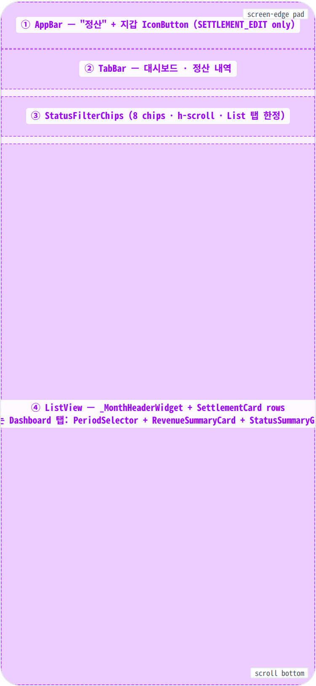
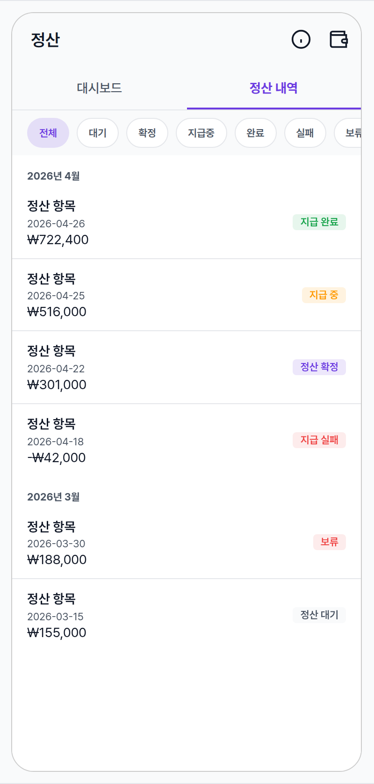
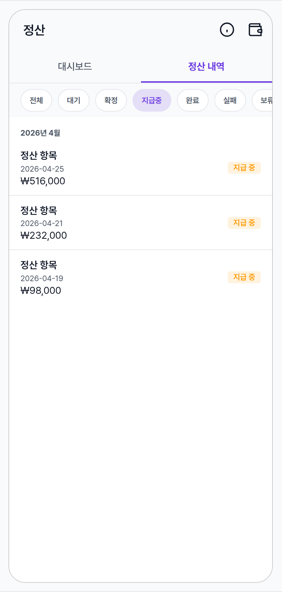
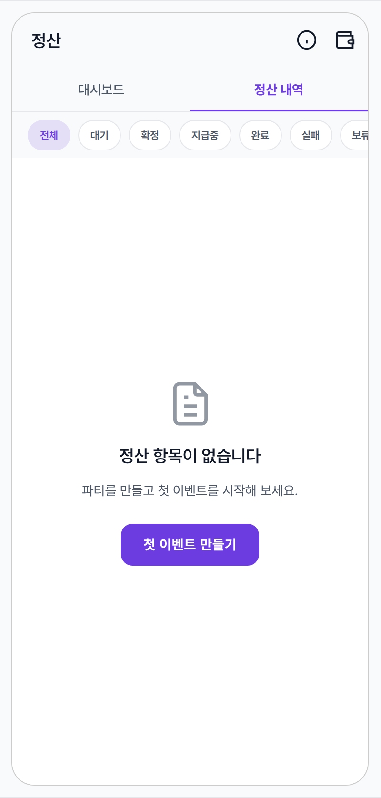
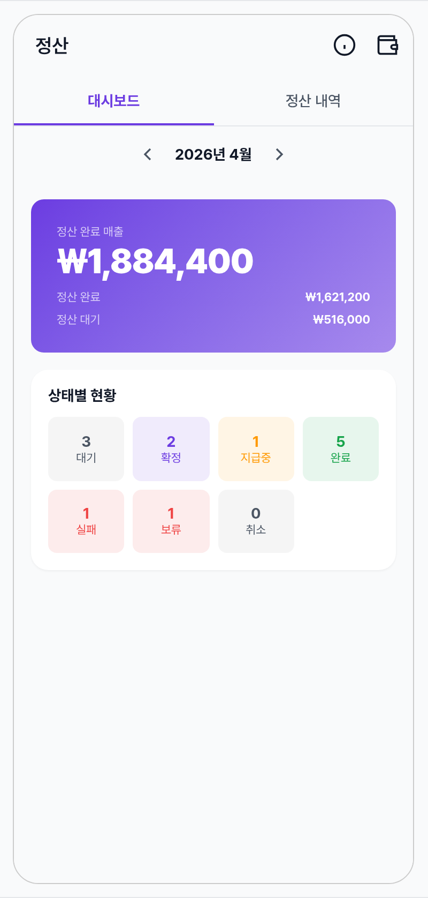
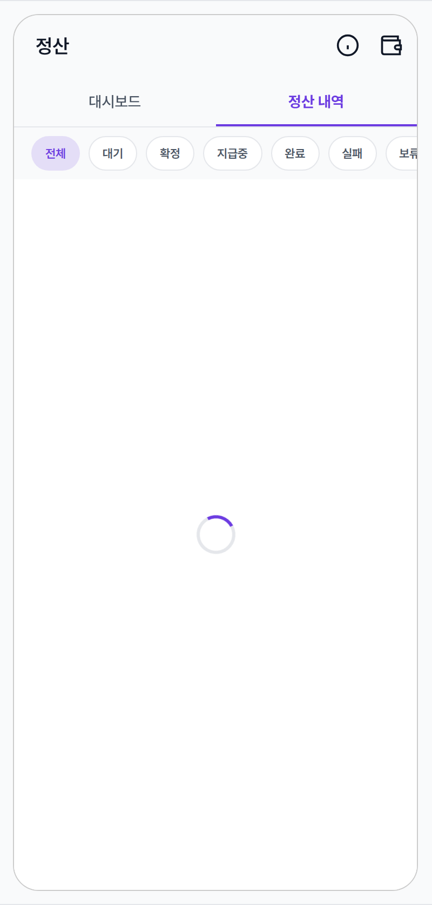
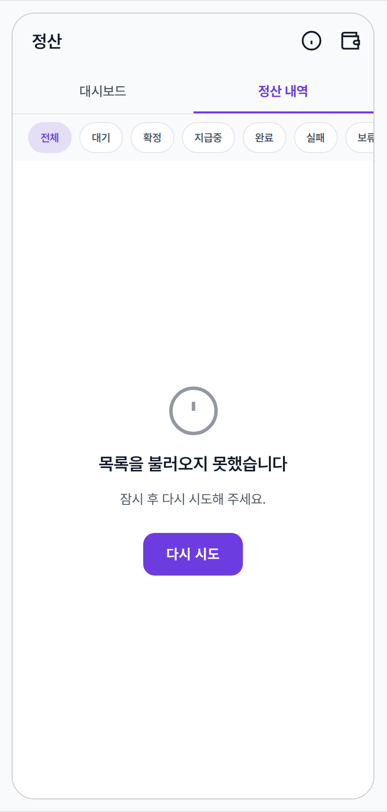
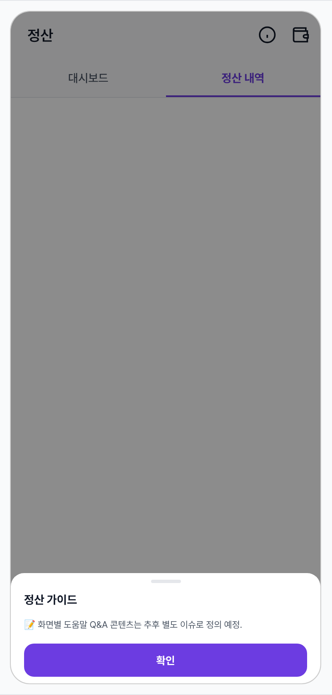

 Spec — SettlementPage (app\_partner · SettlementRoute)  

# Settlement

## Overview

| Status | ✅ 디자인완료 — 5 state · 정산 dashboard + 내역 list parent |
|---|---|
| App | app_partner |
| Category | settlement · list · dashboard |
| Route / Surface | SettlementRoute · widget: SettlementPage (Scaffold + 2-tab TabBar: 대시보드 / 정산 내역) |
| Path | /settlement |
| Hierarchy | Parent: — (StatefulShellBranch top-level — bottom nav "정산" 탭)Children: SettlementDetailPage (정산 내역 탭의 카드 탭으로 진입 · /settlement/:id) · BankAccountPage (AppBar 우측 지갑 아이콘 · /settlement/bank-account · SETTLEMENT_EDIT 권한 보유 시만) |
| Purpose | 파트너가 (1) 월별 정산 대시보드(완료 매출 / 대기 / 상태별 카운트)와 (2) 정산 항목 list(상태 필터 + 월별 그룹)를 한 화면에서 확인한다. 개별 항목 상세는 SettlementDetailPage로 진입. |
| User journey | Entry points: 하단 네비게이션 "정산" 탭 / 푸시 알림(정산 완료) 탭.Exit points: 카드 탭 → 정산 상세 화면 · AppBar 지갑 아이콘 → 정산 계좌 화면 (정산 편집 권한 보유 시) · 빈 상태 CTA "첫 이벤트 만들기" → 파티 생성 화면 (다른 탭으로 점프). |
| Background | 정산 항목은 7가지 상태(대기 / 준비 / 처리 중 / 완료 / 실패 / 보류 / 취소)로 분류된다. 대시보드 카드는 정산 완료 매출 / 완료 순매출 / 대기 매출 / 상태별 카운트를 보여주며, 정산 내역 리스트는 항목 생성일 기준으로 월별 그룹으로 묶인다. |
| Frequency | 월 1–2회 + 정산 완료 알림 수신 시 즉시 진입. |

## History

이 spec의 주요 변경 이력. 최신 항목 위.

| Date | Version | Author | Changes |
|---|---|---|---|
| 2026-05-01 | 1.0 | mark-yun | v1.4 template으로 작성. SettlementDetailPage의 부모 list/dashboard 화면 신규 spec. |

[🧱 Layout](#layout) [🎨 States](#states) [🔄 Global Behavior](#behavior) [📖 Reference](#reference)

🧱

## Layout

화면 구조 — 영역, 정렬, 간격 규칙. 색·타이포 무시.

## Blueprint & tree

Scaffold + AppBar(title:"정산", actions: 지갑 IconButton, bottom: 2-tab TabBar) + TabBarView(`_DashboardTab` / `_ListTab`). List 탭은 StatusFilterChips(8 chips) + ListView(month header + SettlementCard rows).

**Scaffold** ├─ **appBar**: AppBar(title: '정산') ← ① │ ├─ **actions**: \[ │ │ IconButton(info\_outline) → showMinglitHelpSheet(...), │ │ if canEditSettlement: IconButton(account\_balance\_wallet\_outlined → BankAccount), │ │ \] │ └─ **bottom**: TabBar(controller, length:2) ← ② │ ├─ Tab('대시보드') │ └─ Tab('정산 내역') └─ **body**: TabBarView(controller) ├─ **\_DashboardTab** (RefreshIndicator + SingleChildScrollView) │ └─ Column(stretch · padding spacing-medium) │ ├─ **\_PeriodSelector**(selectedMonth · ◀ "YYYY년 M월" ▶) │ ├─ status.when( │ │ data: \[ │ │ **\_RevenueSummaryCard**(gradient · "정산 완료 매출" 라벨 + 큰 금액 + 완료/대기 행) │ │ **\_StatusSummaryGrid**(Card · 4×2 grid · 7 status) │ │ \], │ │ loading: CircularProgressIndicator, │ │ error: Text+다시시도 FilledButton) │ └─ └─ **\_ListTab** (Column) ├─ **StatusFilterChips**(MinglitChipGroup · 8 ChoiceChip) ← ③ └─ **Expanded** ← ④ ├─ \[error&&empty\] **MinglitEmptyState**(error\_outline · "다시 시도") ├─ \[empty\] **MinglitEmptyState**(receipt\_long · CTA "첫 이벤트 만들기" │ 필터 없을 때만 · cross-branch root push) └─ \[data\] **RefreshIndicator** → **ListView.builder** ├─ **\_MonthHeaderWidget**('YYYY년 M월') + … ├─ **SettlementCard**(item · onTap → SettlementDetailRoute(id)) │ └─ Row(Column\[정산 항목 / yyyy-MM-dd / ±₩금액\] + SettlementStatusBadge) ├─ Divider(1px) · … └─ \[isLoading more\] CircularProgressIndicator footer

## Spacing & alignment rules

| # | Region | Alignment | Spacing |
|---|---|---|---|
| ① | AppBar | height 56 · title 좌측 (centerTitle 미설정) · 2 actions trailing (info + 지갑) | 표준 AppBar · scaffold-gray bg · 하단 border 없음 |
| ② | TabBar | height 48 · 2 equal-flex tabs · indicator 2px | indicator color = partner primary · active label = primary, inactive = secondary · 하단 1px color-divider |
| ③ | StatusFilterChips | row · h-scroll · 칩 8개 (전체 + 7 status) | chip 간: spacing-small (8) · row v-pad: spacing-small 위/아래 · h-pad: spacing-medium |
| ④a | SettlementCard row (List 탭) | Row · 좌 Column(title/date/amount stacked) · 우 SettlementStatusBadge | row pad: spacing-medium (16h) · spacing-sm (12v) · 행 분리: 1px Divider · column 내부: spacing-xsmall (4) |
| ④b | _MonthHeaderWidget | 좌측 정렬 · UPPERCASE 아님 · bold | pad: 16/16/16/4 (top/right/bottom/left? 실제는 16,16,16,4 fromLTRB) · onSurfaceVariant · labelMedium bold |
| ④c | RevenueSummaryCard (Dashboard) | column start · gradient bg · 큰 금액 강조 | card outer margin: spacing-medium · inner pad: spacing-large (24) · 라벨↔금액: spacing-xsmall · row 간격: spacing-sm |
| ④d | StatusSummaryGrid (Dashboard) | 4-col grid · childAspectRatio 1.2 · 7 status (PENDING/READY/PROCESSING/COMPLETED/FAILED/HOLD/CANCELED) | card inner pad: spacing-medium · grid main/cross spacing: spacing-small |

## AppBar sub-anatomy

파트너 앱 AppBar — title 좌측 + 우측 actions(info + 지갑). info icon은 화면별 컨텍스트 도움말 sheet 트리거 (파트너 앱 일관 패턴).

| Region | Alignment | Notes |
|---|---|---|
| ① Title (leading) | 좌측 정렬 · 1줄 | "정산" · --typography-font-size-app-bar-title 18 · w600 · color-text-primary. padding-left medium. |
| ② Info action (1st trailing) | 우측 · 40×40 hit-region | info_outline 22×22 · 탭 시 도움말 bottom sheet 진입 (State 7). 파트너 앱 모든 화면에 동일 패턴 적용. |
| ③ Wallet action (2nd trailing) | 우측 · 40×40 hit-region · SETTLEMENT_EDIT 권한 보유 시만 | account_balance_wallet_outlined 22×22 · 탭 시 정산 계좌 화면 push. |
| — | AppBar bg | --color-surface · surfaceTint transparent · border-bottom 없음. |

## Help bottom sheet sub-anatomy _(MinglitHelpSheet 컴포넌트 후보)_

info 아이콘 탭 시 노출되는 컨텍스트 도움말 sheet. 파트너 앱 모든 주요 화면에서 같은 chrome 재사용 — 화면별 sections 콘텐츠만 다름.

| Region | Alignment | Notes |
|---|---|---|
| ① Scrim (barrier) | full-screen overlay | rgba(0,0,0,0.45) · 하단 정렬 컨테이너 · 탭 시 sheet dismiss. |
| ② Sheet container | bottom-anchored · max-height 75% | bg --color-background · 상단 모서리 radius-card 16. |
| ③ Handle bar | 중앙 정렬 | 36×4 · radius 2 · --color-divider · drag-down dismiss affordance. |
| ④ Header | 좌측 정렬 | "정산 가이드" · 16/700 primary · padding small/medium. |
| ⑤ Body (scrollable) | flex 1 · 세로 스크롤 | sections list · 항목 사이 1px --color-divider top border (첫 항목 제외). 화면별 콘텐츠는 호출 측 정의. |
| ⑥ Confirm CTA | bottom · sticky | "확인" · filled partner-primary · height 48 · 15/700 white · margin medium. |

🎨

## States

시각 변형 5종. baseline = 정산 내역 탭 + 데이터 있음, 나머지는 additive diff.

**State 종류 식별 기준**: ① 활성 탭(대시보드 / 정산 내역) ② 정산 항목이 비어있는지 여부 + 상태 필터 선택 여부 ③ 정산 목록 조회 실패 여부 ④ 정산 목록 로딩 진행 여부.

### List · 정산 내역 (mixed status) 🎯 baseline · production

| 항목 | 내용 |
|---|---|
| 조건 | 활성 탭이 정산 내역이며, 정산 항목이 1개 이상 있고 상태 필터는 '전체'. |
| 사용자 액션 | ① 카드 탭 → 정산 상세 화면으로 이동② chip 탭 → 해당 상태로 리스트가 좁혀짐 (State 2)③ 탭 스와이프 / "대시보드" tap → 대시보드 탭으로 전환④ 스크롤 끝 → 다음 페이지가 자동으로 더 불러와짐⑤ pull-to-refresh → 리스트 새로고침⑥ 지갑 아이콘 → 정산 계좌 화면 (정산 편집 권한 보유 시만 노출) |
| 에지케이스 | · 음수 정산금: -₩42,000 형식 (마이너스 부호가 ₩ 앞)· 동일 월 내 여러 항목 → 월 헤더는 1회만 표시 후 카드 연속· 추가 로딩 중간 실패 → 하단 스피너가 사라지고 다음 스크롤 시 재시도· 취소된 항목 → 배지에 취소선 표시 |
| 컴포넌트 | · AppBar(title:'정산', actions:[wallet IconButton, gated by SETTLEMENT_EDIT])· TabBar + TabController(length:2) · TabBarView· StatusFilterChips(MinglitChipGroup · 8 ChoiceChip — 전체/PENDING/READY/PROCESSING/COMPLETED/FAILED/HOLD/CANCELED)· RefreshIndicator + ListView.builder(_scrollController · loadMore at maxScroll-200)· _MonthHeaderWidget(labelMedium bold · onSurfaceVariant · padding 16,16,16,4)· SettlementCard — InkWell + Row(Column[title='정산 항목' bodyMedium 600, date bodySmall onSurfaceVariant, amount bodyMedium] + SettlementStatusBadge compact:true)· Divider(height 1) 카드 사이 |
| 토큰 | · color: color-partner-primary (#6c3ce1 — TabBar indicator/active label · chip selected · READY 배지 · loadMore spinner), color-success (COMPLETED 배지), color-secondary (PROCESSING — 주황 #ff9900 계열), color-error (FAILED · HOLD), color-surface (scaffold + appbar + tabbar + chip row), color-background (list bg + 카드 bg), color-divider (TabBar 하단 hairline · 카드 사이 Divider · 비선택 chip border)· radius: radius-chip (100 · ChoiceChip), radius-badge (4 · Badge)· spacing: spacing-medium (16 · 카드 h-pad · 월 헤더 pad), spacing-sm (12 · 카드 v-pad · badge↔content), spacing-small (8 · chip 간격 · row 위/아래 v-pad), spacing-xsmall (4 · 월 헤더 하단 pad · row 내 텍스트 stacked gap)· typography: appBarTitle (18/600), bodyMedium (14/600 — 카드 title · "지급 완료" 텍스트), bodySmall (12 — 날짜 · onSurfaceVariant · amount), labelMedium (12/700 — 월 헤더 · onSurfaceVariant), labelSmall (11/600 — Badge compact:true) |
| 노트 | 📝 정산 카드 자체는 별도 widget이지만 spec은 분리하지 않음 (단순 row + 상태 배지만 재사용). 상태 배지 색상은 settlement_detail spec과 100% 동일. |

### List · Filtered (PROCESSING) 지급중 chip 선택 · 해당 상태만 표시

| 항목 | 내용 |
|---|---|
| 조건 | '지급중' chip이 선택되어 있고 해당 상태의 항목이 1개 이상 존재. |
| 사용자 액션 | + "전체" chip 탭 → baseline으로 복귀 · 동일 chip 재탭 → 변화 없음나머지 동일 |
| 에지케이스 | · 필터가 켜진 상태에서 결과 0건 → 빈 상태가 노출되며 안내 부제는 "다른 상태를 선택해 보세요." (CTA 없음) |
| 컴포넌트 | ↔ chip 선택 → '지급중'− 다른 상태의 카드는 보이지 않음 |
| 토큰 | 동일 |
| 노트 | 📝 chip 라벨은 다음 7개 상태로 고정: 전체 · 대기 · 확정 · 지급중 · 완료 · 실패 · 보류 · 취소. |

### List · Empty (no settlements) 최초 진입 · CTA "첫 이벤트 만들기"

| 항목 | 내용 |
|---|---|
| 조건 | 정산 항목이 0개이고 로딩/오류가 아니며 상태 필터는 '전체'. |
| 사용자 액션 | + "첫 이벤트 만들기" CTA 탭 → 파티 생성 화면으로 이동 (정산 탭에서 더보기/이벤트 영역으로 점프)+ chip 탭 → 다른 상태 선택 시 빈 필터 상태로 전환 |
| 에지케이스 | · 정산 조회 권한만 있고 편집 권한이 없으면 AppBar 지갑 아이콘이 보이지 않음 — 빈 상태 본문에는 영향 없음 |
| 컴포넌트 | + MinglitEmptyState(variant:fullPage · icon:Icons.receipt_long_outlined · title '정산 항목이 없습니다' · subtitle '파티를 만들고 첫 이벤트를 시작해 보세요.' · actionLabel '첫 이벤트 만들기' · onAction → coordinator)− Month header / SettlementCard / Divider |
| 토큰 | + icon @ color-text-secondary opacity 0.6 (Icons.display 48px · MinglitEmptyState fullPage default · outline tone)+ FilledButton bg = color-partner-primary · fg white |
| 노트 | 📝 빈 정산 상태에 CTA 추가 (Fix #997) — 필터 없을 때만 노출. 필터가 켜진 상태에서는 CTA가 노출되지 않고 안내 부제만 변경됨. |

### Dashboard tab 대시보드 탭 · 월별 요약 + 상태별 카운트

| 항목 | 내용 |
|---|---|
| 조건 | 활성 탭이 대시보드이며 월별 요약 데이터가 도착한 상태. |
| 사용자 액션 | + ◀ / ▶ 월 이동 → 이전/다음 달로 이동하며 대시보드 데이터가 갱신됨+ pull-to-refresh → 대시보드 새로고침+ "정산 내역" tab tap / 우 swipe → 정산 내역 탭으로 전환↔ 상태 필터 chip 없음 (정산 내역 탭 한정) |
| 에지케이스 | · '정산 완료 매출'은 완료 상태 항목만 합산 (지급중/확정/보류 제외)· 상태 카운트가 누락된 상태는 해당 cell이 0으로 표시· 로딩 중: 중앙 스피너 · 오류: 안내 텍스트 + "다시 시도" 버튼 |
| 컴포넌트 | ↔ body → _DashboardTab (RefreshIndicator + SingleChildScrollView · padding spacing-medium)+ _PeriodSelector (Row · IconButton chevron_left + Text titleMedium + IconButton chevron_right · centered)+ _RevenueSummaryCard (Container · gradient primary→primary@scrimLight · radius-button · displayLarge w900 -1px letter)+ _StatusSummaryGrid (Card · Column · titleSmall '상태별 현황' + GridView 4×2 · childAspectRatio 1.2)+ _StatusCell (Container · status.textColor @ MinglitOpacity.highlight bg · radius-small · count titleMedium bold + label bodySmall)− chip row · ListView · SettlementCard |
| 토큰 | + gradient: color-partner-primary 0% → color-partner-primary @ MinglitOpacity.scrimLight 100% (topLeft → bottomRight)+ onPrimary text @ scrimLight opacity (caption '정산 완료 매출' · 행 라벨), full opacity (큰 금액 · 행 값)+ grid cell bg: SettlementStatus.textColor @ MinglitOpacity.highlight (~10%) · cell text: SettlementStatus.textColor 그대로− chip / divider tokens |
| 노트 | 📝 대시보드 탭은 7개 상태 모두 cell이 있고, 정산 내역 탭 chip도 동일 7개. 두 화면의 색·라벨은 단일 매핑으로 통일되어 drift 없음. |

### Loading 진입 직후 또는 새로고침 중

| 항목 | 내용 |
|---|---|
| 조건 | 최초 데이터 조회 중이고 항목이 비어 있는 상태. 추가 페이지를 더 받아오는 경우는 리스트 하단 스피너로 표시되며 이 화면과는 다름. |
| 사용자 액션 | ↔ chip 탭 가능 (탭하면 새 조회 시작), 카드 탭 영역은 없음. 탭 전환은 그대로 가능 |
| 에지케이스 | · 새로고침 시 기존 항목을 그대로 둔 채 상단에 인디케이터만 노출 (별도 state로 그리지 않음)· 데이터 조회 실패 → 오류 상태로 진입 (아래) |
| 컴포넌트 | ↔ ListView body → CircularProgressIndicator 단일− SettlementCard / Month header |
| 토큰 | − 카드 토큰 미사용. 스피너만 color-partner-primary + color-divider (track) |
| 노트 | 📝 AppBar + TabBar + chip row는 유지. body만 spinner. |

### Error 정산 목록을 받지 못함 · 재시도 CTA

| 항목 | 내용 |
|---|---|
| 조건 | 정산 목록 조회가 실패했고 항목 캐시가 비어 있는 상태 (Fix #127: 빈 상태 대신 명시적 오류 화면). |
| 사용자 액션 | + "다시 시도" CTA → 새로고침 시도 · 성공 시 baseline / 빈 상태 / 오류 중 하나로 전환 |
| 에지케이스 | · 오류는 발생했지만 직전 항목 캐시가 남아 있는 경우 → 빈 화면 대신 직전 리스트 + 무음 오류 (이 화면에는 해당 안 됨)· 권한 부족으로 인한 거부 → 동일 화면으로 표시 (메시지 분기 없음 — 후속 개선 후보) |
| 컴포넌트 | ↔ body → MinglitEmptyState(icon:Icons.error_outline · title '목록을 불러오지 못했습니다' · subtitle '잠시 후 다시 시도해 주세요.' · actionLabel '다시 시도' · onAction → refresh) |
| 토큰 | ↔ icon → 동일 outline tone (MinglitEmptyState는 fullPage variant에서 항상 outline color · 에러용 색 분기 없음) |
| 노트 | 📝 시각적으로 빈 상태와 매우 유사. 차이는 아이콘 / 타이틀 / CTA 라벨. 일반 빈 상태와 명확히 구분하기 위함 (Fix #127). |

### Help · 도움말 bottom sheet 🆘 info 아이콘 탭 시 노출 — 파트너 앱 일관 패턴

| 항목 | 내용 |
|---|---|
| 조건 | AppBar의 info 아이콘 탭 → 화면 위 bottom sheet 슬라이드 업. 파트너 앱 전체 일관 패턴. |
| 사용자 액션 | ① "확인" 버튼 탭 — sheet dismiss (primary).② handle 드래그 / scrim 탭 — dismiss (보조).③ sheet 내부 스크롤 — max-height 초과 시. |
| 컴포넌트 | · MinglitHelpSheet — props: title: String · sections: List<HelpSection>.· 화면별 도움말 내용은 호출 측에서 정의 — sheet chrome만 책임.· 진입: showModalBottomSheet(isScrollControlled · barrierColor · shape rounded top). |
| 토큰 | · scrim: rgba(0,0,0,0.45) · sheet bg --color-background · 상단 모서리 radius-card· handle 36×4 · --color-divider · header 16/700 primary· CTA "확인" — height 48 · partner-primary filled · 15/700 white · margin medium· max-height 75vh |
| 노트 | 📝 화면별 sections 콘텐츠(도움말 Q&A)는 추후 별도 이슈로 디자인 결정 예정. |

🔄

## Global Behavior

cross-cutting — 모든 state에 적용되는 액션, motion, 글로벌 에지케이스. 각 state 한정 액션은 위 mini-table 참고.

## Cross-cutting interactions

| 사용자 액션 | 화면에 보이는 결과 |
|---|---|
| 탭 전환 (대시보드 ↔ 정산 내역) | 탭/스와이프 모두 가능. 두 탭은 데이터를 별도로 가져오므로 한쪽을 새로고침해도 다른 쪽은 자동 갱신되지 않음. |
| AppBar 지갑 IconButton | 정산 편집 권한 보유 시만 노출. 탭 → 정산 계좌 화면으로 이동. |
| 알 수 없는 상태 값 응답 | 지원되지 않는 상태가 들어오면 "알 수 없음" 라벨로 표시되며 회색 배지로 fallback. (빈 상태 화면에는 영향 없음) |
| 다크 모드 토글 | scaffold/list 배경 → color-dark-surface(#212121) · primary → color-partner-dark-primary(#9b7bec) · 배지 색상은 상태별 약 10% 투명도로 자동 조정. |
| 금액 포맷 (모든 state 공통) | 정산 카드 금액은 음수일 때 마이너스 부호가 ₩ 앞에 표시됨 (예: -₩42,000). 천 단위 콤마는 모든 금액에 일관되게 적용. |

## Motion timing

Source: `shared/packages/mds/core/lib/src/theme/minglit_design_tokens.dart` → `MinglitAnimation`.

| Transition | Token / Duration | Notes |
|---|---|---|
| 화면 진입 (다른 탭 → /settlement) | MinglitAnimation.fast (200ms) | Bottom nav indexChanged · StatefulShell branch 전환은 cut transition이 default. |
| TabBarView 스와이프 / tap | MinglitAnimation.medium (350ms) | Material default TabController.animateTo curve. |
| chip 토글 | MinglitAnimation.micro (100ms) | ChoiceChip ripple + fill swap. 직후 list refetch (별도 spinner는 없음 — items 그대로 두고 갱신). |
| 카드 tap → SettlementDetail 진입 | MinglitAnimation.medium (350ms) | MinglitPageTransitions.sharedAxisScaled (X-axis · scale + slide). |
| pull-to-refresh / loadMore | Material default | RefreshIndicator는 자체 progress · loadMore는 ListView footer spinner (cut 표시). |

## Global edge cases

-   **정산 조회 권한만 보유** — AppBar 지갑 아이콘이 보이지 않음. 리스트 / 대시보드는 정상 표시.
-   **무한 스크롤 race** — 리스트 끝에 가까워지면 자동으로 다음 페이지가 로드됨. 이미 로드 중인 동안에는 중복 호출이 일어나지 않도록 보장 필요 (drift 점검 후보).
-   **탭 경계 CTA** — 빈 상태의 "첫 이벤트 만들기"는 정산 탭에서 다른 탭으로 점프해야 하므로 일반 push가 아닌 표준 코디네이터를 통해 이동.
-   **대시보드 오류** — 대시보드 오류 화면의 '다시 시도' 버튼은 일반 FilledButton (정산 내역 탭의 빈/오류 화면과 시각적 결이 다름) — 후속 통일 후보.

📖

## Reference

implementation source + 인접 화면. Components / Tokens는 위 mini-table 참고.

## Implementation source

| Widget | SettlementPage + _DashboardTab / _ListTab — apps/app_partner/lib/src/features/settlement/settlement_page.dart |
|---|---|
| Route | SettlementRoute · /settlement · app_routes.dart |
| Theme | MinglitTheme.partnerTheme — primary MinglitPartnerColors.primary(#6c3ce1). user app(#9900ff)과 다름. |
| Controllers | settlementDashboardControllerProvider (월별 dashboard · loadDashboard · changeMonth) · settlementListControllerProvider (list · changeStatus · loadMore · refresh) |
| Coordinator | settlementCoordinatorProvider — goToDetail(id) · goToBankAccount() · goToPartyCreate() (root GoRouter · Fix #1680) |
| Permission gate | currentMemberPermissionsProvider · SETTLEMENT_EDIT 보유 시만 AppBar 지갑 아이콘 노출 (Fix #1568) |
| Sub-widgets | SettlementCard (list row) · SettlementStatusBadge + SettlementStatus enum (settlement_detail_page에 documented) · StatusFilterChips (8 ChoiceChip · MinglitChipGroup) · _PeriodSelector · _RevenueSummaryCard · _StatusSummaryGrid · _StatusCell · _MonthHeaderWidget |
| Empty / Error | MinglitEmptyState(fullPage variant) — shared/packages/mds/core/lib/src/ui/widgets/common/minglit_empty_state.dart |
| ⚠️ Drift / 후속 후보 | · Dashboard error column은 MinglitEmptyState 미사용 (인라인 Text + FilledButton) — list와 시각적 결 통일 후보· loadMore 가드 위치 점검 (race 가능성 · isLoading 체크) |

## Related screens

| Spec | Relation |
|---|---|
| SettlementDetailPage | 본 spec의 자식 — list 탭의 SettlementCard tap으로 진입. SettlementStatusBadge · status enum · 색상 매핑 single source of truth. |
| BankAccountPage | 본 spec의 자식 — AppBar 지갑 IconButton(SETTLEMENT_EDIT)으로 진입. /settlement/bank-account. |
| PartnerHomePage | partner brand color scoping (--color-partner-primary) · bottom nav peer. |
| EventApplicationManagePage | 유사 패턴 — Scaffold + AppBar + TabBar + tab별 list. 본 spec의 List tab과 비교 참고. |
| PartyCreateWizardPage | Empty state CTA "첫 이벤트 만들기"의 도착지 (cross-branch root push). |