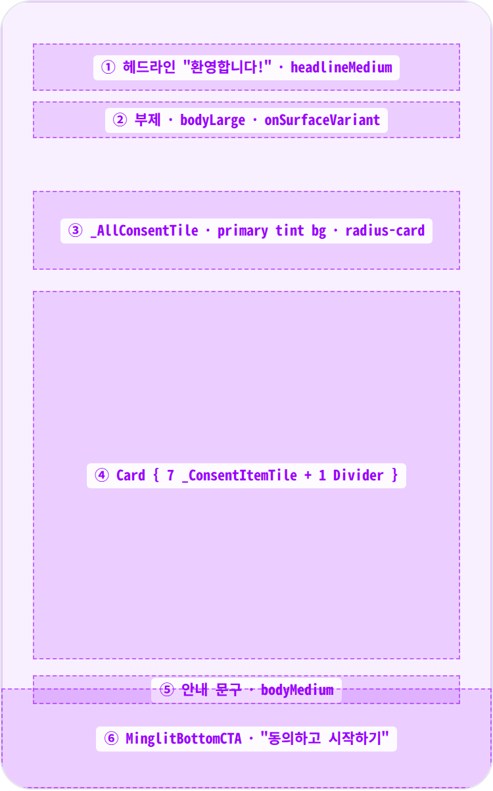
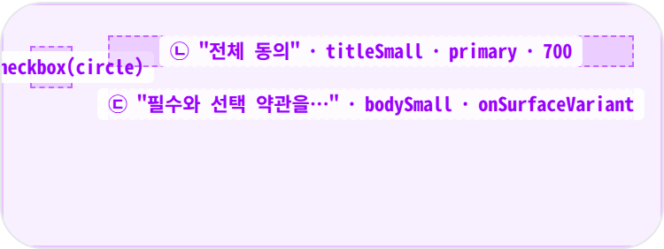
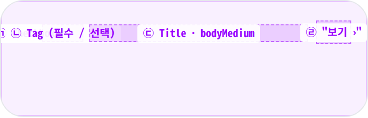
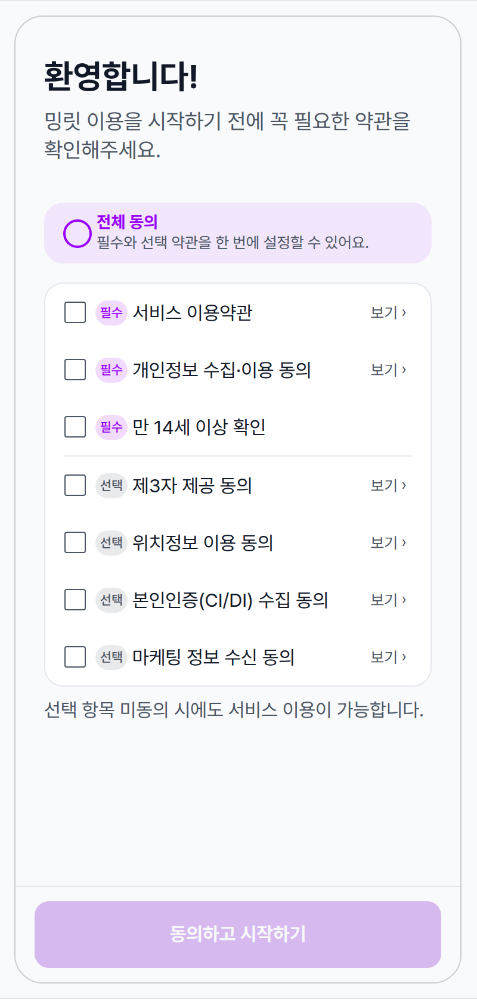
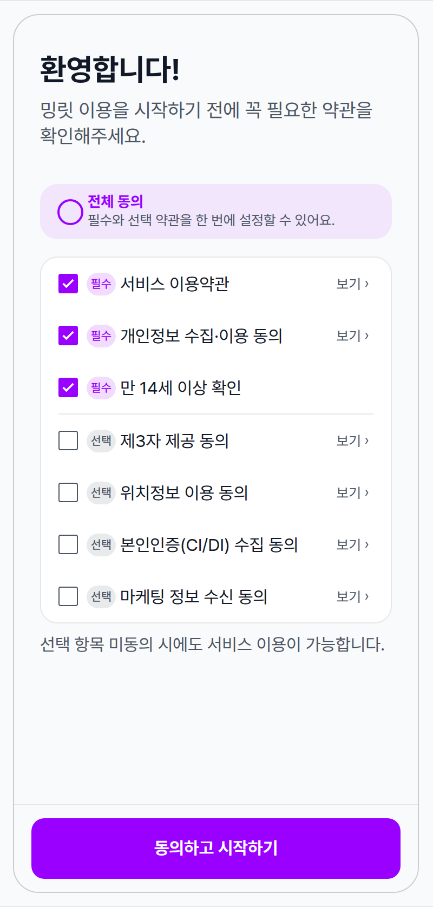
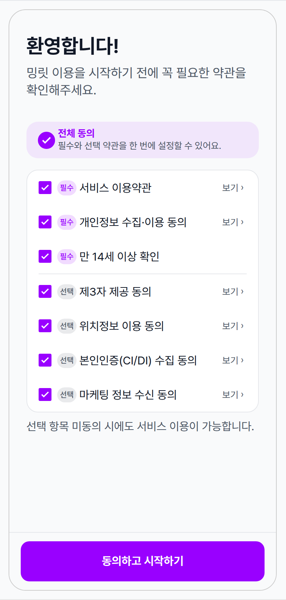
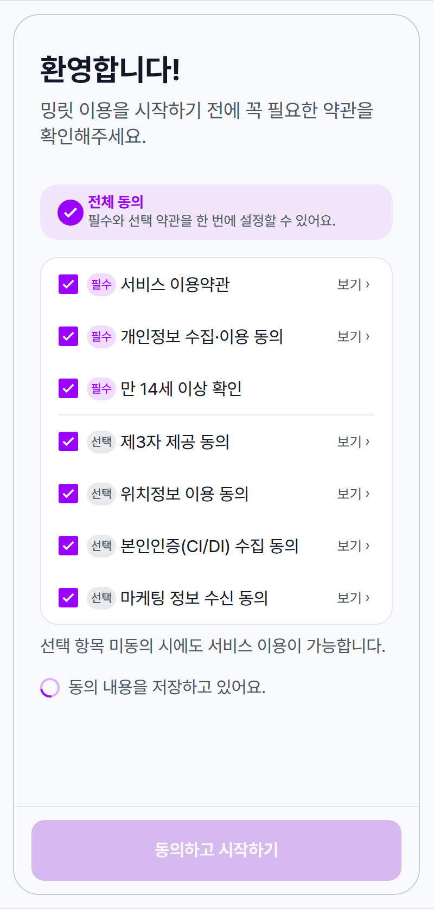
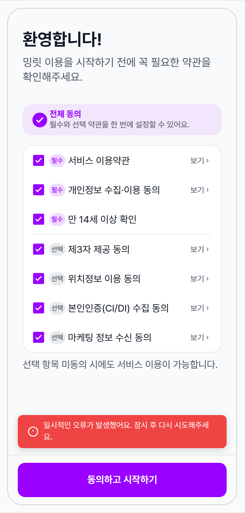
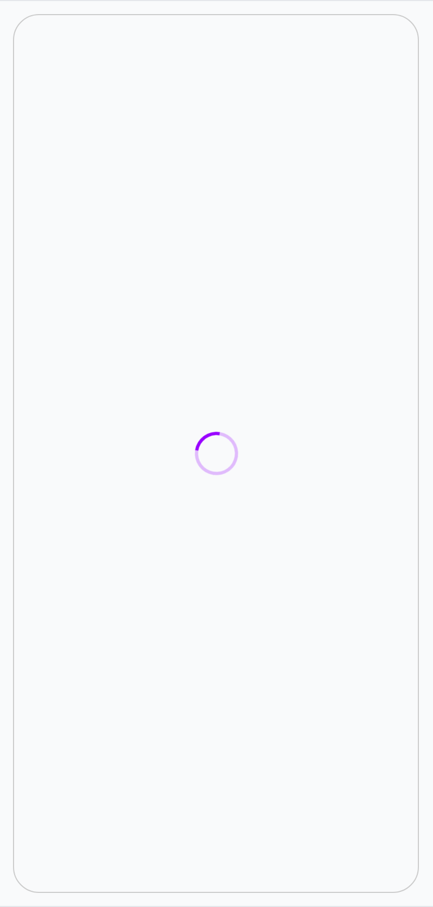

 Spec — SignupConsentPage (app\_user · SignupConsentRoute)  

# Signup Consent

## Overview

| Status | ✅ 디자인완료 — 5 state · 7 consent items (3 required + 4 optional) |
|---|---|
| App | app_user |
| Category | auth · onboarding · consent collection |
| Route / Surface | SignupConsentRoute · widget: SignupConsentPage |
| Path | /signup/consent · query: ?from=<original-path> (post-consent redirect) |
| Hierarchy | Parent: — (top-level — LoginRoute → 콜백 후 필수 동의 누락 시 진입)Children: ConsentDetailSheet (각 항목 "보기 ›" 탭 시 modal bottom sheet · 별도 spec 후보) |
| Purpose | 첫 가입 시 서비스 이용에 필요한 약관(필수 3 + 선택 4)을 한 화면에서 수집한다. 필수 항목이 모두 토글되어야 CTA가 활성화되며, 저장이 성공하면 사용자가 원래 가려던 화면(또는 홈)으로 자동 복귀된다. 시스템 뒤로가기를 차단해 중간 이탈을 막는다. |
| User journey | Entry points: LoginRoute → 인증 콜백 → 필수 consent 누락 시 자동 push (auth flow의 분기점) · OAuth/매직링크 첫 로그인 시 항상 1회.Exit points: 동의 저장 성공 → completeSignup(from)로 원래 가려던 화면 또는 HomeRoute · 시스템 back 차단 · 로그아웃 외 정상 이탈 경로 없음. |
| Background | PIPA / 위치정보법 / 정보통신망법 동의 의무 + 14세 이상 확인이 한 번에 모이는 단일 게이트. Fix #966에서 SwitchListTile → 원형 체크박스 + 카드 단일화로 디자인 정리. Fix #1141에서 제3자 제공 동의 추가, Fix #1143에서 PIPA 제22조 제4항 강조 의무(수집 항목/이용 목적/보관 기간) 반영. |
| Frequency | 계정당 1회 (재로그인 시에는 이미 저장된 동의 hydrate되어 재진입 X). 정책 버전 bump(_signupPolicyVersion) 시 재수집 가능. |

## History

이 spec의 주요 변경 이력. 최신 항목 위.

| Date | Version | Author | Changes |
|---|---|---|---|
| 2026-05-01 | 1.0 | mark-yun | v1.4 template으로 초안 작성. Source verify against signup_consent_page.dart (+ widgets / definitions parts) · user_consent.dart(ConsentType.requiredTypes: termsOfService · privacyCollection · ageConfirmation) · MinglitBottomCTA · MinglitTheme.materialTheme. States: Default(none toggled) / Required only / All toggled / Submitting / Error. Loading-on-entry는 별도 mini-table. |

[🧱 Layout](#layout) [🎨 States](#states) [🔄 Global Behavior](#behavior) [📖 Reference](#reference)

🧱

## Layout

AppBar 없음. SafeArea + ListView 본문 + Scaffold.bottomNavigationBar에 MinglitBottomCTA 고정.

## Blueprint & tree

`Scaffold`(`PopScope(canPop:false)`로 감싸짐). `body`는 `SafeArea` + `Column[Expanded(ListView(...))]`. `bottomNavigationBar`는 `MinglitBottomCTA` 단일 변형 (label "동의하고 시작하기").

**PopScope**(canPop: _false_) └─ **Scaffold** ├─ bottomNavigationBar: **MinglitBottomCTA**(_"동의하고 시작하기"_) ← ⑥ │ enabled: `requiredSelected && !_isSubmitting` └─ body: **SafeArea** └─ **Column** └─ **Expanded** └─ **ListView** padding: `fromLTRB(24, 32, 24, 24)` ├─ **Text** "환영합니다!" · `headlineMedium` ← ① ├─ Gap: `spacing-small (8px)` ├─ **Text** 부제 · `bodyLarge` · onSurfaceVariant ← ② ├─ Gap: `spacing-xlarge (32px)` ├─ **\_AllConsentTile**(allSelected, onToggle) ← ③ ├─ Gap: `spacing-medium (16px)` ├─ **Card** ← ④ │ └─ **Column** │ ├─ **\_ConsentItemTile** × 3 (required) │ ├─ **Divider**(h:1, indent/endIndent: 16) ← 필수/선택 경계 │ └─ **\_ConsentItemTile** × 4 (optional) ├─ Gap: `spacing-small (8px)` ├─ **Text** 안내 문구 · `bodyMedium` ← ⑤ └─ _(if \_isSubmitting)_ Row\[**CircularProgressIndicator**(18px), Text "동의 내용을 저장하고 있어요."\]

| # | Region | Alignment | Spacing |
|---|---|---|---|
| — | ListView padding | — | EdgeInsets.fromLTRB(spacing-large 24, spacing-xlarge 32, spacing-large 24, spacing-large 24) |
| ① | 헤드라인 | start (LTR) | height: ~36 · headlineMedium (28/700/1.29) |
| ② | 부제 | start | top gap: spacing-small (8) · bodyLarge (18/400/1.33 · onSurfaceVariant) |
| ③ | _AllConsentTile | Row crossAxis: center | top gap: spacing-xlarge (32) · padding: h: spacing-medium (16) · v: spacing-small (8) · gap(check↔body): spacing-xsmall (4) · radius: radius-card (16) · bg: primary @ opacity-softTint |
| ④ | Card (items) | edge align (LTR) | top gap: spacing-medium (16) · radius: radius-card (16) · bg: colorScheme.surface (#fff) · 1dp Material elevation |
| — | _ConsentItemTile | Row crossAxis: center | min-height 48 · padding: h: spacing-medium (16) · v: spacing-small (8) · gap(check↔body): spacing-small (8) |
| — | 필수/선택 Divider | edge-inset | height: 1 · indent / endIndent: spacing-medium (16) · color: color-divider |
| ⑤ | 안내 문구 | start | top gap: spacing-small (8) · bodyMedium (16/400/1.5 · onSurfaceVariant) |
| ⑥ | MinglitBottomCTA | 전체 너비 ElevatedButton | padding: h: spacing-screen-edge (16) · v: spacing-sm (12) · button height 56 · radius: radius-button (12) · 상단 0.5px outlineVariant |

## Sub-anatomy ① — \_AllConsentTile

Material(InkWell) 위 Row\[Checkbox(circle shape, IgnorePointer로 wrap), gap 4, Column\[title primary 700, sub onSurfaceVariant\]\]. **IgnorePointer로 Checkbox tap 흡수 차단** — InkWell.onTap만 발화시켜 토글 중복(net no-op) 방지.

**Material**(color: `primary @ opacity-softTint`, radius: `radius-card`) └─ **InkWell**(onTap: `onToggle(!allSelected)`) └─ **Padding**(`h: spacing-medium (16) · v: spacing-small (8)`) └─ **Row**(crossAxis: center) ├─ **IgnorePointer** ← ㉠ │ └─ **Checkbox**(shape: _CircleBorder_, activeColor: `primary`) ├─ Gap: `spacing-xsmall (4)` └─ **Expanded** └─ **Column**(crossAxis: start) ├─ **Text** "전체 동의" ← ㉡ │ `titleSmall` · `primary` · weight 700 └─ **Text** "필수와 선택 약관을…" ← ㉢ `bodySmall` · `onSurfaceVariant`

## Sub-anatomy ② — \_ConsentItemTile

InkWell 전체가 tap 영역. Row\[Checkbox(IgnorePointer), Column\[Row\[Tag, Title\]\]\]. detail 있는 항목은 우측 inline "보기 ›" 텍스트(GestureDetector + Semantics(button: true)). detail 없는 항목(만 14세 이상 확인)은 보기 텍스트 미렌더.

**InkWell**(onTap: `onChanged(!selected)`) └─ **ConstrainedBox**(minHeight: 48) └─ **Padding**(`h: spacing-medium · v: spacing-small`) └─ **Row**(crossAxis: center) ├─ **IgnorePointer** > **Checkbox** ← ㉠ │ _VisualDensity.compact_ ├─ Gap: `spacing-small (8)` ├─ **Expanded** │ └─ **Column** │ └─ **Row** │ ├─ **\_ConsentTag**(required) ← ㉡ │ │ 필수 → `primaryContainer` bg + `primary` fg │ │ 선택 → `surfaceContainerHighest` bg + `onSurfaceVariant` fg │ │ `radius-chip` · padding: `h:xsmall, v:4` · `labelSmall` │ ├─ Gap: `spacing-xsmall (4)` │ └─ **Expanded** > **Text** 항목명 · `bodyMedium` ← ㉢ └─ _(if detail != null)_ ├─ Gap: `spacing-xsmall (4)` └─ **Semantics**(button: true, label: "{title} 상세 보기") └─ **GestureDetector**(onTap: `showConsentDetailSheet`) └─ **Padding**(`spacing-xsmall (4)` all) └─ **Text** "보기 ›" · `bodySmall` · onSurfaceVariant ← ㉣

🎨

## States

시각 변형 5종 — baseline은 Default(아무 항목도 토글되지 않은 상태). 토글 진행에 따라 CTA가 활성/비활성으로 갈리고, 제출 후 Submitting / Error로 분기.

**State 식별 기준**: 현재 토글된 동의 항목 + 제출 진행 여부 + 저장 결과 (성공 / 실패).  
· 진입 직후 동의 정보를 가져오는 동안에는 화면 전체에 단독 로딩 스피너만 보임.  
· 정보가 도착하면 동의 리스트가 렌더링되고 토글 상태에 따라 CTA가 활성/비활성으로 갈림.  
· 제출 중에는 CTA가 비활성으로 바뀌고 본문 끝에 인라인 진행 표시가 추가됨.  
· 저장에 실패하면 화면 하단에 에러 스낵바가 노출되고 CTA는 다시 활성으로 복귀해 재시도 가능.

### State summary

| State | Tag | 조건 (요약) | Key visual differentiator |
|---|---|---|---|
| Default · 미토글 🎯 | baseline | 동의 정보가 도착했지만 사용자가 아직 어떤 항목도 토글하지 않은 상태. | 모든 체크박스 빈 상태 + CTA 비활성 (회색) |
| 필수만 토글 | cta enabled | 필수 3개가 모두 토글되고 일부 선택 항목은 토글되지 않은 상태. | 필수 3개 ✓ + CTA primary 활성화 |
| 전체 토글 | all on | 필수와 선택 모두 토글된 상태. | 전체 동의 카드 강조 + 모든 ✓ + CTA 활성 |
| Submitting | async | CTA를 누른 뒤 동의 내용을 저장하는 동안의 진행 상태. | CTA 비활성 + 본문 끝에 인라인 스피너 + "동의 내용을 저장하고 있어요." |
| Error | save fail | 저장 시도가 실패한 상태. | 화면 하단에 에러 스낵바가 노출되고 CTA는 다시 활성으로 복귀 |
| Loading on entry | hydrate | 화면 진입 직후 저장된 동의 정보를 가져오는 짧은 구간. | 화면 중앙에 단독 스피너만 노출 |

### Default · 미토글 🎯 baseline · 사용자가 아직 어떤 항목도 토글하지 않은 상태

| 항목 | 내용 |
|---|---|
| 조건 | 동의 정보가 도착했지만 사용자가 아직 어떤 항목도 토글하지 않은 상태. 제출도 진행 중이 아님. |
| 사용자 액션 | ① 전체 동의 카드 탭 — 7개 항목이 한 번에 모두 토글됨.② 개별 항목 탭 — 해당 항목 하나만 토글됨.③ "보기 ›" 탭 — 항목별 상세 내용을 보여주는 하단 시트가 올라옴 (만 14세 이상 확인 항목만 별도 상세 화면이 없어 보기 텍스트도 노출되지 않음).④ CTA 탭 — 반응 없음 (필수 3개가 모두 토글되지 않은 동안에는 CTA가 비활성 상태).⑤ 시스템 뒤로가기 / 스와이프 — 반응 없음. 동의를 마치거나 앱을 종료해야만 이 화면을 떠날 수 있음. |
| 에지케이스 | · 이전에 일부 동의가 저장돼 있던 사용자라면 해당 항목들이 미리 토글된 채로 화면이 시작될 수 있음 (신규 가입은 보통 빈 상태에서 시작).· 만 14세 이상 확인 항목은 별도 상세 시트가 없어 태그와 제목만 표시되고 "보기 ›"는 노출되지 않음. |
| 컴포넌트 | · PopScope(canPop: false)· Scaffold(no AppBar) · SafeArea · ListView· Text headlineMedium "환영합니다!" · Text bodyLarge 부제· _AllConsentTile (Material + InkWell + IgnorePointer(Checkbox circle) + Column[titleSmall primary, bodySmall onSurfaceVariant])· Card · Column · _ConsentItemTile × 7 · _ConsentTag (필수/선택) · Divider(h:1, indent/endIndent: 16) · GestureDetector + Semantics "보기 ›"· Text bodyMedium 안내 문구· MinglitBottomCTA(label "동의하고 시작하기", enabled: false) |
| 토큰 | · color: color-surface (#f9fafb) (scaffold), color-background (#fff) (Card), color-primary (all-tile bg @ opacity-softTint · checkbox active · CTA disabled bg-mix), color-text-primary, color-text-secondary (= onSurfaceVariant), color-divider (= outlineVariant), primaryContainer / surfaceContainerHighest (Tag bg)· spacing: spacing-large (24) (ListView h-pad), spacing-xlarge (32) (top pad · subhead↔all gap), spacing-medium (16) (item h-pad · card gap · divider indent · CTA h-pad), spacing-small (8) (subhead gap · item v-pad · CTA gap), spacing-sm (12) (CTA v-pad), spacing-xsmall (4) (all-tile check gap · tag→title gap · "보기" pad)· radius: radius-card (16) (all-tile · Card), radius-button (12) (CTA), radius-chip (100) (Tag)· typography: headlineMedium (28/700/1.29), bodyLarge (18/400/1.33), titleSmall (14/700/1.43), bodyMedium (16/400/1.5), bodySmall (13/400/1.5), labelSmall (11/500/1.45) |
| 노트 | 📝 ⓐ 헤드라인 · ⓑ 전체 동의 카드 · ⓒ 동의 항목 카드 · ⓓ 비활성 CTA. 필수 ↔ 선택 사이의 구분선은 마지막 필수 항목 바로 아래에 자동 위치 — 항목 순서가 바뀌거나 추가돼도 경계가 자동으로 따라간다. 현재 순서: 서비스 이용약관 → 개인정보 수집·이용 → 만 14세 이상 확인 → 제3자 제공 → 위치정보 → 본인인증 → 마케팅 정보 수신. |

### 필수만 토글 · CTA 활성 필수 항목 3개가 모두 토글된 상태

| 항목 | 내용 |
|---|---|
| 조건 | 필수 3개 항목이 모두 토글되었지만 선택 항목은 일부 또는 전체가 아직 토글되지 않은 상태. |
| 사용자 액션 | + CTA 탭 — 동의 내용 저장이 시작되며 화면은 Submitting 상태로 전환됨.동일: 개별 항목 탭 (선택 항목 토글 가능 · 필수 항목을 해제하면 즉시 Default 상태로 복귀) · "보기 ›" 탭 · 시스템 뒤로가기 반응 없음. |
| 에지케이스 | · 필수 항목 중 하나를 다시 해제하면 즉시 CTA가 비활성으로 바뀌고 Default 상태로 복귀. |
| 컴포넌트 | 동일 (Default 참조). 시각 차이만 — 필수 3개 체크박스가 채워져 있고 CTA가 활성 상태. |
| 토큰 | + color-primary의 노출 강도가 강해짐 (CTA 배경이 단색 채움 · 체크박스 내부도 채워짐). 전체 동의 카드의 옅은 톤은 그대로 유지. |
| 노트 | 📝 가장 자주 일어나는 정상 흐름의 직전 단계. 마케팅 / 위치 항목은 미토글 상태로 제출되는 경우가 많다. |

### 전체 토글 · all on 필수와 선택 7개 항목이 모두 토글된 상태

| 항목 | 내용 |
|---|---|
| 조건 | 필수와 선택을 포함한 모든 항목이 토글된 상태. |
| 사용자 액션 | 동일 (CTA 활성 · 제출 가능). 추가:+ 전체 동의 카드 다시 탭 — 모든 항목이 한 번에 해제되어 Default 상태로 복귀. |
| 에지케이스 | · 단일 항목을 해제하면 해당 항목만 빠지고 전체 동의 카드의 체크가 자동으로 해제됨. |
| 컴포넌트 | 동일. 시각 차이만 — 7개 모두 ✓ + 전체 동의 tile checkbox 채워짐. |
| 토큰 | 동일 |
| 노트 | 📝 전체 동의 카드의 체크는 원형이라, 사각형인 일반 항목 체크와 시각적으로 구분된다. |

### Submitting 동의 내용을 저장하는 동안의 진행 상태

| 항목 | 내용 |
|---|---|
| 조건 | CTA를 누른 뒤 동의 내용이 저장되는 동안의 상태. CTA는 비활성으로 바뀐다. |
| 사용자 액션 | ↔ CTA는 비활성이라 누를 수 없음. 항목 토글은 기술적으로 가능하지만 의미가 없는 짧은 구간이라 권장되지 않음. 보통 0.1~1초 안에 다음 상태로 전환됨.+ 완료 후: 성공하면 원래 가려던 화면 (또는 홈)으로 자동 이동, 실패하면 Error 상태로 전환됨. |
| 에지케이스 | · 제출 시점에 사용자 인증 정보가 사라진 경우 "로그인이 필요합니다." 경고가 노출되고 Submitting 상태로 진입하지 않음. |
| 컴포넌트 | + 본문 끝에 인라인 Row[작은 스피너 (18×18) + 간격 + 텍스트 "동의 내용을 저장하고 있어요." (bodyMedium)] 추가됨.↔ MinglitBottomCTA는 비활성 상태. |
| 토큰 | + 진행 인디케이터 색은 color-primary · 굵기 2px. |
| 노트 | 📝 인라인 진행 표시는 본문 마지막에 위치. 이 화면은 입력 필드가 없어 키보드가 올라오지 않으므로 항상 화면에 보인다. |

### Error · save fail 저장에 실패해 에러 스낵바가 노출된 상태

| 항목 | 내용 |
|---|---|
| 조건 | 저장에 실패해 화면 하단에 에러 스낵바가 잠깐 노출된 상태. 진행 표시는 사라지고 CTA는 다시 활성으로 복귀해 재시도가 가능해진다. |
| 사용자 액션 | 동일 (항목 토글 가능 · CTA가 다시 활성이라 다시 시도 가능)+ 스낵바 안의 액션 탭 (제공되는 경우) — 재시도가 즉시 일어남. |
| 에지케이스 | · 네트워크 끊김 / 서버 오류 / 권한 거부 등은 모두 동일한 스낵바로 안내됨.· 사용자가 CTA를 다시 누르면 Submitting 상태로 재진입. |
| 컴포넌트 | + 공통 에러 스낵바 (color-error 배경 + 경고 아이콘 + 본문 메시지)− Submitting에서 추가됐던 인라인 진행 표시는 사라진다. |
| 토큰 | + color-error (#dc2626) · radius-small (8) (스낵바) · spacing-small / medium (스낵바 내부 padding) |
| 노트 | 📝 스낵바는 화면 하단 CTA 위쪽에 잠깐 떠 있다가 약 4초 후 자동으로 사라지거나 사용자가 스와이프해 닫을 수 있다. |

### Loading on entry 화면 진입 직후 짧게 노출되는 로딩 상태

| 항목 | 내용 |
|---|---|
| 조건 | 화면 진입 직후 저장된 동의 정보를 가져오는 짧은 구간. 아직 결과가 도착하지 않은 상태. |
| 사용자 액션 | ↔ 인터랙션 가능한 요소가 없음. 화면 중앙의 스피너만 회전. |
| 에지케이스 | · 저장된 동의가 없으면 Default 상태로 곧바로 진입.· 일부 항목이 이미 저장돼 있으면 그 항목들이 미리 토글된 채로 시작됨. |
| 컴포넌트 | ↔ 전체 화면이 중앙 스피너 (MinglitCircularProgressIndicator) 단독으로 교체됨.− 헤드라인 · 전체 동의 카드 · 항목 카드 · CTA는 모두 노출되지 않음. |
| 토큰 | − 본문 영역 토큰 전부 미사용. + color-primary (스피너 색). |
| 노트 | 📝 첫 응답이 도착하면 그 결과로 화면이 한 번만 초기화되고, 이후에는 자연스럽게 Default 상태로 이어진다. |

🔄

## Global Behavior

cross-cutting — 모든 state에 적용되는 액션, motion, 글로벌 에지케이스.

## Cross-cutting interactions

| 사용자 액션 | 화면에 보이는 결과 |
|---|---|
| 시스템 뒤로가기 / 뒤로가기 스와이프 | 차단됨. 사용자는 동의를 마치거나 앱을 종료해야만 이 화면을 떠날 수 있다. |
| "보기 ›" 탭 (상세가 있는 항목) | 해당 항목의 상세 내용을 보여주는 하단 시트가 올라옴. 시트가 닫히면 본 화면은 그대로 유지된다. |
| 스크롤 | 본문 영역만 스크롤된다. 하단 CTA는 화면 아래쪽에 고정되어 스크롤의 영향을 받지 않는다. |
| 다크 모드 토글 | 화면 배경, 카드 배경, 텍스트 / 구분선 색이 다크 토큰으로 자동 전환됨. 전체 동의 카드의 옅은 톤도 다크 기준으로 재계산된다. |
| 외부에서 로그아웃이 발생한 경우 | 제출 시 사용자 인증 정보가 사라졌다는 경고가 노출되고 제출이 진행되지 않는다. 본 화면이 직접 로그인 화면으로 보내지는 않는다. |

## Motion timing

Source: `shared/packages/mds/core/lib/src/theme/minglit_design_tokens.dart` → `MinglitAnimation`.

| Transition | Token / Duration | Notes |
|---|---|---|
| 화면 진입 (로그인 → 동의) | MinglitAnimation.fast (200ms) | 표준 라우트 전환 (slide). |
| 체크박스 토글 (개별 항목 / 전체) | MinglitAnimation.micro (100ms) | Material 체크박스 기본의 scale + fill 애니메이션. |
| 전체 동의 → 7개 일괄 토글 | MinglitAnimation.micro (100ms · 동시) | 7개 체크박스가 동시에 발화. 순차 캐스케이드 없음. |
| Loading → Default (정보 도착 직후) | 컷 | 전환 애니메이션 없이 즉시 교체됨. |
| CTA 활성 ↔ 비활성 색 전환 | MinglitAnimation.fast (200ms) | 버튼 색이 부드럽게 페이드 전환됨. |
| "보기 ›" → 상세 시트 등장 | MinglitAnimation.medium (350ms) | 하단 시트가 위로 슬라이드 업. |
| Submitting 인라인 행 등장 | MinglitAnimation.fast (200ms) | 조건부 노출. 본문이 다시 그려지면서 자연스럽게 페이드 인. |
| 에러 스낵바 등장 | MinglitAnimation.medium (350ms) | 스낵바가 아래에서 슬라이드 업. 약 4초 후 자동으로 사라짐. |

## Global edge cases

-   **네트워크 끊김** — 제출 시 실패하면 에러 스낵바와 함께 다시 시도할 수 있게 된다. 진입 직후 정보 조회에 실패하면 로딩 상태에서 에러로 전환된다.
-   **다크 모드** — 화면 배경 / 카드 / 구분선 / 텍스트 모두 다크 토큰으로 자동 교체된다. 전체 동의 카드의 옅은 톤도 다크 기준으로 재계산된다.
-   **접근성** — 각 항목 행 전체가 탭 영역(최소 48dp)이고, "보기 ›"는 별도 버튼으로 보이스 오버에 안내된다. 원형 체크박스도 일반 체크박스와 같은 방식으로 토글 상태가 안내된다.
-   **큰 글씨 옵션** — 모든 텍스트가 OS 글씨 크기 설정에 비례. 항목 행은 충분한 높이로 두 줄 제목도 잘림 없이 wrap된다.
-   **중간 이탈 차단** — 시스템 뒤로가기 / 스와이프 모두 무력화된다. 사용자가 앱을 강제 종료하면 다음 진입 시 다시 처음부터 시작된다.
-   **이중 탭 방지** — 체크박스를 직접 누르는 것이 아니라 행 전체 탭만 받아들이도록 설계되어, 같은 동작이 두 번 일어나지 않는다.
-   **키보드** — 입력 필드가 없으므로 키보드가 올라오지 않는다.

📖

## Reference

implementation source + 인접 화면.

## Implementation source

| Widget | SignupConsentPage — apps/app_user/lib/src/features/consent/ui/signup_consent_page.dart |
|---|---|
| Part files | signup_consent_widgets.dart (_AllConsentTile, _ConsentItemTile, _ConsentTag) · signup_consent_definitions.dart (_ConsentDefinition map · 7 entries) |
| Route | SignupConsentRoute · /signup/consent · query: from · app_routes.dart |
| Controller / Provider | consentControllerProvider (AsyncValue<List<UserConsent>>) · shared/packages/minglit_kit/lib/src/features/consent/logic/consent_controller.dart |
| Coordinator | consentCoordinatorProvider.completeSignup(from: widget.from) — consent_coordinator.dart |
| Required types | ConsentType.requiredTypes = [termsOfService, privacyCollection, ageConfirmation] — user_consent.dart |
| Policy version | const _signupPolicyVersion = 1 (file-private). bump 시 재수집 트리거. |
| Detail sheet | showConsentDetailSheet(context, content: ConsentDetailContent) — apps/app_user/lib/src/features/consent/ui/consent_detail_sheet.dart · 7개 항목 중 6개 detail 보유 (만 14세 항목만 detail null) |
| Bottom CTA atom | MinglitBottomCTA · single 변형 · 키보드 자동 hide · SafeArea 처리 — shared/packages/mds/core/lib/src/ui/widgets/common/minglit_bottom_cta.dart |
| Item atoms (private) | _AllConsentTile (Material+InkWell · primary tint · circle Checkbox · IgnorePointer 패턴) · _ConsentItemTile (InkWell · ConstrainedBox minHeight 48 · IgnorePointer Checkbox · _ConsentTag · GestureDetector "보기 ›") · _ConsentTag (필수 → primaryContainer/primary · 선택 → surfaceContainerHighest/onSurfaceVariant) |
| Theme map | Scaffold bg = MinglitColors.surface · ColorScheme.surface = MinglitColors.background (Card bg) · onSurfaceVariant = MinglitColors.textSecondary · outlineVariant = divider · minglit_theme.dart |
| Pop behavior | PopScope(canPop: false) — 시스템 back / swipe 무력화. 명시적 onPop 콜백 없음 (단순 차단). |
| Test | apps/app_user/test/src/features/consent/ui/signup_consent_page_test.dart + shared/packages/minglit_kit/test/src/features/consent/logic/consent_controller_test.dart |

## Related screens

| Spec | Relation |
|---|---|
| LoginPage | 직접 진입원 — OAuth/매직링크 콜백 후 필수 consent 누락 시 push. from 파라미터로 최종 도착지 보존. |
| HomePage | completeSignup의 디폴트 도착지. from null이면 HomeRoute로 복귀. |
| MyPage | 가입 후 동의 변경(선택 항목 토글)은 MyPage 산하 PrivacyPage / NotificationSettings에서 처리 — 본 화면은 1회성. |
| Layout foundations | AppBar 없는 단독 화면 + bottomNavigationBar CTA 패턴. PartyCreateWizard와 유사한 submit-bottom 흐름. |