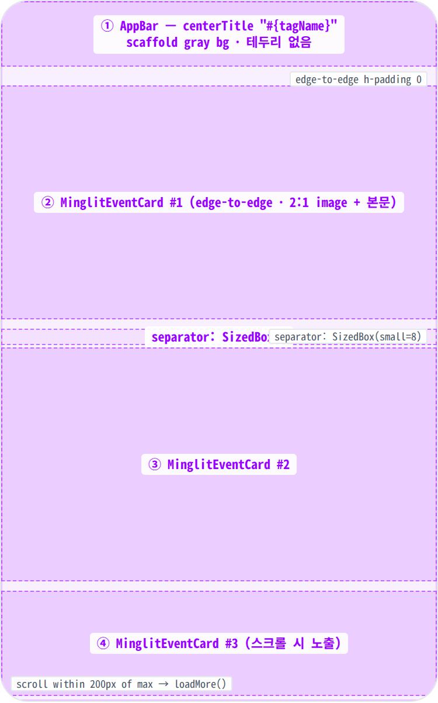
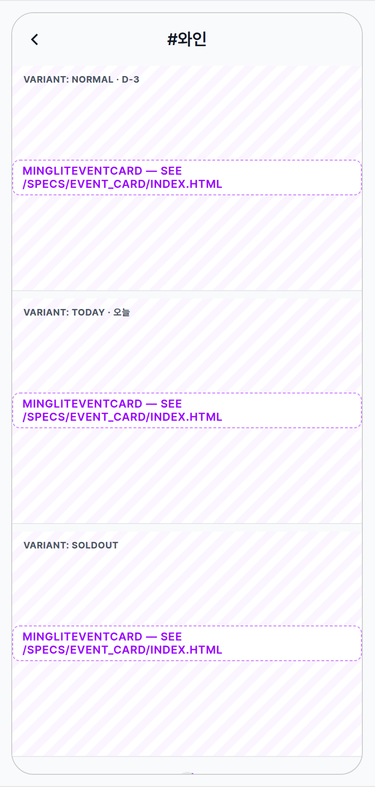
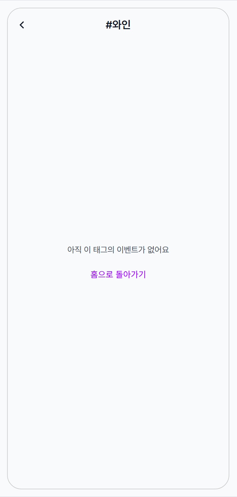
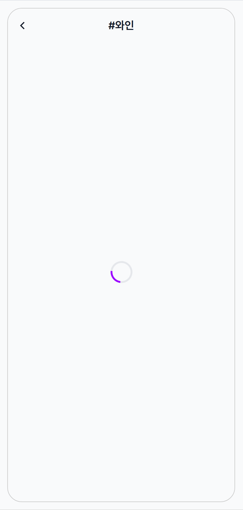
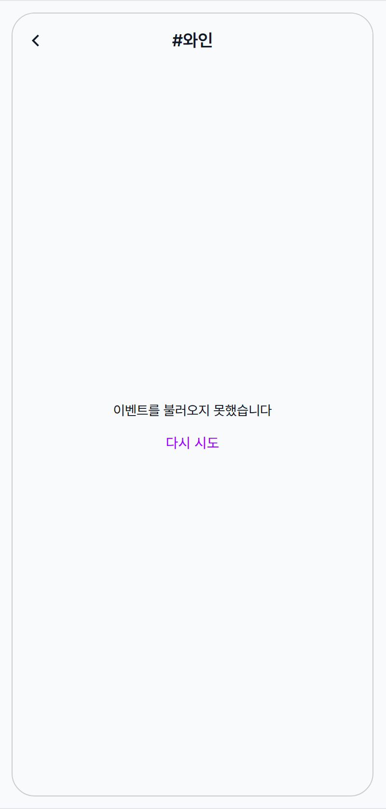

 Spec — TagEventListPage (app\_user · TagEventListRoute)  

# Tag Event List

## Overview

| Status | 🚧 디자인중 — 4 states · paginated vertical list (infinite scroll · 10/page). HomePage 태그 chip 탭 진입. |
|---|---|
| App | app_user |
| Category | tag · events list |
| Route / Surface | TagEventListRoute · widget: TagEventListPage |
| Path | /tags/:tagId |
| Hierarchy | Parent: HomePage (TrendingTagSection / FeaturedTagChipBar 태그 chip 탭으로 진입)Children: MinglitEventCard (수직 셀 · 탭 시 EventDetailPage로 이동 · 4 visible state — 별도 spec) |
| Purpose | 한 태그(예: #와인, #스피드데이팅)에 묶인 이벤트들을 시간순으로 한 화면에 펼쳐 보여준다. HomePage의 태그 chip은 발견·키워드 잡기 용도, 이 화면은 "이 키워드로 묶인 이벤트 N개를 천천히 둘러보기" — 태그 기반 탐색의 종착지. |
| User journey | Entry points: HomePage의 트렌딩 태그 카드 / 추천 태그 chip 탭. 딥링크 /tags/:tagId도 가능. 단 외부 진입에서는 AppBar 타이틀이 빈 "#"로 보일 수 있음.Exit points: 카드 탭 → EventDetailPage로 이동 · 뒤로 가기 → HomePage 복귀 · Empty 상태 CTA "홈으로 돌아가기" → 홈으로 명시적 이동 (Fix #1136 — 이전 화면이 없을 때를 위해 단순 pop 대신 홈으로 이동). |
| Background | 태그 chip은 HomePage에서 노출되는 가벼운 단서지만, 그 뒤에 어떤 이벤트들이 묶여 있는지를 풀어줄 화면이 필요했다. 이벤트는 10건씩 페이지로 받아오고, 리스트 끝에 가까워지면 다음 페이지가 자동으로 이어 붙는다 — 별도 풀-다운 새로고침은 없음. 다음 페이지 로드가 실패해도 화면이 깨지지 않고 조용히 멈추도록 안전 장치가 들어 있음 (Fix #1149). |
| Frequency | 관심 키워드에 대해 세션당 0~1회 — HomePage에서 chip을 발견하고 호기심에 진입하는 탐색 단계. |

## History

| Date | Version | Author | Changes |
|---|---|---|---|
| 2026-05-01 | 1.0 | mark-yun | v1.4 template으로 작성 — 4 states (Default · Empty · Loading · Error). 카드 자체 디자인은 MinglitEventCard child spec으로 위임. PaginationLoading은 Default의 sub-anatomy로 다룸 (별도 state로 분리하지 않음). |

[🧱 Layout](#layout) [🎨 States](#states) [🔄 Global Behavior](#global-behavior) [📖 Reference](#reference)

🧱

## Layout

Scaffold + AppBar + 분기 body. Default는 카드 사이 8px 간격이 들어간 수직 리스트, 그 외엔 화면 중앙 단일 영역.

## Blueprint & tree

body는 로딩 / 에러 / 결과 3개 분기를 같은 영역에서 교체 노출. 결과가 0건이면 Empty 안내, 1건 이상이면 카드 리스트. 리스트는 외곽 패딩 0 (edge-to-edge), 카드 사이에 8px gray gap.

**Scaffold** ├─ **AppBar**(centerTitle: true) ← ① │ └─ title: "#{태그 이름}" │ └─ body: 비동기 분기 ├─ \[loading\] Center → **MinglitCircularProgressIndicator** ├─ \[error\] Center → Column(min) \[ │ Text("이벤트를 불러오지 못했습니다"), │ SizedBox(small), │ TextButton("다시 시도") → 다시 받아오기 │ \] └─ \[data\] ├─ 결과 0건 + 더 받아올 것 없음 → **Center** → Column(min) \[ │ Text("아직 이 태그의 이벤트가 없어요", outline), │ SizedBox(medium), │ TextButton("홈으로 돌아가기") → 홈으로 이동 _(Fix #1136)_ │ \] └─ 결과 1건 이상 → **ListView**(카드 사이 separator 8) ← ②③④ · 다음 페이지 로딩 중이면 마지막에 작은 스피너 한 줄 추가 · 카드 탭 시 EventDetailPage로 이동 _(Fix #1136)_

| # | Region | Alignment | Spacing |
|---|---|---|---|
| ① | AppBar | centerTitle (자동 뒤로가기 leading) | height: 56 · scaffold gray bg · border-bottom 없음 · title typography titleLarge |
| ②③④ | MinglitEventCard cell | edge-to-edge · 외곽 패딩 없음 | 카드 사이 separator 8px (gray gap). 카드 height ≈ 240px (2:1 이미지 + 본문). 자세한 anatomy는 child spec. |
| — | Pagination spinner | — | 다음 페이지 로딩 중에 리스트 끝에 한 줄 노출. 외곽 패딩 16px + 작은 중앙 정렬 스피너. |
| — | Body | — | 외곽 padding 0 — 분기 결과가 그대로 화면에 채워짐. |

🎨

## States

4 states (Default · Empty · Loading · Error). 모두 동일 `Scaffold` + AppBar — body만 분기. Default가 baseline; 나머지는 additive diff (`+` · `−` · `↔` · `동일` · `—`). 카드 자체의 4 visible state(normal · today · soldOut · ended) 변형은 [MinglitEventCard child spec](/specs/event_card/index.html) 참고.

## State summary

| State | Tag | 조건 (요약) | Key visual differentiator |
|---|---|---|---|
| Default 🎯 | production | 이 태그에 이벤트 1개 이상 | 수직 카드 리스트 · 카드 사이 8px gap · 끝에 다다르면 다음 페이지가 자동으로 이어 붙음 |
| Empty | data·empty | 이 태그에 이벤트가 0개 (더 받아올 것도 없음) | 화면 중앙 "아직 이 태그의 이벤트가 없어요" + "홈으로 돌아가기" 텍스트 버튼 |
| Loading | async | 첫 페이지를 불러오는 중 | 화면 중앙 단일 스피너 · AppBar 태그 이름은 그대로 노출 |
| Error | network/server | 첫 페이지를 받지 못한 상태 | "이벤트를 불러오지 못했습니다" + "다시 시도" 텍스트 버튼 (재시도 CTA — partner_events_page와 다른 점) |

## States gallery

각 state mini-table — mockup(rowspan=6) + 6 aspect rows. **Default가 baseline**; 나머지 3 states는 additive diff. 카드 자체 anatomy / D-Day 칩 / 만석 scrim 등은 child spec에서 다룸 — 이 spec은 페이지 골격(AppBar + list/center 분기 + 페이지네이션)에 집중.

### Default 🎯

| 항목 | 내용 |
|---|---|
| 조건 | 이 태그에 이벤트가 1개 이상 도착한 상태. |
| 사용자 액션 | · 뒤로 가기 → HomePage 복귀· 카드 탭 → EventDetailPage로 이동· 스크롤 → 추가 카드 노출. 끝에 다다르면 다음 10건이 자동으로 이어 붙고, 그 사이에는 리스트 끝에 작은 스피너 한 줄이 노출· 카드 길게 누르기 — 별도 액션 없음 |
| 에지케이스 | · PaginationLoading sub-state: 다음 페이지 로딩 중이면 리스트 끝에 작은 스피너 한 줄이 더해짐. 별도 페이지 상태로 분리하지 않음 (UI는 Default + 끝에 스피너 행).· 다음 페이지 로딩 실패: 화면이 깨지지 않고 조용히 멈춤 — 사용자에게 별도 오류 안내 없이 스피너만 사라짐. 다음 스크롤이 다시 트리거하면 재시도. 실제 끝에 도달했을 때와 시각적으로 잘 구분되지 않음.· 리스트 끝에 도달: 추가 스피너 없음. "이게 전부예요"라는 별도 안내도 없음.· 카드 mix (오늘 / 만석 / 종료) — 정렬은 시간 기반으로 보이지만 명시적 보장은 아님. |
| 컴포넌트 | Scaffold · AppBar(centerTitle · 타이틀 "#{태그 이름}") · 카드 리스트(카드 사이 8px gap · 다음 페이지 로딩 중에는 끝에 스피너 행 추가) · MinglitEventCard(탭 시 EventDetailPage로 이동 · 별도 spec — child) · 작은 중앙 스피너 (페이지네이션 행 · 외곽 패딩 16px) |
| 토큰 | · color: color-surface (#f9fafb) (scaffold + AppBar bg + 카드 사이 separator gap) · color-background (#ffffff) (카드 본체 — child spec) · color-text-primary (AppBar title) · color-primary (pagination spinner indicator)· spacing: list 외곽 padding 0 (edge-to-edge) · 카드 사이 separator spacing-small (8) · pagination row padding spacing-medium (16) · 카드 내부 token은 child spec 참고· radius / typography / iconSize: 카드 자체에 위임 — child spec |
| 노트 | 📝 mockup은 카드 3장 + 페이지네이션 스피너로 표시 — 실제는 N개 + 스크롤. AppBar의 태그 이름은 진입 직후부터 즉시 노출. |

### Empty data·empty

| 항목 | 내용 |
|---|---|
| 조건 | 이 태그에 이벤트가 0개이고 더 받아올 것도 없는 상태. |
| 사용자 액션 | ↔ 리스트 / 스크롤 / 카드 액션 모두 없음 (카드 미노출)+ "홈으로 돌아가기" 탭 → 홈으로 명시적 이동 (Fix #1136 — 이전 스택이 없을 때를 위해 단순 pop 대신 홈으로 이동)동일: 뒤로 가기 (시스템 back / AppBar back) → 이전 화면 (보통 HomePage)으로 복귀 |
| 에지케이스 | · 첫 페이지가 0건이면 더 받아올 것도 없는 것으로 간주되어 Empty 안내가 노출됨.· 첫 페이지 결과가 1~9건이면 더 받아올 것이 없더라도 Default 화면으로 분기 — Empty 화면을 보지 않음.· 알 수 없는 태그로 직접 진입해도 결과가 0건이면 동일한 Empty 화면. 별도 "잘못된 태그" 안내 없음. |
| 컴포넌트 | ↔ 카드 리스트 → 화면 중앙 Column [ "아직 이 태그의 이벤트가 없어요" (bodyMedium · outline) · 16px gap · "홈으로 돌아가기" 텍스트 버튼 ] |
| 토큰 | − Default list / pagination 토큰 모두 미사용+ color-text-secondary = outline (메시지 색)+ color-primary (TextButton fg · Material default)+ spacing: spacing-medium (16) (text → button 사이 SizedBox) |
| 노트 | 📝 재시도 / 검색 안내 없음 — 단순히 홈으로 돌려보냄. 향후 "비슷한 태그 추천" 또는 "검색해보기" CTA 보강 후보. 빈 상태에서 스크롤 액션이 사라지는 것은 의도적 — 더 이상 받아올 게 없기 때문. |

### Loading async

| 항목 | 내용 |
|---|---|
| 조건 | 첫 페이지를 불러오는 중. 화면에 처음 들어올 때. |
| 사용자 액션 | · 뒤로 가기 → HomePage 복귀 (즉시).· 그 외 무반응 (스피너 회전). |
| 에지케이스 | · 스켈레톤 / 풀-다운 새로고침 없음. 별도 타임아웃 없음.· 화면을 떠나면 캐시가 비워지므로 다시 들어올 때마다 Loading을 거침 (PartnerEvents와 다른 점).· 백그라운드에서 다시 받아오는 경우에는 직전 결과가 그대로 노출되어 이 화면이 보이지 않음. |
| 컴포넌트 | ↔ 카드 리스트 → 화면 중앙 단일 스피너 |
| 토큰 | − Default list 토큰 미사용+ color-primary (스피너 색)+ color-surface (scaffold bg 유지) |
| 노트 | 📝 AppBar의 태그 이름은 진입 직후부터 즉시 표시 — Loading 상태에서도 "어떤 태그를 보러 왔는지" 단서 제공. 다음 페이지 로딩(PaginationLoading)은 이 상태가 아니라 Default + 끝의 작은 스피너 행 — 구분 필요. |

### Error network/server

| 항목 | 내용 |
|---|---|
| 조건 | 첫 페이지를 받지 못한 상태. 네트워크 / 서버 / 권한 오류. |
| 사용자 액션 | ↔ 리스트 액션 모두 없음+ "다시 시도" 탭 → 첫 페이지를 다시 받아옴 → Loading → Default/Error동일: 뒤로 가기 → HomePage 복귀 |
| 에지케이스 | · 구체적인 오류 사유는 화면에 표시되지 않음 — 일반 안내 문구만 노출.· 인증 만료도 동일한 오류 화면 (별도 분기 없음).· 두 번째 이후 페이지 로딩 실패는 이 화면이 아닌 Default 안에서 조용히 처리됨 (Fix #1149). |
| 컴포넌트 | ↔ 카드 리스트 → 화면 중앙 Column [ "이벤트를 불러오지 못했습니다" · 8px gap · "다시 시도" 텍스트 버튼 ] |
| 토큰 | − Default list 토큰 미사용+ color-text-primary (메시지 색 — default Text style)+ color-primary (TextButton fg)+ spacing: spacing-small (8) (text → button 사이 SizedBox)(partner_events_page와 달리 error icon / "오류가 발생했습니다." titleMedium 미사용 — 단순 bodyMedium + retry CTA 조합) |
| 노트 | 📝 재시도 버튼이 있다는 점이 partner_events_page와의 차이 — 사용자가 "뒤로 → 다시 진입" 없이 같은 화면에서 재시도 가능. 대신 에러 아이콘이 빠져 시각적으로 약하다 — Phase 2에서 아이콘 + 통일된 레이아웃 검토 후보. |

🔄

## Global Behavior

cross-cutting — 모든/다수 state에 적용. state-specific 액션은 위 mini-table 참고.

## Cross-cutting interactions

| 사용자 액션 | 화면에 보이는 결과 |
|---|---|
| 뒤로 가기 (OS back / AppBar 뒤로 버튼) | 이전 화면(보통 HomePage)으로 복귀 — 4 state 모두 동일. |
| 카드 탭 (Default 한정) | EventDetailPage로 이동 (sharedAxisScaled · 350ms 전환). |
| 리스트 끝부근 스크롤 | 리스트 끝에 가까워지면 다음 10건이 자동으로 이어 붙음. 진행 중에는 리스트 끝에 작은 스피너 한 줄. 더 받아올 게 없거나 이미 진행 중이면 무반응. |
| 풀-다운 새로고침 | 없음 — 강제로 다시 받으려면 "뒤로 → 다시 진입"으로 우회. |
| 딥링크로 직접 진입 | /tags/:tagId URL로 곧장 진입 가능 → Loading → Default (또는 Empty / Error). 외부 진입에서는 AppBar 타이틀이 빈 "#"로 보일 수 있음. |
| 다크 모드 토글 | scaffold / AppBar / 카드 모두 다크 토큰으로 자동 전환. |

## Motion timing

Source: `shared/packages/mds/core/lib/src/theme/minglit_design_tokens.dart` → `MinglitAnimation`.

| Transition | Token / Duration | Notes |
|---|---|---|
| 화면 진입 (HomePage → TagEventList) | MinglitAnimation.fast (200ms) | 플랫폼 기본 push 전환. |
| 카드 탭 → EventDetail 이동 | MinglitAnimation.medium (350ms) | MinglitPageTransitions.sharedAxisScaled — EventDetail 진입의 표준 전환. |
| Loading → Default 교체 | cut | fade 없이 즉시 교체. |
| 다음 페이지 추가 노출 | cut + 자연스러운 리스트 재배치 | 스피너 한 줄이 끝에 잠시 노출됐다가, 응답 도착 후 새 카드들로 교체됨. |
| 카드 탭 ripple | MinglitAnimation.micro (100ms) | Material 잉크 리플 — 카드 내부에서 처리. |
| 리스트 스크롤 관성 | OS 기본 | iOS는 끝에서 살짝 튕김, Android는 Material 기본. 별도 token 없음. |

## Global edge cases

-   **태그 이름이 빈 문자열** — AppBar 타이틀이 그냥 "#"로 보일 수 있음. HomePage 정상 진입에서는 사실상 발생 안 함, 외부 진입에서만 가능.
-   **캐시 정책** — 화면을 떠나면 결과가 비워지므로 다시 들어올 때마다 Loading을 거치며 첫 페이지를 다시 받음 (PartnerEventsPage와 다른 점 — 태그 목록은 짧은 탐색 단계라 캐시 정책이 가볍게).
-   **다음 페이지 로딩 실패** — 사용자에게는 스피너가 슬그머니 사라지고 추가 카드가 안 붙는 상황으로 보임. 별도 toast / snackbar 없음.
-   **접근성** — AppBar 뒤로 버튼은 플랫폼 기본 접근성 동작. 카드 자체 접근성 안내는 child spec 참고 (만석 / 종료 안내 포함). 페이지네이션 스피너는 별도 접근성 안내 없음.
-   **대용량 리스트** — 한 번에 10건씩만 받아오므로 partner\_events\_page의 "전부 받아 표시" 방식보다 메모리 안전. 다만 N이 매우 커지면 누적 길이가 무한정 증가 (페이지 누적 폐기 정책 없음).

📖

## Reference

implementation source + 인접 화면. Components / Tokens는 위 mini-table 참고.

## Implementation source

| Widget | TagEventListPage — apps/app_user/lib/src/features/tag/ui/tag_event_list_page.dart |
|---|---|
| Controller | TagEventListController + TagEventListState — tag_event_list_controller.dart (@riverpod · autoDispose · _pageSize: 10 · Fix #1149 silent loadMore failure) |
| Repository | tagRepositoryProvider.getPartiesByTag(tagId, offset:) — Supabase에서 태그 매핑 이벤트 list paginated fetch. |
| Coordinator (entry) | tagCoordinatorProvider — tag_coordinator.dart · goToTagEventList(tagId, tagName) |
| Coordinator (exit) | eventCoordinatorProvider — goToEventDetail(eventId) (카드 탭 시 · Fix #1136: 위젯에서 GoRouter 직접 호출 금지) |
| Async pattern | raw stateAsync.when(data, loading, error) — MinglitAsyncValueWidget 미사용 · loading/error 모두 인라인 Center+Column으로 직접 작성 |
| Card cell | MinglitEventCard — event_card.dart · onTap: eventCoordinator.goToEventDetail (Fix #1136) |
| Route | TagEventListRoute · /tags/:tagId · 인자: tagId (path) + tagName (생성자 prop · 딥링크 path/query 미노출 · uncertain) · app_routes.dart (380행~) |
| Pagination trigger | _scrollController.position.pixels >= maxScrollExtent − 200 → unawaited(controller.loadMore()) · _pageSize = 10 |
| Related fix | Fix #1136 (Coordinator 패턴 + Empty CTA HomeRoute go) · Fix #1149 (loadMore silent failure recovery — 글로벌 async error 폭주 방지) |

## Related screens

| Spec | Relation |
|---|---|
| HomePage | 유일한 정상 진입점 — TrendingTagSection 카드 / FeaturedTagChipBar chip 탭. 둘 다 tagCoordinator.goToTagEventList 호출. |
| MinglitEventCard | list cell 위젯 — 별도 spec. 4 visible state(normal · today · soldOut · ended). onTap → EventDetail. |
| EventDetailPage | 카드 탭 시 push — eventCoordinator.goToEventDetail(event.id). sharedAxisScaled 350ms transition. |
| PartnerEventsPage | 유사 vertical event list 패턴 (한 파트너의 이벤트). 다만 pagination 없음 + retry CTA 없음 + MinglitAsyncValueWidget 사용 — 작은 차이가 모여 다른 화면. |
| SearchPage | 비슷한 키워드 기반 탐색 패턴 (사용자가 쿼리를 입력 vs 태그 chip을 탭). 결과 list 형태가 유사 — 추후 통합 / 디자인 정합 검토 후보. |