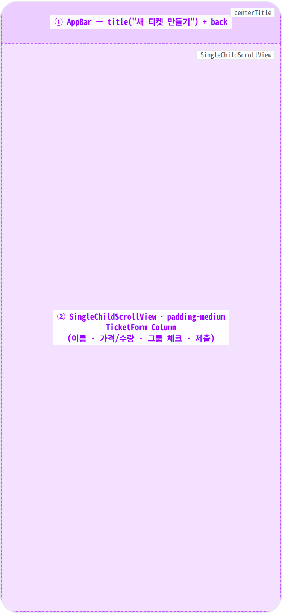
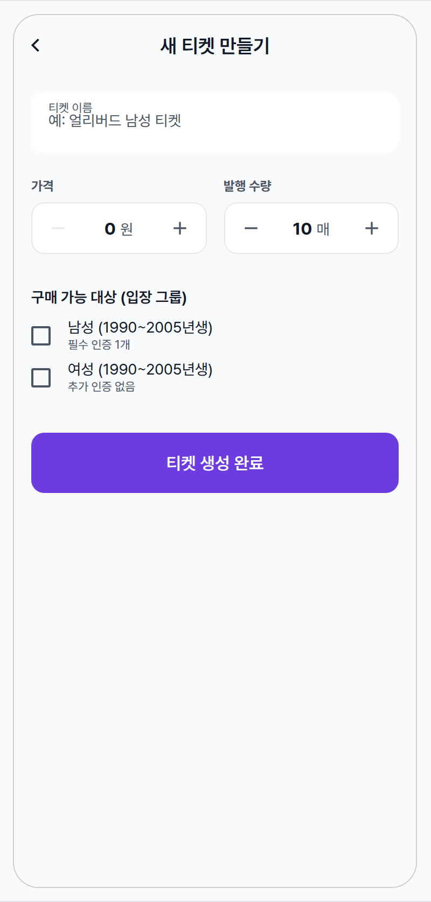
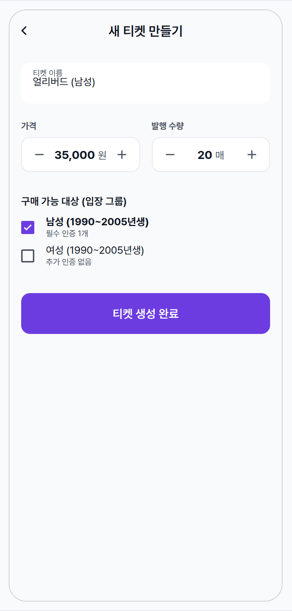
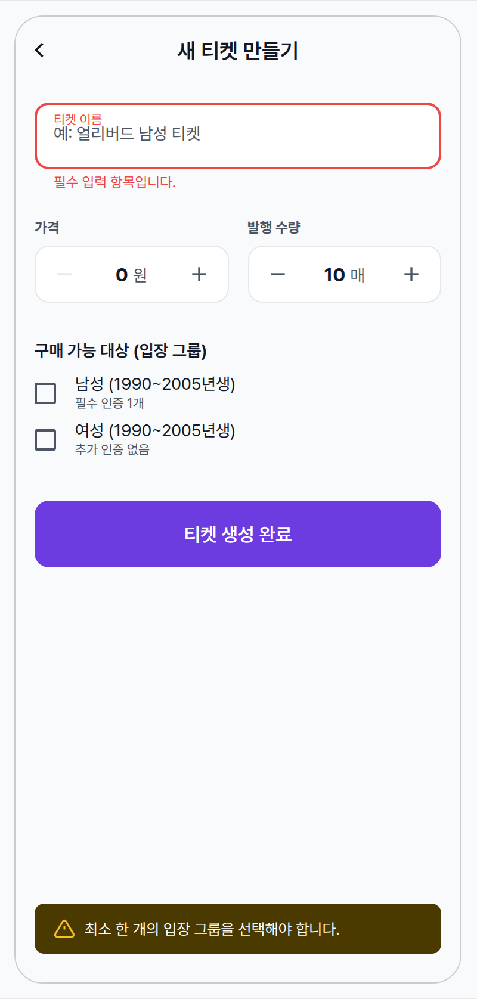
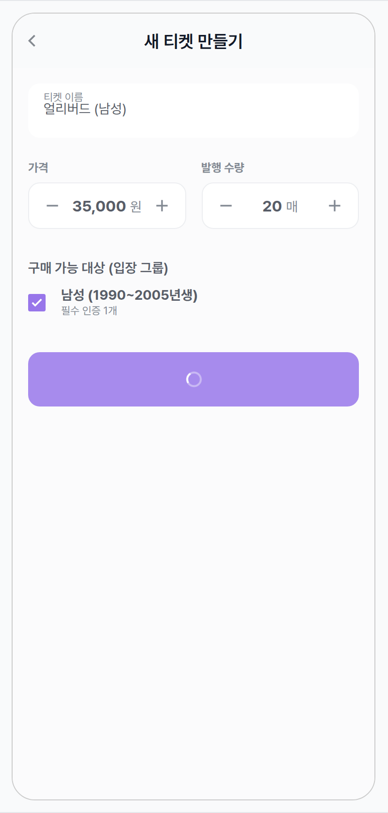
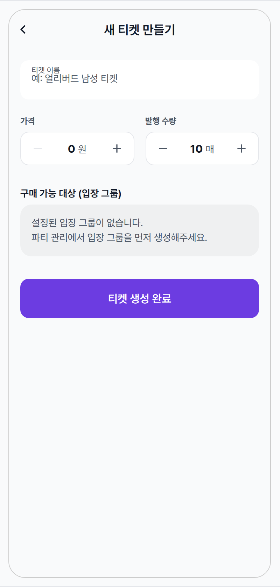

 Spec — TicketCreatePage (app\_partner · TicketCreateRoute)  

# Ticket Create

## Overview

| Status | ✅ 디자인완료 — 5 state (loading + form 4 variants) · single tab · single submit |
|---|---|
| App | app_partner |
| Category | party · event · ticket · create |
| Route / Surface | TicketCreateRoute · widget: TicketCreatePage wraps TicketForm (재사용 atom — Edit 화면도 같은 form) |
| Path | /more/parties/:partyId/events/:eventId/tickets/create |
| Hierarchy | Parent: EventDetailPage (티켓 섹션의 "+ 티켓 추가" CTA에서 진입)Children: — (편집 변형은 sibling spec TicketEditPage가 같은 TicketForm 재사용 — 별도 spec 없음. 입장 그룹은 부모 파티 단위라 이 화면에선 read-only 선택.) |
| Purpose | 파트너가 특정 회차(event)에 판매할 티켓을 만든다. 이름·가격·발행 수량을 정한 뒤 파티에 정의된 입장 그룹 중 어느 그룹이 이 티켓을 살 수 있는지 다중 선택해 저장한다. 이벤트 단위로 묶이며 한 회차에 N개 티켓을 발행할 수 있다. |
| User journey | Entry points: 회차 상세 화면의 티켓 섹션 → "티켓 추가" CTA에서 진입.Exit points: 생성 성공 → 화면이 닫히며 회차 상세로 돌아가고 "티켓이 생성되었습니다." 토스트가 잠시 노출되며 새 티켓이 목록에 즉시 반영. 실패 → 안내 토스트가 잠시 노출되고 화면은 그대로 유지. 뒤로가기 → 별도 확인 없이 즉시 닫힘. |
| Background | 밍글릿은 같은 회차 안에서도 가격대·인원 풀이 다른 티켓을 여러 종 운영한다 (얼리버드/일반, 남성/여성, VIP 등). 입장 그룹은 부모 파티에서 미리 정의된 인구학적/인증 슬롯이며, 티켓은 그 슬롯에 1:N으로 연결된다. 그래서 이 화면은 "그룹 정의" UI가 없고 — 이미 만들어진 그룹 중 선택만 한다. 그룹이 0개면 명시적 안내(empty 카드)와 함께 진행 자체를 막아 데이터 무결성을 지킨다. |
| Frequency | 회차당 1~5회. 정기 파티의 매주 회차마다 같은 티켓을 새로 만들 가능성이 높지만, 기존 티켓을 복제하거나 템플릿으로 불러오는 기능은 아직 없음 — 후속 정리 후보. |

## History

이 spec의 주요 변경 이력. 최신 항목 위.

| Date | Version | Author | Changes |
|---|---|---|---|
| 2026-05-01 | 1.0 | mark-yun | v1.4 template으로 작성. 5 state — baseline empty form · filled · validation error · submitting · groups empty (party 단계에서 그룹 미정의). Partner brand --color-partner-primary viewport-scoped. |

[🧱 Layout](#layout) [🎨 States](#states) [🔄 Global Behavior](#behavior) [📖 Reference](#reference)

🧱

## Layout

화면 구조 — 영역, 정렬, 간격 규칙. 색·타이포 무시.

## Blueprint & tree

가장 단순한 구조의 단일 폼 화면. `Scaffold`(simpleAppBar) + `SingleChildScrollView`(padding all 16) → `TicketForm` Column. 별도 bottom bar 없음 — submit 버튼은 폼의 마지막 row. 입장 그룹 prefetch는 `MinglitAsyncValueWidget`으로 감싸 loading/error를 분기한다.

**Scaffold** ├─ **appBar**: **MinglitTheme.simpleAppBar** ← ① │ title: l10n.ticket\_title\_create ("새 티켓 만들기") └─ **body**: **MinglitAsyncValueWidget** ← ② value: `ticketEntryGroupsProvider(partyId)` data: **SingleChildScrollView**(padding: all `spacing-medium`) └─ **TicketForm**(Form) └─ **Column**(crossAxis: start) ├─ **TextFormField**(이름) label/hint · validator ├─ SizedBox(height: `spacing-large`) ├─ **Row** │ ├─ Expanded(**NumberStepperInput** 가격 · step 1000 · suffix "원") │ ├─ SizedBox(width: `spacing-medium`) │ └─ Expanded(**NumberStepperInput** 수량 · 1~999 · suffix "매") ├─ SizedBox(height: `spacing-xlarge`) ├─ Text("구매 가능 대상 (입장 그룹)") titleSmall w600 ├─ SizedBox(height: `spacing-small`) ├─ if entryGroups.isEmpty: │ Container(empty 카드 · surfaceContainerHighest @ muted) │ else: │ ...entryGroups.map(**CheckboxListTile**) (dense compact · zero pad) ├─ SizedBox(height: `spacing-xlarge`) └─ **SizedBox**(width: ∞) → **ElevatedButton** onPressed: isLoading ? null : \_handleSubmit child: isLoading ? MinglitCircularProgressIndicator : "티켓 생성 완료"

## Spacing & alignment rules

| # | Region | Alignment | Spacing |
|---|---|---|---|
| ① | AppBar | title centered (simpleAppBar default · centerTitle: true) · 56px · automaticallyImplyLeading: true | border 없음 (surfaceTintColor: transparent · scaffold-gray bg). |
| ② | ScrollView body | SingleChildScrollView · column start · padding all spacing-medium (16) | field 간 간격: spacing-large (24 · 이름↔stepper row), spacing-xlarge (32 · stepper↔그룹, 그룹↔submit). Stepper 두 개 사이: spacing-medium (16). 그룹 라벨↔첫 체크박스: spacing-small (8). |
| — | TextFormField | filled · radius-input(12) · borderSide: none · focusedBorder: 2px primary · contentPadding all 16 | 높이 ≈ 56 · 라벨/힌트는 InputDecoration default(floating). hintStyle 14/textSecondary. |
| — | NumberStepperInput | Column(start) — label labelMedium bold + 8 gap + Container(border outlineVariant · radius-input · padding-xsmall horizontal) | row 높이 ≈ 48 · stepper btn 40×40 (icon 20px) · 중앙 TextFormField textAlign center · suffix titleSmall normal. |
| — | CheckboxListTile | contentPadding zero · controlAffinity leading · dense · visualDensity compact | 체크박스 18px → text 사이 default Material gap. subtitle labelSmall onSurfaceVariant. 행간 약 4px (dense+compact). |
| — | Submit button | SizedBox(width: ∞) · ElevatedButton | partner theme: minHeight 56 · radius-button (12) · bg primary · fg white · elevation 0. |

🎨

## States

시각 변형 5종. baseline = 빈 폼 · 그룹 prefetch 완료, 나머지는 additive diff.

**State 식별 기준**: 부모 파티의 입장 그룹이 도착해 있는지 / 비어 있는지, 입력값이 유효한지, 1개 이상의 그룹을 선택했는지, 저장이 진행 중인지에 따라 5가지 변형. 이 화면은 항상 새 티켓을 만드는 흐름이며, 기존 티켓을 수정하는 변형은 같은 폼을 재사용하는 별도 화면.

### 빈 폼 / 그룹 도착 완료 🎯 baseline · 입장 그룹은 채워졌고 사용자는 아직 입력 전

| 항목 | 내용 |
|---|---|
| 조건 | 부모 파티의 입장 그룹이 한 개 이상 등록되어 있고, 화면에는 빈 폼(이름 비어 있음 / 가격 0 / 수량 기본 10)만 노출된 진입 직후 모습. |
| 사용자 액션 | ① 이름 입력란 탭 — 키보드가 올라오며 입력란 둘레가 강조 색의 두꺼운 외곽선으로 바뀜.② 가격 +/− — 1,000원 단위로 증감. 0원에서는 빼기 버튼이 흐릿하게 비활성.③ 수량 +/− — 1매 단위로 증감 (1~999매 범위).④ 가격 / 수량을 직접 입력 — 숫자만 받아들이며, 입력란 바깥을 누르거나 엔터를 치면 허용 범위로 보정되어 반영.⑤ 입장 그룹 체크박스 탭 — 복수 선택 가능. 한 개 이상 선택해야 저장 가능.⑥ "티켓 생성 완료" 탭 — 입력값이 유효하면 저장이 진행되고, 그룹을 한 개도 고르지 않았다면 안내 토스트가 잠시 노출.⑦ 뒤로가기 — 별도 확인 없이 즉시 닫힘. |
| 에지케이스 | · 이름을 비운 채 저장하면 — 입력란이 빨간 톤으로 강조되며 "필수 입력 항목입니다." 안내가 그 아래에 노출.· 그룹을 한 개도 고르지 않은 채 저장하면 — "최소 한 개의 입장 그룹을 선택해야 합니다." 안내 토스트가 잠시 노출.· 가격을 0원으로 두는 것도 가능 — 무료 티켓 발행을 허용하는 정책 — 후속 검토 후보.· 키보드가 올라와 저장 버튼을 가리는 경우 — 본문이 자동으로 줄어들어 버튼이 가려지지 않음. |
| 컴포넌트 | · AppBar(simpleAppBar · centerTitle · back btn auto)· TextFormField(이름 · filled · floating label · hint · validator)· NumberStepperInput × 2 (가격 step 1000, 수량 1~999)· Text(titleSmall w600) 그룹 라벨· CheckboxListTile × N (dense compact · zero pad · leading)· ElevatedButton(SizedBox width ∞) |
| 토큰 | · color: color-partner-primary (#6c3ce1 — focus border, checkbox active, 버튼 bg), color-surface (scaffold + AppBar bg, light gray), color-background (TextField fill, stepper bg — white), color-divider (stepper border, disabled stepper btn), color-text-primary/secondary· radius: radius-input (12 · TextField, stepper), radius-button (12 · 제출 버튼)· spacing: spacing-medium (16 · body padding · stepper 사이), spacing-large (24 · 이름↔stepper), spacing-xlarge (32 · stepper↔그룹↔submit), spacing-small (8 · 라벨↔본문)· typography: appBarTitle (18/600), bodyMedium (14 · field 값/체크박스 title), labelMedium bold (12 · stepper 라벨), titleSmall w600 (14 · 그룹 헤더), labelSmall (11 · 그룹 sub) |
| 노트 | 📝 진입 시 수량의 기본값은 10매. 재발행 같은 변형 흐름이 들어올 때를 대비한 초기값 주입 경로가 폼에 마련되어 있지만, 이 화면에선 사용되지 않음. |

### 입력 완료 (filled · valid) 이름·가격·수량·그룹이 모두 채워져 저장 가능한 상태

| 항목 | 내용 |
|---|---|
| 조건 | 이름 / 가격 / 수량이 모두 채워졌고, 한 개 이상의 입장 그룹이 선택되어 저장이 가능한 상태. |
| 사용자 액션 | ↔ 이름 입력란 — 힌트 텍스트가 사라지고 입력값이 표시됨. 포커스를 잃어도 상단의 작은 라벨은 그대로 남음.↔ 선택된 그룹은 제목이 굵게 변하고 체크박스가 강조 색으로 채워짐.+ "티켓 생성 완료" 탭 — 다음 state(저장 진행)로 전환.나머지 baseline 동일. |
| 에지케이스 | · 가격이 아주 큰 숫자(예: 999,999원)면 입력란 좌우가 좁아져 일부가 잘려 보일 수 있음 — 후속 정리 후보.· 이름에 공백만 있는 경우는 빈 값으로 간주되지 않으므로 저장 직전에 서버 측에서 다듬는 처리가 필요.· 그룹 제목이 길어서 두 줄로 줄바꿈되는 경우 — 행 높이가 살짝 커지며 자연스럽게 늘어남. |
| 컴포넌트 | ↔ TextFormField → 값 채워진 상태 (hint 비활성)↔ CheckboxListTile(선택됨) → activeColor primary · title bold w600나머지 동일 |
| 토큰 | ↔ TextField 값 텍스트 → bodyMedium color-text-primary+ 체크박스 선택 fill → color-partner-primary, 체크 마크 white+ 선택된 그룹 title → fontWeight 600나머지 동일 |
| 노트 | 📝 가격 표기에 천 단위 콤마가 적용되지 않아, 큰 가격도 콤마 없이 한 줄에 노출됨 — 후속 정리 후보. mockup은 가독성을 위해 콤마를 표기. |

### 유효성 에러 (validation) 이름이 비어 있거나 그룹을 한 개도 선택하지 않은 채 저장을 시도한 직후

| 항목 | 내용 |
|---|---|
| 조건 | (a) 이름이 비어 있는 채 저장을 시도한 경우 — 이름 입력란이 빨간 톤으로 강조되고 그 아래에 "필수 입력 항목입니다." 안내가 노출.(b) 이름은 채웠으나 그룹을 한 개도 선택하지 않은 경우 — 입력란은 그대로 두고 화면 하단에 "최소 한 개의 입장 그룹을 선택해야 합니다." 안내 토스트가 잠시 노출. |
| 사용자 액션 | ↔ 저장 시 미흡한 입력란이 있으면 화면이 그쪽으로 자동 스크롤되며 강조 표시.+ 그룹 누락 안내 토스트는 잠시 후 자동으로 사라지며 별도 액션은 필요 없음.+ 사용자가 입력을 보완한 뒤 다시 저장을 누르면 정상 진행. |
| 에지케이스 | · 이름이 비어 있고 그룹도 선택되지 않은 경우 — 이름 누락 안내가 먼저 노출되고, 이름이 채워진 뒤 다시 저장을 누르면 그 다음 그룹 누락 안내가 노출됨.· 한 번 강조된 입력란은 사용자가 다시 손대지 않더라도 다음 저장 시도 시점까지 강조 상태가 유지됨. |
| 컴포넌트 | ↔ TextFormField → error border + helper text (Material 표준)+ SnackBar(warning) — showMinglitWarning · context extension나머지 baseline 동일 |
| 토큰 | + TextField error border → color-error 2px+ helper text → color-error, 12px+ warning snackbar bg → 짙은 amber/brown (Material default surface inverse · 아이콘 amber)나머지 동일 |
| 노트 | 📝 그룹 누락 안내는 입력란 강조와 함께 인라인으로 표기되지 않고 화면 하단의 토스트로 안내되는 점이 다른 입력 누락과의 차이. |

### 제출 중 (submitting) "티켓 생성 완료"를 누른 직후 서버 응답 대기

| 항목 | 내용 |
|---|---|
| 조건 | "티켓 생성 완료"를 누른 직후, 서버에 새 티켓을 만드는 응답을 기다리는 짧은 구간. 저장 버튼은 비활성화되며 안에 작은 흰 스피너만 노출됨. |
| 사용자 액션 | ↔ 저장 버튼 — 라벨이 사라지고 스피너만 노출되며 비활성화.↔ 본문 입력 영역은 시각상 살짝 흐릿하게 표시되지만 손댈 수 있는 약점이 있음 — 후속 정리 후보.완료되면 — 성공 시 화면이 닫히며 회차 상세로 돌아가고 "티켓이 생성되었습니다." 토스트가 잠시 노출되며 새 티켓이 목록에 즉시 반영. 실패 시 다음 state(에러 안내)로 전환. |
| 에지케이스 | · 회차 정보가 비어 있는 변형 흐름에서는 부모 파티의 티켓 템플릿 목록이 갱신되어 다음 회차에서 그대로 가져다 쓸 수 있게 됨.· 저장 진행 중 사용자가 빠져나가더라도 저장은 백그라운드에서 그대로 진행되며, 이미 만들어진 티켓은 서버에 그대로 남음.· 사용자가 빠르게 두 번 탭하면 같은 티켓이 중복 생성될 위험이 있음 — 후속 정리 후보. |
| 컴포넌트 | ↔ 저장 버튼 안의 텍스트가 사라지고 작은 흰 스피너로 교체.나머지는 baseline과 동일 (폼 자체는 그대로 유지). |
| 토큰 | ↔ 저장 버튼 배경 — baseline과 동일한 강조 색을 유지하고 살짝 옅은 톤으로 비활성 표기.나머지 동일 |
| 노트 | 📝 사용자가 빠르게 두 번 탭하면 같은 티켓이 중복 생성될 위험이 있어, 저장 진행 중 폼 입력을 막거나 풀스크린 로딩 오버레이로 일관 처리 — 후속 정리 후보. |

### 입장 그룹 미정의 (entry groups empty) 부모 파티에 입장 그룹이 한 개도 등록되어 있지 않은 상태

| 항목 | 내용 |
|---|---|
| 조건 | 부모 파티에 입장 그룹이 한 개도 등록되어 있지 않은 상태. 보통 파티 만들기 위저드에서 한 개 이상 만들기 때문에 흔히 발생하지 않음. |
| 사용자 액션 | ↔ 그룹 선택 영역에 체크박스 대신 회색 톤의 안내 카드("설정된 입장 그룹이 없습니다. 파티 관리에서 입장 그룹을 먼저 생성해주세요.")가 노출되며, 카드를 눌러도 다음 화면으로 이동하지 않음.+ 그룹 없이 저장을 시도하면 그룹 누락 안내 토스트가 잠시 노출되어 결과적으로 저장은 진행되지 않음.↔ 사용자가 직접 뒤로가기로 빠져나가 파티 관리 화면에서 입장 그룹을 먼저 만들어야 함 (안내 카드에 이동 링크는 없음 — 후속 정리 후보). |
| 에지케이스 | · 안내 카드가 단순 안내라 다음 단계로 가는 길이 명시되어 있지 않은 약점 — 후속 정리 후보.· 입장 그룹을 가져오는 도중 — 같은 자리(체크박스 영역) 위에 작은 스피너만 노출되며, 폼 나머지 영역은 아직 그려지지 않음.· 입장 그룹을 가져오지 못한 경우 — 폼 대신 표준 오류 화면이 노출되어 사용자는 뒤로가기로만 빠져나올 수 있음. |
| 컴포넌트 | ↔ CheckboxListTile 리스트 → Container(empty 카드 · padding 16 · radius-card)나머지 baseline 동일 |
| 토큰 | + empty 카드 bg → surfaceContainerHighest @ MinglitOpacity.muted (~0.06 alpha)+ 본문 텍스트 → color-text-secondary · bodyMedium · whitespace pre-line나머지 동일 |
| 노트 | 📝 입장 그룹이 없는 상태에서도 저장 버튼은 활성화되어 보이지만, 누르면 그룹 누락 안내가 떠 결국 진행되지 않음. 사용자에게 명시적으로 안내하는 의도지만, 버튼도 같이 비활성화하는 것이 더 명확하다는 의견 — 후속 정리 후보. |

🔄

## Global Behavior

화면 전체에 적용되는 인터랙션, 모션, edge case.

## Cross-cutting interactions

| Trigger | Effect |
|---|---|
| 이름 입력란 탭 | 키보드가 올라오며 본문이 자동으로 줄어들어 가려지지 않음. 포커스를 받은 입력란은 강조 색의 두꺼운 외곽선으로 표시되고, 포커스를 잃으면 상단의 작은 라벨만 남음. |
| 가격 / 수량 +/− 탭 | 해당 값이 즉시 반영. 허용 범위의 끝(최소·최대)에 도달하면 그쪽 버튼만 흐릿하게 비활성. |
| 가격 / 수량 직접 입력 | 숫자만 입력 가능. 입력란 바깥을 누르거나 엔터를 치면 허용 범위로 보정되어 반영. |
| 입장 그룹 체크박스 탭 | 해당 그룹의 선택이 즉시 토글. 선택된 그룹은 제목이 굵게 변하고 체크박스가 강조 색으로 채워짐. |
| "티켓 생성 완료" 탭 | 입력값이 유효하지 않으면 미흡한 입력란이 강조되며 안내가 노출. 그룹을 한 개도 고르지 않았으면 안내 토스트가 잠시 노출. 모두 통과하면 저장이 진행되고, 성공하면 화면이 닫히며 부모 화면(회차 상세)으로 돌아가고 새 티켓이 목록에 즉시 반영. 실패하면 안내 토스트가 잠시 노출되고 화면은 그대로 유지. |
| 뒤로가기 | 별도 확인 다이얼로그 없이 즉시 닫힘. 입력 중이던 값은 보존되지 않음. |
| 저장 성공 직후 부모 화면 | 회차 상세 화면의 티켓 목록이 자동으로 갱신되어 새 티켓이 그 자리에서 바로 보임. |

## Motion timing

| Transition | Token | Note |
|---|---|---|
| 입력란 포커스 외곽선 | MinglitAnimation.fast (200ms) | 외곽선 색과 두께가 부드럽게 변하며 강조 표시. |
| 체크박스 켜기 / 끄기 | MinglitAnimation.micro (100ms) | 채움 색이 바뀌며 체크 마크가 자연스럽게 페이드 인. |
| 가격 / 수량 +/− | cut (no animation) | 값이 즉시 갱신. |
| 저장 버튼 → 스피너 교체 | cut (no animation) | 버튼 안 텍스트가 사라지고 작은 스피너로 즉시 교체. |
| 안내 토스트 (성공 / 실패 / 경고) | MinglitAnimation.fast (200ms) | 화면 하단에서 슬라이드 업으로 등장. |
| 저장 성공 → 부모 화면 복귀 | MinglitAnimation.medium (350ms) | 좌→우 슬라이드 표준 닫힘 전환. |
| 키보드 등장 / 숨김 | 플랫폼 기본 (250–300ms) | 본문 높이가 자동으로 축소되어 키보드 위로 폼이 가려지지 않음. |

## Global edge cases

-   **입장 그룹 정보를 가져오지 못한 경우** — 폼 대신 표준 오류 화면이 노출되며 사용자는 뒤로가기로만 빠져나옴.
-   **저장 진행 중 뒤로가기** — 사용자가 화면을 빠져나가도 저장은 백그라운드에서 그대로 진행되며, 이미 만들어진 티켓은 서버에 그대로 남음.
-   **이중 제출 방지 미흡** — 사용자가 빠르게 두 번 탭하면 같은 티켓이 중복 생성될 위험이 있음 — 후속 정리 후보.
-   **입장 그룹이 없을 때 안내** — 안내 카드가 단순 안내라 다음 단계로 가는 길이 명시되어 있지 않음 — 후속 정리 후보 (파티 관리 화면으로 이동하는 길 제공 검토).
-   **가격 0원 허용** — 무료 티켓을 만들 수 있도록 허용되어 있음. 정책상 허용 여부 — 후속 검토 후보.
-   **이름 누락 안내 메시지** — 다른 도메인의 안내 메시지를 빌려 쓰고 있어 이 화면 전용으로 정리할 여지 — 후속 정리 후보.
-   **가격 천단위 콤마 미적용** — 큰 숫자도 콤마 없이 한 줄에 노출됨 — 후속 정리 후보.
-   **편집 변형** — 같은 폼이 티켓 수정 화면에서도 재사용되며 기존 티켓 값이 채워진 상태로 노출. 이 spec은 새 티켓 만들기에 한정.

📖

## Reference

implementation source + 인접 화면. Components / Tokens는 위 mini-table 참고.

## Implementation source

| Widget | TicketCreatePage — apps/app_partner/lib/src/features/ticket/create/ticket_create_page.dart |
|---|---|
| Form widget | TicketForm — apps/app_partner/lib/src/widgets/ticket_form.dart (재사용 — TicketEditPage도 동일 widget 사용) |
| Controller | TicketController (ticketControllerProvider · autoDispose) — createTicket(eventId, name, price, quantity, targetEntryGroupIds) · Fix #1741 watch로 listener 유지 |
| Sub-widgets | NumberStepperInput (shared/packages/mds/core/lib/src/ui/widgets/common/number_stepper_input.dart) · MinglitAsyncValueWidget · MinglitCircularProgressIndicator · 표준 TextFormField + CheckboxListTile |
| Route | TicketCreateRoute · /more/parties/:partyId/events/:eventId/tickets/create · app_routes.dart |
| Provider | ticketControllerProvider · ticketEntryGroupsProvider(partyId) · invalidate 대상: ticketsByEventProvider(eventId) · fallback ticketTemplatesByPartyProvider(partyId) |
| Repository | ticketRepository.createTicket (TicketController 내부) |
| Theme | MinglitTheme.partnerTheme — primary = MinglitPartnerColors.primary (#6c3ce1) · spec var: --color-partner-primary |
| l10n keys | ticket_title_create · ticket_label_name · ticket_hint_name · ticket_label_price · ticket_label_quantity · ticket_label_targetGroups · ticket_empty_groups · ticket_button_create · ticket_message_created · ticket_error_minOneGroup · partnerApplication_error_required (재사용) |
| ⚠️ 알려진 drift / 의문점 | · TicketCreatePage가 controller state.isLoading을 TicketForm.isLoading으로 전달하지 않아 제출 중 버튼 disable 안 됨 → 이중 제출 위험.· 그룹 empty 안내가 단순 텍스트 — 이동 링크/버튼 없음.· price min default 0 허용 → 무료 티켓 정책 불명.· 가격 천단위 콤마 미적용 (NumberStepperInput).· 이름 빈 검증 메시지가 partnerApplication 도메인 키를 차용.· 그룹 0개 검증이 Form validator 밖에 있어 autovalidate 흐름과 분리됨.· 제출 중 화면 다른 영역(필드/체크박스/back)이 막히지 않음 (글로벌 로딩 오버레이 없음). |

## Related screens

| Spec | Relation |
|---|---|
| EventDetailPage | 이 화면의 부모 — 티켓 섹션 "+ 티켓 추가" CTA가 진입점. 저장 성공 시 화면이 닫히면 부모의 티켓 목록이 자동으로 갱신. |
| EventCreatePage | 같은 partner 앱의 sibling — 회차(event)를 만드는 화면. 그 회차에 속한 티켓을 이 화면에서 만든다 (event:ticket = 1:N). |
| PartyCreateWizardPage | 티켓의 대상이 되는 입장 그룹을 정의하는 화면. 여기서 그룹이 0개면 티켓 생성 화면의 empty 상태(State 5)가 발생한다. |
| EventApplicationWizardPage | user app — 여기서 만들어진 티켓이 user 측에서 신청·결제 대상으로 노출된다. |