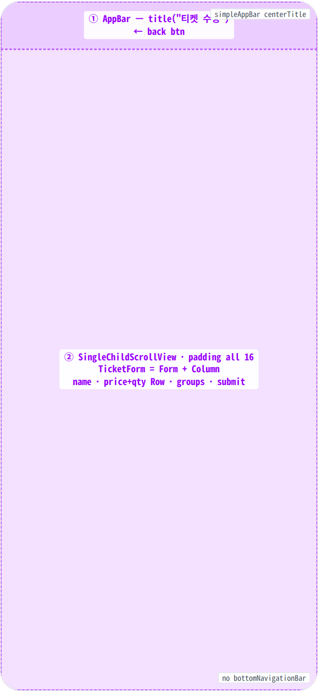
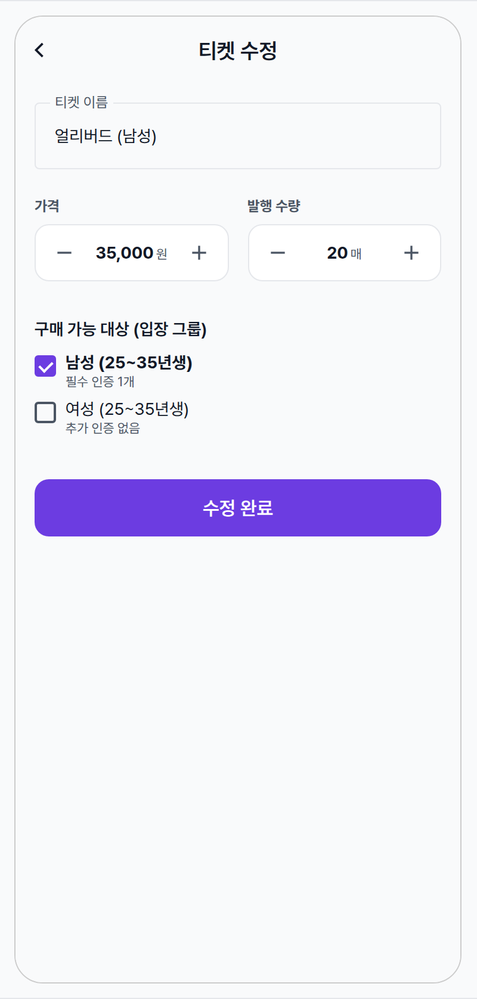
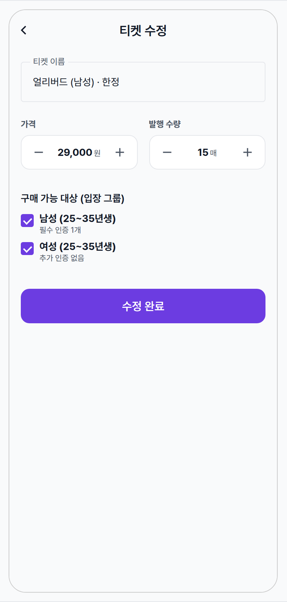
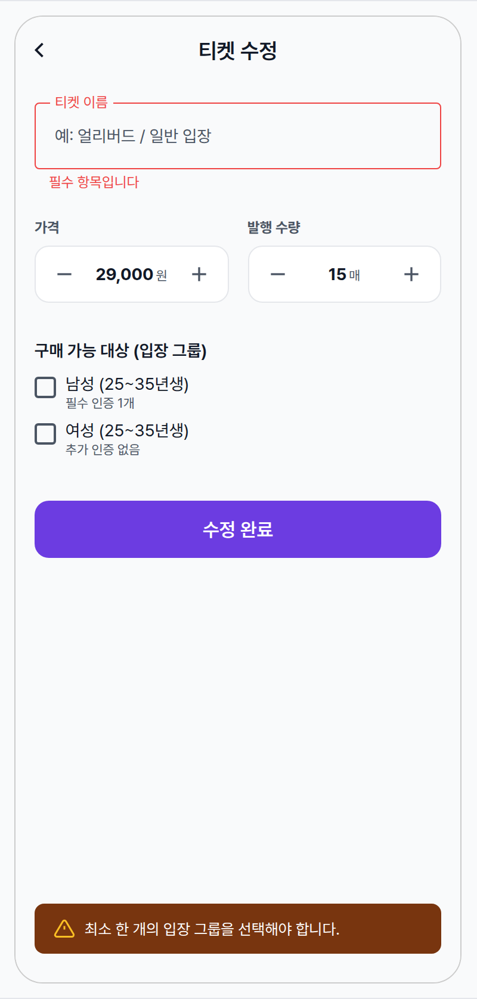
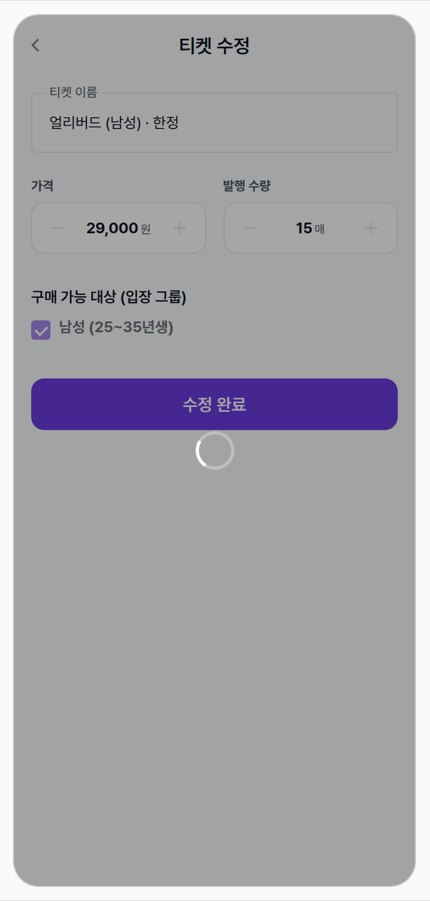
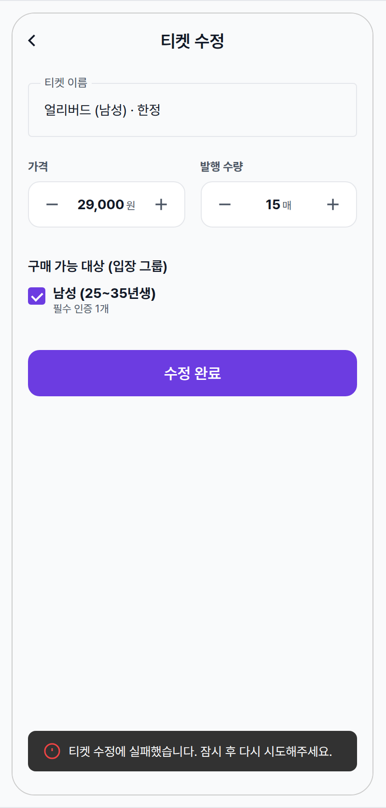
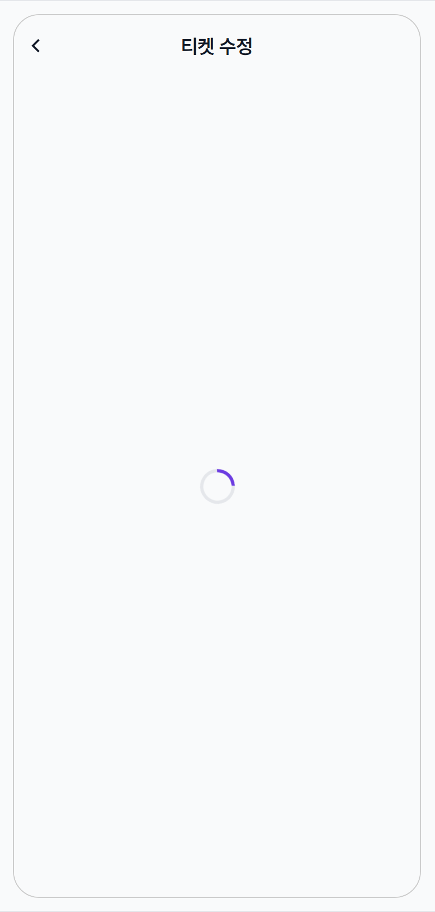

 Spec — TicketEditPage (app\_partner · TicketEditRoute / PartyTicketEditRoute)  

# Ticket Edit

## Overview

| Status | ✅ 디자인완료 — prefilled · edited · validation error · saving · error · ticket-load = 6 state |
|---|---|
| App | app_partner |
| Category | party · event · ticket · edit (instance OR template) |
| Route / Surface | TicketEditRoute (event ticket instance) OR PartyTicketEditRoute (party-level ticket template)widget: TicketEditPage hosting TicketForm (shared with TicketCreatePage) |
| Path | /more/parties/:partyId/events/:eventId/tickets/:ticketId/edit (event ticket)/more/parties/:partyId/tickets/:ticketId/edit (party template — eventId == '') |
| Hierarchy | Parent: EventDetailPage (이벤트 티켓 instance 편집) OR PartyDetailPage (파티 ticket template 편집)Children: — (편집 완료 시 부모로 pop · GlobalLoadingOverlay는 root PartnerScaffold의 stack overlay) |
| Purpose | 파트너가 기존 티켓의 이름·가격·발행 수량·구매 가능 대상(입장 그룹)을 수정한다. 한 회차에서 발행된 티켓 인스턴스와, 다음 회차에 자동으로 복사되는 티켓 템플릿 두 가지를 같은 화면에서 다룬다. 폼은 새 티켓 만들기 화면과 동일한 모양을 공유하며, 화면에 들어올 때 기존 티켓 값으로 입력란이 자동으로 채워진 채 표시된다. |
| User journey | Entry points: ① 회차 상세 화면의 티켓 카드 길게 누르기 / 편집 버튼(이벤트 티켓 인스턴스 편집) · ② 파티 상세 화면의 티켓 템플릿 카드 / 관리 영역(파티 티켓 템플릿 편집).Exit points: 저장 성공 → 화면이 닫히며 부모 화면으로 돌아가고 "티켓이 수정되었습니다." 토스트가 잠시 노출. 부모 화면의 티켓 목록이 자동으로 갱신됨. 저장 실패 → 안내 토스트가 잠시 노출되고 화면은 그대로 유지(입력값 보존). 뒤로가기 → 별도 확인 다이얼로그 없이 즉시 닫힘 (입력 중이던 값은 보존되지 않음). |
| Background | 밍글릿은 한 번의 회차마다 발행되는 티켓(인스턴스)과 부모 파티에 묶여 다음 회차에 자동 복사되는 티켓 템플릿을 분리한다. 파트너가 자주 쓰는 가격대를 템플릿으로 정의해두면 다음 회차를 만들 때 자동으로 같은 값이 채워진다. 편집 화면에서 둘 다 동일한 폼을 사용하는 이유 — 두 모델이 사용자에게 보여주는 정보(이름·가격·수량·구매 가능 대상)가 거의 동일하기 때문이다. |
| Frequency | 티켓 가격 조정·문구 정정·인원 조정 시. 이벤트당 1~3회 정도. 정기 파티는 template 편집이 더 빈번 (다음 회차부터 자동 반영). |

## History

이 spec의 주요 변경 이력. 최신 항목 위.

| Date | Version | Author | Changes |
|---|---|---|---|
| 2026-05-01 | 1.0 | mark-yun | v1.4 template으로 작성. 6 state — prefilled baseline · edited(dirty) · validation error · saving · save error · ticket loading. TicketEditRoute(instance) + PartyTicketEditRoute(template) 두 라우트가 같은 widget을 사용함을 명시. Partner brand --color-partner-primary viewport-scoped. |

[🧱 Layout](#layout) [🎨 States](#states) [🔄 Global Behavior](#behavior) [📖 Reference](#reference)

🧱

## Layout

화면 구조 — 영역, 정렬, 간격 규칙. 색·타이포 무시.

## Blueprint & tree

`Scaffold` + `MinglitTheme.simpleAppBar(title: "티켓 수정")` + body는 `MinglitAsyncValueWidget` 2중 nesting (티켓 detail + party entry groups). data state에서 `SingleChildScrollView`(padding all 16) → `TicketForm`(`Form` + 4 sections + 제출 버튼). 바텀 고정 영역은 없음 — 제출 버튼이 폼 마지막 자식. 글로벌 로딩 overlay는 `PartnerScaffold` 레벨에서 stack으로 깔린다.

**Scaffold** ├─ **appBar**: **MinglitTheme.simpleAppBar**(title: l10n.ticket\_title\_edit) ← ① └─ **body**: **MinglitAsyncValueWidget**<Ticket> ├─ value: isTemplate ? ticketTemplateDetailProvider(ticketId).whenData(toTicket) │ : ticketDetailProvider(ticketId) ├─ error → Center(Text(l10n.partyDetail\_error\_ticketLoad(e))) └─ data(ticket) → **MinglitAsyncValueWidget**<List<PartyEntryGroup>> ├─ value: ticketEntryGroupsProvider(partyId) ├─ error → Center(Text(l10n.partyDetail\_error\_partyLoad(e))) └─ data(entryGroups) → **SingleChildScrollView**(padding: all medium) ← ② └─ **TicketForm** ├─ initialTicket: ticket (prefilled) ├─ entryGroups ├─ submitButtonLabel: l10n.ticket\_button\_edit ("수정 완료") └─ onSaved: \_persist(...) **TicketForm**(**Form** · \_formKey) └─ **Column**(crossAxisStart) ├─ **TextFormField** "티켓 이름" (required validator) ├─ SizedBox(spacing-large = 24) ├─ **Row** │ ├─ Expanded(**NumberStepperInput** "가격" · step 1000 · suffix "원") │ ├─ SizedBox(spacing-medium) │ └─ Expanded(**NumberStepperInput** "발행 수량" · min 1 · max 999 · suffix "매") ├─ SizedBox(spacing-xlarge = 32) ├─ Text "구매 가능 대상 (입장 그룹)" (titleSmall · w600) ├─ SizedBox(spacing-small) ├─ if entryGroups.isEmpty → empty state container │ else → **CheckboxListTile** × N ├─ SizedBox(spacing-xlarge) └─ **ElevatedButton**(width: double.infinity) onPressed: isLoading ? null : \_handleSubmit child: isLoading ? **MinglitCircularProgressIndicator** : Text(submitButtonLabel)

## Spacing & alignment rules

| # | Region | Alignment | Spacing |
|---|---|---|---|
| ① | AppBar | title centered (simpleAppBar default) · 56px · automaticallyImplyLeading=true | surfaceTintColor: transparent → 스크롤해도 변색 없음. elevation 0 → 하단 디바이더 없음. |
| ② | SingleChildScrollView body | Form · Column crossAxisStart | 외곽 padding: spacing-medium (16) all 면. 필드 간 spacing: 이름→price/qty Row 사이 spacing-large (24), price/qty Row → 그룹 라벨 spacing-xlarge (32), 라벨↔체크리스트 spacing-small (8), 체크리스트→제출 spacing-xlarge (32). |
| — | Price + Quantity Row | Row · crossAxisStart · 2 Expanded | 두 stepper 사이 gap: spacing-medium (16, SizedBox). 각 stepper는 자체 라벨 위·input 아래 구조. |
| — | NumberStepperInput | Container(border + radius-input) · Row(− · TextField · +) | Container hpad: spacing-xsmall (4). _StepperButton size 40×40 · icon 20px. TextField textAlign center · vertical contentPadding spacing-sm (12). |
| — | CheckboxListTile (group row) | controlAffinity: leading · contentPadding zero · dense · visualDensity compact | title bodyMedium (선택 시 w600), subtitle labelSmall onSurfaceVariant. 체크박스 18px · activeColor partner primary. |
| — | Empty groups state | Container(radius-card · padded) | padding all spacing-medium. bg: surfaceContainerHighest @ MinglitOpacity.muted. 폭 100% (Column 자식이라 가로 채움). |
| — | Submit ElevatedButton | SizedBox(width: double.infinity) | Material default height ≈ 48 · radius-button 12. loading 중에는 MinglitCircularProgressIndicator(size: 20)이 라벨 자리에 들어감. |

🎨

## States

시각 변형 6종. baseline = 진입 직후 prefill 완료 상태, 나머지는 additive diff.

**State 식별 기준**: 진입 직후 기존 티켓 정보가 도착했는지 / 가져오는 중인지 / 실패했는지, 입력값이 유효한지, 1개 이상의 그룹을 선택했는지, 저장이 진행 중인지 / 실패했는지에 따라 6가지 변형. 새 티켓 만들기 화면과 같은 폼을 쓰기 때문에 시각적 차이는 화면 타이틀("티켓 수정")과 저장 버튼 라벨("수정 완료")뿐.

### Prefilled · 미수정 🎯 baseline · 기존 티켓 값으로 입력란이 채워진 진입 직후 모습

| 항목 | 내용 |
|---|---|
| 조건 | 기존 티켓 정보와 부모 파티의 입장 그룹 정보가 모두 도착해, 모든 입력란이 기존 값으로 채워진 진입 직후의 모습. |
| 사용자 액션 | ① 이름 입력란 탭 — 키보드가 올라오며 입력란이 강조 색의 두꺼운 외곽선으로 바뀜.② 가격 +/− — 1,000원 단위로 증감. 직접 입력도 가능하며 입력란 바깥을 누르거나 엔터를 치면 허용 범위로 보정되어 반영.③ 수량 +/− — 1매 단위로 증감 (1~999매 범위).④ 그룹 체크박스 탭 — 즉시 토글되어 선택된 그룹은 굵게 표기되고 강조 색으로 채워짐.⑤ "수정 완료" 탭 — 입력값이 유효하면 다음 state(저장 진행)로 전환.⑥ 뒤로가기 — 별도 확인 없이 즉시 닫힘. 입력 중이던 값은 보존되지 않음 — 후속 정리 후보. |
| 에지케이스 | · 기존 티켓 정보를 못 가져온 경우 — 폼 대신 안내 문구가 가운데 정렬로 노출 (State 6 참고).· 입장 그룹 정보를 못 가져온 경우 — 같은 형태의 안내 문구가 노출.· 템플릿 편집으로 진입한 경우에도 화면 타이틀과 저장 버튼 라벨은 동일 ("티켓 수정" / "수정 완료").· 가격을 음수로 만드는 것은 불가능. 다만 0원으로 두는 것은 허용되어 무료 티켓이 될 수 있음 — 후속 검토 후보. |
| 컴포넌트 | · MinglitTheme.simpleAppBar(title)· MinglitAsyncValueWidget × 2 (ticket detail + entry groups)· TextFormField(이름 · validator: required)· NumberStepperInput × 2 (가격 · 수량) — Container border outlineVariant + radius-input + −/+ IconButton 40×40· CheckboxListTile × N (controlAffinity: leading · dense · activeColor primary)· ElevatedButton(width double.infinity · child: Text 또는 MinglitCircularProgressIndicator) |
| 토큰 | · color: color-partner-primary (#6c3ce1 — 체크박스 체크 fill, 버튼 bg, focus border), color-surface (scaffold + AppBar bg + scaffold padding), color-background (stepper card bg = ColorScheme.surface), color-divider (TextField/stepper border, 미선택 체크박스 외곽), color-text-primary/secondary· radius: radius-input (12 · stepper card), radius-button (12 · 수정 완료 버튼), radius-card (16 · empty groups state), 4 (TextField outline · Material default)· spacing: spacing-medium (16 · body padding · price/qty 사이), spacing-large (24 · 이름→stepper Row), spacing-xlarge (32 · stepper→그룹 라벨 / 그룹→submit), spacing-small (8 · 라벨↔body)· typography: appBarTitle (18/600), bodyMedium (필드값 16), labelMedium bold onSurfaceVariant (stepper 라벨 · 12), titleSmall w600 (그룹 섹션 라벨 · 14), labelSmall onSurfaceVariant (그룹 sub · 11), button (15/600 — 수정 완료) |
| 노트 | 📝 새 티켓 만들기 화면과 같은 폼을 공유. 차이는 진입 시 입력란이 기존 값으로 채워져 있다는 점과, 저장 버튼 라벨("수정 완료" vs "발행하기")뿐. |

### 편집 중 (dirty) 사용자가 어느 한 입력란이라도 손을 댄 상태

| 항목 | 내용 |
|---|---|
| 조건 | baseline에서 사용자가 어느 한 입력란이라도 손을 댄 상태. 화면에 별도의 "변경됨" 표식이 보이지 않으며, baseline과 시각적으로 차이가 없음. |
| 사용자 액션 | ↔ baseline과 동일한 인터랙션.↔ 같은 그룹을 두 번 탭하면 켜짐 / 꺼짐이 토글되며, 그룹을 모두 해제한 채 저장하면 안내 토스트가 잠시 노출됨 (다음 state 참고).↔ 뒤로가기 시 변경 보존 확인 다이얼로그가 없음 — 변경 중이던 값이 즉시 휘발 — 후속 정리 후보. |
| 에지케이스 | · 이름을 빈 채로 두면 입력 도중에는 빨간 강조가 노출되지 않고, 저장을 누른 시점에만 강조됨.· 가격을 0원으로 변경하는 것이 허용됨.· 수량은 1매보다 작게는 줄일 수 없음. |
| 컴포넌트 | 동일 |
| 토큰 | 동일 |
| 노트 | 📝 변경 여부는 화면에 별도의 표식으로 노출되지 않음. mockup은 baseline에서 글자와 숫자만 살짝 다르게 두어 사용자가 "손댄" 상태임을 표현. |

### 검증 실패 (이름 필수 / 그룹 필수) 이름이 비어 있거나 그룹을 한 개도 선택하지 않은 채 저장을 시도한 직후

| 항목 | 내용 |
|---|---|
| 조건 | (a) 이름이 비어 있는 채 저장을 시도한 경우 — 이름 입력란이 빨간 톤 외곽선으로 강조되며 그 아래에 "필수 항목입니다" 안내가 노출.(b) 이름은 채웠지만 그룹을 한 개도 선택하지 않은 채 저장을 시도한 경우 — 입력란은 그대로 두고 화면 하단에 "최소 한 개의 입장 그룹을 선택해야 합니다." 황색 톤 안내 토스트가 잠시 노출.(위 mockup은 두 경우를 한 화면에 합쳐 시각화함.) |
| 사용자 액션 | ↔ 저장 버튼은 계속 활성화된 채로 보이지만, 누르더라도 검증을 통과하지 못하면 진행되지 않음.+ 이름 입력란을 손보더라도 빨간 강조는 다음 저장을 누를 때까지 그대로 유지됨.+ 그룹을 1개 이상 선택하면 다음 저장 시도부터는 그룹 누락 안내가 다시 뜨지 않음. 토스트 자체는 잠시 후 자동으로 사라짐. |
| 에지케이스 | · 이름에 공백 문자만 있는 경우는 빈 값으로 간주되지 않는 약점이 있음 — 후속 정리 후보.· 이름이 빈 채 저장을 시도하면 그룹 검사까지 도달하지 않으므로, 그룹 누락 안내는 이름이 채워진 뒤에 다시 시도해야 보임.· 그룹 누락 안내(황색)와 일반 오류 안내(빨강)의 색·톤이 비일관적 — 후속 정리 후보. |
| 컴포넌트 | + TextFormField의 Material default error border (red 1px) + helperText 자리에 errorText (12px)+ SnackBar (warning · 노란/주황 톤)나머지 동일 |
| 토큰 | + TextField error border → color-error (#ef4444) · errorText 동일 색+ warning snackbar bg → 다크 amber (#78350f) · 아이콘 → amber-400나머지 동일 |
| 노트 | 📝 두 검증은 순차적으로 동작 — 이름 검증이 먼저 실패하면 그룹 검사까지 도달하지 않으므로 실제로는 이름을 채운 뒤 다시 시도해야 그룹 누락 안내가 보일 수 있음. mockup은 두 경우를 한 화면에 합쳐 시각화함. |

### 저장 중 (saving) "수정 완료"를 누른 직후 화면 전체가 풀스크린 로딩 오버레이로 가려짐

| 항목 | 내용 |
|---|---|
| 조건 | "수정 완료"를 눌러 검증을 통과한 직후, 서버 응답을 기다리는 짧은 구간. 화면 전체가 어두운 막 + 가운데 흰 스피너로 덮여 사용자 입력이 차단됨. |
| 사용자 액션 | ↔ 화면 전체에 어두운 막이 깔려 모든 입력이 차단됨.완료되면 — 성공 시 화면이 닫히며 부모 화면으로 돌아가고 "티켓이 수정되었습니다." 토스트가 잠시 노출되며 부모의 티켓 목록이 즉시 갱신. 실패 시 다음 state(저장 실패 안내)로 전환. |
| 에지케이스 | · 저장 버튼 자체에는 스피너가 들어가지 않으며, 진행 신호는 풀스크린 오버레이가 담당.· 풀스크린 오버레이는 시각적으로 입력을 막아주지만, 시스템 뒤로가기까지 차단하지는 못함 — 후속 정리 후보. |
| 컴포넌트 | + GlobalLoadingOverlay(globalLoadingControllerProvider) — root scaffold stack의 IgnorePointer + barrier + center spinner↔ 폼 자체 위젯은 변경 없음 (TicketForm.isLoading은 false 유지) |
| 토큰 | + overlay barrier → 검정 알파 0.35 (수치 시각 추정)+ overlay spinner → white 36px나머지 동일 |
| 노트 | 📝 화면 자체엔 spinner 없고, 진행 신호는 전역 오버레이가 담당. EventCreatePage처럼 버튼 라벨이 "수정 중..."으로 바뀌진 않는다 — TicketForm은 isLoading prop을 노출하지만 호출부에서 false로 둠. |

### 저장 실패 (save error) updatedState.hasError

| 항목 | 내용 |
|---|---|
| 조건 | 티켓 수정 또는 템플릿 수정 저장이 실패한 직후 — 풀스크린 로딩 오버레이가 사라지고 화면 하단에 오류 SnackBar가 노출됨. |
| 사용자 액션 | + 스낵바 표시 (3-4초 자동 dismiss · 액션 없음)↔ 폼은 dirty 그대로 유지 — 사용자가 그대로 다시 "수정 완료" 탭하면 재시도↔ pop 안 됨 — 페이지 그대로 머무름 |
| 에지케이스 | · 네트워크 단절 / 서버 5xx / RLS 거부 / 동시 편집 충돌 모두 같은 일반 에러 메시지 — 세분화 안 됨· invalidate는 호출 안 됨 (성공 분기에서만 실행) → ticket cache는 stale· template 모드 실패 시 동일하게 partyTickets 캐시는 유지 |
| 컴포넌트 | + SnackBar (handleMinglitError → MinglitSnackbar.showError)− globalLoadingOverlay (해제됨)나머지 동일 |
| 토큰 | + snackbar bg → #323232 (Material inverse surface) · 아이콘 → color-error나머지 동일 |
| 노트 | 📝 에러 카피는 handleMinglitError가 내부에서 분기 — 일반 RepositoryException은 default 카피, 알려진 에러는 specialized. |

### 티켓 로딩 / 로드 실패 ticketAsync.isLoading or hasError

| 항목 | 내용 |
|---|---|
| 조건 | 6a ticketAsync.isLoading — Riverpod future 첫 fetch 중 → MinglitAsyncValueWidget default loading widget(센터 spinner) 표시.6b ticketAsync.hasError — fetch 실패 → Center(Text(l10n.partyDetail_error_ticketLoad(e.toString())))로 대체. |
| 사용자 액션 | ↔ 본문 인터랙션 없음. AppBar back은 정상 동작 (pop으로 부모 복귀)6a → 데이터 도착 시 baseline으로 자연 전이 (form prefill 1회)6b → 자동 retry 없음. 사용자가 back 후 재진입해야 함 (drift 후보) |
| 에지케이스 | · entryGroups가 먼저 도착하고 ticket이 늦게 도착해도 외곽 AsyncValueWidget이 ticket을 기다림 — entryGroups loader 자체는 안 보임· 템플릿 수정 모드도 동일 — 템플릿 데이터를 받아오는 동안 같은 스피너 노출· 캐시 hit이면 6은 거의 안 보임 (PartyDetailPage/EventDetailPage에서 진입 시 보통 미리 fetch됨) |
| 컴포넌트 | ↔ body → MinglitAsyncValueWidget loading state(MinglitCircularProgressIndicator centered)또는 error state (Text on Center) |
| 토큰 | + spinner stroke → color-partner-primary 32px (Material default ring)+ error text → color-text-secondary bodyMedium나머지 동일 |
| 노트 | 📝 위 mockup은 6a를 그렸다. 6b는 같은 영역에 spinner 대신 카피("티켓 정보를 불러오지 못했습니다: ...") 를 띄움. 화면 자체에 retry 버튼 없음 — back-and-reenter 패턴 의존. |

🔄

## Global Behavior

화면 전체에 적용되는 인터랙션, 모션, edge case.

## Cross-cutting interactions

| Trigger | Effect |
|---|---|
| 진입 (route push) | ticketAsync + entryGroupsAsync 병렬 watch. ticket 도착 시 TicketForm.initState가 controller/필드를 prefill — 이후 텍스트/스텝퍼/체크박스 인터랙션은 form 자체 setState로 즉시 반영. |
| 가격 / 수량 stepper 직접 입력 | 키보드 digitsOnly · onTapOutside 또는 onFieldSubmitted에서 clamp(min, max) 후 commit. 음수/문자열 입력 시 이전 값으로 복귀. |
| 그룹 체크박스 toggle | setState(_selectedGroupIds.add/remove). title fontWeight가 즉시 600으로 변경 (선택 시 강조). controller 호출 없음 — submit 시점에만 controller로 전송. |
| 제출 ("수정 완료") | 1) Form.validate() — 이름 required2) _selectedGroupIds.isEmpty → showMinglitWarning + return3) onSaved callback 호출4) page에서 mode 분기 → updateTicket 또는 updateTicketTemplate (globalLoading show)5) 성공 → context.pop + showMinglitSuccess + invalidate · 실패 → handleMinglitError |
| back 버튼 / system back | confirm 다이얼로그 없이 즉시 pop. 변경사항은 휘발 — _formKey state 그대로 dispose. |
| provider invalidate (성공 후) | instance: ticketDetailProvider(ticketId) + ticketsByEventProvider(eventId)template: ticketTemplateDetailProvider(ticketId) + ticketTemplatesByPartyProvider(partyId)→ 부모 화면(EventDetail / PartyDetail)이 자동으로 fresh 데이터로 rebuild. |
| auto-dispose 보호 (Fix #1741) | page top에서 ref.watch(ticketControllerProvider)로 listener 유지 — 없으면 await 중 controller가 dispose돼 line 95의 ref.read가 stale state 반환. |

## Motion timing

| Transition | Token | Note |
|---|---|---|
| route push (parent → ticket edit) | MinglitAnimation.medium (350ms — Material default) | go_router 기본 우→좌 slide. PartyTicketEditRoute/TicketEditRoute 모두 buildPage 명시 없음 → default. |
| 키보드 등장 (이름 필드) | SystemKeyboard default (~250ms) | resizeToAvoidBottomInset 기본 true → SingleChildScrollView가 위로 스크롤되어 활성 필드 확보. |
| 체크박스 toggle | MinglitAnimation.micro (100ms) | Material CheckboxListTile thumb fade + crossfade. |
| stepper +/- 탭 | MinglitAnimation.micro (100ms) | Ink ripple + 즉시 텍스트 업데이트. |
| 스낵바 (성공/에러/경고) | MinglitAnimation.fast (200ms) | showMinglitSuccess / handleMinglitError / showMinglitWarning 모두 ScaffoldMessenger 기본 슬라이드 업. |
| globalLoadingOverlay show/hide | MinglitAnimation.fast (200ms — visual approximation) | 실제 fade duration은 overlay widget 정의에 따름. 시각적으로 화면 즉시 뿌옇게 변함. |
| 제출 → pop 후 부모 복귀 | MaterialPageRoute pop default (~300ms) | 좌→우 slide (Material 표준). |

## Global edge cases

-   **두 라우트가 같은 widget 사용** — `TicketEditRoute`(eventId 비어있지 않음, instance) vs `PartyTicketEditRoute`(eventId == ''로 호출, template). page 내부 `final isTemplate = eventId.isEmpty`로 분기. AppBar/buttonLabel은 동일 — 사용자에게 mode 시각 차이 없음.
-   **autoDispose race** — Fix #1741: `ref.watch(ticketControllerProvider)`로 listener 유지 안 하면 await updateTicket 중에 dispose되며 ref.read(updatedState)가 stale data 반환 → 성공으로 오인 가능.
-   **이름 trim 미적용** — 공백문자만 입력 시 `value.isEmpty` 검증 통과 → drift 후보 (validator에 trim().isEmpty 권장).
-   **가격 0원 허용** — NumberStepperInput min=0이라 무료 티켓 가능. 의도된 동작인지 검증 없음 (drift 후보).
-   **back 시 변경 보존 confirm 없음** — dirty 상태에서 실수로 back 누르면 입력 휘발. `WillPopScope`/`PopScope` 미적용 (drift 후보).
-   **저장 실패 후 cache stale** — 성공 분기에서만 invalidate 호출. 부모 복귀 시 fresh 보장 위해 실패 분기에서도 stale 표식 필요할 수 있음.
-   **localization mode mismatch** — instance와 template이 동일 카피("티켓 수정", "수정 완료") 사용. 사용자가 어느 모드인지 화면에서 구분 못 함 (drift 후보 — title을 "티켓 템플릿 수정"으로 분기 권장).
-   **warning 스낵바와 error 스낵바 톤 비일관** — handleMinglitError와 showMinglitWarning는 다른 색·아이콘. 서비스 전체에 통일 가이드라인 적용 여부 불명확.

📖

## Reference

implementation source + 인접 화면. Components / Tokens는 위 mini-table 참고.

## Implementation source

| Widget | TicketEditPage — apps/app_partner/lib/src/features/ticket/edit/ticket_edit_page.dart |
|---|---|
| Form widget | TicketForm (shared with TicketCreatePage) — apps/app_partner/lib/src/widgets/ticket_form.dart |
| Controller | TicketController (ticketControllerProvider · autoDispose) — updateTicket / updateTicketTemplate / createTicket |
| Sub-widgets | NumberStepperInput · CheckboxListTile · MinglitAsyncValueWidget · MinglitCircularProgressIndicator · MinglitSnackbar(showMinglitSuccess/showMinglitWarning/handleMinglitError) |
| Routes | TicketEditRoute · /more/parties/:partyId/events/:eventId/tickets/:ticketId/edit (event ticket instance)PartyTicketEditRoute · /more/parties/:partyId/tickets/:ticketId/edit (party ticket template — eventId='')app_routes.dart |
| Providers | instance: ticketDetailProvider(ticketId) · ticketsByEventProvider(eventId)template: ticketTemplateDetailProvider(ticketId) · ticketTemplatesByPartyProvider(partyId)shared: ticketEntryGroupsProvider(partyId) · ticketControllerProvider · globalLoadingControllerProvider |
| Repository | ticketRepository.updateTicket(Ticket) · ticketRepository.updateTicketTemplate(TicketTemplate) |
| l10n keys | ticket_title_edit · ticket_button_edit · ticket_message_updated · ticket_label_name · ticket_label_price · ticket_label_quantity · ticket_label_targetGroups · ticket_empty_groups · ticket_error_minOneGroup · partyDetail_error_ticketLoad · partyDetail_error_partyLoad |
| Theme | MinglitTheme.partnerTheme — primary = MinglitPartnerColors.primary (#6c3ce1) · spec var: --color-partner-primary |
| ⚠️ 알려진 drift / 의문점 | · 두 모드(instance vs template) 시각 구분 없음 — title이 "티켓 수정"으로 동일.· 이름 validator가 trim 안 함 — 공백만으로 통과 가능.· 가격 0원 무료 티켓 의도된 동작인지 정의 없음.· dirty 상태에서 back 시 변경사항 휘발 — confirm 다이얼로그 없음.· 저장 실패 시 cache invalidate 안 함 — 부모 복귀 시 stale 가능.· ticket load 실패 시 retry 버튼 없음 — back-and-reenter 의존.· TicketForm.isLoading prop은 page에서 false로만 들어옴 — 버튼 자체 spinner 사용 안 됨 (globalLoading 의존).· warning과 error 스낵바 톤 비일관 (서비스 가이드 부재). |

## Related screens

| Spec | Relation |
|---|---|
| TicketCreatePage | 같은 TicketForm을 공유하는 sibling 생성 화면. 차이: initialTicket null + submit 버튼 라벨 "발행하기" + createTicket 호출. 시각적으로는 prefill 여부만 다름. |
| EventDetailPage | 이 화면(instance 모드)의 부모 — 티켓 카드의 edit 액션 진입점. 저장 성공 시 pop 후 ticketsByEventProvider invalidate로 자동 refresh. |
| PartyDetailPage | 이 화면(template 모드)의 부모 — 파티 ticket template 관리 진입점 (eventId=''). 저장 성공 시 ticketTemplatesByPartyProvider invalidate로 자동 refresh. |
| EventCreatePage | 회차 생성 시 부모 파티의 ticket template들이 Ticket.createFromTemplate로 자동 prefill된다 — 이 화면(template 모드)에서 편집한 결과가 다음 회차에 자동 반영됨. |