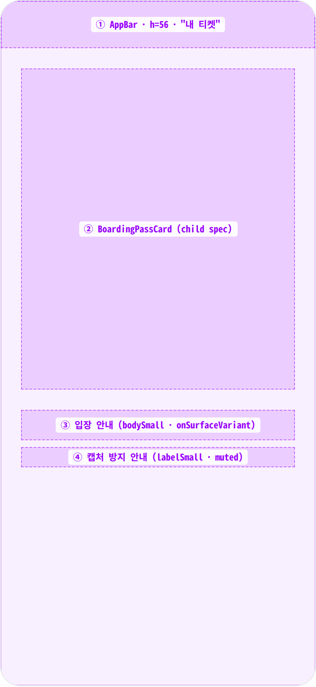
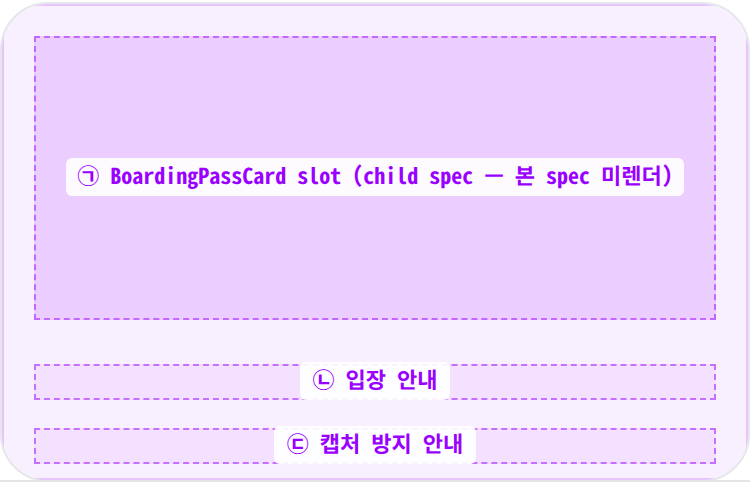
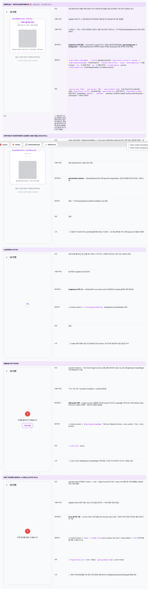

 Spec — TicketQRScreen (app\_user · TicketQRRoute)  

# 티켓 QR (보딩패스)

## Overview

| Status | ✅ 디자인완료 |
|---|---|
| App | app_user |
| Category | ticket · entry/QR |
| Route / Surface | TicketQRRoute |
| Path | /tickets/:ticketId/qr |
| Hierarchy | Parent: MyTicketsPage (내 티켓 list에서 진입) · EventCheckedInScreen (오늘 banner CTA에서 진입) · deep link도 진입 가능Children: BoardingPassCard (sub-component widget — 별도 spec TBD) |
| Purpose | 사용자의 티켓을 항공 보딩패스 메타포로 표시하고 입장용 QR 코드를 가장 잘 보이도록 한다. 진입 즉시 화면 밝기를 최대로 올리고, 카드 하단에 입장 안내 + 캡처 방지 안내를 노출한다. offline 모드 — 로컬 wallet에 캐시된 토큰이 있으면 네트워크 없이도 노출된다. |
| User journey | Entry points: MyTicketsPage 카드 탭 / TodayBanner "QR" 버튼 / EventCheckedInScreen 진행 버튼 / push notification deep link.Exit points: AppBar back → 진입 화면 복귀 (dispose 시 brightness 복원). 토큰 만료 시 별도 재발급 흐름은 BoardingPassCard 자체에서 처리. |
| Background | 입장 게이트에서 파트너 카메라가 QR을 스캔하는 시나리오라 ① 화면 밝기 최대 ② QR 가시성 ③ 보딩패스 메타포로 신뢰감 확보가 모두 필요. boarding/confirmed/used status 기반 시각 분기는 BoardingPassCard 내부에 캡슐화되어 본 화면은 호스팅만 책임진다 (Fix #1526 리팩터링 결과). eventMeta는 deep link 진입 시 null일 수 있어 graceful degradation — 카드에 placeholder dashes 노출. |
| Frequency | 입장 직전 1~2회 / 티켓당 |

## History

| Date | Version | Author | Changes |
|---|---|---|---|
| 2026-05-01 | 1.0 | mark-yun | v1.4 template 신규 작성. 5개 state enumerate (Default-with-meta baseline / No-eventMeta / Loading / Error / Not-found). BoardingPassCard 내부 status(boarding/confirmed/used)는 child spec으로 위임 — 본 spec은 호스팅 + brightness/AppBar/안내 텍스트만 담당. |

[🧱 Layout](#layout) [🎨 States](#states) [🔄 Global Behavior](#global-behavior) [📖 Reference](#reference)

🧱

## Layout

simpleAppBar('내 티켓') + 중앙 정렬 SingleChildScrollView. 본문은 BoardingPassCard + 안내 2-line.

## Blueprint & tree

AppBar(h56). body는 SingleChildScrollView · padding all 24 (large) · Column(center). 카드 + spacing-large + 안내 + spacing-small + 캡처 방지 안내.

**Scaffold**(backgroundColor: `MinglitColors.surface`) └─ **AppBar** = MinglitTheme.simpleAppBar('내 티켓') ← ① └─ **body**: **Consumer**(builder: ref.watch(\_ticketTokenProvider(ticketId))) └─ **MinglitAsyncValueWidget**<TicketToken?>(value: ticketAsync) └─ data(token) → ├─ if token == null → Center(Column(error\_outline + Text('티켓 정보를 찾을 수 없습니다'))) └─ else → **SingleChildScrollView**(padding: `spacing-large (24px)`) └─ **Column** ├─ **BoardingPassCard** ← ② │ · token: TicketToken │ · eventMeta: TicketEventMeta? (nullable) │ · scanningAnimation: AnimationController(2s repeat reverse) │ · (자체 spec — 4영역: brand header + event info + perforation + QR stub) │ ├─ Gap: `spacing-large (24px)` │ ├─ **Text**('입장 시 파트너에게 이 화면을 보여주세요') ← ③ │ · bodySmall · onSurfaceVariant · center │ ├─ Gap: `spacing-small (8px)` │ └─ **Text**('스크린샷은 입장에 사용할 수 없습니다') ← ④ · labelSmall · onSurfaceVariant.muted · center

## Spacing & alignment rules

| # | Region | Alignment | Spacing |
|---|---|---|---|
| — | Outer body padding | — | all spacing-large (24px) |
| ① | AppBar | title leading + back | height: 56 |
| ② | BoardingPassCard | crossAxis: center · 풀폭에서 max-width로 자체 collapse | — |
| ③ | 입장 안내 | textAlign: center | card↔text: spacing-large (24px) |
| ④ | 캡처 방지 안내 | textAlign: center | text↔text: spacing-small (8px) |

## Sub-anatomy ① — Body host (BoardingPassCard 호스팅)

본 화면이 직접 그리는 부분은 SingleChildScrollView 내부 Column뿐 — BoardingPassCard 자체는 별도 child spec. 본 화면이 카드에 주입하는 props 3개: `token`(필수) · `eventMeta`(nullable, deep link 시 null) · `scanningAnimation`(\_TicketQRScreenState가 소유한 2s repeating AnimationController · 부모가 lifecycle 관리해 카드 hot-restart 시 안전).

**SingleChildScrollView** └─ **Padding**(`spacing-large (24px)` all) └─ **Column** ├─ _BoardingPassCard slot_ ← ㉠ │ · 본 화면은 카드를 build에 직접 호출하나 │ 내부 구조는 child spec (boarding\_pass\_card) │ ├─ Gap: `spacing-large (24px)` │ ├─ _입장 안내_ ← ㉡ │ ├─ Gap: `spacing-small (8px)` │ └─ _캡처 방지 안내_ ← ㉢

🎨

## States

5종 — token async + eventMeta nullable. baseline은 Default(token data + eventMeta non-null) — 가장 풍부한 케이스.

### State summary

| State | Tag | 조건 (요약) | Key visual differentiator |
|---|---|---|---|
| Default · with eventMeta 🎯 | baseline | token data 있음 + eventMeta non-null | BoardingPassCard 풀 정보 + 입장/캡처 안내 2-line |
| Without eventMeta | graceful | token data 있음 + eventMeta == null (deep link 진입) | BoardingPassCard에 placeholder dashes — title/date/venue 자리에 '—' |
| Loading | async | _ticketTokenProvider isLoading | 중앙 spinner (MinglitAsyncValueWidget) |
| Error | network | provider hasError | 중앙 에러 + retry CTA (MinglitAsyncValueWidget 기본) |
| Not found | data null | provider data == null (Edge Function 200 + null) | 중앙 error_outline icon + "티켓 정보를 찾을 수 없습니다" |

🔄

## Global Behavior

brightness 제어 · scanning animation lifecycle · provider lifecycle.

## Cross-cutting interactions

| 사용자 액션 | 화면에 보이는 결과 |
|---|---|
| 화면 진입 (initState) | ① _scanningController.repeat(reverse: true) 시작 (2s 사이클) ② _maximizeBrightness — application scope만 1.0으로 |
| 화면 이탈 (dispose) | ① _scanningController.dispose ② _restoreBrightness — _originalBrightness가 null 아니면 복원 (Fix #382) |
| app background → foreground | BoardingPassCard 내부 WidgetsBindingObserver가 status 재계산 (자정 경계 처리). 본 화면 자체는 추가 동작 없음. |
| OS back / AppBar back | navigator.pop — 진입 화면 복귀 (MyTicketsPage / EventCheckedInScreen / push notification chain). |
| Pull-to-refresh | 지원 안 함. 캐시 무효화는 외부 액션(예: 환불)이 트리거. |

## Motion & timing

| Token | Value | Use case |
|---|---|---|
| MinglitAnimation.fast | 200ms | route push/pop · button ripple |
| MinglitAnimation.medium | 350ms | AsyncValue.when crossfade |
| (unscoped) scanning line | 2000ms | BoardingPassCard QR 위 스캔 라인 · repeat reverse · 본 화면이 controller 소유 |

| Transition | Duration (token) | Curve / notes |
|---|---|---|
| 화면 진입 | fast (200ms) | Material slide push (push notification deep link은 fade) |
| loading → data | medium (350ms) | MinglitAsyncValueWidget 내부 crossfade |
| scanning line (BoardingPassCard 내부) | 2000ms unscoped | repeat reverse (linear) — child spec 책임 |
| brightness 적용 | OS native | iOS/Android OS가 알아서 fade — token 없음 |

## Global edge cases

-   **네트워크 끊김 + wallet 미적중** — Error state. wallet 적중 시 offline 가능 (의도적 디자인).
-   **screen\_brightness 권한 거부 / 미지원** — try/catch로 무시, 기본 밝기 유지. 사용자에게 안내 없음.
-   **스크린샷 / 화면 녹화** — anti-fraud 안내는 텍스트 only. 실제 차단(FLAG\_SECURE)은 BoardingPassCard 내부 또는 native layer에서 (현재 미적용 — 정책 결정 후속).
-   **다크 모드** — Scaffold bg는 항상 `MinglitColors.surface`(light gray) — 입장 게이트 가독성을 위해 라이트 강제 (Scaffold backgroundColor 직접 명시). 다크 모드 시스템에서도 본 화면만 라이트 톤.
-   **접근성** — 큰 글씨 시 Column이 자연 wrap. screen reader는 BoardingPassCard 내부 semantic + 본 화면의 안내 텍스트 2-line 차례로 읽음.
-   **시간대** — boarding 자정 경계 판정은 local timezone (boardingPassStatus 함수). UTC 아님 — child 책임.

📖

## Reference

Implementation source + 인접 화면.

## Implementation source

| 항목 | Path / Reference |
|---|---|
| Widget class | TicketQRScreen (StatefulWidget · SingleTickerProviderStateMixin) |
| File path | apps/app_user/lib/src/features/ticket/ui/ticket_qr_screen.dart |
| Provider | _ticketTokenProvider(ticketId) (FutureProvider.family) — ticketTokenServiceProvider.getToken(ticketId) |
| Child widget | BoardingPassCard · boarding_pass_card.dart (별도 spec TBD) |
| Models | TicketToken (data) · TicketEventMeta (display context) |
| External | screen_brightness 패키지 — ScreenBrightness().setApplicationScreenBrightness(1) |
| Route | TicketQRRoute · path: /tickets/:ticketId/qr |

## Related screens

| Spec | Relation |
|---|---|
| MyTicketsPage | Parent — 티켓 list에서 본 화면 진입. |
| EventCheckedInScreen | 인접 — 체크인 직전 화면, QR 버튼으로 본 화면 진입. |
| EventCheckInScreen | 인접 — 체크인 진행 화면 (사용자 측). |
| BoardingPassCard (spec TBD) | Child sub-component — 본 화면이 호스팅. 4영역(brand + event info + perforation + QR stub) 자체 spec. |