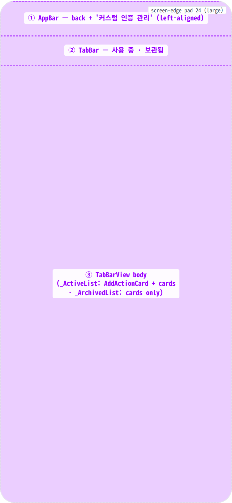
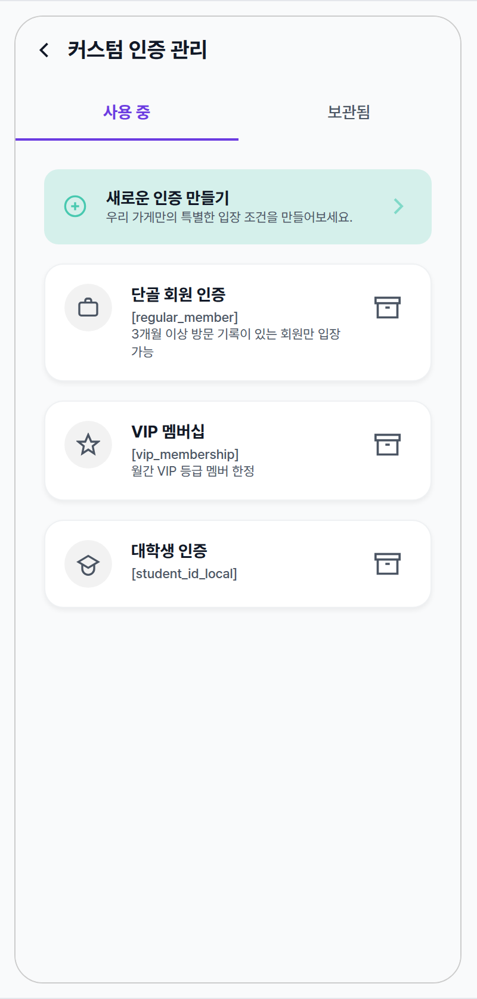
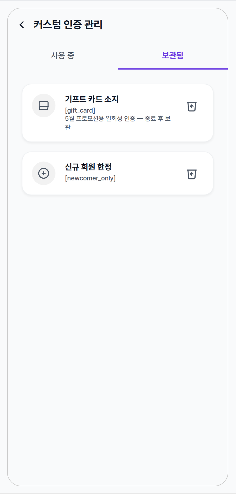
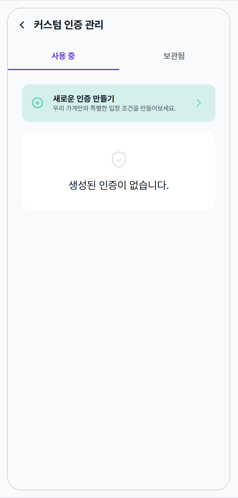
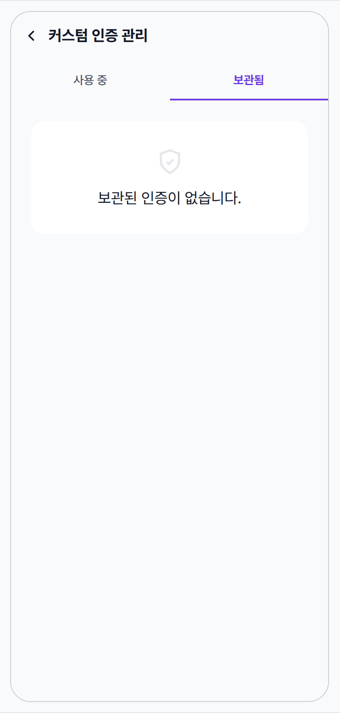
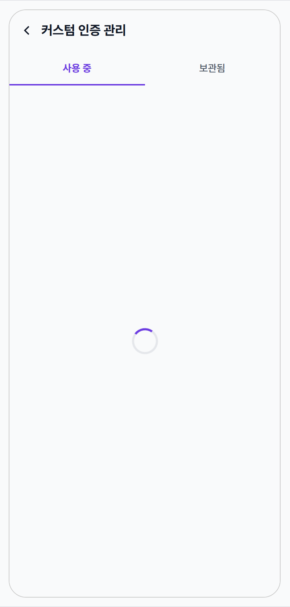
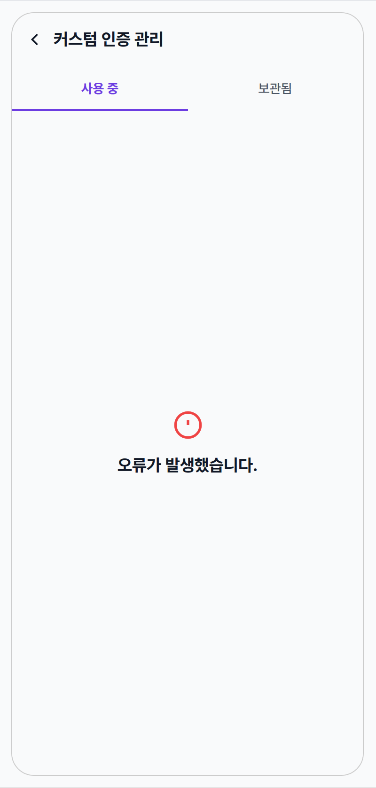
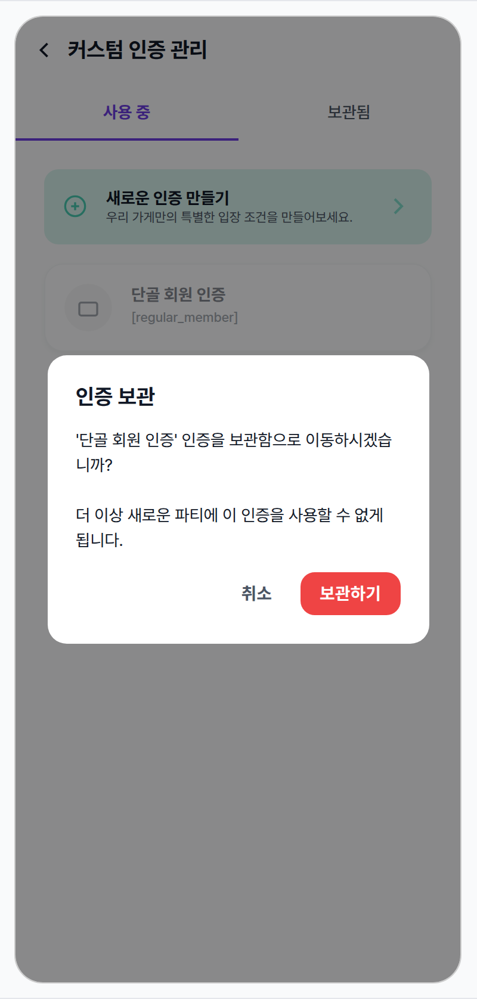

 Spec — VerificationManagePage (app\_partner · VerificationManageRoute)  

# Verification Manage

## Overview

| Status | ✅ 디자인완료 — 6 state · 파트너 커스텀 인증 관리 (사용 중/보관됨) |
|---|---|
| App | app_partner |
| Category | verification · partner ops · custom verification CRUD |
| Route / Surface | VerificationManageRoute · widget: VerificationManagePage |
| Path | /more/verifications/manage |
| Hierarchy | Parent: MorePage (더보기 탭에서 push)Children: CreateVerificationRoute (AddActionCard 탭 시 push) · _ActiveList · _ArchivedList · _VerificationManageCard (internal widgets — no separate spec) |
| Purpose | 파트너가 자기 가게 전용 커스텀 인증(예: '단골 회원', '월간 멤버십' 등)을 정의하고, 더 이상 쓰지 않는 인증을 보관하거나 다시 복구할 수 있게 한다. 파티 생성 시 입장 조건으로 선택할 수 있는 인증 풀(pool)을 관리하는 단일 진입점. |
| User journey | Entry points: 더보기 → "커스텀 인증 관리" 항목 탭.Exit points: AppBar back → 이전 화면 복귀 · AddActionCard → 인증 생성 화면으로 이동 (생성 후 사용 중 리스트에 자동 반영) · 보관/복구 확인 → 같은 화면에 머무르며 리스트 갱신. |
| Background | 파티 생성 시 입장 조건으로 인증을 고를 때 보이는 후보 목록은 (1) 시스템 글로벌 인증 + (2) 이 화면에서 만든 파트너 커스텀 인증(사용 중만)이다. 보관은 영구 삭제가 아닌 일시 보관 — 과거 파티의 인증 이력 보존을 위해. 사용 중/보관됨을 2 탭으로 분리한 이유는 사용 중 리스트가 파티 생성에서 직접 노출되는 풀이기 때문에 시각적으로 명확히 구분해야 하기 때문. |
| Frequency | 활성 파트너 기준 월 0~수회. 신규 파트너 onboarding 직후 1회 집중 사용 후 안정 운영기에는 거의 진입하지 않음. |

## History

이 spec의 주요 변경 이력. 최신 항목 위.

| Date | Version | Author | Changes |
|---|---|---|---|
| 2026-05-01 | 1.0 | mark-yun | v1.4 template으로 작성. 6 state(Default 사용 중 · 보관됨 · Empty active · Empty archived · Loading · Error · Archive confirm dialog) → mini-table per state, baseline = 사용 중 탭(active list with verifications + AddActionCard), additive diff. 파트너 brand color(#6c3ce1) viewport-scoped override. |

[🧱 Layout](#layout) [🎨 States](#states) [🔄 Global Behavior](#behavior) [📖 Reference](#reference)

🧱

## Layout

화면 구조 — 영역, 정렬, 간격 규칙. 색·타이포 무시.

## Blueprint & tree

Scaffold = AppBar(left-aligned title '커스텀 인증 관리' + 2탭 TabBar) + body(MinglitAsyncValueWidget → TabBarView · 각 탭은 \_ActiveList 또는 \_ArchivedList). Active 탭은 SingleChildScrollView로 AddActionCard + ListView.separated(NeverScrollable, shrinkWrap)을 묶어 스크롤. Archived 탭은 ListView.separated 단독 스크롤. 하단 네비게이션 없음 — leaf route.

**Scaffold** ├─ **appBar**: AppBar │ ├─ leading: BackButton (auto) │ ├─ title: Text('커스텀 인증 관리') · centerTitle:false │ └─ **bottom**: TabBar(length:2) ← ② │ ├─ Tab('사용 중') │ └─ Tab('보관됨') ├─ **body**: `MinglitAsyncValueWidget<VerificationManageState>` │ ├─ loading: `MinglitCircularProgressIndicator` │ ├─ error: `_DefaultErrorView` (Icon error\_outline + '오류가 발생했습니다.') │ └─ data: TabBarView ← ③ │ ├─ **\_ActiveList** (SingleChildScrollView · pad 24) │ │ ├─ `AddActionCard` ('새로운 인증 만들기' / 부제 / chevron) │ │ ├─ SizedBox 16 │ │ └─ if active.isEmpty │ │ ├─ `MinglitEmptyState.card` ('생성된 인증이 없습니다.') │ │ else │ │ └─ ListView.separated (shrinkWrap · NeverScrollable) │ │ └─ \_VerificationManageCard × N │ │ └─ VerificationCard(trailing: IconButton(archive\_outlined)) │ └─ **\_ArchivedList** │ ├─ if empty → `MinglitEmptyState.card` ('보관된 인증이 없습니다.') │ └─ else → ListView.separated (pad 24) │ └─ \_VerificationManageCard × N │ └─ VerificationCard(trailing: IconButton(restore\_from\_trash)) └─ (no bottomNavigationBar — leaf route under /more)

## Spacing & alignment rules

| # | Region | Alignment | Spacing |
|---|---|---|---|
| ① | AppBar | height 56 · centerTitle:false (left-aligned) · bg = surface (no border) · scrolledUnderElevation 0 | title typography titleMedium · fontWeight bold · iconTheme onSurface |
| ② | TabBar | height 48 · 2 equal-flex tabs · indicator 2px partner primary · indicatorColor matches labelColor (active) | label color: active = colorScheme.primary · inactive = onSurfaceVariant |
| ③ | TabBarView body (active) | SingleChildScrollView · pad spacing-large (24) on all sides · column stretch | AddActionCard ↔ list 사이: SizedBox(height: spacing-medium = 16) · 카드 사이: ListView.separated(SizedBox(height: 16)) |
| — | AddActionCard 내부 | row · icon(20) + flex Column(title + subtitle) + chevron(24) | icon↔text: spacing-medium (16) · title↔sub: spacing-xxsmall (2) · text↔chev: spacing-small (8) · 패딩 all spacing-medium (16) · radius radius-input (12) |
| — | VerificationCard 내부 | row · iconWrap(40 circle) + Expanded info column + optional trailing IconButton | icon↔info: spacing-medium (16) · title↔internal: spacing-xxsmall (2) · trailing↔info: spacing-small (8) · 패딩 all spacing-medium (16) · radius radius-card (16) · border 1px outlineVariant @ strong (.70) · shadow blur 4 offset (0,2) |
| ③′ | TabBarView body (archived) | ListView.separated 단독 · pad spacing-large (24) | 카드 사이: SizedBox(height: 16) · empty 시 ListView 자체가 MinglitEmptyState.card로 대체 |

🎨

## States

시각 변형 6종. baseline = Default(사용 중 탭 · verifications + AddActionCard), 나머지는 additive diff.

**State 식별 기준**: 활성 탭(사용 중 · 보관됨) · 인증 데이터의 도착 여부 · 사용 중/보관됨 리스트의 비어있음 여부 · 보관/복구 확인 다이얼로그 노출 여부. 색은 _partner brand `#6c3ce1`_ (user app `#9900ff` 아님).

### State summary — 6 states

| State | Tag | 조건 (요약) | Key visual differentiator |
|---|---|---|---|
| Default · 사용 중 | baseline | 사용 중 탭 · 인증 1+개 | '새로운 인증 만들기' 카드 + 인증 카드 리스트, 각 카드 우측 보관 아이콘 |
| 보관됨 탭 | history | 보관됨 탭 · 보관된 인증 1+개 | − '새로운 인증 만들기' 카드 없음 · 카드 우측 아이콘이 복구 아이콘으로 변경 |
| Empty · 사용 중 | no data | 사용 중 탭 · 0개 | '새로운 인증 만들기' 카드 유지 · 그 아래 '생성된 인증이 없습니다.' 빈 상태 카드 |
| Empty · 보관됨 | no data | 보관됨 탭 · 0개 | '보관된 인증이 없습니다.' 빈 상태 카드 단독 |
| Loading | async | 인증 데이터 조회 중 | 중앙 스피너 (TabBar 보임 · 본문 영역만 스피너) |
| Error | network/server | 인증 데이터를 받지 못함 | 중앙에 오류 아이콘 + '오류가 발생했습니다.' (재시도 버튼 없음) |
| Archive confirm dialog | overlay | 보관 아이콘 탭 직후 | 스크림 + 확인 다이얼로그 — 빨간 '보관하기' 버튼 |

### Default · 사용 중 (active list) 🎯 baseline · 인증을 1개 이상 만들어둔 일반 진입

| 항목 | 내용 |
|---|---|
| 조건 | 활성 탭이 사용 중이고 인증이 1개 이상 존재. 파트너 정보가 정상 조회된 상태. |
| 사용자 액션 | ① AppBar back → 더보기 화면으로 복귀② 탭 전환(사용 중 ↔ 보관됨) → 탭/스와이프 모두 가능 · 전환 시 데이터 재조회 없이 즉시 표시③ '새로운 인증 만들기' 카드 탭 → 인증 생성 화면으로 이동. 생성 완료 후 돌아오면 사용 중 리스트에 새 인증이 반영됨④ 인증 카드 본체 탭 → 무반응 (현재 화면에서는 카드 자체가 정보 표시용)⑤ 보관 아이콘 탭 → 확인 다이얼로그가 열리고, 확정 시 화면 전체가 잠금 상태(스피너)로 잠시 변하고 카드는 사용 중 리스트에서 사라져 보관됨 탭으로 이동 |
| 에지케이스 | · 인증의 내부 이름이 표시 이름과 같거나 비어있으면 [내부 이름] 라인은 보이지 않음· 인증 설명이 비어있으면 설명 라인은 보이지 않고 제목 + 내부 이름만 표시· 보관 확인 도중에는 화면 전체가 잠금 상태가 되어 동일 카드를 두 번 탭하는 상황을 방지· 카드 본체에는 ripple 효과가 발생하지 않음 (보관 아이콘만 인터랙티브) |
| 컴포넌트 | · Scaffold + AppBar(title:Text, centerTitle:false, bottom:TabBar) · DefaultTabController(length:2)· TabBar(2 tabs) · TabBarView with _ActiveList + _ArchivedList· MinglitAsyncValueWidget<VerificationManageState> wrapper· SingleChildScrollView + Column(crossAxisAlignment.stretch)· AddActionCard(tertiary tint · iconData defaults to Icons.add_circle_outline · chevron right)· ListView.separated (shrinkWrap · NeverScrollableScrollPhysics · separator: SizedBox 16)· _VerificationManageCard → VerificationCard (icon wrap surfaceContainerHighest @ strong + Column [displayName · [internalName] · description] + trailing IconButton archive_outlined w/ tooltip '보관하기') |
| 토큰 | · color: color-partner-primary (#6c3ce1 — TabBar indicator/active label), color-tertiary (AddActionCard bg @ activeChip + icon · chevron @ separator), color-surface (scaffold + appbar + tabbar bg), color-background (VerificationCard bg = colorScheme.surface white), onSurfaceVariant (icon wrap aux color · trailing IconButton color)· radius: radius-card (16) (VerificationCard), radius-input (12) (AddActionCard)· spacing: spacing-large (24) (body padding all), spacing-medium (16) (card 내부 padding · 카드 사이 separator · icon↔text), spacing-small (8) (text↔chevron · trailing↔info), spacing-xxsmall (2) (title↔internal·description), spacing-small + spacing-xxsmall (10) (VerificationCard icon wrap padding)· typography: app-bar-title (18), body (14) (card title · AddActionCard title), caption (12) (internal/description · AddActionCard subtitle)· opacity: activeChip (.20) (AddActionCard bg fill from tertiary), strong (.70) (VerificationCard border · icon-wrap surfaceContainerHighest fill)· icon size: small (20) (AddActionCard leading · VerificationCard category icon), medium (24) (AddActionCard trailing chevron)· animation: AddActionCard AnimatedContainer duration MinglitAnimation.fast (200ms) |
| 노트 | 📝 가장 일반적 진입 상태. 보관 액션이 진행되는 동안에는 화면 전체가 잠금 상태가 된다. 카드 본체 탭이 비활성인 건 의도 — 향후 인라인 편집 도입 시 활성화 가능. |

### 보관됨 탭 (archived list) 보관됨 탭 · 보관된 인증 1+개

| 항목 | 내용 |
|---|---|
| 조건 | ↔ 활성 탭이 보관됨 · 보관된 인증이 1개 이상 존재. |
| 사용자 액션 | ↔ 보관 아이콘 자리 → 복구 아이콘 탭 → 확인 다이얼로그가 열리고, 확정 시 카드는 보관됨 리스트에서 사라져 사용 중 리스트로 이동동일: AppBar back · 탭 전환 · 카드 본체 무반응 · '새로운 인증 만들기' 카드는 보이지 않음 |
| 에지케이스 | + 복구 시 동일한 내부 이름이 사용 중에 이미 존재하는 상황은 정상 흐름에서는 발생하지 않음. 만약 충돌이 발생하면 화면 전체가 오류 상태로 전환됨. |
| 컴포넌트 | − SingleChildScrollView, − AddActionCard, − NeverScrollableScrollPhysics(active의 inner ListView)↔ ListView.separated 단독(자체 스크롤 · padding all spacing-large = 24)↔ trailing icon: Icons.archive_outlined → Icons.restore_from_trash · tooltip '보관하기' → '복구하기'↔ confirm dialog isDestructive: true → false (default red 버튼 사라짐 · partner primary 색 사용) |
| 토큰 | − color-tertiary usage (no AddActionCard) · 동일: card · primary · spacing |
| 노트 | 📝 보관된 인증은 새 파티 생성 시 선택지에 노출되지 않음. 단, 과거 파티가 이 인증을 입장 조건으로 잡고 있었다면 그 파티의 신청자/신청 이력은 그대로 유효 — 보관(soft-delete)의 의도가 이력 보존. |

### Empty · 사용 중 사용 중 인증이 0개

| 항목 | 내용 |
|---|---|
| 조건 | + 사용 중 인증이 하나도 없음 (파트너가 아직 커스텀 인증을 만들지 않은 신규 파트너 일반). |
| 사용자 액션 | ↔ '새로운 인증 만들기' 카드만 의미 있는 인터랙션 — 탭 시 인증 생성 화면으로 이동. 동일: AppBar back · 탭 전환. |
| 에지케이스 | + 신규 파트너의 첫 진입 = 100% 이 상태. 인증 생성 화면에서 새 인증을 만들고 돌아오면 사용 중 리스트에 새 인증이 들어가며 baseline 상태로 전환. |
| 컴포넌트 | ↔ ListView.separated → MinglitEmptyState.card(title:'생성된 인증이 없습니다.', icon:Icons.verified_user_outlined)+ Container with surfaceContainerLowest bg · radius-card · pad-xlarge+ Icon 32px outlineVariant · titleMedium '생성된 인증이 없습니다.' |
| 토큰 | + icon size xlarge (32), color outlineVariant · spacing icon↔title spacing-medium (16) · pad spacing-xlarge (32) |
| 노트 | 📝 EmptyState.card는 transparent 배경 위에 white 카드로 떠 있는 형태가 의도. AddActionCard가 위에 함께 보여 첫 액션 유도가 명확. |

### Empty · 보관됨 보관된 인증이 0개

| 항목 | 내용 |
|---|---|
| 조건 | + 보관됨 탭 · 보관한 인증이 하나도 없음 (신규 파트너의 일반 진입 상태). |
| 사용자 액션 | − 카드 액션(없음) · 동일: AppBar back · 탭 전환 |
| 에지케이스 | + 보관됨 탭의 빈 상태 카드는 별도 외곽 패딩 없이 본문 영역에 자리 잡아, 사용 중 탭의 빈 상태와는 위치/여백이 미묘하게 달라 보일 수 있음. |
| 컴포넌트 | ↔ ListView.separated → MinglitEmptyState.card(title:'보관된 인증이 없습니다.', icon:Icons.verified_user_outlined)− padding wrapper (active 탭과 달리 _ArchivedList가 padding을 ListView에 줬는데, empty 분기에서는 직접 EmptyState만 반환) |
| 토큰 | 동일 (Empty 사용 중과 같음 — EmptyState.card variant) |
| 노트 | 📝 사용 중 탭의 빈 상태와 패딩이 미묘하게 달라 보일 수 있음. 정확한 픽셀이 중요하면 사용 중 탭과 동일한 패딩으로 통일하는 후속 정리 후보. |

### Loading 인증 데이터 조회 중

| 항목 | 내용 |
|---|---|
| 조건 | + 첫 진입 시 파트너 정보 + 사용 중/보관됨 인증 목록을 동시에 받아오는 중. |
| 사용자 액션 | 탭 전환 가능 · 그 외 무반응. 보관/복구가 진행 중일 때는 화면 전체가 잠금 상태로 변경되며, 이는 첫 로딩과는 별개의 모달 잠금. |
| 에지케이스 | + 파트너 정보가 없는 경우 로딩은 정상 종료되지만 양쪽 탭 모두 빈 상태로 보임. |
| 컴포넌트 | ↔ TabBarView/ActiveList/ArchivedList → MinglitCircularProgressIndicator (Center) · TabBar는 그대로 노출 |
| 토큰 | spinner color = ProgressIndicatorTheme default (partner primary tint) |
| 노트 | 📝 사용 중/보관됨 데이터를 동시에 받아오므로 한쪽이 실패해도 양쪽 모두 오류 화면으로 떨어짐. UX 개선 후보: 스켈레톤 카드 리스트 도입. |

### Error 인증 데이터를 받지 못함

| 항목 | 내용 |
|---|---|
| 조건 | + 인증 목록 조회 실패 또는 보관/복구 도중 오류가 발생해 화면 전체가 오류 상태로 전환된 경우. |
| 사용자 액션 | − 재시도 버튼 없음 (오류 아이콘 + 텍스트만 노출). 사용자는 AppBar back으로 빠져나갔다 다시 진입해야 재시도가 일어남. |
| 에지케이스 | + 보관/복구 도중 오류로 진입한 경우에도 화면 전체 잠금은 자동으로 풀려서 back 버튼을 누를 수 있음. 구체적인 오류 사유는 화면에 노출되지 않음. |
| 컴포넌트 | ↔ TabBarView → _DefaultErrorView (in MinglitAsyncValueWidget) — Center + Column+ Icon(error_outline · color = error · size xlarge 32)+ Text('오류가 발생했습니다.' · titleMedium bold) |
| 토큰 | + color-error (icon) · spacing icon↔text spacing-medium (16) |
| 노트 | 📝 재시도 UX 부재가 알려진 약점 — 향후 화면에 명시적 '다시 시도' 버튼을 추가하는 게 후속 개선. |

### Archive confirm dialog 보관 아이콘 탭 직후

| 항목 | 내용 |
|---|---|
| 조건 | + 보관 아이콘 탭 직후 — 빨간 '보관하기' 버튼이 있는 확인 다이얼로그가 위에 띄워진 상태. (보관됨 탭의 복구 다이얼로그는 같은 형식이지만 확인 버튼 색이 partner primary로 바뀜 — 별도 mini-table 생략, 본 state의 변형으로 본다.) |
| 사용자 액션 | + '취소' 탭 → 다이얼로그가 닫히고 화면 그대로 유지 (보관 진행되지 않음)+ '보관하기'(빨간 버튼) 탭 → 다이얼로그가 닫히고 화면 전체가 잠금 상태(스피너)로 잠시 변하다가 카드가 사용 중 리스트에서 사라짐+ 스크림 외부 탭 → 다이얼로그 닫힘 |
| 에지케이스 | + 보관 도중 오류가 발생하면 화면 전체가 오류 상태로 전환됨. 성공 후 같은 인증을 다시 보관하는 충돌은 발생하지 않음 (이미 사용 중 리스트에서 사라졌기 때문). |
| 컴포넌트 | + 확인 다이얼로그 + 스크림 오버레이+ 본문은 여러 줄 + 빈 줄 — 그대로 줄바꿈 노출+ 빨간 destructive 확인 버튼 (배경 color-error · 글자 흰색) · '취소'는 회색 텍스트 버튼 |
| 토큰 | + color-error (destructive 버튼 fill) · scrim alpha .45 · dialog radius radius-card (16) · button radius radius-button (12) |
| 노트 | 📝 동일 패턴이 보관됨 탭의 복구 다이얼로그에서도 사용되며 차이는 확인 버튼 색이 partner primary로 바뀐다는 점뿐. 본문 카피는 '복구하시겠습니까?' / '다시 파티 생성 시 선택할 수 있게 됩니다.' |

🔄

## Global Behavior

cross-cutting — 모든 state에 적용되는 액션, motion, 글로벌 에지케이스. 각 state 한정 액션은 위 mini-table 참고.

## Cross-cutting interactions

| 사용자 액션 | 화면에 보이는 결과 |
|---|---|
| 탭 전환 (사용 중 ↔ 보관됨) | 탭/스와이프 모두 가능. 두 리스트는 한 번에 받아오므로 전환 시 데이터를 다시 조회하지 않고 즉시 표시됨. |
| AppBar back / OS back | 이전 화면으로 복귀. 다이얼로그가 떠 있으면 다이얼로그만 닫힘. |
| 보관/복구 실행 중 | 화면 전체가 모달 스크림 + 스피너로 잠금됨. 작업이 끝날 때까지 사용자 입력이 차단되어 중복 실행이 방지됨. |
| 다크 모드 토글 | scaffold 배경 → color-dark-surface · primary → color-partner-dark-primary(#9b7bec). 카드 border도 다크 톤으로 자동 매핑. |
| 인증 생성 화면에서 복귀 | 새 인증을 만들고 돌아오면 사용 중 리스트에 반영됨. |

## Motion timing

Source: `shared/packages/mds/core/lib/src/theme/minglit_design_tokens.dart` · `MinglitAnimation`.

| Transition | Token / Duration | Notes |
|---|---|---|
| Tab indicator 슬라이드 | Material default (~300ms) | TabController의 default kTabScrollDuration. AnimationToken과 1:1 매핑 안 됨, medium에 가까움. |
| TabBarView page swipe | Material default (~300ms) | fling curve. |
| AddActionCard color/shape transition | MinglitAnimation.fast (200ms) | AnimatedContainer 기본 — 현재 정적이지만 향후 hover/pressed에 사용 예정. |
| CreateVerificationRoute push | MinglitAnimation.fast (200ms) | go_router 기본 push transition (Material default — fadeUp). |
| MinglitAlert.showConfirm scale-fade | Material default (~150ms) | AlertDialog 기본. dismiss도 동일. |
| archive/restore 후 list update | cut (no animation) | controller가 state = AsyncData(newState) 직접 set → AnimatedSwitcher 등 미사용 → 즉시 swap. |

## Global edge cases

-   **파트너 정보 없음** — 파트너 컨텍스트가 없으면 양쪽 탭 모두 빈 상태로 표시되지만 실제로는 '로그인되지 않음 / 가게 선택 안 됨' 상황. 별도 안내 문구 없음 (현재 약점).
-   **데이터 조회 실패** — 사용 중/보관됨 둘 중 어느 쪽이라도 실패하면 양쪽 탭 모두 오류 화면으로 떨어짐. 부분 복구는 불가.
-   **보관/복구 실패** — 작업 결과가 실패하면 전체 페이지가 오류 화면으로 떨어짐 (가벼운 안내 메시지가 아님). UX 개선 후보: 안내 메시지로 결과 표시 + 리스트는 직전 상태 유지.
-   **카테고리 아이콘** — 카테고리별로 아이콘이 1:1로 매핑됨. '기타' 카테고리는 일반 인증 아이콘으로 표시 (의미상 모호).
-   **다크 모드** — partner dark primary(`#9b7bec`) 사용. '새로운 인증 만들기' 카드의 tertiary tint도 다크에서 어둡게 매핑되어 텍스트 가독성 검증 권장.
-   **접근성** — 보관/복구 아이콘에는 툴팁이 노출됨. 카드 자체에는 별도 음성 안내가 없어 표시 이름 + 내부 이름 + 설명이 순차 음성 출력됨. 내부 이름의 대괄호는 음성으로 어색할 수 있음 (개선 후보).

📖

## Reference

implementation source + 인접 화면. Components / Tokens는 위 mini-table 참고.

## Implementation source

| Widget | VerificationManagePage — apps/app_partner/lib/src/features/verification/manage/verification_manage_page.dart |
|---|---|
| Internal widgets | _ActiveList · _ArchivedList · _VerificationManageCard (page 파일 내부 private) |
| Shared atoms | VerificationCard (shared/packages/minglit_kit/lib/src/ui/widgets/common/verification_card.dart) · AddActionCard (kit common) · MinglitEmptyState.card · MinglitAsyncValueWidget · MinglitAlert.showConfirm |
| Route | VerificationManageRoute · path /more/verifications/manage · app_routes.dart (MoreBranch · StatefulShell · 5번째 branch) |
| Sibling push target | CreateVerificationRoute · path /more/verifications/create · sibling under MoreBranch (not nested child) |
| Provider | verificationManageControllerProvider (AsyncNotifierProvider · VerificationManageController) · currentPartnerInfoProvider · verificationRepositoryProvider · globalLoadingControllerProvider |
| Repository methods | VerificationRepository.getPartnerVerifications(partnerId, isActive: true\|false) · deleteVerification(id) (soft) · restoreVerification(id) |
| Theme | MinglitTheme.partnerTheme — primary MinglitPartnerColors.primary(#6c3ce1). user app(#9900ff)과 다름. |
| Model | Verification (shared/packages/minglit_kit/lib/src/data/models/verification.dart) · VerificationCategory enum (career/academic/asset/marriage/vehicle/etc) — switch에서 카테고리 아이콘 매핑. |
| ⚠️ 알려진 drift | Error state에 retry 버튼 없음 — back 후 재진입만 회복 경로. archive/restore 실패도 Error state로 전체 떨어짐(SnackBar 미사용). active 탭의 empty와 archived 탭의 empty는 padding wrapping이 미세하게 다름(active은 SingleChildScrollView 내부, archived는 EmptyState 단독). CreateVerificationRoute pop 후 자동 invalidate 미보장(외부 트리거 의존). |

## Related screens

| Spec | Relation |
|---|---|
| MorePage | 부모 라우트. 더보기 메뉴 항목에서 본 화면으로 push. |
| PartyCreateWizardPage | 파티 생성 wizard의 "입장 조건" 단계에서 본 화면 active 리스트에 있는 인증을 후보로 노출. 보관됨 인증은 노출되지 않음. |
| Layout foundations | Standard Scaffold + AppBar(bottom:TabBar) + TabBarView · leaf route under StatefulShell (no bottom nav). |