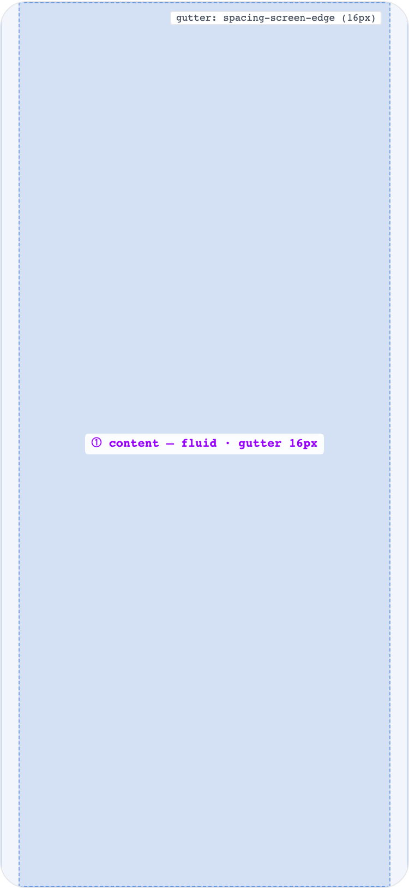
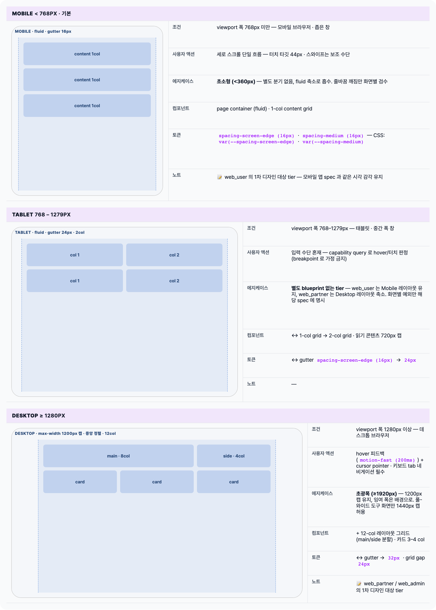

    Spec — WebFoundationResponsive (web shared · foundation)  

# Web Responsive Foundation

## Overview

| Status | 🚧 디자인중 — web MVP pivot 의 responsive 기반 규칙 |
|---|---|
| Surface | web_shared — web_user · web_partner · web_admin 모든 웹 surface 가 공유 |
| Category | foundation · layout |
| Route / Surface | — (foundation spec — 라우트 없음) |
| Behavior Source | — (web-native foundation, no mobile counterpart) |
| Hierarchy | Parent: — (top-level foundation)Children: 모든 web screen spec — _template_web.html 로 작성되는 spec 이 이 문서의 breakpoint/컨테이너/그리드/포인터 규칙을 참조한다. |
| Purpose | 웹 surface 공통 responsive 규칙의 SSOT. breakpoint 경계 · 컨테이너 폭 · 그리드 · 터치/포인터 규칙을 한 곳에 정의해, 각 screen spec 은 "이 화면이 breakpoint 별로 어떻게 달라지는지"만 기술하게 한다. |
| User journey | Entry points: web screen spec 작성/리뷰 시 참조.Exit points: 각 화면의 Responsive Layout 섹션. |
| Background | 웹 MVP 피벗 — 유저웹/파트너웹은 landing_user/landing_partner 확장으로 구현. 기존 70개 모바일 spec 은 behavior source 로 유지하고, 웹 화면 spec 은 신규 작성. 유저웹은 모바일웹 우선 (SNS/검색 유입 = 모바일 브라우저 다수), 파트너웹·admin 은 데스크톱 우선 (운영/관리 작업 환경) 원칙을 여기서 고정한다. |
| Frequency | 모든 web spec 작성 시 1회 이상 참조되는 공통 기반. |

## History

| Date | Version | Author | Changes |
|---|---|---|---|
| 2026-06-06 | 1.0 | mark-yun | Initial foundation published — breakpoint 3단 (mobile <768 / tablet 768–1279 / desktop ≥1280), 컨테이너 폭, 그리드 규칙, 터치/포인터 규칙, surface 별 우선순위 원칙 (유저웹 = 모바일웹 우선 · 파트너웹/admin = 데스크톱 우선) 정의. |

[🧱 Responsive Layout](#layout) [🎨 States](#states) [🔄 Global Behavior](#global-behavior) [📖 Reference](#reference)

🧱

## Responsive Layout

breakpoint 경계 · 컨테이너 폭 · 그리드 규칙의 정의. 모든 web screen spec 이 이 값을 인용한다.

## Breakpoints

3단 breakpoint. 경계값은 CSS media query / Tailwind 기준으로 min-width 판정 (`md: 768px` · `xl: 1280px` 와 정렬). screen spec 의 variant 는 **Mobile / Desktop 2종만** 작성하고, Tablet 은 어느 variant 를 따르는지 1줄로 명시한다.

| Tier | Range | Media query / Tailwind | Spec variant 규칙 |
|---|---|---|---|
| Mobile | < 768px | 기본 (no prefix) — mobile-first | 모든 web spec 의 기본 variant. 항상 blueprint 작성. |
| Tablet | 768 – 1279px | @media (min-width: 768px) · md: | 별도 blueprint 없음 — 기본: web_user 는 Mobile 레이아웃 유지(컨테이너만 fluid), web_partner/web_admin 은 Desktop 레이아웃 축소. 화면별 예외만 spec 에 1줄. |
| Desktop | ≥ 1280px | @media (min-width: 1280px) · xl: | Mobile 과 구조가 다른 화면만 variant blueprint 추가. States 테이블은 공유. |

## Container widths

페이지 콘텐츠의 최대 폭과 좌우 gutter. 컨테이너는 항상 중앙 정렬, gutter 는 컨테이너 바깥 패딩. 토큰 이름은 MDS 체계 — 구현은 CSS variable / Tailwind arbitrary value 로 소비.

| Tier | Content max-width | Gutter (좌우 패딩) | Notes |
|---|---|---|---|
| Mobile | fluid (100%) | spacing-screen-edge (16px) — var(--spacing-screen-edge) | 모바일 앱과 동일 edge 패딩 감각 유지. |
| Tablet | fluid (100%) · 단일 컬럼 콘텐츠는 720px 캡 권장 | 24px | 긴 글줄 방지 — 읽기 콘텐츠는 폭 캡. |
| Desktop | 1200px 캡 (admin console 등 풀-와이드 도구 화면은 1440px까지 허용) | 32px | 중앙 정렬. 캡 초과 영역은 배경(surface)으로 채움. |

**Mobile (<768px)** **<body>** └─ **<main>** — width: 100% └─ padding-inline: `spacing-screen-edge (16px)` └─ _content_ ← ① **Desktop (≥1280px)** **<body>** └─ **<main>** — max-width: `1200px` · margin-inline: auto └─ padding-inline: `32px` └─ _content_ (12-col grid)

## Grid rules

카드 목록 등 반복 콘텐츠의 컬럼 규칙. 고정 컬럼 수 — 컨테이너 폭 안에서 1fr 균등 분할.

| Tier | Columns | Gap | Notes |
|---|---|---|---|
| Mobile | 1 col (카드 목록) · 최대 2 col (compact 아이템) | spacing-medium (16px) | 세로 스크롤 단일 흐름 우선. |
| Tablet | 2 col | spacing-medium (16px) | 카드 목록 기본 2열. |
| Desktop | 12-col 레이아웃 그리드 · 카드 목록은 3–4 col | 24px | main/side 분할 등 페이지 구조는 12-col 기준으로 명세 (예: 8/4 분할). |

## Touch / pointer rules

입력 수단은 breakpoint 가 아니라 capability 로 판정 — `@media (hover: hover) and (pointer: fine)`. 좁은 창의 데스크톱, 터치 노트북이 있으므로 "좁으면 터치"라고 가정하지 않는다.

| Rule | 정의 |
|---|---|
| 최소 터치 타깃 | 44×44px — 터치 가능 모든 인터랙티브 요소. 시각 크기가 작아도 hit area 는 44px 확보. |
| Hover 의존 금지 | hover 로만 노출되는 정보/액션 금지 — hover 는 보조 강조(hover: hover 디바이스에서만), 모든 액션은 클릭/탭으로 도달 가능해야 함. |
| 포인터 피드백 | fine pointer: hover 상태 (motion-fast (200ms) transition) + cursor: pointer. coarse pointer: press 상태로 즉각 피드백 (motion-micro (100ms)). |
| 스와이프 제스처 | 모바일웹에서도 스와이프는 보조 수단 — 동일 기능의 버튼 대안 필수 (캐러셀 화살표 등). |
| 키보드 | 모든 인터랙티브 요소 tab 도달 가능 + visible focus ring. 데스크톱 우선 surface (web_partner/web_admin) 는 필수 검토. |

## Surface priority principles

| Surface | 우선 breakpoint | 원칙 |
|---|---|---|
| web_user | Mobile (모바일웹 우선) | SNS/검색 유입 = 모바일 브라우저 다수. Mobile blueprint 가 1차 산출물, Desktop 은 컨테이너 캡 중앙 정렬이 기본값 (구조가 달라질 때만 variant). spec mockup 도 375px viewport 기본. |
| web_partner | Desktop (데스크톱 우선) | 운영/관리 작업 환경. Desktop blueprint 가 1차 산출물, Mobile 은 조회 중심 축소 (핵심 운영 액션은 유지). spec mockup 은 데스크톱 폭 viewport 권장. |
| web_admin | Desktop only | 내부 admin console — 모바일 대응 비목표. admin_console_dashboard spec 패턴 유지. |

🎨

## States

foundation 의 "state" = breakpoint tier. 각 tier 에서 컨테이너/그리드가 어떻게 동작하는지를 mockup 으로 보여준다. (일반 screen spec 의 데이터 state 와 다름 — foundation 전용 해석.)

## Breakpoint tiers

🔄

## Global Behavior

breakpoint 전환 · 입력 capability 전환 등 모든 웹 화면에 공통으로 적용되는 동작.

## Cross-cutting interactions

| 사용자 액션 | 화면에 보이는 결과 |
|---|---|
| 창 리사이즈 (tier 경계 통과) | 레이아웃 즉시 reflow — 전환 애니메이션 없음. 스크롤 위치·입력값·열린 모달 유지. |
| 모바일 기기 회전 (portrait ↔ landscape) | 리사이즈와 동일 처리 — landscape 폭이 768px 을 넘으면 Tablet tier 적용. |
| 브라우저 줌 (텍스트 확대) | 200% 줌에서 가로 스크롤 없이 사용 가능해야 함 (effective viewport 가 좁아지면 하위 tier 레이아웃 적용). |

## Motion & timing

duration 토큰 체계는 모바일 MDS 와 동일 (micro 100 / fast 200 / medium 350 / slow 500). 웹 구현은 CSS `transition-duration` / Tailwind `duration-N` 으로 같은 ms 값 소비. breakpoint 전환 자체에는 모션을 걸지 않는다.

| Transition | Duration (token) | Curve / notes |
|---|---|---|
| breakpoint reflow | 없음 (0ms) | 즉시 reflow — 중간 폭 애니메이션 금지 |
| hover 피드백 (fine pointer) | fast (200ms) | ease-out — color/elevation 변화 |
| press 피드백 (coarse pointer) | micro (100ms) | 즉각 시각 변화 |

## Global edge cases

-   **다크 모드** — 컨테이너/그리드 규칙은 다크 모드와 무관 (배경 토큰만 전환).
-   **접근성** — 200% 줌 + 가로 스크롤 금지 · visible focus ring · 터치 타깃 44px — 본 문서의 규칙이 모든 화면의 baseline.
-   **reduced motion** — `prefers-reduced-motion` 시 hover/press 피드백은 유지하되 transition 을 0ms 로.
-   **브라우저 호환** — evergreen 브라우저 기준. `hover/pointer` media query 미지원 환경은 coarse pointer 로 폴백.

📖

## Reference

foundation 이므로 implementation source 대신 소비처/관련 문서 링크.

## Implementation source

| 항목 | Path / Reference |
|---|---|
| Web user app | apps/landing_user/ — 유저웹 (모바일웹 우선) · 구현 시 이 문서의 breakpoint/컨테이너 값 적용 TBD |
| Web partner app | apps/landing_partner/ — 파트너웹 (데스크톱 우선) TBD |
| Token SSOT | shared/packages/mds/tokens/ — generated CSS 는 docs 의 public/tokens.css 로 sync |

## Related screens

| Spec | Relation |
|---|---|
| _template_web.html | web screen spec 템플릿 — Responsive Layout 섹션이 본 문서를 인용 |
| AdminConsoleDashboard | web_admin desktop-only 패턴의 선례 |
| Layout foundations | 모바일 앱 layout foundation — spacing 토큰 체계 공유 |