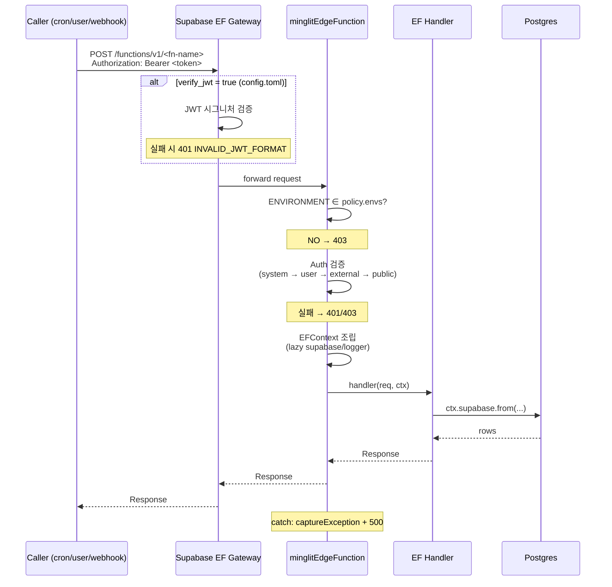
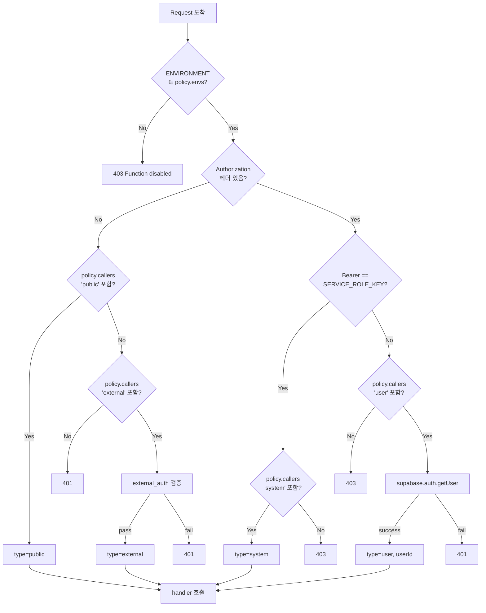
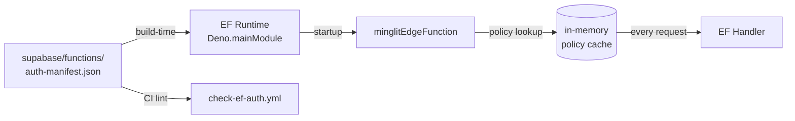

# Edge Function Auth Architecture

Minglit의 모든 Edge Function (EF) 인증/인가 모델을 기술한다.
중앙 manifest + 단일 미들웨어 wrapper 로 EF별 caller 정책과 환경 가드를 일원 관리한다.

---

## 1. 배경

### 1.1 현재 문제점 (이 설계 도입 전)

47개 `verify_jwt = false` EF 의 인증 보호가 **분산 관리** 되고 있어 다음 문제 발생:

| 항목 | 현재 상태 |
|---|---|
| 보호 메커니즘 | EF 별로 `requireServiceRole` / `requireAuth` / 직접 구현 / DEV_GUARD / IP allowlist 등 6가지 패턴 혼재 |
| 정책 가시성 | 어떤 EF 가 누구한테 호출 가능한지 한눈에 파악 불가 — 각 `index.ts` 열어봐야 함 |
| 신규 EF 누락 위험 | 새 EF 추가 시 보호 호출 잊으면 silent unprotected (Supabase 강제 메커니즘 없음) |
| 환경 가드 | dev-only EF 가 prod 호출되면 안 되는데 EF 코드 안에 매번 직접 `ENVIRONMENT` 체크 |
| 코드 중복 | `Deno.serve(withHandler(...))` + `initSentry()` + `createServiceClient()` 보일러플레이트 100% 반복 |

### 1.2 설계 원칙

1. **모든 EF는 어떤 형태든 보호되어야 한다** — JWT (게이트웨이), service_role 매칭, 외부 인증 (IP/HMAC), 또는 환경 가드
2. **정책은 중앙 manifest 에서 선언적으로 관리한다** — 코드 안 if-then 분산 금지
3. **wrapper 가 잊을 수 없도록 강제한다** — 보일러플레이트 자동 처리 + manifest 누락 시 startup fail
4. **확장 가능해야 한다** — rate limit / deprecation / audit 등 미래 정책 추가가 manifest 필드 추가만으로 가능

### 1.3 Supabase 가 제공하는 것 / 안 하는 것

| 영역 | Supabase 제공 | 우리가 커버해야 |
|---|---|---|
| Gateway JWT 검증 (`verify_jwt = true`) | ✅ 프레임워크 레벨, 기본값 | 옵트아웃 시 보호 책임 이동 |
| EF env 자동 주입 (`SUPABASE_SERVICE_ROLE_KEY` 등) | ✅ | — |
| `verify_jwt = false` 시 내부 보호 강제 | ❌ | ✅ 본 설계 (manifest + wrapper) |
| EF 별 환경 가드 (dev-only / prod-only) | ❌ | ✅ 본 설계 |
| Unprotected EF 자동 검출 | ❌ | ✅ CI lint |

---

## 2. Caller Types (4종)

EF 가 받을 수 있는 호출자 분류. manifest 의 `callers` 배열에 명시 (OR — 하나라도 매칭되면 통과).

| 타입 | 의미 | 검증 방법 |
|---|---|---|
| **`system`** | cron, 시스템 우회 | `Authorization: Bearer ${SUPABASE_SERVICE_ROLE_KEY}` exact match |
| **`user`** | 인증된 사용자/파트너 | `supabase.auth.getUser(token)` 성공 → `auth.userId` 추출 |
| **`external`** | 외부 시스템 (webhook 등) | manifest 의 `external_auth` 정책에 따라 IP / HMAC / signature 검증 |
| **`public`** | 익명 OK | check 없음. 보통 `envs: ["dev"]` 와 결합하여 prod 노출 차단 |

### 2.1 caller 검증 우선순위 (성능 최적화)

`Authorization` 헤더 형식으로 분기하여 cheap check 먼저:

```
1. Bearer 형식 아님 → "external" 또는 "public" 만 허용 시 통과, 아니면 401
2. Bearer 토큰 == SUPABASE_SERVICE_ROLE_KEY → system (cheap, env var 비교)
3. Else → user JWT decode (supabase-js round-trip, expensive)
```

---

## 3. Auth Manifest

### 3.1 위치

`supabase/functions/auth-manifest.json`

EF 들과 같은 디렉토리 — wrapper 가 import 가능 + locality 좋음.

### 3.2 스키마

```json
{
  "version": "1.0",
  "functions": {
    "<fn-name>": {
      "callers": ["system" | "user" | "external" | "public"],
      "envs": ["local" | "development" | "dev" | "production"],
      "external_auth": { ... },     // optional, callers 에 "external" 있을 때
      "description": "한 줄 요약"
    }
  }
}
```

### 3.3 필드 정의

| 필드 | 타입 | 필수 | 설명 |
|---|---|---|---|
| `callers` | `Caller[]` | ✅ | 허용 호출자 (OR) |
| `envs` | `string[]` | ✅ | 동작 허용 환경 — 외 환경 호출 시 403 |
| `external_auth` | `object` | callers 에 `external` 있으면 | 외부 인증 검증 정책 |
| `description` | `string` | 권장 | 한 줄 한국어 설명 (audit 용) |

### 3.4 `external_auth` polymorphism

```json
// IP allowlist
"external_auth": {
  "type": "ip_allowlist",
  "ips": ["52.78.100.19", "52.78.48.223", "52.78.17.128"]
}

// HMAC signature (미래 확장)
"external_auth": {
  "type": "hmac",
  "secret_env": "PORTONE_WEBHOOK_SECRET",
  "header": "x-portone-signature"
}

// 임의 검증 (escape hatch, 미래 확장)
"external_auth": {
  "type": "custom",
  "module": "./payment_webhook_auth.ts"
}
```

### 3.5 예제 entry

```json
{
  "version": "1.0",
  "functions": {
    "cleanup-retention": {
      "callers": ["system"],
      "envs": ["dev", "production"],
      "description": "Cron 전용 retention cleanup"
    },
    "user-create-order": {
      "callers": ["user"],
      "envs": ["dev", "production"],
      "description": "사용자 결제 주문 생성"
    },
    "notification-worker": {
      "callers": ["user", "system"],
      "envs": ["dev", "production"],
      "description": "푸시 알림 처리 (cron + 관리자 트리거)"
    },
    "payment-webhook": {
      "callers": ["external"],
      "external_auth": {
        "type": "ip_allowlist",
        "ips": ["52.78.100.19", "52.78.48.223", "52.78.17.128"]
      },
      "envs": ["dev", "production"],
      "description": "PortOne V1 웹훅 수신"
    },
    "dev-mock-portone": {
      "callers": ["public"],
      "envs": ["dev"],
      "description": "PortOne 목업 (dev only)"
    }
  }
}
```

---

## 4. minglitEdgeFunction Wrapper

### 4.1 API

```ts
// supabase/functions/_shared/edge_function.ts

export type AuthContext =
  | { type: "system" }
  | { type: "user"; userId: string }
  | { type: "external"; reason: string }   // e.g., "ip_allowlist:52.78.100.19"
  | { type: "public" };

export type Environment = "local" | "development" | "dev" | "production";

export type EFContext = {
  // 항상 주입 (lightweight)
  auth: AuthContext;
  fnName: string;
  env: Environment;
  requestId: string;

  // Lazy 주입 (getter — 첫 접근 시 생성)
  readonly supabase: SupabaseClient;     // service role client
  readonly logger: Logger;               // axiom + sentry 초기화된 로거
};

export type EFHandler = (req: Request, ctx: EFContext) => Promise<Response>;

export function minglitEdgeFunction(handler: EFHandler): void;
```

### 4.2 동작 (startup → request)

#### Startup (모듈 로드 시 1회)
1. `Deno.mainModule` 파싱 → `fnName` 자동 감지
   - 패턴: `/functions/<name>/index.ts$` 매칭
   - 실패 시 throw (deploy fail)
2. `auth-manifest.json` import 후 `manifest.functions[fnName]` lookup
   - 없으면 throw (deploy fail) — manifest 누락 자동 검출
3. Sentry / Statsig SDK init (한 번만)

#### Request (호출마다)
4. CORS preflight (`OPTIONS`) → `corsResponse()` 즉시 반환
5. **Env 가드** — `Deno.env.get("ENVIRONMENT") ∉ policy.envs` → 403 `Function disabled in <env>`
6. **Auth 검증** — `policy.callers` 순회, 우선순위 (system → user → external → public) 별 검증
   - 어떤 caller 도 매칭 안 되면 → 401 또는 403
7. `EFContext` 조립 (lazy getter 포함)
8. `handler(req, ctx)` 호출, 응답 반환
9. catch: `captureException` + axiom log + 500 응답

### 4.3 Lazy 주입 패턴

```ts
const ctx = {
  auth, fnName, env, requestId,
  
  // supabase: 첫 접근 시 createServiceClient 호출, 이후 캐시
  get supabase() {
    if (!this._supabase) this._supabase = createServiceClient();
    return this._supabase;
  },
  
  get logger() {
    if (!this._logger) this._logger = createLogger({ fnName, requestId });
    return this._logger;
  },
};
```

EF 가 `ctx.supabase` 를 한 번도 안 쓰면 client 생성 자체가 안 됨 — cold start 시간 단축.

### 4.4 EF 코드 예시

#### Before (현재 — boilerplate ~12줄)

```ts
import { createServiceClient } from "../_shared/supabase_client.ts";
import { successResponse, errorResponse } from "../_shared/response_utils.ts";
import { initSentry, withHandler, captureException } from "../_shared/logger.ts";
import { requireServiceRole } from "../_shared/auth_utils.ts";

initSentry();

Deno.serve(withHandler(async (req) => {
  if (req.method !== "POST") return errorResponse("Method not allowed", 405);

  const auth = requireServiceRole(req);
  if (auth instanceof Response) return auth;

  const supabase = createServiceClient();

  // ... 비즈니스 로직

  return successResponse({ ok: true });
}));
```

#### After (boilerplate 0)

```ts
import { minglitEdgeFunction } from "../_shared/edge_function.ts";
import { successResponse, errorResponse } from "../_shared/response_utils.ts";

export const handler = async (req, { auth, supabase }) => {
  if (auth.type !== "system") return errorResponse("Forbidden", 403);

  // ... 비즈니스 로직

  return successResponse({ ok: true });
};

minglitEdgeFunction(handler);
```

EF 본문 = 비즈니스 로직만. CORS / sentry / auth / env / supabase client / logger 모두 wrapper 가 처리.

---

## 5. Runtime View



### 5.1 인증 분기 상세



---

## 6. Data View

### 6.1 manifest 데이터 흐름



### 6.2 EFContext 객체

```
EFContext
├─ auth: AuthContext                    [eager]
│   ├─ type: 'system' | 'user' | 'external' | 'public'
│   └─ userId?: string                  (type === 'user' 일 때만)
├─ fnName: string                       [eager, startup detected]
├─ env: 'local'|'development'|'dev'|'production'  [eager]
├─ requestId: string                    [eager, per-request UUID]
├─ supabase: SupabaseClient             [lazy getter]
└─ logger: Logger                       [lazy getter]
```

### 6.3 manifest entry → caller 매핑 매트릭스

| 시나리오 | callers | envs | external_auth |
|---|---|---|---|
| Cron 전용 (cleanup, settlement) | `["system"]` | `["dev", "production"]` | — |
| User 전용 (앱 호출) | `["user"]` | `["dev", "production"]` | — |
| User + Cron 혼용 | `["user", "system"]` | `["dev", "production"]` | — |
| 외부 webhook | `["external"]` | `["dev", "production"]` | `{ type: "ip_allowlist", ips: [...] }` |
| Dev-only 시스템 | `["system"]` | `["dev"]` | — |
| Dev-only public mock | `["public"]` | `["dev"]` | — |

---

## 7. CI Lint

`.github/workflows/check-ef-auth.yml` (신규):

```yaml
- name: Verify all EFs declared in auth-manifest
  run: |
    EF_DIRS=$(ls -d supabase/functions/*/ | xargs -I{} basename {} | grep -v "^_")
    DECLARED=$(jq -r '.functions | keys[]' supabase/functions/auth-manifest.json)

    # 1. 모든 EF 디렉토리가 manifest에 entry 있는지 (orphan EF 검출)
    for ef in $EF_DIRS; do
      echo "$DECLARED" | grep -q "^${ef}$" || {
        echo "::error::EF '${ef}' missing entry in supabase/functions/auth-manifest.json"
        exit 1
      }
    done

    # 2. manifest entry 가 실제 디렉토리 가지는지 (orphan entry 검출)
    for declared in $DECLARED; do
      [ -d "supabase/functions/${declared}" ] || {
        echo "::error::auth-manifest declares '${declared}' but supabase/functions/${declared}/ missing"
        exit 1
      }
    done

    # 3. 모든 EF index.ts 가 minglitEdgeFunction 호출하는지 (옛 패턴 잔존 검출)
    for ef in $EF_DIRS; do
      grep -q "minglitEdgeFunction" "supabase/functions/${ef}/index.ts" || {
        echo "::error::EF '${ef}/index.ts' missing minglitEdgeFunction call"
        exit 1
      }
    done
```

`ci.yml` 의 `test-edge-functions` job 에 dependency 추가하여 `ci-result` 게이트 합류.

---

## 8. Migration Plan

| Phase | 작업 | PR 단위 | 영향 |
|---|---|---|---|
| **0** | 본 doc 머지 + 설계 합의 | 1 PR (이것) | 문서만 |
| **1** | `auth-manifest.json` 신규 (47개 EF entry, 현재 동작 mirror) + `_shared/edge_function.ts` (`minglitEdgeFunction`) 추가 | 1 PR | 신규 모듈만 — 기존 EF 영향 0 |
| **2** | 신규 EF 부터 `minglitEdgeFunction` 의무 사용 + CLAUDE.md 업데이트 | 즉시 적용 | 신규 EF 만 |
| **3** | 기존 47 EF 마이그레이션 (PR 단위 5~10개씩, 각 PR negative diff) | 5~10 PR / 2~4주 | EF 본문 단축 |
| **4** | CI lint 활성화 (`ci-result` 의존성 추가) | 1 PR | 모든 EF 강제 |
| **5** | 옛 헬퍼 제거 (`requireServiceRole`, `requireAuth`, `withHandler`) | 1 PR | cleanup |

Phase 3 의 마이그레이션 PR 은 EF 보일러플레이트 제거로 **negative diff** — 리뷰 부담 ↓.

---

## 9. Open Questions / 후속 이슈

본 doc 머지 후 별도 이슈로 추적:

| # | 주제 | 우선순위 |
|---|---|---|
| TBD-1 | manifest 누락 → 503 fail-closed 시나리오 검증 (e2e 테스트) | P2 |
| TBD-2 | 47 EF 마이그레이션 진척 트래킹 (Phase 3 의 epic) | P2 |
| TBD-3 | 옛 auth 헬퍼 deprecation timeline + 제거 (Phase 5) | P3 |
| TBD-4 | `external_auth` HMAC / custom 패턴 실제 적용 (PortOne 등) | P3 |
| TBD-5 | rate limit / deprecation / audit 등 manifest 확장 | P3 |

---

## 10. 부록

### 10.1 참조 파일

| 파일 | 역할 |
|---|---|
| `supabase/functions/auth-manifest.json` | 중앙 정책 |
| `supabase/functions/_shared/edge_function.ts` | `minglitEdgeFunction` wrapper |
| `supabase/functions/_shared/auth_handler.ts` | caller 검증 로직 |
| `supabase/config.toml` | `verify_jwt` per-EF (게이트웨이 레벨, manifest 와 직교) |
| `env-manifest.json` | EF env vars + vault secrets (auth-manifest 와 별개) |
| `.github/workflows/check-ef-auth.yml` | CI lint |

### 10.2 용어

| 용어 | 의미 |
|---|---|
| **caller** | EF 를 호출하는 주체 (cron, user, webhook 등) |
| **policy** | manifest 의 EF 별 entry — callers + envs + external_auth |
| **wrapper** | `minglitEdgeFunction` — Deno.serve 를 감싸 cross-cutting concern 처리 |
| **gateway** | Supabase EF 게이트웨이 — verify_jwt 처리 + EF runtime 진입 |
| **lazy injection** | EFContext 의 `supabase` / `logger` 는 첫 접근 시에만 생성 |
