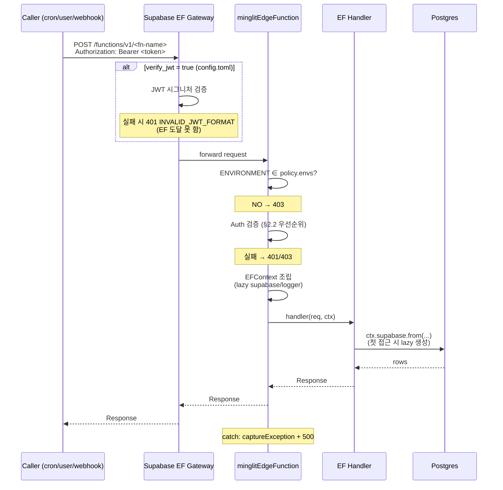
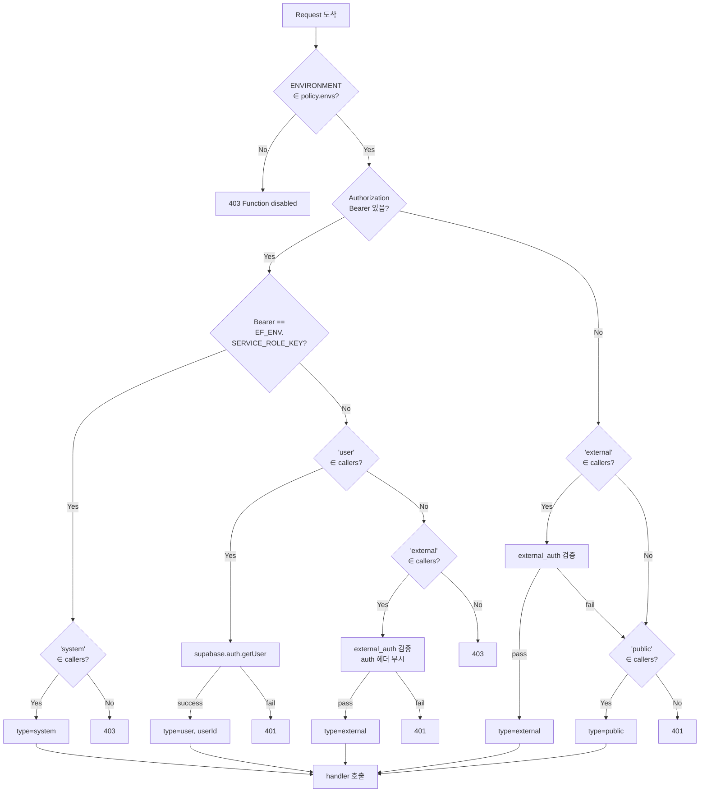
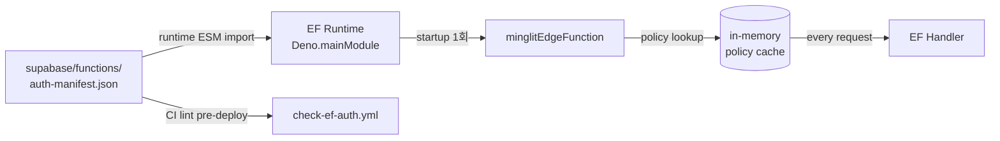

# Edge Function Auth Architecture

Minglit의 모든 Edge Function (EF) 인증/인가 모델을 기술한다.
중앙 manifest + 단일 미들웨어 wrapper 로 EF별 caller 정책과 환경 가드를 일원 관리한다.

---

## 1. 배경

### 1.1 현재 문제점 (이 설계 도입 전)

47개 `verify_jwt = false` EF + 13개 `verify_jwt = true` EF (총 ~60개) 의 인증 보호가 **분산 관리** 되어 다음 문제 발생:

| 항목 | 현재 상태 |
|---|---|
| 보호 메커니즘 | EF 별로 `requireServiceRole` / `requireAuth` / 직접 구현 / DEV_GUARD / IP allowlist 등 6가지 패턴 혼재 |
| 정책 가시성 | 어떤 EF 가 누구한테 호출 가능한지 한눈에 파악 불가 — 각 `index.ts` 열어봐야 함 |
| 신규 EF 누락 위험 | 새 EF 추가 시 보호 호출 잊으면 silent unprotected (Supabase 강제 메커니즘 없음) |
| 환경 가드 | dev-only EF 가 prod 호출되면 안 되는데 EF 코드 안에 매번 직접 `ENVIRONMENT` 체크 |
| 코드 중복 | `Deno.serve(withHandler(...))` + `initSentry()` + `createServiceClient()` 보일러플레이트 100% 반복 |

### 1.2 설계 원칙

1. **모든 EF는 어떤 형태든 보호되어야 한다** — JWT (게이트웨이), service_role 매칭, 외부 인증 (IP/HMAC), 또는 환경 가드
2. **정책은 중앙 manifest 에서 선언적으로 관리한다** — 코드 안 if-then 분산 금지
3. **wrapper 가 잊을 수 없도록 강제한다** — 보일러플레이트 자동 처리 + manifest/env 누락 시 모든 요청에 HTTP 500 반환 (deploy 자체는 성공)
4. **확장 가능해야 한다** — rate limit / deprecation / audit 등 미래 정책 추가가 manifest 필드 추가만으로 가능

### 1.3 Supabase 가 제공하는 것 / 안 하는 것

| 영역 | Supabase 제공 | 우리가 커버해야 |
|---|---|---|
| Gateway JWT 검증 (`verify_jwt = true`) | ✅ 프레임워크 레벨, 기본값 | 옵트아웃 시 보호 책임 이동 |
| EF env 자동 주입 (`SUPABASE_SERVICE_ROLE_KEY` 등) | ✅ 단 형식 (legacy JWT vs 신규 sb_secret_) 은 프로젝트 설정 의존 | Vault 와의 형식 일치 보장 (CI sync) |
| `verify_jwt = false` 시 내부 보호 강제 | ❌ | ✅ 본 설계 (manifest + wrapper) |
| EF 별 환경 가드 (dev-only / prod-only) | ❌ | ✅ 본 설계 |
| Unprotected EF 자동 검출 | ❌ | ✅ CI lint |

### 1.4 service_role 형식 일관성 요건 ⚠️

`system` caller 검증은 cron 이 보낸 `Bearer <token>` 과 EF 내부 `Deno.env.get("SUPABASE_SERVICE_ROLE_KEY")` 의 **exact string match** 다. 두 값의 출처:

```
GH Secret (SUPABASE_*_SECRET_KEY)
  ├─→ EF env (Supabase 플랫폼 자동 주입 — supabase-deploy.yml 의 supabase secrets set 안 거침)
  └─→ Vault (CI sync — supabase-deploy.yml 의 Sync Vault secrets step)
        └─→ cron 이 SELECT 하여 Bearer 헤더에 사용
```

두 경로가 같은 GH Secret 에서 나오므로 형식 일치는 자동. 단 **GH Secret 형식이 EF 게이트웨이의 verify_jwt 와 호환되어야** 함:
- legacy JWT (`eyJ...`): verify_jwt=true / false 모두 호환
- 신규 sb_secret_: verify_jwt=false 전용 (게이트웨이가 JWT 시그니처 검증 못함)

**현재 정책**: legacy JWT 형식 사용. 신규 형식은 `verify_jwt=true` EF 가 cron 호출 받는 한 부적합 (별도 이슈에서 마이그레이션 검토).

---

## 2. Caller Types (4종)

EF 가 받을 수 있는 호출자 분류. manifest 의 `callers` 배열에 명시 (OR — 하나라도 매칭되면 통과).

| 타입 | 의미 | 검증 방법 |
|---|---|---|
| **`system`** | cron, 시스템 우회 | `Authorization: Bearer ${EF_ENV.SUPABASE_SERVICE_ROLE_KEY}` exact match (§1.4 의 EF env 값과 비교) |
| **`user`** | 인증된 사용자/파트너 | `supabase.auth.getUser(token)` 으로 decode + claims 추출 → `auth.userId` |
| **`external`** | 외부 시스템 (webhook 등) | manifest 의 `external_auth` 정책에 따라 IP / HMAC / signature 검증. **Authorization 헤더 무관** |
| **`public`** | 익명 OK | check 없음. 보통 `envs: ["dev"]` 와 결합하여 prod 노출 차단 |

### 2.1 user 검증의 중복 우려 (해명)

`verify_jwt=true` EF 의 경우 게이트웨이가 이미 JWT 시그니처 검증함 → wrapper 의 `supabase.auth.getUser()` 가 다시 검증하는 것 같음. 실제로는:

- `supabase.auth.getUser(token)` 는 **decode-only + Supabase Auth API 조회 (캐시됨)** — 시그니처 재검증은 안 함
- 비용: ~1ms (캐시 hit) ~ ~50ms (cache miss). 게이트웨이의 시그니처 검증과 별개 작업
- 목적: claims 에서 `userId` 추출 (게이트웨이는 통과 여부만 결정, claims 내용을 EF 에 전달 안 함)

→ **중복 아님**. 게이트웨이=시그니처 검증, wrapper=user 정보 추출.

### 2.2 caller 검증 우선순위 (성능 최적화)

`Authorization` 헤더 형식과 manifest.callers 조합으로 분기. cheap check 먼저:

```
0. (선결) Env 가드: ENVIRONMENT ∉ policy.envs → 403 (auth 검증 자체 skip)

1. Authorization 헤더 있음 + Bearer 형식
   ├─ Bearer == EF_ENV.SUPABASE_SERVICE_ROLE_KEY
   │   └─ "system" ∈ callers → ✅ pass (cheap, env var 비교만)
   │   └─ 아니면 → 403
   └─ Else
       ├─ "user" ∈ callers → supabase.auth.getUser() (expensive)
       │   └─ success → ✅ pass + userId
       │   └─ fail → 401
       └─ "user" ∉ callers + "external" ∈ callers → external_auth 검증 (auth 헤더 무시, IP 등 다른 신호 사용)
       └─ 둘 다 ∉ → 403

2. Authorization 헤더 없음 또는 Bearer 형식 아님
   ├─ "external" ∈ callers → external_auth 검증
   ├─ "public" ∈ callers → ✅ pass (auth check 없음)
   └─ 둘 다 ∉ → 401
```

---

## 3. Auth Manifest

### 3.1 위치

`supabase/functions/auth-manifest.json`

EF 들과 같은 디렉토리 — wrapper 가 import 가능 + locality 좋음.

### 3.2 스키마

```json
{
  "version": "1.0",
  "functions": {
    "<fn-name>": {
      "callers": ["system" | "user" | "external" | "public"],
      "envs": ["local" | "development" | "dev" | "production"],
      "external_auth": { ... },     // optional, callers 에 "external" 있을 때
      "description": "한 줄 요약"
    }
  }
}
```

### 3.3 필드 정의

| 필드 | 타입 | 필수 | 설명 |
|---|---|---|---|
| `callers` | `Caller[]` | ✅ | 허용 호출자 (OR) |
| `envs` | `string[]` | ✅ | 동작 허용 환경 — 외 환경 호출 시 403 |
| `external_auth` | `object` | callers 에 `external` 있으면 | 외부 인증 검증 정책 |
| `description` | `string` | 권장 | 한 줄 한국어 설명 (audit 용) |

### 3.4 `external_auth` polymorphism

```json
// IP allowlist
"external_auth": {
  "type": "ip_allowlist",
  "ips": ["52.78.100.19", "52.78.48.223", "52.78.17.128"]
}

// HMAC-SHA256 signature — PortOne V2 webhook 예시.
// signature 형식: 헤더 값이 "sha256=<hex>" 또는 "<hex>" 모두 허용.
// body는 req.clone()으로 읽어 원본 request를 보존한다.
"external_auth": {
  "type": "hmac",
  "secret_env": "PORTONE_WEBHOOK_SECRET",
  "header": "x-portone-signature-v2"
}

// 임의 검증 (escape hatch — bespoke 인증 로직이 필요한 경우).
// module은 EF 디렉토리 기준 상대 경로.
// 해당 모듈은 `check(req: Request): Promise<{ok:true;reason:string}|{ok:false}>` 를 export해야 한다.
"external_auth": {
  "type": "custom",
  "module": "./payment_webhook_auth.ts"
}
```

### 3.5 예제 entry

```json
{
  "version": "1.0",
  "functions": {
    "cleanup-retention": {
      "callers": ["system"],
      "envs": ["dev", "production"],
      "description": "Cron 전용 retention cleanup"
    },
    "user-create-order": {
      "callers": ["user"],
      "envs": ["dev", "production"],
      "description": "사용자 결제 주문 생성"
    },
    "notification-worker": {
      "callers": ["user", "system"],
      "envs": ["dev", "production"],
      "description": "푸시 알림 처리 (cron + 관리자 트리거)"
    },
    "payment-webhook": {
      "callers": ["external"],
      "external_auth": {
        "type": "ip_allowlist",
        "ips": ["52.78.100.19", "52.78.48.223", "52.78.17.128"]
      },
      "envs": ["dev", "production"],
      "description": "PortOne V1 웹훅 수신"
    },
    "dev-mock-portone": {
      "callers": ["public"],
      "envs": ["dev"],
      "description": "PortOne 목업 (dev only)"
    }
  }
}
```

---

## 4. minglitEdgeFunction Wrapper

### 4.1 API

```ts
// supabase/functions/_shared/edge_function.ts
import type { SupabaseClient } from "@supabase/supabase-js";
import type { Logger } from "./logger.ts";

export type AuthContext =
  | { type: "system" }
  | { type: "user"; userId: string }
  | { type: "external"; reason: string }   // e.g., "ip_allowlist:52.78.100.19"
  | { type: "public" };

export type Environment = "local" | "development" | "dev" | "production";

export interface EFContext {
  // 항상 주입 (lightweight)
  readonly auth: AuthContext;
  readonly fnName: string;
  readonly env: Environment;
  readonly requestId: string;

  // Lazy 주입 (getter — 첫 접근 시 생성, 이후 캐시)
  readonly supabase: SupabaseClient;     // service role client
  readonly logger: Logger;               // sentry 초기화된 로거
  readonly statsig?: StatsigClient;      // opts.features 에 'statsig' 포함 시만 노출
}

export interface MinglitEFOptions {
  /** 옵트인 기능. 기본값 [] — sentry 만 자동 init */
  features?: ('statsig' | 'axiom')[];
}

export type EFHandler = (req: Request, ctx: EFContext) => Promise<Response>;

export function minglitEdgeFunction(handler: EFHandler, opts?: MinglitEFOptions): void;
```

### 4.2 동작 (startup → request)

#### Startup (모듈 로드 시 1회 — 실패 시 `_initError` 저장, deploy 는 성공)

> **실제 동작**: `tryInit()` 내부에서 throw 가 발생해도 try-catch 로 잡아 `_initError` 에 저장한다.
> `Deno.serve()` 는 항상 호출되므로 deploy 자체는 성공한다.
> 이후 모든 요청에서 `_initError` 가 있으면 HTTP 500 을 반환한다.
> (e2e 검증: `supabase/functions/_shared/edge_function_manifest_test.ts`)

1. `Deno.mainModule` 파싱 → `fnName` 자동 감지
   - 패턴: `/functions/<name>/index\.ts$` 매칭
   - 실패 시 throw → `_initError` 저장 → 모든 요청에 HTTP 500
2. `auth-manifest.json` import 후 `manifest.functions[fnName]` lookup
   - 없으면 throw → `_initError` 저장 — manifest 누락 자동 검출
3. `Deno.env.get("ENVIRONMENT")` 확인
   - undefined 면 throw → `_initError` 저장 — 환경 변수 누락 즉시 검출
4. Sentry SDK init (모든 EF 공통). Statsig/Axiom 은 `opts.features` 에 명시된 EF 만

#### Request (호출마다)
5. CORS preflight (`OPTIONS`) → `corsResponse()` 즉시 반환
6. **Env 가드** — `ENVIRONMENT ∉ policy.envs` → `errorResponse("Function disabled in <env>", 403)`
7. **Auth 검증** — §2.2 우선순위 따라 검증
   - 매칭 caller 없음 → `errorResponse("Unauthorized" | "Forbidden", 401 | 403)`
8. `EFContext` 조립 (lazy getter 포함)
9. `handler(req, ctx)` 호출, 응답 반환
10. catch: `captureException` + sentry log + `errorResponse("Internal error", 500)`

### 4.3 응답 형식

wrapper 가 반환하는 모든 에러 응답은 기존 `errorResponse` 헬퍼 형식을 그대로 사용:

```json
{ "error": "Function disabled in production" }      // 403
{ "error": "Unauthorized" }                         // 401
{ "error": "Internal error" }                       // 500
```

기존 EF 클라이언트 호환성 유지. 향후 구조화 (`code` 필드 등) 필요 시 별도 PR.

### 4.4 Lazy 주입 패턴 (구현 의사코드)

```ts
// 실제 구현은 closure 또는 class 활용. 객체 리터럴 + this._x 패턴은
// TypeScript readonly 제약과 충돌하므로 아래 closure 패턴 권장.
function makeEFContext(opts: {
  auth: AuthContext;
  fnName: string;
  env: Environment;
  requestId: string;
}): EFContext {
  let _supabase: SupabaseClient | undefined;
  let _logger: Logger | undefined;
  return {
    auth: opts.auth,
    fnName: opts.fnName,
    env: opts.env,
    requestId: opts.requestId,
    get supabase() {
      if (!_supabase) _supabase = createServiceClient();
      return _supabase;
    },
    get logger() {
      if (!_logger) _logger = createLogger({ fnName: opts.fnName, requestId: opts.requestId });
      return _logger;
    },
  };
}
```

EF 가 `ctx.supabase` 를 한 번도 안 쓰면 client 생성 자체가 안 됨 — cold start 시간 단축.

### 4.5 EF 코드 예시

#### Before (현재 — boilerplate ~12줄)

```ts
import { createServiceClient } from "../_shared/supabase_client.ts";
import { successResponse, errorResponse } from "../_shared/response_utils.ts";
import { initSentry, withHandler, captureException } from "../_shared/logger.ts";
import { requireServiceRole } from "../_shared/auth_utils.ts";

initSentry();

Deno.serve(withHandler(async (req) => {
  if (req.method !== "POST") return errorResponse("Method not allowed", 405);

  const auth = requireServiceRole(req);
  if (auth instanceof Response) return auth;

  const supabase = createServiceClient();

  // ... 비즈니스 로직

  return successResponse({ ok: true });
}));
```

#### After: cron 전용 EF (boilerplate 0)

manifest: `{ "callers": ["system"], "envs": ["dev", "production"] }`

```ts
import { minglitEdgeFunction } from "../_shared/edge_function.ts";
import { successResponse } from "../_shared/response_utils.ts";

export const handler = async (req, { supabase }) => {
  // wrapper 가 이미 system caller 만 통과시킴 — handler 안 추가 체크 불필요
  // ... 비즈니스 로직 (cleanup, settlement 등)
  return successResponse({ ok: true });
};

minglitEdgeFunction(handler);
```

#### After: user + cron 혼용 EF (분기 필요)

manifest: `{ "callers": ["user", "system"], "envs": ["dev", "production"] }`

```ts
import { minglitEdgeFunction } from "../_shared/edge_function.ts";
import { successResponse, errorResponse } from "../_shared/response_utils.ts";

export const handler = async (req, { auth, supabase }) => {
  if (auth.type === "system") {
    // 관리자 트리거: 모든 pending notification 처리
    return await processAllPending(supabase);
  }
  // type === "user" — wrapper 가 보장
  return await processForUser(supabase, auth.userId);
};

minglitEdgeFunction(handler);
```

EF 본문 = 비즈니스 로직 + caller 분기만. CORS / sentry / auth / env / supabase client / logger 모두 wrapper 가 처리.

### 4.6 Test 전략

`handler` 를 export 하므로 unit test 에서 직접 호출. 표준 mock context utility:

```ts
// supabase/functions/_shared/test_utils.ts (신규)
export function makeMockContext(overrides: Partial<EFContext> = {}): EFContext {
  return {
    auth: { type: "system" },
    fnName: "test",
    env: "local",
    requestId: "test-req-id",
    supabase: createMockClient(),
    logger: createMockLogger(),
    ...overrides,
  };
}

// 예: cleanup-retention/index_test.ts
import { handler } from "./index.ts";
import { makeMockContext } from "../_shared/test_utils.ts";

Deno.test("processes when called as system", async () => {
  const ctx = makeMockContext({ auth: { type: "system" } });
  const res = await handler(new Request("http://x"), ctx);
  assertEquals(res.status, 200);
});

Deno.test("rejects user caller (manifest disallows)", async () => {
  // 이 테스트는 wrapper 통합 테스트에서 검증 — handler 단위 테스트는
  // wrapper 통과 가정하므로 caller 거부 로직 테스트 안 함
});
```

wrapper 자체의 caller/env 검증 로직은 별도 `_shared/edge_function_test.ts` 에서 통합 테스트.

---

## 5. Runtime View



### 5.1 인증 분기 상세



---

## 6. Data View

### 6.1 manifest 데이터 흐름



Supabase EF 는 build-time bundling 없이 deno deploy 시점에 ESM import 가 resolve 됨. manifest 는 startup 때 1회 import 후 메모리에 상주.

### 6.2 EFContext 객체

```
EFContext
├─ auth: AuthContext                    [eager]
│   ├─ type: 'system' | 'user' | 'external' | 'public'
│   └─ userId?: string                  (type === 'user' 일 때만)
├─ fnName: string                       [eager, startup detected]
├─ env: 'local'|'development'|'dev'|'production'  [eager]
├─ requestId: string                    [eager, per-request UUID]
├─ supabase: SupabaseClient             [lazy getter]
├─ logger: Logger                       [lazy getter]
└─ statsig?: StatsigClient              [lazy getter, opts.features 'statsig' 포함 시만]
```

### 6.3 manifest entry → caller 매핑 매트릭스

| 시나리오 | callers | envs | external_auth |
|---|---|---|---|
| Cron 전용 (cleanup, settlement) | `["system"]` | `["dev", "production"]` | — |
| User 전용 (앱 호출) | `["user"]` | `["dev", "production"]` | — |
| User + Cron 혼용 | `["user", "system"]` | `["dev", "production"]` | — |
| 외부 webhook | `["external"]` | `["dev", "production"]` | `{ type: "ip_allowlist", ips: [...] }` |
| Dev-only 시스템 | `["system"]` | `["dev"]` | — |
| Dev-only public mock | `["public"]` | `["dev"]` | — |

---

## 7. CI Lint

`.github/workflows/check-ef-auth.yml` (신규):

```yaml
- name: Verify all EFs declared in auth-manifest
  run: |
    EF_DIRS=$(ls -d supabase/functions/*/ | xargs -I{} basename {} | grep -v "^_")
    DECLARED=$(jq -r '.functions | keys[]' supabase/functions/auth-manifest.json)

    # 1. 모든 EF 디렉토리가 manifest에 entry 있는지 (orphan EF 검출)
    for ef in $EF_DIRS; do
      echo "$DECLARED" | grep -q "^${ef}$" || {
        echo "::error::EF '${ef}' missing entry in supabase/functions/auth-manifest.json"
        exit 1
      }
    done

    # 2. manifest entry 가 실제 디렉토리 가지는지 (orphan entry 검출)
    for declared in $DECLARED; do
      [ -d "supabase/functions/${declared}" ] || {
        echo "::error::auth-manifest declares '${declared}' but supabase/functions/${declared}/ missing"
        exit 1
      }
    done

    # 3. 모든 EF index.ts 가 minglitEdgeFunction 호출하는지 (옛 패턴 잔존 검출)
    for ef in $EF_DIRS; do
      grep -q "minglitEdgeFunction" "supabase/functions/${ef}/index.ts" || {
        echo "::error::EF '${ef}/index.ts' missing minglitEdgeFunction call"
        exit 1
      }
    done

    # 4. (Phase 5 후) 옛 헬퍼 잔존 금지
    # OLD_PATTERNS="requireServiceRole|requireAuth|withHandler"
    # for ef in $EF_DIRS; do
    #   grep -qE "$OLD_PATTERNS" "supabase/functions/${ef}/index.ts" && {
    #     echo "::error::EF '${ef}/index.ts' uses deprecated auth helper"
    #     exit 1
    #   }
    # done
```

`ci.yml` 의 `test-edge-functions` job 에 dependency 추가하여 `ci-result` 게이트 합류.

`#3` 활성화 시점: Phase 4 (모든 EF 마이그레이션 완료 후).
`#4` 활성화 시점: Phase 5 (옛 헬퍼 제거 후).

---

## 8. Migration Plan

총 대상: **verify_jwt=false EF 47개 + verify_jwt=true EF 13개 = 약 60개**. 두 그룹 모두 wrapper 로 통합 (verify_jwt 설정은 config.toml 그대로 유지 — 게이트웨이 보호는 별도).

| Phase | 작업 | PR 단위 | 영향 |
|---|---|---|---|
| **0** | 본 doc 머지 + 설계 합의 | 1 PR (이것) | 문서만 |
| **1** | `auth-manifest.json` 신규 (60개 EF entry, 현재 동작 mirror) + `_shared/edge_function.ts` (`minglitEdgeFunction`) + `_shared/test_utils.ts` 추가 | 1 PR | 신규 모듈만 — 기존 EF 영향 0 |
| **2** | 신규 EF 부터 `minglitEdgeFunction` 의무 사용 + CLAUDE.md/AGENTS.md 업데이트 | 즉시 적용 | 신규 EF 만 |
| **3** | 기존 60 EF 마이그레이션 (PR 단위 5~10개씩, 각 PR negative diff) | 6~12 PR / 2~4주 | EF 본문 단축 |
| **4** | CI lint 활성화 — `#1`, `#2`, `#3` 라인 (`ci-result` 의존성 추가) | 1 PR | 모든 EF 강제 |
| **5** | 옛 헬퍼 제거 (`requireServiceRole`, `requireAuth`, `withHandler`) + CI lint `#4` 활성화 | 1 PR | cleanup |

### 8.1 마이그레이션 중 양립

Phase 1~4 동안 **옛 헬퍼와 새 wrapper 가 공존**. 마이그레이션되지 않은 EF 는 옛 헬퍼 (`withHandler`, `requireServiceRole`, `requireAuth`) 사용 유지. Phase 5 에서 옛 헬퍼 제거 = 모든 EF 마이그레이션 완료의 signal.

리뷰어 혼란 방지: 옛 헬퍼 코드에 `@deprecated — use minglitEdgeFunction (docs/architecture/edge-function-auth.md)` JSDoc 주석 추가 (Phase 1 PR 에서).

### 8.2 Phase 3 의 negative diff 가치

각 EF 마이그레이션 PR 의 평균 변경:
- `-12 줄` (boilerplate 제거: import 4개, initSentry, Deno.serve(withHandler(...)), requireServiceRole call, createServiceClient call)
- `+3 줄` (minglitEdgeFunction import + handler export + minglitEdgeFunction(handler))

순수 코드 감소. 리뷰 부담 ↓.

---

## 9. Open Questions / 후속 이슈

본 doc 머지 후 별도 이슈로 추적:

| # | 주제 | 우선순위 |
|---|---|---|
| ~~TBD-1~~ | ~~manifest 누락 → startup throw 시나리오 검증~~ (완료: `_shared/edge_function_manifest_test.ts`, 실제 동작은 HTTP 500/request — deploy 성공) | ~~P2~~ |
| TBD-2 | 60 EF 마이그레이션 진척 트래킹 (Phase 3 의 epic) | P2 |
| TBD-3 | 옛 auth 헬퍼 deprecation timeline + 제거 (Phase 5) | P3 |
| ~~TBD-4~~ | ~~`external_auth` HMAC / custom 패턴 실제 적용 (PortOne 등)~~ (완료: `checkExternalAuth` — hmac/custom 모두 구현, issue #2186) | ~~P3~~ |
| TBD-5 | rate limit / deprecation / audit 등 manifest 확장 | P3 |
| TBD-6 | 신규 sb_secret_ 형식으로 service_role 마이그레이션 (verify_jwt=true cron-호출 EF 의 verify_jwt=false 전환 검토 포함) | P3 |

---

## 10. 부록

### 10.1 참조 파일

| 파일 | 역할 |
|---|---|
| `supabase/functions/auth-manifest.json` | 중앙 정책 |
| `supabase/functions/_shared/edge_function.ts` | `minglitEdgeFunction` wrapper + caller 검증 로직 |
| `supabase/functions/_shared/test_utils.ts` | `makeMockContext` 등 테스트 유틸 |
| `supabase/config.toml` | `verify_jwt` per-EF (게이트웨이 레벨, manifest 와 직교) |
| `env-manifest.json` | EF env vars + vault secrets (auth-manifest 와 별개 — §1.4 참고) |
| `.github/workflows/check-ef-auth.yml` | CI lint |

### 10.2 용어

| 용어 | 의미 |
|---|---|
| **caller** | EF 를 호출하는 주체 (cron, user, webhook 등) |
| **policy** | manifest 의 EF 별 entry — callers + envs + external_auth |
| **wrapper** | `minglitEdgeFunction` — Deno.serve 를 감싸 cross-cutting concern 처리 |
| **gateway** | Supabase EF 게이트웨이 — verify_jwt 처리 + EF runtime 진입 |
| **lazy injection** | EFContext 의 `supabase` / `logger` 는 첫 접근 시에만 생성 |
| **deploy fail** | ~~manifest/env 누락으로 startup throw → EF 가 시작 자체를 못 함~~ **실제**: `tryInit()` 이 throw 를 catch → `_initError` 저장 → deploy 성공 + 모든 요청에 HTTP 500 반환 |
