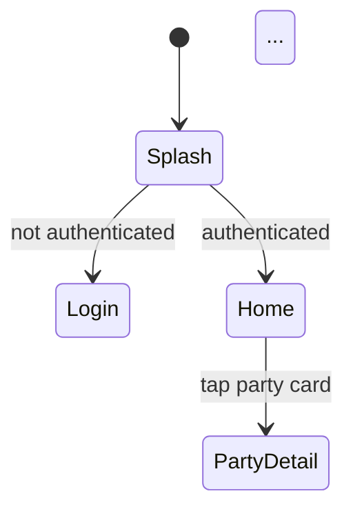

# mds_docs Phase 1 Plan

**Status:** PoC, feature/mds-docs-phase1 브랜치
**Goal:** mds 디자인 시스템의 공개 docs 사이트 골격 구축 — Material Design / Polaris 류의 디자인 시스템 사이트
**Predecessors:** #1869 / #1887 / #1899 (mds 패키지, storybook, tokens wiring)

## 비전 (전체 phase 누적)

Material Design 3 / Shopify Polaris / IBM Carbon 같은 공식 디자인 시스템 docs 사이트의 minglit 축약판. 디자이너/PM/개발자가 한 곳에서 토큰/컴포넌트/화면/가이드라인을 참조.

## Phase 1 — 이번 PR 범위

**4개 페이지 + tokens.css 파이프라인 추가:**

| 페이지 | 내용 | 자동/수동 |
|---|---|---|
| `/` (Home) | 디자인 시스템 소개, 4개 섹션 link card | 수동 (간단) |
| `/tokens` | color/spacing/radius/typography 카탈로그 | **자동** — `tokens.json` 파싱하여 build time 생성 |
| `/screens` | 화면 spec 갤러리 — 현재는 profile_home 1개 (wireframe PoC) | iframe 임베드 |
| `/flows` | 앱 navigation 흐름 — Mermaid stateDiagram | **반자동** — 앱 라우팅 코드 탐색하여 작성 |

## 사전 작업: Style Dictionary CSS target 추가

`shared/packages/mds_tokens/config.js` (또는 `config.cjs`)에 `css` 플랫폼 추가:

```js
platforms: {
  dart: { /* 기존 */ },
  css: {
    transformGroup: 'css',
    buildPath: 'lib/generated/',
    files: [{
      destination: 'tokens.css',
      format: 'css/variables',
      options: { selector: ':root' }
    }]
  }
}
```

`npm run build` 실행 후 `lib/generated/tokens.css`가 생성되어야 함. mds_docs는 이걸 import하여 사이트 자체가 mds 토큰으로 그려지는 dogfood.

## `apps/mds_docs/` 신규 앱

**스택:** Next.js 15 + TypeScript + Tailwind (landing_user 동일 스택). Reference: `apps/landing_user/`의 package.json, next.config.ts, tsconfig.json, eslint.config.mjs, postcss.config.mjs, vercel.json 그대로 복제 후 mds_docs 용으로 조정.

**버전:** `26.04.1900-dev` (또는 현재 dev 버전 따름)

### 디렉토리 구조

```
apps/mds_docs/
  package.json
  next.config.ts
  tsconfig.json
  vercel.json
  postcss.config.mjs
  tailwind.config.ts        ← mds_tokens/tokens.css 변수 wire
  src/
    app/
      layout.tsx            ← 공통 레이아웃 (사이드바 nav)
      page.tsx              ← Home
      tokens/page.tsx       ← /tokens
      screens/page.tsx      ← /screens
      flows/page.tsx        ← /flows
    lib/
      tokens.ts             ← tokens.json 파싱 헬퍼 (build time)
    components/
      Sidebar.tsx           ← 좌측 nav
      ColorSwatch.tsx       ← /tokens 컴포넌트
      SpacingScale.tsx
      RadiusPreview.tsx
      MermaidDiagram.tsx    ← /flows 클라이언트 컴포넌트
  public/
    specs/
      profile_home.html     ← wireframe PoC 복사 (iframe 임베드용)
```

### 페이지별 콘텐츠

#### `/` (Home)

- 헤로 섹션: "Minglit Design System" + 한 줄 description
- 4개 섹션 카드 (Tokens / Screens / Flows / Components(soon))
- 각 카드 클릭 → 해당 페이지

#### `/tokens` — 자동 카탈로그 (핵심)

`tokens.json` 파일들 (`color.json`, `spacing.json`, `radius.json`, `typography.json`)을 build time에 읽어서:

- **Colors**: 31개 swatch — hex 미리보기 + 토큰 이름 (`color-primary`) + hex 값 + `MdsTokens.colorPrimary` 코드 스니펫
- **Spacing**: 16 단계 — 각 단계의 길이를 시각적으로 비교 (가로 막대 그래프 형태)
- **Radius**: 7개 — 각 값으로 모서리 둥근 박스 미리보기
- **Typography**: 6개 — 실제 텍스트로 size/weight 시연

각 토큰 카드:
```
┌─────────────────────────────┐
│ ███ (color preview)         │
│ color-primary               │
│ #9900FF                     │
│ MdsTokens.colorPrimary      │
└─────────────────────────────┘
```

토큰 추가/변경 시 페이지가 자동 업데이트 — manual 콘텐츠 0.

#### `/screens` — 화면 spec 갤러리

콘텐츠 소스: `docs/screen-specs/_demo/profile_home_spec.html` (현재 PoC 1개).

Phase 1에선:
- 그리드 레이아웃 (1개라도 grid)
- 각 카드: 화면 이름 + iframe scaled (0.4) preview + "View full spec" 링크
- 클릭 → spec.html 새 탭

`apps/mds_docs/public/specs/profile_home.html`로 복사하여 정적 자원으로 서빙.

향후 화면이 늘어나면 자동 디스커버리 (디렉토리 스캔)로 진화 가능, 이번엔 hardcode 1개.

#### `/flows` — Mermaid stateDiagram

**탐색 대상:**
- `apps/app_user/lib/src/routing/app_router.dart`
- `apps/app_user/lib/src/routing/app_routes.dart`
- `apps/app_partner/lib/src/routing/app_router.dart`
- `apps/app_partner/lib/src/routing/app_routes.dart`

**산출물:** Mermaid stateDiagram-v2로 표현된 앱 navigation 그래프. user/partner 앱 별로 1개씩 (총 2개 다이어그램).



라우트가 많아 한 다이어그램에 다 안 들어가면 도메인별로 분할 (Auth flow / Party flow / Profile flow 등).

**중요한 룰:**
- 라우트 코드의 실제 경로/이름을 그대로 사용 (e.g., `app_user AppRoutes.partyDetail` 노드명)
- 각 transition은 사용자 액션 또는 시스템 트리거 라벨링
- diagram 옆에 **"How this was generated"** 메모: "이 다이어그램은 `apps/app_user/lib/src/routing/app_router.dart`의 라우트 정의를 기반으로 한다. 코드 변경 시 수동 업데이트 필요." (자동 생성 추적이 follow-up)

Mermaid 렌더는 클라이언트 컴포넌트 (`use client`) + `mermaid` npm 패키지.

### Tailwind 설정 — tokens.css와 연결

`tailwind.config.ts`에서 `theme.extend.colors`, `spacing`, `borderRadius`를 CSS variable 참조로:

```ts
theme: {
  extend: {
    colors: {
      'mds-primary': 'var(--color-primary)',
      'mds-surface': 'var(--color-surface)',
      // ...
    },
    spacing: {
      'mds-xs': 'var(--spacing-xs)',
      'mds-md': 'var(--spacing-md)',
      // ...
    }
  }
}
```

`globals.css`의 `@import "../../shared/packages/mds_tokens/lib/generated/tokens.css";` (또는 빌드 타임 복사).

### CI / Vercel

**`.github/workflows/ci.yml`:**
- paths-filter에 `mds_docs: 'apps/mds_docs/**'` 추가
- `lint-mds-docs` job 추가 (landing_user lint job 미러링) — npm install + lint + build

**Vercel deploy:**
- `.github/workflows/deploy-vercel.yml`에 mds_docs 추가 (다른 4개 앱 배포 패턴 따라)
- Vercel 프로젝트 자체는 사용자 (Mark)가 dashboard에서 생성 필요 — agent가 못 함. PR에는 workflow 변경만 포함, README에 setup 노트 남김.

## 검증 게이트

1. `cd shared/packages/mds_tokens && npm run build` — `tokens.css` 생성됨, 31개 컬러 변수 포함
2. `cd apps/mds_docs && npm install && npm run build` — 0 errors
3. `cd apps/mds_docs && npm run lint` — 0 errors
4. `npm run dev`로 로컬 띄워서 4개 페이지 모두 접근 가능
5. `/tokens`에 31 swatch + spacing scale + 7 radius previews 보임
6. `/screens`에 profile_home iframe 1개 보임
7. `/flows`에 Mermaid 다이어그램 1-3개 렌더됨

## 위험

- **Vercel 프로젝트 셋업** — 사용자 수동 작업 필요. PR이 머지되어도 cron 배포 시 5번째 앱이 없어 실패 가능. README에 명시.
- **Mermaid 클라이언트 렌더** — Next.js SSR과 mermaid가 ssr: false 동적 import 필요. 못 풀면 image fallback (사전 생성 SVG).
- **tokens.css codegen 위치** — `lib/generated/`가 git tracked인지 확인. (현재 `tokens.g.dart`는 tracked.)
- **콘텐츠 미완성** — Phase 1은 4페이지 골격만. 컴포넌트, 가이드라인, changelog는 후속.

## PR

- Base: dev
- Title: `feat(mds_docs): bootstrap design system docs site (Phase 1)`
- Body: 이 plan + 스크린샷 + Vercel setup 안내
- Auto-merge: ON

## 후속 Phase

- Phase 2: `/components` (mds_storybook iframe — Flutter web build 필요)
- Phase 3: `/screens` 자동 discovery + 더 많은 wireframe spec
- Phase 4: `/guidelines` (a11y, writing, iconography) — 콘텐츠 작성 비용 큼
- Phase 5: `/changelog` 자동화 + 검색 기능

---

**Date:** 2026-04-27
