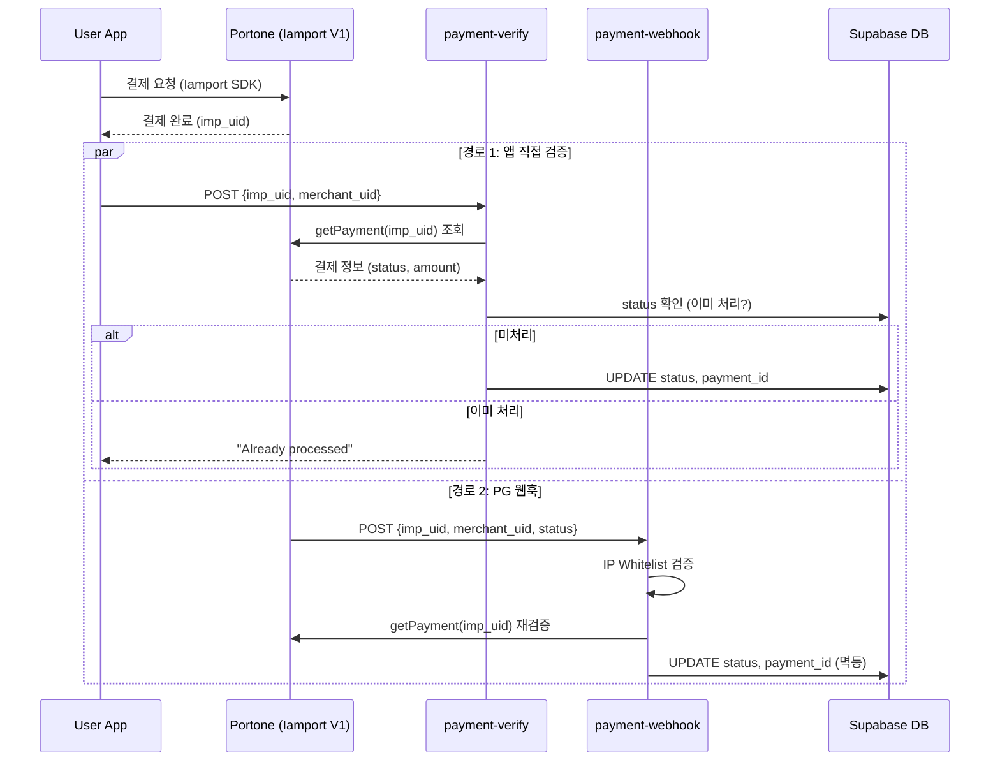
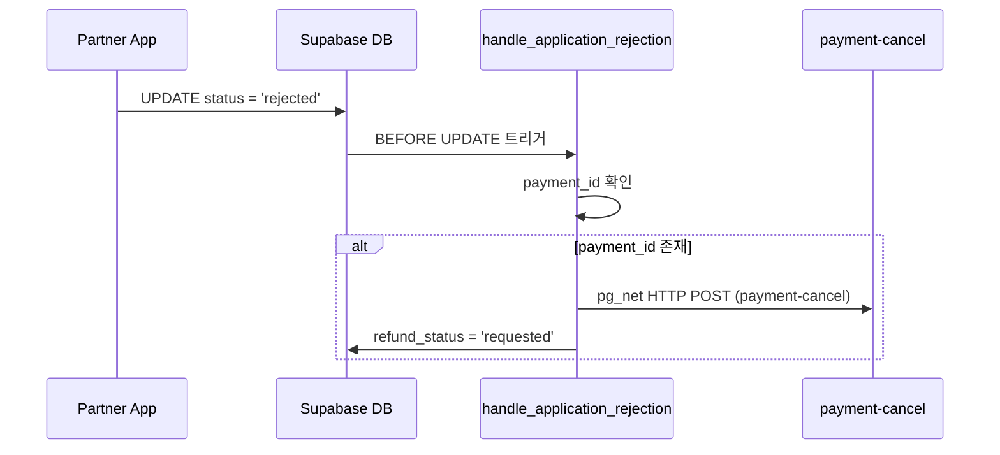

# Payment Pipeline

Minglit의 결제 및 정산 파이프라인의 현재 구현 상태를 기술한다.  
정산 시스템 확장 계획은 [Partner Settlement Architecture](../features/partner-settlement/architecture.md)를 참고.

---

## 1. Overview

결제 파이프라인은 유저의 이벤트 참가 결제부터 파트너 정산까지의 전 과정을 처리한다.

```text
User App ──결제──> Portone(Iamport V1) ──웹훅──> payment-webhook
    │                                              │
    └── payment-verify ────────────────────────────┘
                    │                               │
                    ▼                               ▼
              event_applications (status 업데이트, 멱등)
                    │
                    ▼ (approved/paid → 트리거)
              event_participants (티켓 발권)
                    │
                    ▼ (event completed → 트리거)
              settlements (정산 자동 생성)
                    │
                    ▼ (7일 후 → 크론)
              status: pending → ready
```

### Key Actors

| Actor | Role |
|-------|------|
| **User** | 앱에서 Iamport SDK로 결제 |
| **Portone (Iamport V1)** | PG 게이트웨이, 결제 처리, 웹훅 발송 |
| **payment-verify** | 앱에서 호출하는 결제 검증 Edge Function |
| **payment-webhook** | PG에서 호출하는 웹훅 수신 Edge Function |
| **payment-cancel** | 결제 취소/환불 Edge Function |

---

## 2. Payment Gateway Integration

### 2.1 Dual Client Architecture

현재 두 개의 PG 클라이언트가 공존한다:

| Client | File | LOC | API Version | Status |
|--------|------|-----|-------------|--------|
| `IamportClient` | `_shared/iamport_client.ts` | 63 | Iamport V1 | **Active** (모든 결제 함수에서 사용) |
| `PortoneClient` | `_shared/portone_client.ts` | 209 | Portone V2 | **준비됨** (정산 확장 시 사용 예정) |

`IamportClient`는 V1 REST API를 래핑하며, 토큰 발급 → 결제 조회/취소를 처리한다.  
`PortoneClient`는 V2 API용이며, 현재는 정산 관련 기능에서만 참조된다.

### 2.2 환경변수

```
PORTONE_API_KEY     — Iamport API Key (V1)
PORTONE_API_SECRET  — Iamport API Secret (V1)
```

---

## 3. Payment Flow

### 3.1 이중 검증 (Dual Verification)

결제는 **앱 직접 검증**과 **PG 웹훅** 두 경로로 검증되며, 선착순 1건만 처리된다 (멱등성).



### 3.2 앱 직접 검증 (payment-verify)

1. Bearer 토큰으로 유저 인증 (`requireAuth`)
2. `event_applications`에서 주문 조회 (`merchant_uid` = application ID)
3. 이미 `approved`/`paid`이면 → 성공 응답 (멱등)
4. Iamport API로 실제 결제 조회 (`getPayment`)
5. **결제 상태 검증**: `payment.status === "paid"` 확인
6. **금액 위변조 검증**: `payment.amount !== order.payment_amount` → 자동 취소
7. DB 업데이트 → `on_application_approval` 트리거 → 티켓 발권

### 3.3 웹훅 수신 (payment-webhook)

1. **IP Whitelist 검증**: `52.78.100.19`, `52.78.48.223`, `52.78.17.128`, `127.0.0.1`
2. Iamport API로 결제 정보 재검증 (`getPayment`)
3. **merchant_uid 일치 확인**: 웹훅의 merchant_uid와 API 응답 비교
4. Iamport status → Minglit status 매핑:

| Iamport Status | Minglit Status | 설명 |
|----------------|----------------|------|
| `paid` | `approved` | 결제 완료 → 티켓 발권 트리거 |
| `cancelled` | `cancelled` | 결제 취소 |
| `failed` | `payment_failed` | 결제 실패 |
| `ready` | `payment_pending` | 가상계좌 발급 등 |

---

## 4. Webhook Security

Iamport V1은 HMAC 서명을 지원하지 않으므로, 다중 방어 레이어를 사용한다:

| Layer | 방어 수단 | 구현 |
|-------|----------|------|
| 1 | **IP Whitelist** | Portone 서버 IP 4개만 허용 |
| 2 | **API 재검증** | 웹훅 수신 후 Iamport API로 결제 정보 직접 조회 |
| 3 | **merchant_uid 대조** | 웹훅 payload의 merchant_uid와 API 응답 비교 |

> Note: `payment-webhook`은 `verify_jwt=false`로 설정되어 있어 JWT 검증을 건너뛴다 (PG 서버가 호출하므로).

---

## 5. Refund Flow

### 5.1 수동 환불 (payment-cancel)

유저 또는 관리자가 직접 환불을 요청하는 경우:

1. Bearer 토큰 인증
2. `IamportClient.cancelPayment()` 호출 (부분 환불 지원: `amount`, `checksum` 파라미터)
3. DB 업데이트: `refund_status = 'completed'`, `refund_amount` 기록

### 5.2 자동 환불 (심사 반려)

파트너가 신청을 거절(`rejected`)하면 DB 트리거가 자동 환불을 실행:



### 5.3 환불 상태

`event_applications.refund_status`:

| Status | 설명 |
|--------|------|
| `none` | 환불 없음 (기본값) |
| `requested` | 환불 요청됨 (트리거가 설정) |
| `completed` | 환불 완료 |
| `failed` | 환불 실패 |

---

## 6. Settlement System (Current)

### 6.1 정산 자동 생성

이벤트 상태가 `completed`로 변경되면 `on_event_completed` 트리거가 정산을 자동 생성한다:

```sql
-- create_settlement_on_event_completion() 핵심 로직:
-- 1. 파트너 정보, 이벤트 제목/날짜 조회
-- 2. event_applications에서 매출/환불 집계
-- 3. 수수료 계산:
v_pg_fee       := round(v_total_sales * 0.035)  -- PG 수수료 3.5%
v_platform_fee := round(v_total_sales * 0.05)   -- 플랫폼 수수료 5%
v_vat          := round((v_pg_fee + v_platform_fee) * 0.1)  -- VAT 10%
v_net_amount   := v_total_sales - v_total_refunds - v_pg_fee - v_platform_fee - v_vat
-- 4. settlements 테이블에 INSERT (ON CONFLICT UPDATE)
```

### 6.2 정산 상태 머신

```text
pending ──(7일 경과, 크론)──> ready ──(수동)──> requested ──(수동)──> completed
```

| Status | 설명 | 전환 방식 |
|--------|------|----------|
| `pending` | 생성 직후, 보류 기간 | 자동 (이벤트 완료 트리거) |
| `ready` | 보류 기간 종료, 지급 가능 | 자동 (매일 03:00 크론) |
| `requested` | 지급 요청됨 | 수동 |
| `completed` | 지급 완료 | 수동 |

### 6.3 Revenue Views

```sql
-- 파트너별 전체 매출/환불/순수익
partner_revenue_stats (view)

-- 파트너별 월간 매출/환불/순수익
partner_monthly_revenue (view)
```

---

## 7. Edge Function Inventory

| Function | Auth | Method | Purpose |
|----------|------|--------|---------|
| `payment-verify` | Bearer (requireAuth) | POST | 앱에서 결제 검증, 금액 위변조 체크 |
| `payment-webhook` | IP Whitelist (no JWT) | POST | PG 웹훅 수신, 상태 동기화 |
| `payment-cancel` | Bearer (requireAuth) | POST | 결제 취소/환불 (부분 환불 지원) |
| `settlement-query` | Bearer (requireAuth) | GET/POST | 정산 내역 조회 |
| `settlement-transfer` | Bearer (requireAuth) | POST | 정산 주문 이체 생성 |

---

## 8. Known Limitations

| Issue | 설명 |
|-------|------|
| **수수료 하드코딩** | PG 3.5%, 플랫폼 5%가 `create_settlement_on_event_completion` 함수 내 하드코딩 |
| **CAS 미적용** | 정산 상태 변경에 낙관적 잠금(version/CAS) 없음 |
| **단일 정산 테이블** | `settlements` 1개 테이블로 운영, `settlement_items` 미구현 |
| **V1 HMAC 미지원** | Iamport V1은 웹훅 서명 검증 불가, IP Whitelist 의존 |
| **환불 비동기 불일치** | 트리거에서 `pg_net`으로 환불 호출 시, 실패해도 `refund_status`가 `requested`로 남을 수 있음 |
| **부분 환불 추적** | `refund_amount`만 기록하며, 다건 부분 환불 이력 미관리 |

---

## Related Documents

- [Backend Architecture](./backend.md) — 전체 백엔드 인프라
- [Partner Settlement Architecture](../features/partner-settlement/architecture.md) — 정산 시스템 확장 계획 (4+1 View)
- [Partner Settlement SRS](../features/partner-settlement/requirements.md) — 정산 시스템 요구사항 (187개 REQ)
