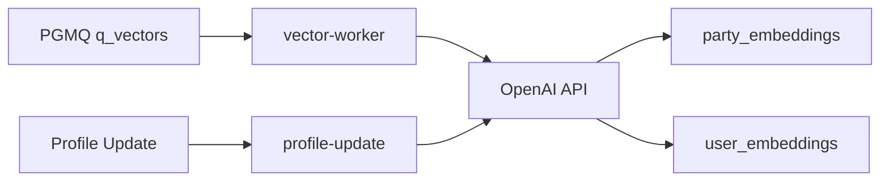

# Search & Recommendation

Minglit의 검색과 추천 시스템을 기술한다.  
두 개의 Postgres 익스텐션(PGroonga, pgvector)을 활용한 하이브리드 디스커버리 엔진이다.

---

## 1. Overview

```text
┌─────────────────────────────────────────────────────────┐
│                  Discovery Engine                        │
│                                                         │
│  ┌──────────────────┐    ┌────────────────────────────┐ │
│  │  PGroonga         │    │  pgvector                  │ │
│  │  Full-Text Search │    │  Vector Recommendation     │ │
│  │                   │    │                            │ │
│  │  "직장인 강남"     │    │  User Embedding ←→ Party   │ │
│  │  → 즉시 결과       │    │  Cosine Similarity         │ │
│  └──────────────────┘    └────────────────────────────┘ │
│          ↑                          ↑                    │
│     사용자 입력              PGMQ q_vectors              │
│                           + 온디맨드 API                 │
└─────────────────────────────────────────────────────────┘
```

| System | Extension | Purpose | Input |
|--------|-----------|---------|-------|
| **Full-Text Search** | PGroonga | 한글 키워드 검색 (파티/이벤트 제목) | 사용자 검색어 |
| **Vector Recommendation** | pgvector | 개인화 추천 (유저↔파티 유사도) | 유저 행동 임베딩 |

---

## 2. PGroonga Full-Text Search

### 2.1 Extension & Indexes

```sql
-- Extension
CREATE EXTENSION IF NOT EXISTS pgroonga;

-- Indexes
CREATE INDEX parties_title_pgroonga_idx ON public.parties USING pgroonga (title);
CREATE INDEX events_title_pgroonga_idx ON public.events USING pgroonga (title);
```

### 2.2 Search RPC Functions

```sql
-- 이벤트 검색 (최대 20건)
CREATE FUNCTION search_events_pgroonga(query text)
RETURNS SETOF events AS $$
  SELECT e.* FROM events e
  JOIN parties p ON e.party_id = p.id
  WHERE query <> ''
    AND p.title &@~ query
    AND e.status = 'scheduled'
    AND e.start_time >= now()
    AND COALESCE(e.visibility, p.visibility) = 'public'
    AND p.partner_id NOT IN (
      SELECT si.target_id::uuid FROM social_interactions si
      WHERE si.user_id = auth.uid()
        AND si.target_type = 'partner'
        AND si.interaction_type = 'block'
    )
  LIMIT 20;
$$ LANGUAGE sql STABLE SECURITY INVOKER;

-- 파티 검색 (최대 20건)
CREATE FUNCTION search_parties_pgroonga(query text)
RETURNS SETOF parties AS $$
  SELECT p.* FROM parties p
  WHERE query <> ''
    AND p.title &@~ query
    AND p.visibility = 'public'
    AND p.partner_id NOT IN (
      SELECT si.target_id::uuid FROM social_interactions si
      WHERE si.user_id = auth.uid()
        AND si.target_type = 'partner'
        AND si.interaction_type = 'block'
    )
  LIMIT 20;
$$ LANGUAGE sql STABLE SECURITY INVOKER;
```

### 2.3 PGroonga Operators

| Operator | 용도 | 예시 |
|----------|------|------|
| `&@~` | 전문 검색 (AND/OR) | `'직장인 강남'` (AND), `'직장인 OR 대학생'` (OR) |
| `&@` | 단순 매칭 | `'직장인'` |
| `&@*` | 정규식 검색 | `'직장.*밍글'` |

### 2.4 Block Filtering

`social_interactions` 테이블을 활용하여 유저가 차단한 파트너의 콘텐츠를 검색 결과에서 제외한다.

- 필터 조건: `interaction_type = 'block'` AND `target_type = 'partner'`
- 적용 대상: `search_events_pgroonga`, `search_parties_pgroonga`, `get_personalized_recommendations`, `get_events_within_radius`
- 차단은 유저별로 적용되며, 각 유저의 차단 목록이 자신의 검색 결과에 반영된다.

### 2.5 Visibility Filtering

파티와 이벤트는 `visibility` 컬럼(`public` | `private`)을 통해 검색 노출을 제어한다.

| Table | Column | Default | 설명 |
|-------|--------|---------|------|
| `parties` | `visibility` | `'public'` | 파티 전체 공개 여부 |
| `events` | `visibility` | `NULL` | NULL이면 파티의 visibility를 상속 |

검색/추천 함수에서의 필터링:
- `search_parties_pgroonga`: `p.visibility = 'public'`
- `search_events_pgroonga`: `COALESCE(e.visibility, p.visibility) = 'public'`
- `get_personalized_recommendations`: `p.visibility = 'public'`
- `get_events_within_radius`: `COALESCE(e.visibility, p.visibility) = 'public'`

`COALESCE` 패턴은 이벤트 자체에 visibility가 설정되지 않은 경우 상위 파티의 값을 상속받는다.

### 2.6 Client Usage

```dart
// Dart (Supabase Client)
final events = await supabase.rpc('search_events_pgroonga', params: {'query': '강남'});
final parties = await supabase.rpc('search_parties_pgroonga', params: {'query': '금요'});
```

---

## 3. pgvector Recommendation Engine

### 3.1 Extension & Tables

```sql
-- Extension
CREATE EXTENSION IF NOT EXISTS vector SCHEMA extensions;

-- User Embeddings
CREATE TABLE user_embeddings (
  user_id uuid PRIMARY KEY REFERENCES user_profiles(id),
  embedding extensions.vector(1536),
  updated_at timestamptz DEFAULT now()
);
CREATE INDEX user_embeddings_embedding_idx
  ON user_embeddings USING hnsw (embedding vector_cosine_ops);

-- Party Embeddings
CREATE TABLE party_embeddings (
  party_id uuid PRIMARY KEY REFERENCES parties(id),
  embedding extensions.vector(1536),
  updated_at timestamptz DEFAULT now()
);
CREATE INDEX party_embeddings_embedding_idx
  ON party_embeddings USING hnsw (embedding vector_cosine_ops);
```

### 3.2 Embedding Specification

| Attribute | Value |
|-----------|-------|
| Dimensions | 1536 |
| Model | OpenAI (text-embedding-ada-002 or compatible) |
| Index | HNSW (Hierarchical Navigable Small World) |
| Distance | Cosine Similarity (`vector_cosine_ops`, `<=>` operator) |

### 3.3 Recommendation RPC

```sql
CREATE FUNCTION get_personalized_recommendations(
  p_user_id uuid, p_limit int DEFAULT 10
) RETURNS TABLE(
  event_id uuid, event_title text, ...,
  similarity_score double precision
) AS $$
  -- 1. 유저 임베딩 조회
  -- 2. party_embeddings와 코사인 유사도 계산
  -- 3. 예정된(scheduled) + 미래 이벤트만 필터
  -- 4. 차단 필터 적용 (social_interactions)
  -- 5. 공개 여부 필터 적용 (p.visibility = 'public')
  -- 6. 유사도 높은 순 정렬
  ORDER BY pe.embedding <=> v_user_embedding ASC
  LIMIT p_limit;
$$;
```

### 3.4 Geo Distance RPC

위치 기반 이벤트 검색도 제공한다:

```sql
CREATE FUNCTION get_events_within_radius(
  p_lat double precision,
  p_lng double precision,
  p_radius_meters int DEFAULT 5000,
  p_limit int DEFAULT 20
) RETURNS TABLE(
  event_id uuid, ..., distance_meters double precision
) AS $$
  -- PostGIS ST_DWithin으로 반경 필터
  -- 공개 여부 필터 적용 (COALESCE(e.visibility, p.visibility) = 'public')
  -- ST_Distance로 거리 계산
  ORDER BY distance ASC;
$$;

*Note: `p_user_id` parameter was removed in latest migration.*
```

---

## 4. Vector Pipeline

임베딩은 두 가지 경로로 생성된다:

### 4.1 Event-Driven (PGMQ)

```text
parties INSERT → produce_event('party_created')
                       ↓
              q_global_events
                       ↓
              fan_out_event()
                       ↓
                 q_vectors
                       ↓
              vector-worker (Edge Function)
                       ↓
              OpenAI API → party_embeddings
```

`vector-worker`는 PGMQ `q_vectors` 큐를 polling하며:
- 파티 생성 → 파티 임베딩 생성
- 유저 인터랙션 → 유저 임베딩 업데이트

자세한 파이프라인 구조는 [Global Event Pipeline](./global-event-pipeline.md) 참고.

### 4.2 On-Demand (Edge Function)

| Function | Trigger | Target |
|----------|---------|--------|
| `profile-update` | 프로필 업데이트 | 유저 임베딩 (재)생성 |

> **Note**: `vectorize-party/`는 비활성 디렉토리이다 (index.ts 없음, config.toml에서 disabled). `vector-worker`가 자체 `openai_service.ts`, `party_serializer.ts`를 갖고 있어 `vectorize-party/`를 import하지 않는다.

### 4.3 Processing Flow



---

## 5. Edge Function Inventory

| Function | LOC | Domain | Purpose |
|----------|-----|--------|---------|
| `vector-worker` | ~578 | Recommendation | PGMQ consumer, 배치 벡터화 (최대 50건). 자체 openai_service, party_serializer 포함 |
| `profile-update` | ~334 | User | 프로필 업데이트 + 유저 임베딩 생성 |

---

## 6. Known Limitations

| Issue | 설명 |
|-------|------|
| **검색 대상 제한** | PGroonga는 `title` 필드만 인덱싱. `description` (jsonb) 미포함 |
| **검색 결과 제한** | LIMIT 20 하드코딩, 페이지네이션 미구현 |
| **배치 지연** | `vector-worker`는 최대 50건씩 배치 처리, 추천 갱신에 약간의 지연 |
| **크론 해상도** | 알림 크론이 매분 실행, 벡터 워커도 동일 — 최대 1분 지연 |
| **임베딩 모델** | OpenAI 의존성 — API 장애 시 임베딩 생성 불가 |
| **HNSW 리빌드** | 대량 데이터 추가 시 인덱스 성능 저하 가능 |
| **Private 이벤트 검색** | Private 파티/이벤트는 PGroonga 검색에서 제외됨. 초대 링크 기반 접근만 가능 |

---

## Related Documents

- [Backend Architecture](./backend.md) — 전체 백엔드 인프라
- [Global Event Pipeline](./global-event-pipeline.md) — PGMQ 이벤트 파이프라인 (q_vectors 큐)
