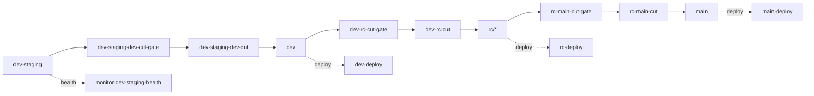

# Spec: Admin CI/CD Status Dashboard

> **위치**
> - Product docs: `docs/features/admin/cicd-status-dashboard/`
> - Client entry: partner app `More > CI/CD 상태`
> - Data API: Supabase Edge Function `ops-cicd-status`

## 목적

운영자가 현재 release flow 상태를 한 화면에서 확인한다. 브랜치별 PR gate, health monitor, cut gate, cut, deploy 워크플로우의 최신 상태와 `shared-notify`가 파일링한 `ci-failure` 이슈를 함께 보여줘서 "지금 어디가 막혔는지"를 빠르게 판단한다.

## CUJs

| ID | Priority | CUJ Name | Details | FR | NFR |
|----|----------|----------|---------|----|-----|
| 1-1 | P0 | 운영자가 CI/CD 상태 진입 | partner 앱 더보기에서 `CI/CD 상태` 진입 | FR-1, FR-2 | NFR-1 |
| 1-2 | P0 | 브랜치별 흐름 확인 | dev-staging → dev → rc → main 순서로 PR gate / cut gate / cut / deploy 상태를 그래프형 lane으로 확인 | FR-3, FR-4 | NFR-1, NFR-2 |
| 1-3 | P0 | 실패 원인 추적 | 실패한 workflow node를 탭해 GitHub Actions run으로 이동 | FR-5 | NFR-2 |
| 1-4 | P0 | 파일링된 이슈 확인 | 열린 `ci-failure` 이슈 목록과 라벨을 확인하고 GitHub issue로 이동 | FR-6 | NFR-2 |
| 1-5 | P1 | 최신 상태 갱신 | pull-to-refresh로 GitHub API 최신 상태 재조회 | FR-7 | NFR-2 |

## Functional Requirements

- **FR-1**: 화면은 관리자 운영 영역에 속한다. API는 `app_roles.role = super_admin` 사용자만 응답한다.
- **FR-2**: 앱 진입점은 partner 앱 `More > 설정 > CI/CD 상태`로 둔다. 향후 별도 admin 앱으로 분리해도 API/문서 구조는 유지한다.
- **FR-3**: 대시보드는 사전 정의된 workflow topology를 사용한다. GitHub Actions YAML을 런타임에 파싱하지 않는다.
- **FR-4**: 브랜치 lane은 `dev-staging`, `dev`, active `rc/*`, `main` 순서로 표시한다.
- **FR-5**: workflow node는 최신 run의 `status`, `conclusion`, run URL을 표시한다. workflow 파일이 없거나 run이 없으면 `unknown` 상태로 표시한다.
- **FR-6**: 이슈 목록은 열린 GitHub issue 중 `ci-failure` 라벨을 가진 항목을 최신 25개까지 표시한다.
- **FR-7**: pull-to-refresh는 Edge Function을 재호출한다. 클라이언트가 GitHub API를 직접 호출하지 않는다.
- **FR-8**: commit status는 `dev-staging-health/*`, `dev-soak/*`, `rc-soak/*`, 브랜치 prefix status를 보조 신호로 표시한다.

## Non-Functional Requirements

- **NFR-1**: 첫 로딩은 GitHub API 정상 응답 기준 p75 3초 이내.
- **NFR-2**: 새로고침 실패 시 기존 화면을 무한 로딩하지 않고 에러 상태와 재시도 버튼을 표시.
- **NFR-3**: GitHub token은 Supabase secret `GITHUB_ACCESS_TOKEN`에서만 읽는다. 클라이언트로 노출하지 않는다.
- **NFR-4**: 운영 대시보드는 read-only다. workflow rerun, branch mutation, issue close 같은 쓰기 액션은 제공하지 않는다.

## Edge Function Contract

`ops-cicd-status`

요청:

```http
GET /functions/v1/ops-cicd-status
Authorization: Bearer <user-jwt>
```

응답:

```json
{
  "success": true,
  "generated_at": "2026-05-24T01:00:00.000Z",
  "repository": "Mark-Yun/minglit",
  "branches": [
    {
      "key": "dev",
      "branch_name": "dev",
      "head_sha": "abcdef1...",
      "state": "success",
      "workflows": [
        {
          "key": "dev-deploy",
          "file": "dev-deploy.yml",
          "lane": "deploy",
          "label": "dev Deploy",
          "state": "success",
          "status": "completed",
          "conclusion": "success",
          "run_id": 123,
          "run_url": "https://github.com/...",
          "updated_at": "2026-05-24T00:55:00Z"
        }
      ],
      "commit_statuses": []
    }
  ],
  "issues": [
    {
      "number": 42,
      "title": "[P1-high] dev-deploy failed",
      "state": "open",
      "url": "https://github.com/Mark-Yun/minglit/issues/42",
      "labels": ["ci-failure", "P1-high"],
      "updated_at": "2026-05-24T00:57:00Z"
    }
  ]
}
```

## Topology



## Open Questions

- [ ] admin 전용 앱 분리 시점: partner 앱 내부 운영 메뉴 유지 vs 별도 Flutter/Web admin 앱.
- [ ] issue scope: `ci-failure` 전체 표시 vs 브랜치/워크플로우 라벨로 기본 필터링.
- [ ] run history: 최신 run 1개만 표시 vs 최근 5개 trend sparkline 표시.
