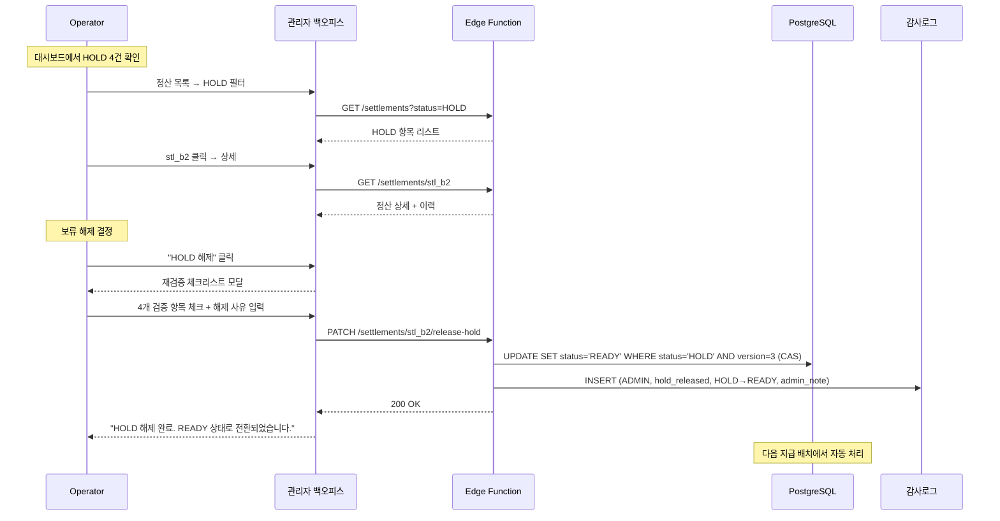
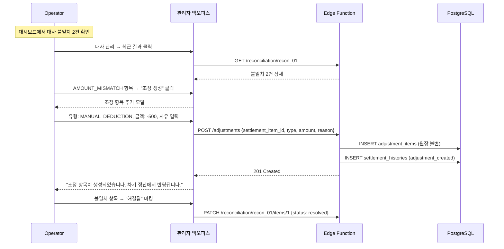
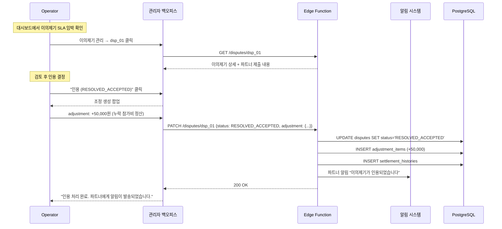

# 관리자 정산 백오피스 UI/UX 설계서

- **버전**: 1.0
- **작성일**: 2026. 03. 13.
- **기반 문서**: SRS v2.0 (requirements.md), Architecture v1.1 (architecture.md), 파트너 UI/UX 설계서 (ui-ux-design.md)
- **대상 플랫폼**: Next.js 웹 애플리케이션 (관리자 백오피스)

### 변경 이력

| 버전 | 일자 | 작성자 | 변경 내용 |
|------|------|--------|-----------|
| 1.0 | 2026.03.13 | — | 초안 작성. TO-BE 전체 범위 설계 |

---

## 목차

1. [설계 개요](#1-설계-개요)
2. [AS-IS 분석 및 플랫폼 결정](#2-as-is-분석-및-플랫폼-결정)
3. [정보 아키텍처](#3-정보-아키텍처)
4. [화면별 설계](#4-화면별-설계)
5. [권한 매트릭스](#5-권한-매트릭스)
6. [인터랙션 플로우](#6-인터랙션-플로우)
7. [알람 및 경보 시스템](#7-알람-및-경보-시스템)
8. [Phase별 구현 로드맵](#8-phase별-구현-로드맵)
9. [REQ 크로스 레퍼런스](#9-req-크로스-레퍼런스)

---

## 1. 설계 개요

### 1.1 목적

정산 시스템 운영자가 정산 파이프라인 전체를 모니터링하고, 이상 상황에 즉각 대응하며, 파트너 이의제기를 처리하고, 대사 결과를 관리할 수 있는 관리자 백오피스를 설계한다.

### 1.2 설계 원칙

| 원칙 | 설명 | 적용 방식 |
|------|------|----------|
| **한눈에 상황 파악 (At-a-Glance)** | 로그인 후 3초 내에 시스템 건강 상태를 파악할 수 있어야 한다 | KPI 카드, 헬스 인디케이터, 알람 배지 |
| **안전한 조작 (Safe Operations)** | 모든 수동 개입은 확인 → 실행 → 감사로그의 3단계를 거친다 | 확인 모달, 멱등키, actor 기록 |
| **추적 가능성 (Traceability)** | 누가, 언제, 왜 어떤 조작을 했는지 항상 추적 가능해야 한다 | 감사로그, admin_note 필수, 검색 가능 이력 |
| **최소 권한 (Least Privilege)** | 역할별로 필요한 최소 기능만 노출한다 | RBAC, 화면/버튼 레벨 권한 제어 |
| **긴급 대응 (Emergency Control)** | 위험 상황 시 1클릭으로 지급을 중단할 수 있어야 한다 | Kill Switch, 긴급 모드 |

### 1.3 대상 사용자

| 역할 | 설명 | 핵심 니즈 |
|------|------|----------|
| **super_admin** | 시스템 전체 관리 권한. Kill switch, 설정 변경 가능 | 전체 통제, 긴급 대응 |
| **operator** (신규) | 일상 정산 운영. 보류/차감, 이의제기 처리, 대사 확인 | 효율적 처리, SLA 준수 |
| **auditor** (신규) | 감사 전용. 읽기 전용, 로그/이력 조회 | 추적, 감사 보고서 |

---

## 2. AS-IS 분석 및 플랫폼 결정

### 2.1 AS-IS 관리자 현황

| 항목 | 현재 상태 |
|------|----------|
| 전용 관리자 앱 | ❌ 없음 |
| 관리자 기능 위치 | app_partner 내 입점 신청 관리만 |
| 정산 관리 | ❌ 읽기 전용 (파트너 앱에서 조회만) |
| DB 관리자 역할 | `app_roles`: super_admin, moderator |
| 보안 함수 | `is_super_admin()`, `has_partner_permission()` |
| 수동 정산 조작 | ❌ 미구현 (Supabase Dashboard 직접 접근 필요) |
| 모니터링 | Sentry (에러만), pg_cron (로그 제한적) |
| 대사 | ❌ 미구현 |
| 이의제기 처리 | ❌ 미구현 |

### 2.2 플랫폼 결정

| 옵션 | 장점 | 단점 | 판정 |
|------|------|------|------|
| **Next.js 웹 백오피스** | 복잡한 테이블/차트 표현 유리, 기존 Next.js 스택 활용, 데스크톱 최적 | 별도 앱 구축 필요 | ✅ **채택** |
| app_partner 확장 | 기존 앱에 추가, 코드 공유 | 모바일에서 관리 UI 부적합, 파트너/관리자 분리 필요 | ❌ |
| Flutter Web | 파트너 앱과 코드 공유 | 웹 테이블/차트 생태계 빈약 | ❌ |
| Retool/Low-code | 빠른 구축 | 커스터마이징 제한, 외부 의존성 | ❌ |

**결정**: `apps/admin_web/` (Next.js + TypeScript) 신규 구축

**기술 스택**:
- **프레임워크**: Next.js 14+ (App Router)
- **UI 라이브러리**: shadcn/ui (Radix + Tailwind)
- **차트**: Recharts 또는 Tremor
- **테이블**: TanStack Table (서버 사이드 페이지네이션)
- **상태 관리**: TanStack Query (서버 상태) + Zustand (클라이언트 상태)
- **인증**: Supabase Auth (GoTrue) — `is_super_admin()` 검증
- **배포**: Vercel (기존 랜딩과 동일)

---

## 3. 정보 아키텍처

### 3.1 사이드바 네비게이션

```
┌─────────────────────────────────┐
│ 🟢 밍글릿 정산 관리               │
│                                 │
│ 📊 대시보드                      │  ← 메인 홈
│                                 │
│ ── 정산 ──────────────────────  │
│ 📋 정산 목록                     │
│ ⚡ DLQ 관리                     │
│                                 │
│ ── 대사 ──────────────────────  │
│ 🔄 대사 관리                    │
│ 📈 대사 리포트                   │
│                                 │
│ ── 파트너 서비스 ─────────────  │
│ 📨 이의제기 관리                  │
│ 👥 파트너 관리                   │
│                                 │
│ ── 운영 ──────────────────────  │
│ 📅 영업일 캘린더                  │
│ ⚙️ 시스템 설정                   │
│ 🔑 웹훅 관리                    │
│                                 │
│ ── 감사 ──────────────────────  │
│ 📝 감사 로그                     │
│ 📊 SLA 리포트                   │
│                                 │
│ ── 긴급 ──────────────────────  │
│ 🚨 Kill Switch                  │
│                                 │
│ ─────────────────────────────  │
│ 👤 운영자명 (super_admin)        │
│ 로그아웃                         │
└─────────────────────────────────┘
```

### 3.2 레이아웃 구조

```
┌─────────┬─────────────────────────────────────────────────┐
│         │  🔔(3) 알람  │  🔍 검색  │  👤 운영자  │ 🚨 긴급 │
│ 사이드바  ├─────────────────────────────────────────────────┤
│ (240px) │                                                 │
│         │                                                 │
│         │              메인 콘텐츠 영역                      │
│         │              (가변 폭)                            │
│         │                                                 │
│         │                                                 │
│         │                                                 │
│         │                                                 │
│         │                                                 │
└─────────┴─────────────────────────────────────────────────┘
```

- **사이드바**: 고정 240px, 접을 수 있음 (아이콘 모드 64px)
- **헤더**: 알람 배지, 글로벌 검색, 사용자 정보, Kill Switch 긴급 버튼
- **메인**: 가변 폭, 패딩 24px
- **최소 해상도**: 1280×768 (데스크톱 전용)

### 3.3 라우팅 설계

| Route | Path | 설명 | Phase |
|-------|------|------|-------|
| Dashboard | `/` | 운영 대시보드 | Phase 1 |
| SettlementList | `/settlements` | 정산 목록 (필터/검색) | Phase 1 |
| SettlementDetail | `/settlements/:id` | 정산 상세 + 관리자 액션 | Phase 1 |
| DLQManagement | `/dlq` | DLQ 관리 | Phase 2 |
| ReconciliationList | `/reconciliation` | 대사 결과 목록 | Phase 2 |
| ReconciliationDetail | `/reconciliation/:id` | 대사 상세 + 불일치 해결 | Phase 2 |
| ReconciliationReport | `/reconciliation/report` | 대사 리포트 | Phase 2 |
| DisputeList | `/disputes` | 이의제기 목록 | Phase 1 |
| DisputeDetail | `/disputes/:id` | 이의제기 상세 + 처리 | Phase 1 |
| PartnerList | `/partners` | 파트너 목록 | Phase 1 |
| PartnerDetail | `/partners/:id` | 파트너 상세 (정산/계좌) | Phase 1 |
| BusinessCalendar | `/settings/calendar` | 영업일 관리 | Phase 2 |
| SystemSettings | `/settings/system` | 세율, 환불정책, 수수료 | Phase 2 |
| WebhookSettings | `/settings/webhook` | 웹훅 키 관리 | Phase 2 |
| AuditLog | `/audit` | 감사 로그 | Phase 1 |
| SLAReport | `/audit/sla` | SLA 준수율 리포트 | Phase 2 |
| KillSwitch | `/emergency` | 긴급 제어판 | Phase 1 |

---

## 4. 화면별 설계

### 4.1 운영 대시보드 (Dashboard)

#### 와이어프레임

```
┌──────────────────────────────────────────────────────────────┐
│ 운영 대시보드                              최종 갱신: 30초 전  │
├──────────────────────────────────────────────────────────────┤
│                                                              │
│ ┌─ 시스템 헬스 ───────────────────────────────────────────┐  │
│ │ 🟢 정상                                                 │  │
│ │ 마지막 성공 대사: 2026.03.13 22:15                       │  │
│ │ 마지막 성공 송금: 2026.03.13 14:32                       │  │
│ │ Kill Switch: OFF                                        │  │
│ └─────────────────────────────────────────────────────────┘  │
│                                                              │
│ ┌─ KPI 카드 ──────────────────────────────────────────────┐  │
│ │                                                          │  │
│ │ ┌──────────┐ ┌──────────┐ ┌──────────┐ ┌──────────┐    │  │
│ │ │ 오늘 지급  │ │ 지급 성공률│ │ 실패 건수  │ │ DLQ 적재  │    │  │
│ │ │ ₩12.5M   │ │ 98.7%    │ │ 3건      │ │ 12건     │    │  │
│ │ │ (23건)   │ │ ↑ 0.3%p  │ │ ↓ 2건    │ │ ⚠ 경고    │    │  │
│ │ └──────────┘ └──────────┘ └──────────┘ └──────────┘    │  │
│ │                                                          │  │
│ │ ┌──────────┐ ┌──────────┐ ┌──────────┐ ┌──────────┐    │  │
│ │ │ PENDING   │ │ HOLD     │ │ PROCESSING│ │ 대사 불일치│    │  │
│ │ │ 156건    │ │ 4건 ⚠    │ │ 8건      │ │ 2건      │    │  │
│ │ └──────────┘ └──────────┘ └──────────┘ └──────────┘    │  │
│ │                                                          │  │
│ └──────────────────────────────────────────────────────────┘  │
│                                                              │
│ ┌─ 지급 성공률 추이 (7일) ──────┐ ┌─ 실패 코드 Top 5 ──────┐  │
│ │ 100% ·─·─·─·─·─·     ·     │ │                          │  │
│ │  98% ·         ·─·─·       │ │ INVALID_ACCOUNT    45%   │  │
│ │  96% ·                     │ │ TIMEOUT            25%   │  │
│ │  94% ·                     │ │ INSUFFICIENT_FUND  15%   │  │
│ │      ─────────────────     │ │ NETWORK_ERROR      10%   │  │
│ │      7  6  5  4  3  2  1   │ │ OTHER               5%   │  │
│ └────────────────────────────┘ └──────────────────────────┘  │
│                                                              │
│ ┌─ 최근 알람 ─────────────────────────────────────────────┐  │
│ │ 🔴 14:32 DLQ depth > 100 (현재: 127건)                  │  │
│ │ 🟡 14:15 실패율 >1% (현재: 1.3%)                        │  │
│ │ 🟢 13:00 대사 완료 — 불일치 0건                          │  │
│ │ 🟡 09:30 SLA 지연 2건 (scheduled_at + 30분 초과)         │  │
│ └─────────────────────────────────────────────────────────┘  │
│                                                              │
│ ┌─ 긴급 조치 필요 ────────────────────────────────────────┐  │
│ │ ⚡ HOLD 4건 (24h 내 통지 SLA)                           │  │
│ │ ⚡ FAILED (non-retryable) 2건                           │  │
│ │ ⚡ 이의제기 미응답 1건 (ACKED SLA 임박)                   │  │
│ │                                    [ 전체 보기 → ]      │  │
│ └─────────────────────────────────────────────────────────┘  │
│                                                              │
└──────────────────────────────────────────────────────────────┘
```

#### 컴포넌트 스펙

**SystemHealthBanner**
- 3가지 상태: 🟢 정상 / 🟡 경고 / 🔴 위험
- 판정 기준: 알람 임계치(REQ-4.3.03) 기반
  - 실패율 >5% 또는 DLQ >1000 또는 Kill Switch ON → 🔴
  - 실패율 >1% 또는 DLQ >100 또는 SLA 지연 → 🟡
  - 그 외 → 🟢
- REQ-4.3.10: 마지막 성공 대사/송금 시각 표시

**KPICards** (2행 4열)
- 자동 갱신: 30초 간격 (TanStack Query refetchInterval)
- 전일 대비 변동: ↑/↓ + 수치 + 색상 (초록/빨강)
- 클릭 → 해당 목록 화면으로 이동
- REQ-4.3.02 메트릭 12개 중 핵심 8개 표시

**SuccessRateTrendChart** (7일 라인 차트)
- Y축: 94~100% (자동 스케일)
- 알람 임계 라인: 1% (경고, 점선 노랑), 5% (치명, 점선 빨강)
- 툴팁: 날짜, 성공률, 총 건수, 실패 건수

**FailureCodeChart** (도넛 또는 수평 바)
- Top 5 실패 코드 + "기타" 그룹핑
- 기간 선택기: 오늘 / 7일 / 30일
- 코드 클릭 → 해당 코드 필터된 정산 목록

**RecentAlarms** (최근 10건)
- 색상별 심각도: 🔴 치명 / 🟡 경고 / 🟢 정보
- 타임스탬프 + 메시지
- 클릭 → 관련 화면으로 이동

**UrgentActions** (즉시 조치 필요 항목)
- HOLD 통지 SLA 임박 (REQ-6.14: 24h 내)
- FAILED non-retryable 미처리
- 이의제기 응답 SLA 임박 (REQ-8.12)
- 대사 미해결 24h 초과 (REQ-4.4.10)

---

### 4.2 정산 관리 (Settlement Management)

#### 4.2.1 정산 목록

```
┌──────────────────────────────────────────────────────────────┐
│ 정산 목록                                                     │
├──────────────────────────────────────────────────────────────┤
│                                                              │
│ ┌─ 필터 바 ───────────────────────────────────────────────┐  │
│ │ 상태: [전체▼] 파트너: [전체▼] 기간: [2026.03▼]          │  │
│ │ 금액 범위: [___] ~ [___]  실패코드: [전체▼]              │  │
│ │ 검색: [정산ID / 이벤트명 / 파트너명...]         [초기화]  │  │
│ └─────────────────────────────────────────────────────────┘  │
│                                                              │
│ ┌─ 일괄 액션 바 (선택 시 표시) ───────────────────────────┐  │
│ │ ☑ 3건 선택  [일괄 HOLD] [일괄 HOLD 해제] [CSV 내보내기]  │  │
│ └─────────────────────────────────────────────────────────┘  │
│                                                              │
│ ┌─ 데이터 테이블 ─────────────────────────────────────────┐  │
│ │ ☐ │ ID      │ 파트너   │ 이벤트     │ 상태       │ 총매출  │  │
│ │   │         │         │           │           │ 정산금  │  │
│ │───┼─────────┼─────────┼───────────┼───────────┼────────│  │
│ │ ☐ │ stl_a1  │ 홍길동   │ 봄맞이파티  │ 🟣 READY   │ ₩200K │  │
│ │   │         │         │ 03.01     │           │ ₩156K │  │
│ │───┼─────────┼─────────┼───────────┼───────────┼────────│  │
│ │ ☐ │ stl_b2  │ 김철수   │ 주말브런치  │ 🔴 HOLD    │ ₩150K │  │
│ │   │         │         │ 03.08     │ 환불검토   │ ₩85K  │  │
│ │───┼─────────┼─────────┼───────────┼───────────┼────────│  │
│ │ ☐ │ stl_c3  │ 이영희   │ 네트워킹   │ 🔴 FAILED  │ ₩500K │  │
│ │   │         │         │ 03.10     │ 계좌오류   │ ₩320K │  │
│ │───┼─────────┼─────────┼───────────┼───────────┼────────│  │
│ │ ☐ │ stl_d4  │ 박지민   │ 와인테이스팅│ ✅ COMPLETED│ ₩300K │  │
│ │   │         │         │ 02.28     │ 03.15지급  │ ₩245K │  │
│ └─────────────────────────────────────────────────────────┘  │
│                                                              │
│  ◀ 1 2 3 ... 15 ▶   │ 20건/페이지 ▼│ 총 291건               │
│                                                              │
└──────────────────────────────────────────────────────────────┘
```

#### 4.2.2 정산 상세 (관리자 뷰)

```
┌──────────────────────────────────────────────────────────────┐
│ ← 정산 목록  │  정산 상세: stl_b2                              │
├──────────────────────────────────────────────────────────────┤
│                                                              │
│ ┌─ 정산 헤더 ─────────────────────────────────────────────┐  │
│ │                                                          │  │
│ │  🔴 HOLD                      파트너: 김철수 (ptr_xyz)   │  │
│ │  보류 사유: 환불 검토 (DISPUTE) 이벤트: 주말 브런치        │  │
│ │  보류 시작: 2026.03.10 15:30  이벤트일: 2026.03.08       │  │
│ │  version: 3                                              │  │
│ │                                                          │  │
│ │  [ HOLD 해제 ]  [ 상태 변경 ▼ ]  [ 조정 항목 추가 ]       │  │
│ │  [ 수동 지급 트리거 ]                                     │  │
│ │                                                          │  │
│ └──────────────────────────────────────────────────────────┘  │
│                                                              │
│ ┌─ 탭: [금액 상세] [상태 이력] [조정 항목] [이의제기] ─────┐  │
│ │                                                          │  │
│ │  ── 금액 상세 탭 ──                                      │  │
│ │                                                          │  │
│ │  총 매출              ₩150,000                           │  │
│ │  참가비 15명 × ₩10,000                                   │  │
│ │                                                          │  │
│ │  차감                                                    │  │
│ │  PG 수수료 (3.5%)              ▼₩5,250                  │  │
│ │  플랫폼 수수료 (5.0%)          ▼₩7,500                  │  │
│ │  부가세 (10%)                  ▼₩12,750                  │  │
│ │  환불 차감 (전액환불 2건)        ▼₩20,000                  │  │
│ │  ────────────────────────────────────                    │  │
│ │  정산 금액                      ₩104,500                  │  │
│ │                                                          │  │
│ │  고급 정보                                               │  │
│ │  calc_checksum: a3f2b8c1d4e5...  [복사]                 │  │
│ │  calc_version: v1                                        │  │
│ │  source_type: event_application                          │  │
│ │  source_id: ea_xyz123                                    │  │
│ │                                                          │  │
│ │  ── 상태 이력 탭 ──                                      │  │
│ │                                                          │  │
│ │  시각            │ 전이           │ 행위자    │ 메모       │  │
│ │  ────────────────┼───────────────┼─────────┼──────────  │  │
│ │  03.10 15:30    │ READY→HOLD    │ ADMIN   │ 환불 분쟁   │  │
│ │                 │               │ admin@  │ 검토 필요   │  │
│ │  03.08 03:00    │ PENDING→READY │ SYSTEM  │ 14일 경과   │  │
│ │  03.01 19:30    │ [*]→PENDING   │ TRIGGER │ 이벤트 완료 │  │
│ │                                                          │  │
│ │  ── 조정 항목 탭 ──                                      │  │
│ │                                                          │  │
│ │  ID      │ 유형    │ 금액       │ 사유     │ 일시        │  │
│ │  ────────┼────────┼───────────┼────────┼────────────  │  │
│ │  adj_01  │ REFUND │ ▼₩10,000  │ 전액환불 │ 03.09 10:00│  │
│ │  adj_02  │ REFUND │ ▼₩10,000  │ 전액환불 │ 03.09 14:30│  │
│ │                                                          │  │
│ │  합계: ▼₩20,000                                         │  │
│ │                                                          │  │
│ └──────────────────────────────────────────────────────────┘  │
│                                                              │
└──────────────────────────────────────────────────────────────┘
```

#### 관리자 액션 모달들

**HOLD 적용 모달** (REQ-3.2.08, 3.2.23)

```
┌──────────────────────────────────────┐
│ 정산 보류 (HOLD) 적용                  │
├──────────────────────────────────────┤
│                                      │
│  대상: stl_b2 (김철수 · 주말 브런치)   │
│  현재 상태: READY                     │
│                                      │
│  보류 사유 *                          │
│  ┌────────────────────────────────┐ │
│  │ DISPUTE (분쟁)              ▼  │ │
│  └────────────────────────────────┘ │
│  사유 코드:                          │
│  · COMPLIANCE (법규 준수)            │
│  · DISPUTE (분쟁)                    │
│  · BANK_INFO_MISSING (계좌 미등록)    │
│  · BANK_INFO_INVALID (계좌 오류)     │
│  · MANUAL_REVIEW (수동 검토)         │
│  · FRAUD_SUSPECTED (사기 의심)       │
│                                      │
│  상세 사유 *                          │
│  ┌────────────────────────────────┐ │
│  │ 파트너 환불 분쟁 건으로 인한       │ │
│  │ 보류 조치. 환불 검토 완료 후       │ │
│  │ 해제 예정.                       │ │
│  └────────────────────────────────┘ │
│                                      │
│  ⚠ 이 작업은 감사로그에 기록됩니다.    │
│     행위자: admin@minglit.com        │
│                                      │
│  [ 취소 ]              [ HOLD 적용 ] │
│                                      │
└──────────────────────────────────────┘
```

**HOLD 해제 모달** (REQ-3.2.24)

```
┌──────────────────────────────────────┐
│ 보류 (HOLD) 해제                      │
├──────────────────────────────────────┤
│                                      │
│  대상: stl_b2 (김철수 · 주말 브런치)   │
│  보류 사유: DISPUTE (분쟁)            │
│                                      │
│  ── 재검증 결과 ──                    │
│  ☑ 계좌 스냅샷 유효                    │
│  ☑ 금액/요율 범위 정상                 │
│  ☑ 체크섬 일치                        │
│  ☐ 지급 가능 캘린더 확인               │
│    ⚠ 영업일 확인 필요                  │
│                                      │
│  해제 사유 *                          │
│  ┌────────────────────────────────┐ │
│  │ 환불 분쟁 검토 완료.              │ │
│  │ 파트너와 합의 도달.              │ │
│  └────────────────────────────────┘ │
│                                      │
│  해제 후 상태: READY                  │
│                                      │
│  ⚠ 모든 검증 항목을 통과해야           │
│     해제할 수 있습니다.                │
│                                      │
│  [ 취소 ]             [ HOLD 해제 ]  │
│                                      │
└──────────────────────────────────────┘
```

**조정 항목 추가 모달** (REQ-5.3.21~23)

```
┌──────────────────────────────────────┐
│ 조정 항목 (Adjustment) 추가            │
├──────────────────────────────────────┤
│                                      │
│  대상 정산: stl_b2                    │
│                                      │
│  조정 유형 *                          │
│  ┌────────────────────────────────┐ │
│  │ MANUAL_DEDUCTION (수동 차감) ▼  │ │
│  └────────────────────────────────┘ │
│  · REFUND (환불)                     │
│  · CHARGEBACK (차지백)               │
│  · MANUAL_DEDUCTION (수동 차감)      │
│  · MANUAL_ADDITION (수동 가산)       │
│  · DISPUTE_RESOLUTION (분쟁 해결)    │
│                                      │
│  금액 * (원 단위)                     │
│  ┌────────────────────────────────┐ │
│  │ -15,000                        │ │
│  └────────────────────────────────┘ │
│  음수 = 차감 / 양수 = 가산 (0 불가)   │
│                                      │
│  사유 코드 *                          │
│  ┌────────────────────────────────┐ │
│  │ PARTIAL_REFUND              ▼  │ │
│  └────────────────────────────────┘ │
│                                      │
│  상세 사유 *                          │
│  ┌────────────────────────────────┐ │
│  │ 파트너 요청에 의한 부분 환불.      │ │
│  │ 참가자 1명 × ₩15,000 차감.      │ │
│  └────────────────────────────────┘ │
│                                      │
│  근거 링크 (선택)                     │
│  ┌────────────────────────────────┐ │
│  │ https://...                    │ │
│  └────────────────────────────────┘ │
│                                      │
│  ⚠ 원장은 수정되지 않습니다.           │
│     조정 항목이 별도 생성됩니다.        │
│                                      │
│  [ 취소 ]           [ 조정 생성 ]     │
│                                      │
└──────────────────────────────────────┘
```

**수동 지급 트리거 모달** (REQ-4.6.09)

```
┌──────────────────────────────────────┐
│ ⚠ 수동 지급 트리거                     │
├──────────────────────────────────────┤
│                                      │
│  대상: stl_b2 (READY 상태)            │
│  파트너: 김철수                        │
│  지급 금액: ₩104,500                  │
│  지급 계좌: 국민은행 ****1234          │
│                                      │
│  ⚠ 수동 지급은 스케줄 외 즉시           │
│    실행됩니다. 멱등키가 자동 생성됩니다.  │
│                                      │
│  멱등키: manual_payout:stl_b2:{ts}    │
│                                      │
│  사유 *                               │
│  ┌────────────────────────────────┐ │
│  │ 파트너 긴급 요청에 의한            │ │
│  │ 수동 지급 트리거.                 │ │
│  └────────────────────────────────┘ │
│                                      │
│  [ 취소 ]           [ 지급 실행 ]     │
│                                      │
└──────────────────────────────────────┘
```

---

### 4.3 DLQ 관리 (Phase 2)

```
┌──────────────────────────────────────────────────────────────┐
│ DLQ 관리                                       적재: 127건   │
├──────────────────────────────────────────────────────────────┤
│                                                              │
│ ┌─ 필터 바 ───────────────────────────────────────────────┐  │
│ │ 실패 유형: [전체▼]  기간: [최근 7일▼]  파트너: [전체▼]    │  │
│ └─────────────────────────────────────────────────────────┘  │
│                                                              │
│ ┌─ 일괄 액션 ─────────────────────────────────────────────┐  │
│ │ ☑ 5건 선택  [일괄 Replay]  [일괄 영구 실패 확정]         │  │
│ └─────────────────────────────────────────────────────────┘  │
│                                                              │
│ ┌─────────────────────────────────────────────────────────┐  │
│ │ ☐ │ ID      │ 파트너  │ 금액     │ 실패코드      │ 재시도│  │
│ │   │         │        │         │ 최종실패시각    │ 횟수  │  │
│ │───┼─────────┼────────┼─────────┼──────────────┼──────│  │
│ │ ☐ │ stl_x1  │ 홍길동  │ ₩150K  │ INVALID_ACCT │ 8/8  │  │
│ │   │         │        │         │ 03.13 08:30  │      │  │
│ │   │         │        │         │              │      │  │
│ │   │ 마지막 시도: 국민 ****5678                          │  │
│ │   │ [ Replay ]  [ 영구 실패 ]  [ 상세 → ]              │  │
│ │───┼─────────┼────────┼─────────┼──────────────┼──────│  │
│ │ ☐ │ stl_x2  │ 박지민  │ ₩320K  │ TIMEOUT      │ 8/8  │  │
│ │   │         │        │         │ 03.12 22:15  │      │  │
│ │   │                                                    │  │
│ │   │ [ Replay ]  [ 영구 실패 ]  [ 상세 → ]              │  │
│ └─────────────────────────────────────────────────────────┘  │
│                                                              │
│  ⚠ Replay 실행 시 멱등키가 자동 생성됩니다 (REQ-4.5.05)      │
│  ⚠ Replay는 super_admin 권한이 필요합니다.                    │
│                                                              │
└──────────────────────────────────────────────────────────────┘
```

---

### 4.4 대사 관리 (Phase 2)

#### 4.4.1 대사 결과 목록

```
┌──────────────────────────────────────────────────────────────┐
│ 대사 관리                                                     │
├──────────────────────────────────────────────────────────────┤
│                                                              │
│ ┌─ 대사 실행 현황 ────────────────────────────────────────┐  │
│ │ 마지막 Daily 대사: 2026.03.13 22:00 (✅ 완료)           │  │
│ │ 마지막 Payout 대사: 2026.03.13 15:32 (✅ 완료)          │  │
│ │ 다음 Daily 대사: 2026.03.14 22:00 (예정)                │  │
│ │                                                          │  │
│ │ [ 수동 대사 실행 ]                                       │  │
│ └──────────────────────────────────────────────────────────┘  │
│                                                              │
│ ┌─ 대사 결과 테이블 ──────────────────────────────────────┐  │
│ │ 일시           │ 유형   │ 매칭  │ 불일치│ 상태   │ 상세  │  │
│ │────────────────┼───────┼──────┼──────┼───────┼──────│  │
│ │ 03.13 22:00   │ Daily │ 142  │ 2    │ 미해결 │  →   │  │
│ │ 03.13 15:32   │ Payout│ 23   │ 0    │ 완료   │  →   │  │
│ │ 03.12 22:00   │ Daily │ 138  │ 0    │ 완료   │  →   │  │
│ │ 03.12 14:45   │ Payout│ 19   │ 1    │ 해결됨 │  →   │  │
│ └──────────────────────────────────────────────────────────┘  │
│                                                              │
└──────────────────────────────────────────────────────────────┘
```

#### 4.4.2 대사 상세 (불일치 해결)

```
┌──────────────────────────────────────────────────────────────┐
│ ← 대사 목록  │  대사 상세: 2026.03.13 Daily                   │
├──────────────────────────────────────────────────────────────┤
│                                                              │
│ ┌─ 대사 요약 ─────────────────────────────────────────────┐  │
│ │ 실행: 2026.03.13 22:00:15                                │  │
│ │ 소스: PG정산(142) + 내부원장(144) + 지급내역(23)          │  │
│ │ 매칭: 142건 ✅  │  불일치: 2건 ⚠                         │  │
│ │ 원본 해시: sha256:a3f2...  처리 버전: recon_v1           │  │
│ └──────────────────────────────────────────────────────────┘  │
│                                                              │
│ ┌─ 불일치 항목 ───────────────────────────────────────────┐  │
│ │                                                          │  │
│ │ ⚠ #1 MISSING_IN_LEDGER                                  │  │
│ │ ┌──────────────────────────────────────────────────────┐ │  │
│ │ │ PG 정산: txn_abc123 / ₩30,000 / 2026.03.13          │ │  │
│ │ │ 내부 원장: (해당 없음)                                 │ │  │
│ │ │                                                      │ │  │
│ │ │ 담당자: (미배정)                                      │ │  │
│ │ │ 1차 조치 기한: 2026.03.14 22:00 (24h 이내)            │ │  │
│ │ │                                                      │ │  │
│ │ │ [ 담당자 배정 ]  [ 조정 생성 ]  [ 무시 (사유 입력) ]   │ │  │
│ │ └──────────────────────────────────────────────────────┘ │  │
│ │                                                          │  │
│ │ ⚠ #2 AMOUNT_MISMATCH                                    │  │
│ │ ┌──────────────────────────────────────────────────────┐ │  │
│ │ │ PG 정산: txn_def456 / ₩50,000                        │ │  │
│ │ │ 내부 원장: stl_g7 / ₩49,500                          │ │  │
│ │ │ 차이: ₩500 (PG 수수료 차이 추정)                      │ │  │
│ │ │                                                      │ │  │
│ │ │ 담당자: (미배정)                                      │ │  │
│ │ │ 1차 조치 기한: 2026.03.14 22:00                       │ │  │
│ │ │                                                      │ │  │
│ │ │ [ 담당자 배정 ]  [ 조정 생성 ]  [ 무시 (사유 입력) ]   │ │  │
│ │ └──────────────────────────────────────────────────────┘ │  │
│ │                                                          │  │
│ └──────────────────────────────────────────────────────────┘  │
│                                                              │
└──────────────────────────────────────────────────────────────┘
```

불일치 유형 (REQ-4.4.04):

| 유형 | 라벨 | 색상 | 설명 |
|------|------|------|------|
| `MISSING_IN_PG` | PG 누락 | 🔴 | 내부 원장에 있지만 PG 리포트에 없음 |
| `MISSING_IN_LEDGER` | 원장 누락 | 🔴 | PG 리포트에 있지만 내부 원장에 없음 |
| `MISSING_IN_BANK` | 지급 누락 | 🔴 | 내부 COMPLETED인데 은행 입출금 없음 |
| `AMOUNT_MISMATCH` | 금액 불일치 | 🟡 | 양측 존재하나 금액 차이 |
| `DUPLICATE` | 중복 | 🟡 | 동일 거래 2건 이상 매칭 |
| `DATE_SHIFT` | 날짜 차이 | 🟢 | 양측 존재하나 날짜 1영업일 차이 |

---

### 4.5 이의제기 관리 (Dispute Management)

```
┌──────────────────────────────────────────────────────────────┐
│ 이의제기 관리                                  미처리: 3건    │
├──────────────────────────────────────────────────────────────┤
│                                                              │
│ ┌─ 필터 ──────────────────────────────────────────────────┐  │
│ │ 상태: [전체▼]  SLA: [전체▼]  기간: [최근 30일▼]          │  │
│ └─────────────────────────────────────────────────────────┘  │
│                                                              │
│ ┌─────────────────────────────────────────────────────────┐  │
│ │ ID      │ 파트너 │ 대상정산│ 유형    │ 상태         │ SLA │  │
│ │─────────┼───────┼───────┼────────┼─────────────┼─────│  │
│ │ dsp_01  │ 홍길동 │stl_a1 │금액오류 │ 🟡 UNDER_   │ D-3 │  │
│ │         │       │       │        │   REVIEW    │     │  │
│ │─────────┼───────┼───────┼────────┼─────────────┼─────│  │
│ │ dsp_02  │ 김철수 │stl_b2 │보류이의 │ 🔵 SUBMITTED│ D-1 │  │
│ │         │       │       │        │ ⚠ ACKED필요 │     │  │
│ │─────────┼───────┼───────┼────────┼─────────────┼─────│  │
│ │ dsp_03  │ 이영희 │stl_c3 │지급실패 │ 🟠 NEED_    │ 5일 │  │
│ │         │       │       │        │   INFO      │남음  │  │
│ └─────────────────────────────────────────────────────────┘  │
│                                                              │
└──────────────────────────────────────────────────────────────┘
```

#### 이의제기 상세 (관리자 처리)

```
┌──────────────────────────────────────────────────────────────┐
│ ← 이의제기 목록  │  이의제기: dsp_01                           │
├──────────────────────────────────────────────────────────────┤
│                                                              │
│ ┌─ 상태 타임라인 ─────────────────────────────────────────┐  │
│ │ ✓ SUBMITTED   03.20 14:30   파트너 제출                  │  │
│ │ ✓ ACKED       03.21 10:00   자동 접수 (1영업일 이내 ✅)   │  │
│ │ ◉ UNDER_REVIEW 03.21 10:15  담당자: admin@minglit.com   │  │
│ │ ○ 결론         — (D-3)      기한: 03.28까지             │  │
│ └──────────────────────────────────────────────────────────┘  │
│                                                              │
│ ┌─ 이의제기 내용 ─────────────────────────────────────────┐  │
│ │ 유형: 금액 오류                                          │  │
│ │ 대상: stl_a1 (봄맞이 와인파티)                            │  │
│ │                                                          │  │
│ │ 내용:                                                    │  │
│ │ "참가비가 ₩15,000인데 ₩10,000으로 계산되었습니다.         │  │
│ │  이벤트 설정 스크린샷을 첨부합니다."                       │  │
│ │                                                          │  │
│ │ 첨부: event_screenshot.png (320KB)  [보기]               │  │
│ └──────────────────────────────────────────────────────────┘  │
│                                                              │
│ ┌─ 관리자 메모 ───────────────────────────────────────────┐  │
│ │ [03.21 10:15] admin@: 이벤트 설정 확인 중                │  │
│ │ [03.22 09:00] admin@: 이벤트 DB 확인 결과                │  │
│ │               event_applications.amount = 15000 확인     │  │
│ │               settlements.total_sales = 200000 (정상)     │  │
│ │               계산 오류 아닌 것으로 판단                   │  │
│ │                                                          │  │
│ │ ┌──────────────────────────────────────────────────────┐ │  │
│ │ │ 메모 추가...                                         │ │  │
│ │ └──────────────────────────────────────────────────────┘ │  │
│ │ [ 메모 저장 ]                                            │  │
│ └──────────────────────────────────────────────────────────┘  │
│                                                              │
│ ┌─ 액션 ──────────────────────────────────────────────────┐  │
│ │                                                          │  │
│ │ [ 추가 정보 요청 (NEED_INFO) ]                           │  │
│ │                                                          │  │
│ │ [ ✅ 인용 (RESOLVED_ACCEPTED) ]                          │  │
│ │   → adjustment_items 생성 팝업                           │  │
│ │                                                          │  │
│ │ [ ❌ 기각 (RESOLVED_REJECTED) ]                          │  │
│ │   → 기각 사유 입력 팝업                                  │  │
│ │                                                          │  │
│ └──────────────────────────────────────────────────────────┘  │
│                                                              │
└──────────────────────────────────────────────────────────────┘
```

---

### 4.6 감사 로그 (Audit Log)

```
┌──────────────────────────────────────────────────────────────┐
│ 감사 로그                                                     │
├──────────────────────────────────────────────────────────────┤
│                                                              │
│ ┌─ 필터 ──────────────────────────────────────────────────┐  │
│ │ 행위자: [전체▼]  이벤트 유형: [전체▼]  기간: [오늘▼]      │  │
│ │ 대상 ID: [검색...]  행위자 유형: [전체▼]                  │  │
│ │                  (ADMIN / SYSTEM / TRIGGER / PARTNER)     │  │
│ └─────────────────────────────────────────────────────────┘  │
│                                                              │
│ ┌─────────────────────────────────────────────────────────┐  │
│ │ 시각            │ 행위자     │ 이벤트        │ 대상      │  │
│ │─────────────────┼──────────┼──────────────┼──────────│  │
│ │ 03.13 15:30:12 │ ADMIN     │ hold_applied  │ stl_b2   │  │
│ │                │ admin@... │ READY→HOLD    │          │  │
│ │                │           │ 사유: DISPUTE  │          │  │
│ │─────────────────┼──────────┼──────────────┼──────────│  │
│ │ 03.13 14:32:45 │ SYSTEM    │ payout_      │ stl_d4   │  │
│ │                │ payout_job│ succeeded    │          │  │
│ │                │           │ PROCESSING→  │          │  │
│ │                │           │ COMPLETED    │          │  │
│ │─────────────────┼──────────┼──────────────┼──────────│  │
│ │ 03.13 03:00:01 │ SYSTEM    │ calc_        │ stl_e5   │  │
│ │                │ pg_cron   │ succeeded    │          │  │
│ │                │           │ PENDING→READY│          │  │
│ └─────────────────────────────────────────────────────────┘  │
│                                                              │
│  ◀ 1 2 3 ... 50 ▶   │ 50건/페이지 ▼│ 총 2,341건             │
│                                                              │
│  [ CSV 내보내기 ]                                             │
│                                                              │
└──────────────────────────────────────────────────────────────┘
```

REQ-5.2.03 필수 필드: `actor_type`, `actor_id`, `event_type`, `from_status`, `to_status`, `details`, `timestamp`
REQ-5.2.07: `actor_type + actor_id` 인덱스로 관리자별 검색 최적화
REQ-5.2.08: 개인정보 평문 저장 금지 (account_last4만 허용)

---

### 4.7 운영 설정

#### 4.7.1 영업일 캘린더 (Phase 2)

```
┌──────────────────────────────────────────────────────────────┐
│ 영업일 캘린더                                                 │
├──────────────────────────────────────────────────────────────┤
│                                                              │
│         ◀  2026년 3월  ▶                                     │
│                                                              │
│  일    월    화    수    목    금    토                        │
│  ──── ──── ──── ──── ──── ──── ────                         │
│  1    2    3    4    5    6    7                              │
│  🔴   ●    ●    ●    ●    ●    🔴                            │
│                                                              │
│  8    9    10   11   12   13   14                             │
│  🔴   ●    ●    ●    ●    ●    🔴                            │
│                                                              │
│  15   16   17   18   19   20   21                             │
│  🔴   ●    ●    🔴   ●    ●    🔴                            │
│            (공휴일)                                           │
│                                                              │
│  ● = 영업일 (지급 가능)                                       │
│  🔴 = 비영업일 (주말/공휴일)                                   │
│                                                              │
│ ┌─ 비영업일 관리 ─────────────────────────────────────────┐  │
│ │ 날짜       │ 유형     │ 사유           │ 액션           │  │
│ │ 03.17 (수) │ 공휴일   │ 삼일절 대체휴일  │ [삭제]        │  │
│ │ 03.24 (수) │ 점검     │ 은행 시스템 점검 │ [삭제]        │  │
│ │                                                          │  │
│ │ [ + 비영업일 추가 ]                                       │  │
│ └──────────────────────────────────────────────────────────┘  │
│                                                              │
│  은행 점검 시간대: 23:30 ~ 00:30 (매일, 자동 이월)            │
│  [ 점검 시간 설정 ]                                           │
│                                                              │
└──────────────────────────────────────────────────────────────┘
```

#### 4.7.2 시스템 설정 (Phase 2)

```
┌──────────────────────────────────────────────────────────────┐
│ 시스템 설정                                                   │
├──────────────────────────────────────────────────────────────┤
│                                                              │
│ ┌─ 수수료 설정 ───────────────────────────────────────────┐  │
│ │                                                          │  │
│ │  기본 PG 수수료율       [  3.5  ] %                      │  │
│ │  기본 플랫폼 수수료율    [  5.0  ] %                      │  │
│ │  기본 부가세율          [ 10.0  ] %                      │  │
│ │                                                          │  │
│ │  ⚠ 변경 시 신규 정산부터 적용됩니다.                      │  │
│ │     기존 정산의 스냅샷은 유지됩니다.                       │  │
│ │                                                          │  │
│ │  [ 저장 ]                                                │  │
│ └──────────────────────────────────────────────────────────┘  │
│                                                              │
│ ┌─ 세율 규칙 (REQ-7.09) ─────────────────────────────────┐  │
│ │ 파트너 유형     │ 거래 유형│ VAT율│ 액션                   │  │
│ │ TAXABLE        │ PAYMENT │ 10%  │ [편집] [삭제]          │  │
│ │ ZERO_RATED     │ PAYMENT │ 0%   │ [편집] [삭제]          │  │
│ │ EXEMPT         │ PAYMENT │ 0%   │ [편집] [삭제]          │  │
│ │ SIMPLIFIED     │ PAYMENT │ 4%   │ [편집] [삭제]          │  │
│ │ CORPORATE      │ PAYMENT │ 10%  │ [편집] [삭제]          │  │
│ │ [ + 규칙 추가 ]                                          │  │
│ └──────────────────────────────────────────────────────────┘  │
│                                                              │
│ ┌─ 환불 정책 (REQ-6.04) ─────────────────────────────────┐  │
│ │ 마감 시간 (시간 전)  │ 환불 수수료율│ 액션                │  │
│ │ 72h 이상           │ 0%          │ [편집]               │  │
│ │ 24h ~ 72h          │ 10%         │ [편집]               │  │
│ │ 24h 미만           │ 50%         │ [편집]               │  │
│ │ 이벤트 후           │ 100%        │ [편집]               │  │
│ └──────────────────────────────────────────────────────────┘  │
│                                                              │
│ ┌─ 정산 설정 ─────────────────────────────────────────────┐  │
│ │ 보류 기간              [ 14 ] 일                         │  │
│ │ 재시도 최대 횟수        [  8 ] 회                         │  │
│ │ 재시도 백오프 기본      [ 60 ] 초                         │  │
│ │ PROCESSING 타임아웃    [  2 ] 시간                       │  │
│ │ SLA 지연 임계          [ 30 ] 분                         │  │
│ └──────────────────────────────────────────────────────────┘  │
│                                                              │
└──────────────────────────────────────────────────────────────┘
```

---

### 4.8 Kill Switch / 긴급 제어판

```
┌──────────────────────────────────────────────────────────────┐
│ 🚨 긴급 제어판                                                │
├──────────────────────────────────────────────────────────────┤
│                                                              │
│ ┌─ Kill Switch ───────────────────────────────────────────┐  │
│ │                                                          │  │
│ │  지급 중단 스위치                                        │  │
│ │                                                          │  │
│ │  ┌──────────────────────────────────────────────────┐   │  │
│ │  │                                                  │   │  │
│ │  │      현재 상태: 🟢 OFF (정상 운영 중)               │   │  │
│ │  │                                                  │   │  │
│ │  │              [ 🔴 지급 중단 ]                      │   │  │
│ │  │                                                  │   │  │
│ │  └──────────────────────────────────────────────────┘   │  │
│ │                                                          │  │
│ │  활성화 시 동작 (REQ-4.6.10):                            │  │
│ │  · READY → PROCESSING 신규 전이 금지                    │  │
│ │  · 기존 PROCESSING 건은 안전 종료 (완료까지 진행)         │  │
│ │  · 모든 관리자에게 알림 발송                              │  │
│ │                                                          │  │
│ │  ⚠ super_admin 권한이 필요합니다.                        │  │
│ │  ⚠ 활성화/비활성화 모두 감사로그에 기록됩니다.             │  │
│ │                                                          │  │
│ └──────────────────────────────────────────────────────────┘  │
│                                                              │
│ ┌─ Kill Switch 이력 ──────────────────────────────────────┐  │
│ │ 시각              │ 행위자    │ 액션    │ 사유           │  │
│ │───────────────────┼─────────┼────────┼───────────────│  │
│ │ 03.10 15:30      │ admin@  │ ON     │ 대사 불일치 급증│  │
│ │ 03.10 17:45      │ admin@  │ OFF    │ 원인 파악 완료  │  │
│ │ 02.28 09:00      │ admin@  │ ON     │ 은행 장애      │  │
│ │ 02.28 12:30      │ admin@  │ OFF    │ 장애 복구 확인  │  │
│ └──────────────────────────────────────────────────────────┘  │
│                                                              │
│ ┌─ 현재 PROCESSING 건 ───────────────────────────────────┐  │
│ │ stl_f1 (박지민 / ₩245K) — 시작: 11:00, 경과: 3h 30m    │  │
│ │ stl_f2 (최수진 / ₩180K) — 시작: 11:15, 경과: 3h 15m    │  │
│ │                                                          │  │
│ │ Kill Switch ON 시 위 건들은 완료까지 계속 진행됩니다.      │  │
│ └──────────────────────────────────────────────────────────┘  │
│                                                              │
└──────────────────────────────────────────────────────────────┘
```

Kill Switch 활성화 확인 모달:

```
┌──────────────────────────────────────┐
│ 🚨 지급 중단 확인                      │
├──────────────────────────────────────┤
│                                      │
│  ⚠ 지급을 즉시 중단하시겠습니까?       │
│                                      │
│  영향 범위:                           │
│  · READY 상태 156건 지급 보류          │
│  · PROCESSING 2건은 완료까지 진행      │
│  · 신규 지급 전이 차단                 │
│                                      │
│  중단 사유 *                          │
│  ┌────────────────────────────────┐ │
│  │                                │ │
│  └────────────────────────────────┘ │
│                                      │
│  확인을 위해 "지급중단"을 입력하세요:   │
│  ┌────────────────────────────────┐ │
│  │                                │ │
│  └────────────────────────────────┘ │
│                                      │
│  [ 취소 ]          [ 🔴 지급 중단 ]  │
│                                      │
└──────────────────────────────────────┘
```

---

## 5. 권한 매트릭스

### 5.1 역할 정의

| 역할 | DB 매핑 | 설명 |
|------|---------|------|
| **super_admin** | `app_roles.role = 'super_admin'` | 전체 관리 권한. Kill Switch, 설정 변경, DLQ replay |
| **operator** | `app_roles.role = 'moderator'` (확장) | 일상 운영. 보류/차감, 이의제기, 대사 확인 |
| **auditor** | 신규 역할 추가 필요 | 읽기 전용. 감사로그, 리포트 조회 |

### 5.2 화면/액션별 접근 제어

| 화면/액션 | super_admin | operator | auditor |
|---------|:-----------:|:--------:|:-------:|
| 대시보드 (읽기) | ✅ | ✅ | ✅ |
| 정산 목록/상세 (읽기) | ✅ | ✅ | ✅ |
| HOLD 적용/해제 | ✅ | ✅ | ❌ |
| 조정 항목 생성 | ✅ | ✅ | ❌ |
| 수동 지급 트리거 | ✅ | ❌ | ❌ |
| DLQ Replay | ✅ | ❌ | ❌ |
| DLQ 영구 실패 | ✅ | ✅ | ❌ |
| 대사 결과 (읽기) | ✅ | ✅ | ✅ |
| 대사 수동 실행 | ✅ | ❌ | ❌ |
| 대사 불일치 해결 | ✅ | ✅ | ❌ |
| 이의제기 처리 | ✅ | ✅ | ❌ |
| 이의제기 (읽기) | ✅ | ✅ | ✅ |
| 파트너 관리 | ✅ | ✅ | ❌ |
| 영업일 캘린더 편집 | ✅ | ❌ | ❌ |
| 시스템 설정 변경 | ✅ | ❌ | ❌ |
| 웹훅 키 관리 | ✅ | ❌ | ❌ |
| Kill Switch | ✅ | ❌ | ❌ |
| 감사 로그 (읽기) | ✅ | ✅ | ✅ |
| 감사 로그 (CSV 내보내기) | ✅ | ❌ | ✅ |
| SLA 리포트 | ✅ | ✅ | ✅ |

### 5.3 보안 규칙

| 규칙 | 적용 |
|------|------|
| 모든 쓰기 액션에 확인 모달 | HOLD, 조정, 지급, DLQ, Kill Switch |
| 위험 액션에 텍스트 확인 입력 | Kill Switch ON/OFF, DLQ Replay, 수동 지급 |
| 모든 액션에 감사로그 기록 | `actor_type='ADMIN'`, `actor_id`, `admin_note` 필수 (REQ-3.2.22) |
| 세션 타임아웃 | 30분 비활성 시 자동 로그아웃 |
| IP 제한 (선택) | 관리자 접근 IP 화이트리스트 |

---

## 6. 인터랙션 플로우

### 6.1 보류(HOLD) → 해제 → 지급 완료



### 6.2 대사 불일치 → 조정 생성



### 6.3 이의제기 처리 (인용)



---

## 7. 알람 및 경보 시스템

### 7.1 알람 규칙 (REQ-4.3.03)

| 지표 | 경고 (🟡) | 치명 (🔴) | 확인 대상 |
|------|----------|----------|---------|
| 지급 실패율 | > 1% | > 5% | operator, super_admin |
| DLQ depth | > 100건 | > 1,000건 | super_admin |
| PROCESSING 경과 | — | > 2시간 | operator |
| SLA 지연 | > 30분 초과 건 존재 | > 1시간 초과 건 존재 | operator |
| 대사 불일치 | > 0건 | Critical 유형 존재 | operator |
| 마지막 대사 | > 25시간 전 | > 48시간 전 | super_admin |
| 마지막 송금 | — | > 24시간 전 (영업일) | super_admin |

### 7.2 알람 전달 채널

| 심각도 | 인앱 배너 | 이메일 | Slack/Webhook | 비고 |
|--------|:--------:|:------:|:------------:|------|
| 정보 (🟢) | ✅ | — | — | 대시보드만 |
| 경고 (🟡) | ✅ | ✅ | — | 15분 집계 |
| 치명 (🔴) | ✅ | ✅ | ✅ | 즉시 발송 |

### 7.3 인앱 알람 센터

- 헤더 벨 아이콘에 미확인 알람 수 배지
- 클릭 → 알람 패널 (최근 50건)
- 각 알람: 심각도 아이콘 + 시각 + 메시지 + 관련 화면 링크
- "모두 읽음" 처리

---

## 8. Phase별 구현 로드맵

### Phase 1: Core (MVP)

| 화면 | 주요 기능 | 우선순위 |
|------|---------|---------|
| 대시보드 | KPI 카드 8개, 헬스 배너, 실패코드 차트, 최근 알람, 긴급 조치 | P0 |
| 정산 목록 | 필터/검색/정렬, 일괄 HOLD, CSV 내보내기 | P0 |
| 정산 상세 | 금액 상세, 상태 이력, 조정 항목, HOLD 적용/해제, 조정 추가, 수동 지급 | P0 |
| 이의제기 관리 | 목록, 상세, ACKED/UNDER_REVIEW/NEED_INFO/RESOLVED 전이, 메모 | P0 |
| 감사 로그 | 필터/검색, CSV 내보내기 | P0 |
| Kill Switch | 긴급 제어판, ON/OFF 토글, 확인 모달, 이력 | P0 |
| 파트너 관리 | 목록, 정산/계좌 정보 조회 | P1 |
| 인증/권한 | Supabase Auth, is_super_admin, RBAC | P0 |

### Phase 2: Advanced

| 화면 | 주요 기능 | 우선순위 |
|------|---------|---------|
| DLQ 관리 | 목록, Replay, 영구 실패 확정, 일괄 작업 | P0 |
| 대사 관리 | 결과 목록, 불일치 상세, 해결 워크플로, 수동 대사 | P0 |
| 대사 리포트 | 일간/주간/월간 대사 통계 | P1 |
| 영업일 캘린더 | 캘린더 UI, 비영업일 추가/삭제, 점검 시간 | P0 |
| 시스템 설정 | 수수료율, 세율 규칙, 환불 정책, 정산 파라미터 | P0 |
| 웹훅 관리 | 키 rotation, dual validation 설정 | P1 |
| SLA 리포트 | 월간 SLA 준수율, 지연 분석 | P1 |
| 성능 모니터링 | throughput/latency 차트, 자동 알람 | P1 |

### Phase 3: 고도화

| 기능 | 설명 |
|------|------|
| 데이터 보존 관리 | 파기 정책 설정, 실행 이력 |
| 벌크 작업 최적화 | 대량 HOLD/해제, 대량 조정 |
| 커스텀 대시보드 | 위젯 드래그&드롭, 개인화 |
| API 키 관리 | 서드파티 연동 API 키 발급/관리 |
| 알림 규칙 커스텀 | 알람 임계치 개별 설정 |

---

## 9. REQ 크로스 레퍼런스

| 화면 | 관련 REQ |
|------|---------|
| 대시보드 | REQ-4.3.02, 4.3.03, 4.3.07, 4.3.08, 4.3.10, 4.6.05, 4.6.08 |
| 정산 목록/상세 | REQ-3.2.08, 3.2.22, 3.2.23, 3.2.24, 5.3.21, 5.3.22, 5.3.23, 4.6.09 |
| DLQ 관리 | REQ-4.5.04, 4.5.05 |
| 대사 관리 | REQ-4.4.01, 4.4.02, 4.4.04, 4.4.05, 4.4.06, 4.4.07, 4.4.08, 4.4.09, 4.4.10 |
| 이의제기 | REQ-8.11, 8.12, 8.13, 8.14, 6.16 |
| 감사 로그 | REQ-5.2.02, 5.2.03, 5.2.07, 5.2.08 |
| 운영 설정 | REQ-4.6.03, 4.6.04, 6.04, 7.08, 7.09 |
| Kill Switch | REQ-4.4.08, 4.6.10 |
| 보안/권한 | REQ-3.2.22, 6.09, 6.21 |
| 데이터 보존 | REQ-6.12 |
| SLA 리포트 | REQ-4.6.05, 4.6.08 |

---

## 부록 A: 기술 스택 상세

### 프로젝트 구조

```
apps/admin_web/              # Next.js 관리자 백오피스
├── src/
│   ├── app/                 # App Router (pages)
│   │   ├── layout.tsx       # 사이드바 + 헤더 레이아웃
│   │   ├── page.tsx         # 대시보드
│   │   ├── settlements/     # 정산 관리
│   │   ├── disputes/        # 이의제기
│   │   ├── reconciliation/  # 대사
│   │   ├── dlq/             # DLQ
│   │   ├── audit/           # 감사 로그
│   │   ├── partners/        # 파트너
│   │   ├── settings/        # 운영 설정
│   │   └── emergency/       # Kill Switch
│   ├── components/          # 공통 컴포넌트
│   │   ├── ui/              # shadcn/ui 기반
│   │   ├── dashboard/       # 대시보드 위젯
│   │   ├── data-table/      # TanStack Table 래퍼
│   │   └── modals/          # 액션 모달들
│   ├── lib/                 # 유틸리티
│   │   ├── supabase.ts      # Supabase 클라이언트
│   │   ├── auth.ts          # 인증 + RBAC
│   │   └── api.ts           # API 호출 래퍼
│   └── hooks/               # 커스텀 훅
├── public/
├── next.config.js
├── tailwind.config.ts
└── package.json
```

### 핵심 의존성

| 패키지 | 버전 | 용도 |
|--------|------|------|
| next | 14+ | 프레임워크 |
| @supabase/supabase-js | latest | DB/Auth 클라이언트 |
| @tanstack/react-table | 8+ | 데이터 테이블 |
| @tanstack/react-query | 5+ | 서버 상태 관리 |
| recharts | 2+ | 차트 |
| shadcn/ui | latest | UI 컴포넌트 |
| tailwindcss | 3+ | 스타일링 |
| zustand | 4+ | 클라이언트 상태 |
| date-fns | 3+ | 날짜 처리 |
| zod | 3+ | 폼 검증 |

## 부록 B: Edge Function API 엔드포인트 (신규)

| Method | Path | 설명 | 권한 |
|--------|------|------|------|
| PATCH | `/admin/settlements/:id/hold` | HOLD 적용 | operator+ |
| PATCH | `/admin/settlements/:id/release-hold` | HOLD 해제 | operator+ |
| PATCH | `/admin/settlements/:id/status` | 상태 수동 전이 | super_admin |
| POST | `/admin/settlements/:id/trigger-payout` | 수동 지급 트리거 | super_admin |
| POST | `/admin/adjustments` | 조정 항목 생성 | operator+ |
| POST | `/admin/dlq/:id/replay` | DLQ Replay | super_admin |
| PATCH | `/admin/dlq/:id/mark-failed` | DLQ 영구 실패 | operator+ |
| POST | `/admin/reconciliation/run` | 수동 대사 실행 | super_admin |
| PATCH | `/admin/reconciliation/items/:id` | 불일치 해결 | operator+ |
| PATCH | `/admin/disputes/:id` | 이의제기 상태 전이 | operator+ |
| POST | `/admin/disputes/:id/notes` | 이의제기 메모 추가 | operator+ |
| PUT | `/admin/settings/calendar` | 영업일 캘린더 수정 | super_admin |
| PUT | `/admin/settings/system` | 시스템 설정 수정 | super_admin |
| POST | `/admin/kill-switch` | Kill Switch 토글 | super_admin |
| GET | `/admin/audit-log` | 감사 로그 조회 | auditor+ |
| GET | `/admin/metrics` | 대시보드 메트릭 | auditor+ |
