# 밍글릿 결제/정산 시스템 아키텍처 기술서 (Architecture Description)

- **버전**: 1.0
- **작성일**: 2026. 03. 13.
- **기반 문서**: SRS v2.0 (requirements.md)
- **뷰 모델**: Kruchten 4+1 Architectural View Model

### 변경 이력

| 버전 | 일자 | 작성자 | 변경 내용 |
|------|------|--------|-----------|
| 1.0 | 2026.03.13 | — | 초안 작성. SRS v2.0 기반 4+1 뷰 |

---

## 목차

1. [아키텍처 개요](#1-아키텍처-개요)
2. [+1 Scenarios View (유스케이스)](#2-scenarios-view)
3. [Logical View (논리 뷰)](#3-logical-view)
4. [Process View (프로세스 뷰)](#4-process-view)
5. [Development View (개발 뷰)](#5-development-view)
6. [Physical View (물리 뷰)](#6-physical-view)
7. [AS-IS vs TO-BE Gap 분석](#7-as-is-vs-to-be-gap-분석)

---

## 1. 아키텍처 개요

### 1.1 시스템 범위

밍글릿 정산 시스템은 소셜 이벤트 플랫폼의 결제 승인부터 파트너 지급까지의 전체 정산 파이프라인을 담당한다.

```
[유저 앱] → [PG(PortOne)] → [결제 승인] → [정산 원장 적재] → [보류 기간] → [지급 편성] → [PortOne 정산 API 지급] → [파트너 정산 확인]
```

### 1.2 핵심 설계 원칙

| 원칙 | 설명 | 관련 REQ |
|------|------|----------|
| 원장 불변 (Immutable Ledger) | settlement_items는 COMPLETED 후 수정 불가. 변동은 adjustment_items로만 | REQ-5.3.21, REQ-7.13 |
| Append-only 감사로그 | 모든 상태 전이를 settlement_histories에 기록. UPDATE/DELETE 금지 | REQ-5.2.01 |
| 멱등성 (Idempotency) | 3중 멱등키: 원천거래 적재, 지급 요청, 송금 시도 | REQ-5.3.26~30 |
| Compare-And-Set (CAS) | 상태 전이는 DB 원자 업데이트로 동시성 제어 | REQ-3.2.15 |
| 스냅샷 보존 | 요율/계좌정보는 정산 시점 값을 스냅샷으로 보관 | REQ-3.1.2, REQ-5.3.03 |
| 3-way 대사 | PG 정산 리포트 + 내부원장 + PortOne 지급 내역 3자 대조 | REQ-4.4.01 |

### 1.3 컨텍스트 다이어그램

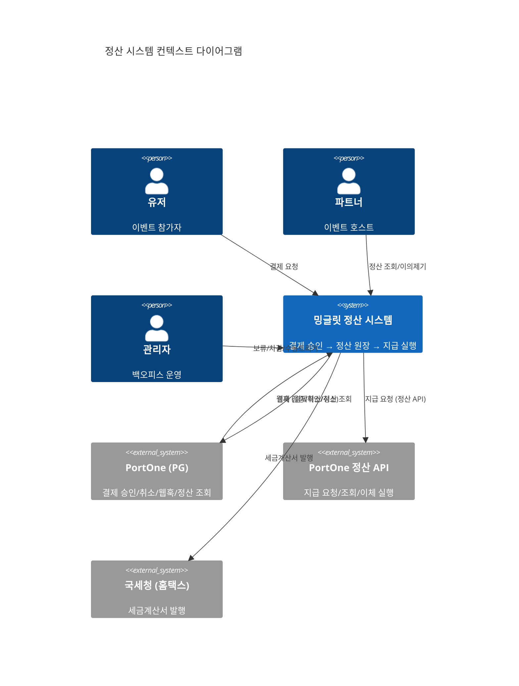

**텍스트 설명**: 유저가 결제하면 PG(PortOne)를 통해 정산 시스템에 도달한다. 파트너는 정산 조회와 이의제기를 하고, 관리자는 보류/차감/수동 트리거를 수행한다. 정산 시스템은 PortOne 정산 API를 통해 파트너에게 지급하고, 국세청에 세금계산서를 발행한다.

---

## 2. Scenarios View

유스케이스(Scenarios)는 나머지 4개 뷰를 검증하고 연결하는 역할을 한다.

### 2.1 핵심 유스케이스 목록

| ID | 유스케이스 | 주 행위자 | 관련 뷰 |
|----|-----------|----------|---------|
| UC-01 | 결제 승인 및 정산 원장 적재 | 유저, PG | Process, Logical |
| UC-02 | 14일 보류 후 READY 확정 | 시스템(Cron) | Process |
| UC-03 | 지급 편성 및 PortOne 정산 지급 | 시스템(Batch) | Process, Physical |
| UC-04 | 파트너 정산 조회 | 파트너 | Logical, Development |
| UC-05 | 지급 실패 → 재시도 → DLQ | 시스템 | Process |
| UC-06 | 관리자 보류/차감 | 관리자 | Logical, Process |
| UC-07 | 파트너 이의제기 | 파트너 | Logical |
| UC-08 | 3-way 대사(Reconciliation) | 시스템(Cron) | Process, Physical |
| UC-09 | 확정 후 환불/차지백 | 유저, PG | Process, Logical |
| UC-10 | 정산서 다운로드 | 파트너 | Development |

### 2.2 UC-01: 결제 승인 및 정산 원장 적재

가장 핵심적인 시나리오. 이중 승인(Dual-Track)으로 PG 웹훅과 앱 직접 확인 중 선착순 1건만 처리.

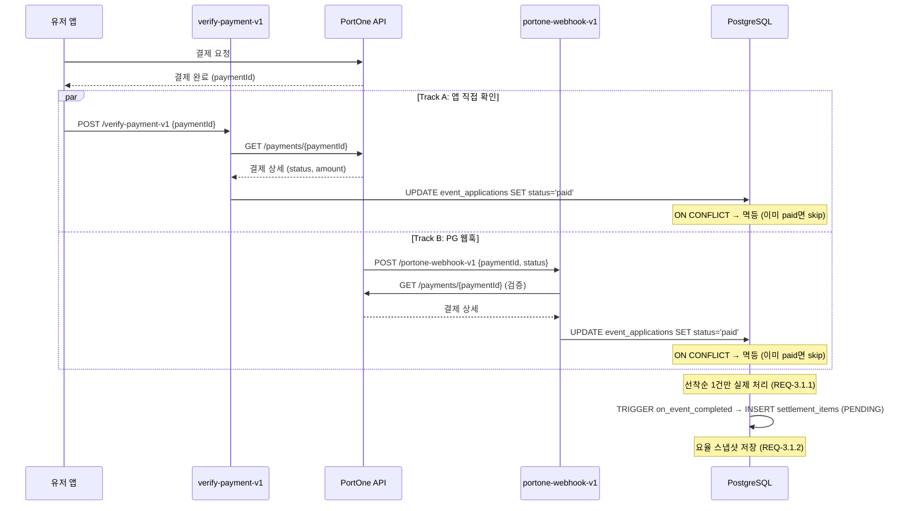

**텍스트 설명**: 유저가 PortOne으로 결제하면, (A) 앱이 verify-payment-v1으로 직접 확인하거나 (B) PG가 웹훅으로 알려준다. 두 경로 모두 PortOne API로 결제를 재검증한 뒤 `event_applications`를 `paid`로 업데이트한다. 멱등성으로 중복 처리를 방지하고, 이벤트 완료 시 트리거가 `settlement_items`에 PENDING 상태로 정산 원장을 적재한다.

### 2.3 UC-02: 14일 보류 후 READY 확정

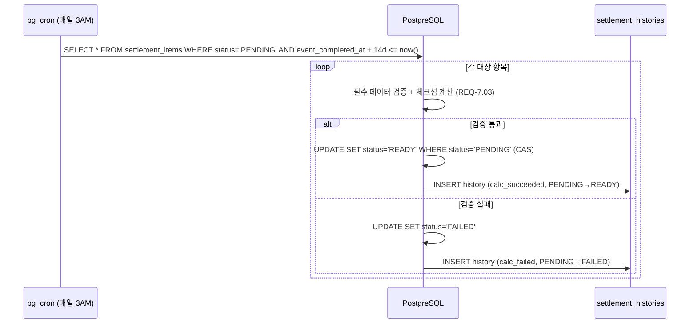

**텍스트 설명**: 매일 3AM에 pg_cron이 `event_completed_at + 14일`이 경과한 PENDING 항목을 조회한다. 필수 데이터와 체크섬을 검증한 뒤, 통과하면 CAS로 READY 전환하고 감사로그를 남긴다. 실패 시 FAILED로 전환.

### 2.4 UC-03: 지급 편성 및 PortOne 정산 지급

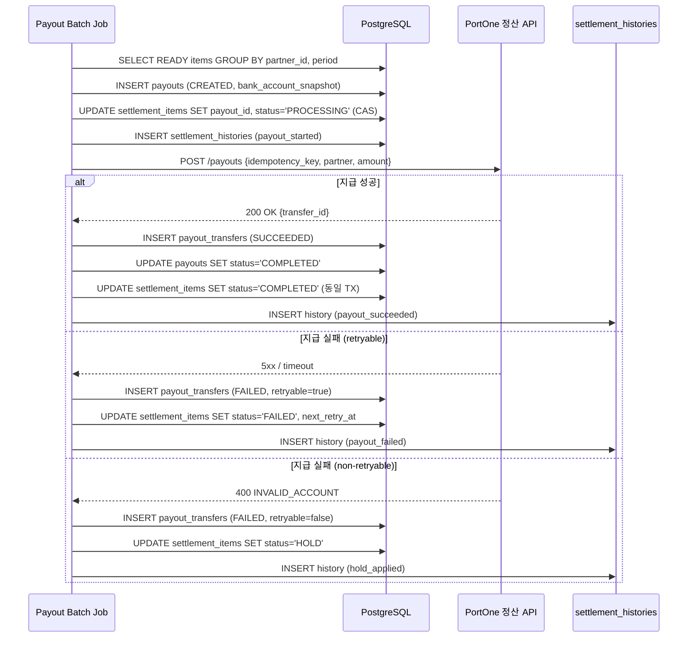

**텍스트 설명**: Batch Job이 READY 항목을 파트너별/기간별로 묶어 payout을 생성하고, 계좌 스냅샷을 저장한다. CAS로 PROCESSING 전환 후 PortOne 정산 API에 멱등키와 함께 지급 요청한다. 성공 시 COMPLETED, 재시도 가능 실패 시 FAILED(지수 백오프), 비재시도 실패 시 HOLD로 전환. 모든 전이를 감사로그에 기록한다.

### 2.5 UC-05: 지급 실패 재시도 및 DLQ

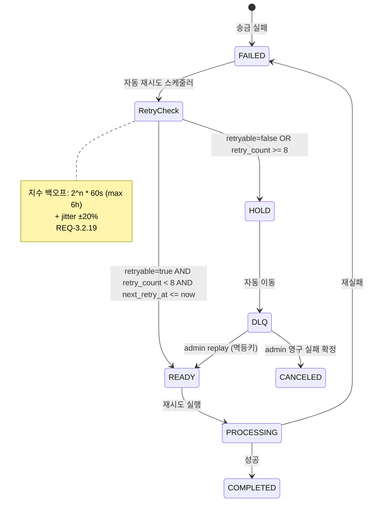

**텍스트 설명**: FAILED 항목은 `retryable` 여부와 `retry_count`를 확인한다. 재시도 가능하면 지수 백오프(2^n * 60s, 최대 6시간, jitter +-20%)로 READY 복귀한다. 8회 초과 또는 비재시도 실패는 HOLD → DLQ로 이동한다. DLQ는 관리자만 replay(멱등키 필수) 또는 영구 실패 확정할 수 있다.

### 2.6 UC-09: 확정 후 환불/차지백

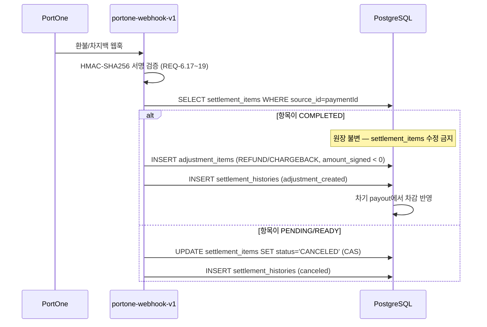

**텍스트 설명**: PG에서 환불/차지백 웹훅이 오면 HMAC 서명을 검증한다. 이미 COMPLETED된 항목은 원장 불변 원칙에 따라 수정하지 않고 `adjustment_items`로 음수 차감을 생성한다. 아직 PENDING/READY인 항목은 직접 CANCELED로 전환한다.

---

## 3. Logical View

### 3.1 도메인 모델 (Entity Relationship)

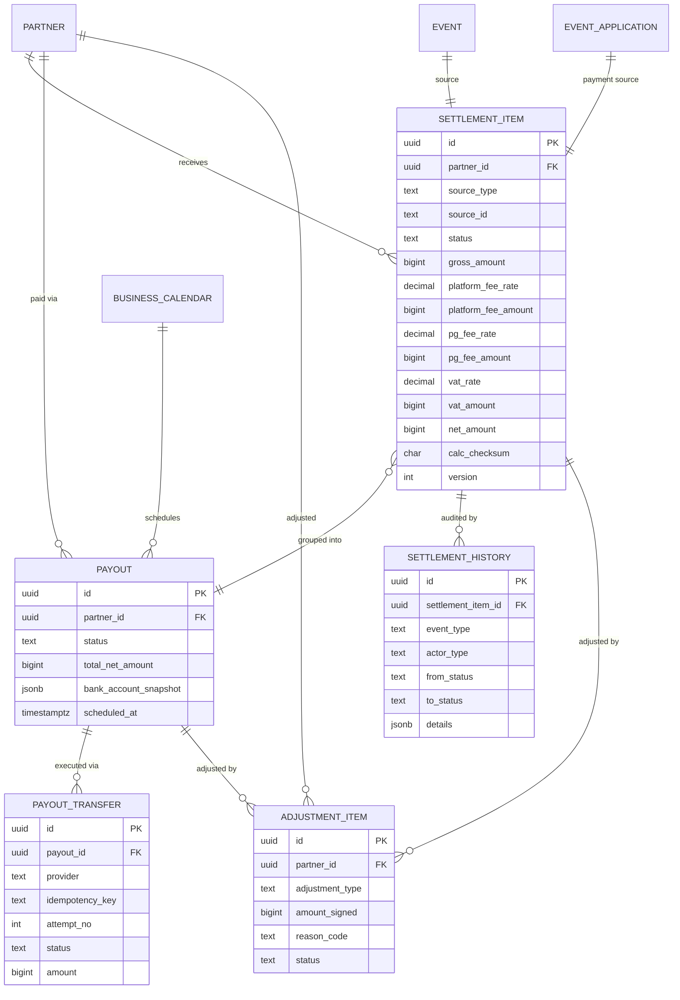

**텍스트 설명**:
- **SETTLEMENT_ITEM**: 정산의 최소 단위. 하나의 결제(EVENT_APPLICATION)에서 생성되며, 파트너에 귀속. 요율 스냅샷과 체크섬을 포함.
- **PAYOUT**: 파트너별 지급 묶음. 여러 SETTLEMENT_ITEM을 합산하고, 계좌 스냅샷을 보관. PortOne 정산 API를 통해 지급 실행.
- **PAYOUT_TRANSFER**: 실제 송금 시도 기록. 멱등키로 중복 송금 방지. 재시도 시 새 행 추가(append-only).
- **SETTLEMENT_HISTORY**: 모든 상태 전이의 감사로그. append-only, UPDATE/DELETE 금지.
- **ADJUSTMENT_ITEM**: 확정 후 변동(환불/차지백/수동 차감). 원장 불변 원칙을 지키는 유일한 변동 수단.

### 3.2 모듈 분해 (Module Decomposition)

```
정산 시스템 (Settlement System)
├── Payment Gateway Module        ← PG 연동 (PortOne)
│   ├── verify-payment            ← 앱 직접 결제 검증
│   ├── portone-webhook           ← PG 웹훅 수신/검증
│   └── cancel-payment            ← 결제 취소/환불
│
├── Settlement Ledger Module      ← 정산 원장 관리
│   ├── settlement-items          ← 원장 CRUD + 상태 머신
│   ├── settlement-histories      ← 감사로그
│   └── checksum-validator        ← 체크섬 계산/검증
│
├── Payout Module                 ← 지급 실행
│   ├── payout-assembler          ← READY 항목 → payout 편성
│   ├── payout-executor           ← PortOne 정산 API 지급 실행
│   ├── payout-transfers          ← 송금 시도 기록
│   └── retry-scheduler           ← 재시도/DLQ 관리
│
├── Adjustment Module             ← 사후 조정
│   ├── adjustment-items          ← 환불/차지백/수동 차감
│   └── dispute-workflow          ← 이의제기 처리
│
├── Reconciliation Module         ← 대사
│   ├── pg-reconciler             ← PG 리포트 수집/정규화
│   ├── payout-reconciler          ← PortOne 지급 내역 수집/정규화
│   └── matcher                   ← 3-way 매칭 + 불일치 분류
│
├── Operations Module             ← 운영
│   ├── business-calendar         ← 영업일/공휴일 관리
│   ├── kill-switch               ← 지급 중단 스위치
│   ├── monitoring                ← 메트릭/알람
│   └── admin-actions             ← 보류/차감/수동 트리거
│
├── Tax & Accounting Module       ← 회계/세무
│   ├── tax-rules                 ← 파트너 유형별 VAT 규칙
│   ├── statement-generator       ← 정산서 생성
│   └── tax-invoice               ← 세금계산서 발행
│
└── Partner Experience Module     ← 파트너 UI
    ├── settlement-list           ← 정산 목록/상세 조회
    ├── settlement-download       ← CSV 다운로드
    ├── notification-triggers     ← 이벤트별 알림 발송
    └── dispute-ui                ← 이의제기 접수 UI
```

### 3.3 상태 머신 (Settlement Item)

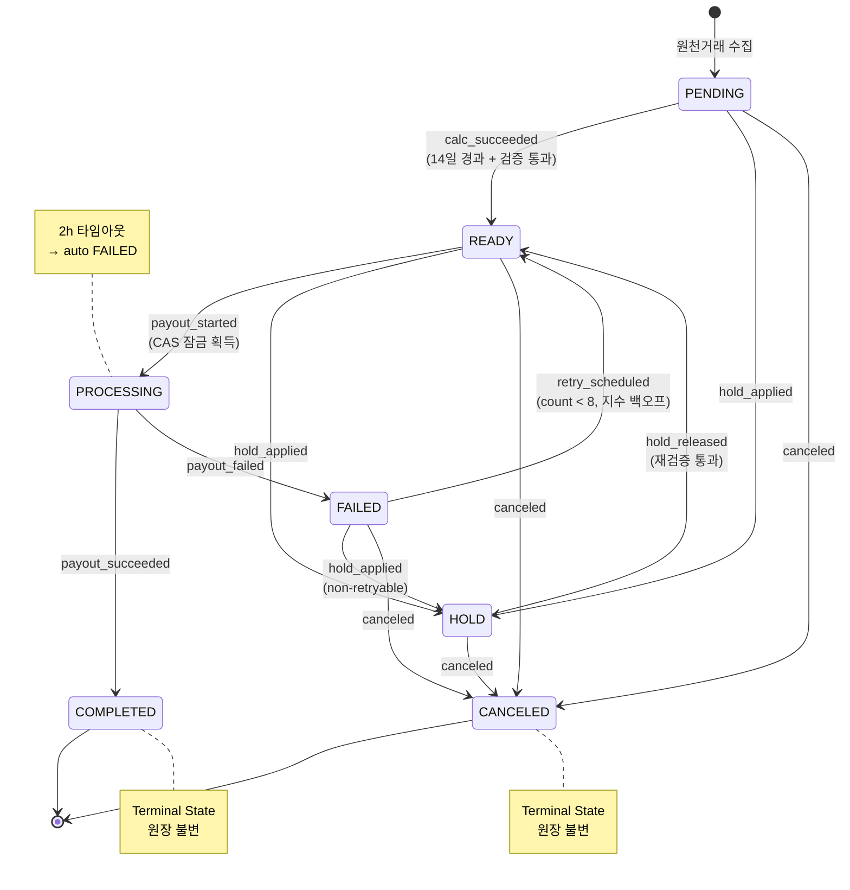

**텍스트 설명**: 7개 상태, 13개 전이. COMPLETED/CANCELED는 종결 상태(더 이상 전이 불가). PROCESSING은 2시간 타임아웃으로 stuck 방지. 모든 전이는 CAS + 감사로그 필수.

---

## 4. Process View

### 4.1 결제 → 정산 → 지급 전체 파이프라인

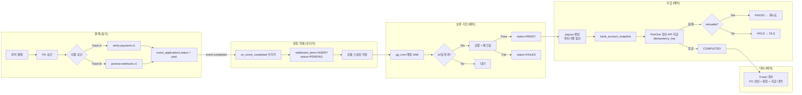

**텍스트 설명**: 전체 파이프라인은 5단계로 구성된다. (1) 결제: 동기식 이중 승인. (2) 원장 적재: DB 트리거로 PENDING 항목 생성. (3) 보류: 매일 크론으로 14일 경과 검사 후 READY 전환. (4) 지급: 파트너별 합산 → PortOne 정산 API 멱등 지급. (5) 대사: PG 정산 리포트 + 내부원장 + 지급 내역 3자 대조.

### 4.2 동시성 제어 패턴

```
┌─────────────────────────────────────────────────────────────┐
│ Compare-And-Set (CAS) Pattern                               │
│                                                             │
│  UPDATE settlement_items                                    │
│  SET status = 'PROCESSING',                                 │
│      version = version + 1,                                 │
│      processing_started_at = now()                          │
│  WHERE id = $1                                              │
│    AND status = 'READY'                                     │
│    AND version = $expected_version;                          │
│                                                             │
│  → rows_affected = 1  ⇒ 잠금 획득, 처리 진행               │
│  → rows_affected = 0  ⇒ 이미 다른 프로세스가 처리 중, skip │
└─────────────────────────────────────────────────────────────┘
```

### 4.3 배치 프로세스 스케줄

| 프로세스 | 스케줄 | 대상 | 처리 방식 |
|---------|--------|------|----------|
| settlement-status-transition | 매일 03:00 KST | PENDING → READY | pg_cron → SQL 함수 |
| payout-assembly | 매일 10:00 KST | READY → PROCESSING | Edge Function / Job |
| payout-execution | 매일 11:00-14:00 KST | PortOne 정산 API 지급 | Edge Function (chunk 500건) |
| retry-scheduler | 매 30분 | FAILED (retryable) | next_retry_at 기반 |
| reconciliation-daily | 매일 22:00 KST | 3-way 대사 | PG report + bank statement |
| reconciliation-payout | 지급 완료 후 1시간 | 당일 지급분 | 즉시 트리거 |
| stuck-processing-check | 매 30분 | PROCESSING > 2h | 자동 FAILED 전환 |
| data-retention-cleanup | 매일 01:00 KST | 만료 데이터 | 파기/마스킹 |

### 4.4 알림 처리 흐름

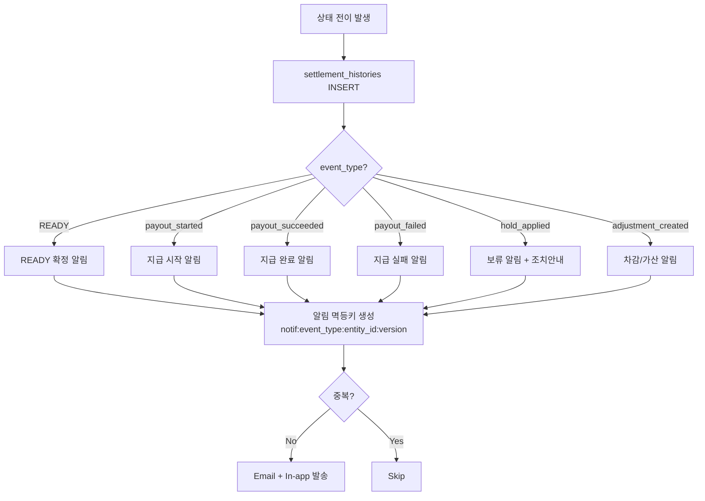

**텍스트 설명**: 모든 알림은 상태 전이(settlement_histories INSERT)를 트리거로 발생한다. 각 알림에 멱등키를 부여해 중복 발송을 방지하고, Email + In-app 2개 채널로 발송한다.

---

## 5. Development View

### 5.1 모노레포 구조

```
minglit/
├── apps/
│   ├── app_user/                  # Flutter 유저 앱
│   │   └── lib/src/features/
│   │       └── payment/           # 결제 UI (결제 요청 → verify-payment 호출)
│   │
│   ├── app_partner/               # Flutter 파트너 앱
│   │   └── lib/src/features/
│   │       └── settlement/        # ★ 정산 UI
│   │           ├── settlement_page.dart
│   │           ├── settlement_list_section.dart
│   │           ├── settlement_revenue_section.dart
│   │           ├── settlement_models.dart
│   │           ├── settlement_controller.dart (+.g.dart, .freezed.dart)
│   │           └── settlement_coordinator.dart (+.g.dart)
│   │
│   ├── landing_user/              # Next.js 유저 랜딩
│   └── landing_partner/           # Next.js 파트너 랜딩
│
├── shared/packages/
│   ├── minglit_kit/               # 공유 UI/로직
│   │   └── lib/src/data/
│   │       └── repositories/      # Supabase 클라이언트 래퍼
│   ├── minglit_lints/             # 커스텀 린트 룰
│   └── minglit_iamport_v1/        # PortOne v1 결제 SDK 래퍼
│
├── supabase/
│   ├── functions/                 # ★ Edge Functions (Deno/TypeScript)
│   │   ├── _shared/              # 공통 유틸
│   │   │   ├── portone_client.ts  # PortOne V2 API 클라이언트
│   │   │   ├── auth_utils.ts      # JWT 인증
│   │   │   ├── response_utils.ts  # 응답 포맷
│   │   │   └── sentry_utils.ts    # 에러 모니터링
│   │   ├── verify-payment-v1/     # 결제 검증 (Track A)
│   │   ├── portone-webhook-v1/    # PG 웹훅 수신 (Track B)
│   │   ├── cancel-payment/        # 결제 취소/환불
│   │   ├── query-settlements/     # 정산 조회 (PortOne API)
│   │   ├── create-order-transfer/ # 주문 이체 등록 (PortOne)
│   │   ├── sync-platform-partner/ # 파트너 PortOne 동기화
│   │   ├── notification-worker/   # FCM 푸시 알림
│   │   └── ...                    # 기타 (health, seed, identity 등)
│   │
│   ├── migrations/                # ★ DB 마이그레이션
│   │   ├── 20260301000004_04_schema_commerce.sql  # event_applications, 환불 트리거
│   │   ├── 20260301000005_05_schema_system.sql    # settlements 테이블, 정산 트리거
│   │   └── 20260301000008_08_cron_routes.sql      # 크론잡 (settlement-status-transition)
│   │
│   └── config.toml               # Supabase 프로젝트 설정
│
├── minglit_env/                   # 환경변수 (private submodule)
│   ├── dev/flutter.env
│   └── local/flutter.env
│
└── docs/features/partner-settlement/
    ├── requirements.md            # SRS v2.0
    └── architecture.md            # 본 문서
```

### 5.2 레이어 아키텍처

```
┌─────────────────────────────────────────────────────────┐
│                    Presentation Layer                     │
│  Flutter (app_user, app_partner)                         │
│  - Riverpod Controllers + Freezed Models                 │
│  - GoRouter Navigation                                   │
├─────────────────────────────────────────────────────────┤
│                    API Gateway Layer                      │
│  Supabase Edge Functions (Deno/TypeScript)               │
│  - REST endpoints                                        │
│  - Webhook receivers                                     │
│  - Auth (JWT) + CORS                                     │
├─────────────────────────────────────────────────────────┤
│                    Business Logic Layer                   │
│  PostgreSQL Functions + Triggers                         │
│  - 정산 트리거 (on_event_completed)                       │
│  - 상태 전이 함수 (update_settlement_ready_status)        │
│  - CAS 업데이트                                          │
├─────────────────────────────────────────────────────────┤
│                    Data Layer                             │
│  PostgreSQL (Supabase)                                   │
│  - settlement_items, payouts, payout_transfers           │
│  - settlement_histories (append-only)                    │
│  - adjustment_items                                      │
│  - RLS Policies                                          │
├─────────────────────────────────────────────────────────┤
│                    External Integration Layer             │
│  - PortOne V2 API (결제/정산/송금)                        │
│  - PortOne 정산 API (지급 요청/조회)                       │
│  - 국세청 API (세금계산서)                                │
│  - Sentry (에러 모니터링)                                 │
│  - FCM (푸시 알림)                                       │
└─────────────────────────────────────────────────────────┘
```

### 5.3 기술 스택

| 계층 | 기술 | 버전/비고 |
|------|------|----------|
| 유저/파트너 앱 | Flutter (Dart) | stable, Riverpod + Freezed + GoRouter |
| 랜딩 페이지 | Next.js (TypeScript) | — |
| API / Serverless | Supabase Edge Functions (Deno) | TypeScript |
| 데이터베이스 | PostgreSQL | Supabase managed |
| 큐 | PGMQ (PostgreSQL) | event_routes + processed_events + DLQ |
| 크론 | pg_cron | Supabase built-in |
| PG 연동 | PortOne V2 API | REST, API Key auth |
| 검색 | PGroonga | 한글 전문 검색 |
| 모니터링 | Sentry | Edge Functions 에러 추적 |
| 푸시 알림 | FCM | notification-worker Edge Function |
| 환경변수 | minglit_env (git submodule) | dev/local/prod 분리 |

### 5.4 의존성 흐름

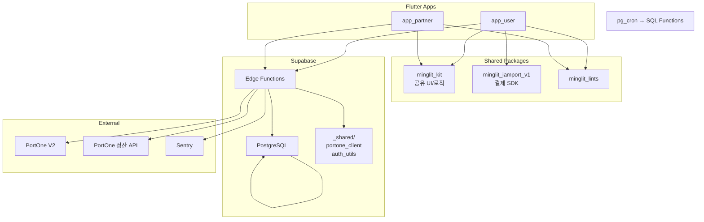

**텍스트 설명**: Flutter 앱들은 minglit_kit(공유 로직)과 minglit_iamport(결제 SDK)에 의존한다. 앱은 Supabase Edge Functions를 REST로 호출하고, Edge Functions는 _shared 유틸을 사용해 PortOne API(결제/정산)와 통신한다. DB 내부에서는 pg_cron이 SQL 함수를 호출하는 자체 루프가 존재한다.

---

## 6. Physical View

### 6.1 배포 토폴로지

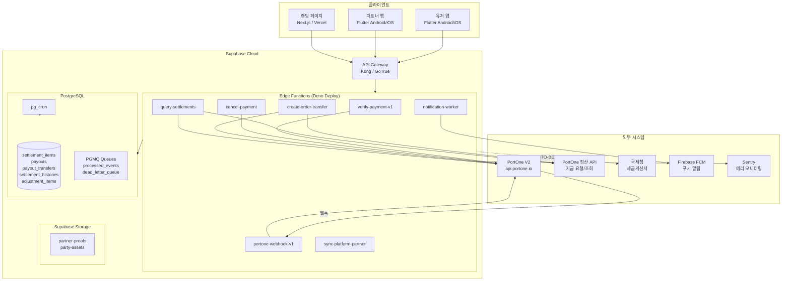

**텍스트 설명**: 클라이언트(Flutter 앱, Next.js 랜딩)는 Supabase API Gateway를 통해 Edge Functions에 접근한다. Edge Functions는 PostgreSQL에 데이터를 읽고 쓰며, PortOne API(결제 V1 + 정산 V2)와 국세청 등 외부 시스템과 통신한다. 지급은 PortOne 정산 API를 통해 실행되므로 직접 은행 연동은 불필요하다. pg_cron은 DB 내에서 배치 작업을 실행하고, PGMQ는 비동기 이벤트 큐를 제공한다. 점선은 TO-BE(아직 구현되지 않은) 연동을 나타낸다.

### 6.2 네트워크 흐름

| 경로 | 프로토콜 | 인증 | 비고 |
|------|---------|------|------|
| 앱 → Supabase | HTTPS | JWT (GoTrue) | Supabase client SDK |
| Edge Function → PortOne V1 | HTTPS | API Key + Secret | PORTONE_API_KEY + PORTONE_API_SECRET (결제 검증/취소) |
| Edge Function → PortOne V2 | HTTPS | API Key (Bearer) | PORTONE_V2_API_KEY (정산 조회/파트너 동기화) |
| PortOne → webhook | HTTPS | IP Allowlist (AS-IS) | ⚠ HMAC-SHA256 미구현 — TO-BE에서 REQ-6.17~19 적용 필수 |
| Edge Function → PortOne 정산 API | HTTPS | API Key (Bearer) | PORTONE_V2_API_KEY (지급 실행) |
| Edge Function → Sentry | HTTPS | DSN | 자동 에러 리포트 |
| pg_cron → Edge Function | HTTP (내부) | service_role_key | vault.decrypted_secrets |
| FCM → 디바이스 | HTTPS/FCM | Server Key | notification-worker |

### 6.3 자격증명 (Credentials) 맵

| 환경변수 | 용도 | 대상 API |
|---------|------|---------|
| `PORTONE_API_KEY` + `PORTONE_API_SECRET` | 결제 검증/취소 (V1) | Iamport V1 REST API |
| `PORTONE_V2_API_KEY` | 정산 조회/주문 이체/파트너 동기화 | PortOne V2 API |
| `PORTONE_IMP_KEY` + `PORTONE_IMP_SECRET` | 본인인증 (별도) | Iamport V1 |
| `SUPABASE_SERVICE_ROLE_KEY` | 내부 서비스 호출 | Supabase (vault에서 조회) |

> **참고**: V1/V2 자격증명이 분리되어 있어 향후 V2 단일화 마이그레이션 필요.

### 6.4 RLS 정책 (Row Level Security)

| 테이블 | 정책 | 설명 |
|--------|------|------|
| `settlements` | `SETTLEMENT_VIEW` 권한 필요 | 파트너는 자기 정산만 조회 가능 (읽기 전용) |
| `partner_settlements` (계좌) | `SETTLEMENT_VIEW` / `SETTLEMENT_EDIT` | 계좌 조회는 VIEW, 수정은 EDIT 권한 |
| `event_applications` | partner_id 기반 | 파트너는 자기 이벤트의 신청만 조회 |

### 6.5 데이터 보안

```
┌─────────────────────────────────────────────────┐
│ 데이터 보안 레이어                                │
│                                                  │
│ [전송 중]  TLS 1.2+ 강제                         │
│ [저장 시]  계좌번호 → envelope encryption (KMS)   │
│            account_last4만 평문                   │
│            bank_account_snapshot → 암호문 only    │
│ [접근]     RLS 정책 (partner_id 기반)             │
│            RBAC (admin/partner/system 구분)       │
│ [로그]     PII 마스킹 (account_last4만)           │
│ [파기]     5년 보존 → crypto-shredding            │
│ [감사]     계좌 조회 자체를 access log 기록        │
└─────────────────────────────────────────────────┘
```

---

## 7. AS-IS vs TO-BE Gap 분석

현재 코드베이스(AS-IS)와 SRS v2.0(TO-BE) 간의 주요 차이를 식별한다.

### 7.1 구조적 차이

| 항목 | AS-IS (현재 코드) | TO-BE (SRS v2.0) | Gap |
|------|-------------------|-------------------|-----|
| **정산 테이블** | `settlements` (단일) | `settlement_items` + `payouts` + `payout_transfers` + `settlement_histories` + `adjustment_items` (5개) | 테이블 재설계 필요 |
| **상태** | 4단계 (pending, ready, requested, completed) | 7단계 (PENDING, HOLD, CANCELED, READY, PROCESSING, COMPLETED, FAILED) | 상태 추가 + 전이 매트릭스 |
| **금액 타입** | `INTEGER` | `BIGINT` | 타입 변경 |
| **수수료율** | 하드코딩 (PG 3.5%, 플랫폼 5%) | `DECIMAL(5,2)` 스냅샷 저장 + 파트너별 룰 테이블 | 요율 스냅샷 구현 |
| **보류 기간** | 7일 | 14일 | 크론 SQL 수정 |
| **체크섬** | 없음 | SHA-256 calc_checksum | 신규 구현 |
| **감사로그** | 없음 | settlement_histories (append-only) | 신규 구현 |
| **멱등성** | 없음 (ON CONFLICT 부분적) | 3중 멱등키 체계 | 신규 구현 |
| **대사** | 없음 | 3-way Reconciliation | 신규 구현 |
| **지급 실행** | PortOne 위임 (AS-IS) | PortOne 정산 API + payout_transfers로 내부 추적 | 지급 추적 체계 신규 구현 |
| **파트너 정산 조회** | PortOne API 프록시 | 내부 DB 직접 조회 | 쿼리 변경 |
| **웹훅 인증** | IP Allowlist (V1) | HMAC-SHA256 서명 (REQ-6.17) | 보안 강화 필요 |
| **PG 버전** | V1(결제) + V2(정산) 혼용 | V2 단일화 | 자격증명 마이그레이션 |
| **환불 처리** | 트리거 → HTTP → PG (비동기, 실패 시 gap) | 멱등 환불 + adjustment_items | 안정성 강화 |
| **QStash** | 미구현 (PGMQ 사용) | QStash 비동기 처리 (SRS 명시) | 큐 시스템 결정 필요 |
| **파트너 UI** | 읽기 전용 (조회만) | 이의제기/재지급 요청/다운로드 | UI 확장 필요 |

### 7.2 마이그레이션 전략 (제안)

```
Phase 1: DB 스키마 확장
  ├── settlement_items 테이블 생성 (기존 settlements와 병행)
  ├── settlement_histories 테이블 생성
  ├── payouts + payout_transfers 테이블 생성
  └── adjustment_items 테이블 생성

Phase 2: 상태 머신 구현
  ├── 7단계 상태 + CAS 전이 함수
  ├── 보류 기간 7일 → 14일 수정
  ├── 체크섬 계산/검증 로직
  └── 감사로그 자동 기록 트리거

Phase 3: 지급 파이프라인
  ├── payout 편성 배치
  ├── PortOne 정산 API 지급 연동
  ├── 멱등키 체계
  └── 재시도/DLQ

Phase 4: 운영/대사
  ├── 3-way 대사 배치
  ├── 모니터링/알람 메트릭
  ├── kill switch
  └── 운영 캘린더 (business_calendar)

Phase 5: 파트너 경험
  ├── app_partner 정산 UI 확장 (7단계 상태 표시)
  ├── 정산서 다운로드 (CSV)
  ├── 이의제기 워크플로
  └── 알림 트리거
```

---

## 부록 A: 용어 사전

| 용어 | 정의 |
|------|------|
| CAS | Compare-And-Set. DB 원자 업데이트로 동시성 제어 |
| DLQ | Dead Letter Queue. 재시도 실패한 메시지의 최종 저장소 |
| 멱등키 | 동일 요청의 중복 처리를 방지하는 고유 식별자 |
| 원장 불변 | COMPLETED된 정산 항목은 수정 불가. 변동은 adjustment_items로만 |
| 3-way 대사 | PG 정산 리포트 + 내부원장 + PortOne 지급 내역 3자 대조 |
| 체크섬 | 정산 산식 입출력의 SHA-256 해시. 무결성 검증용 |
| 스냅샷 | 정산 시점의 요율/계좌정보를 불변 저장 |
| 지수 백오프 | 재시도 간격을 2^n으로 점진적으로 늘리는 전략 |

## 부록 B: REQ 크로스 레퍼런스

| 뷰 | 관련 REQ 범위 |
|----|-------------|
| Scenarios (UC-01~10) | REQ-3.1.1~2, REQ-3.2.01~25, REQ-3.3.1~2, REQ-5.3.21, REQ-7.13, REQ-8.11~14 |
| Logical | REQ-5.1.01~10, REQ-5.2.01~10, REQ-5.3.01~30, REQ-3.2.01~25 |
| Process | REQ-3.2.11~25, REQ-3.3.1~2, REQ-4.3.01~10, REQ-4.4.01~10, REQ-4.5.01~10, REQ-4.6.01~10 |
| Development | REQ-8.01~04, REQ-8.15~17 |
| Physical | REQ-6.07~10, REQ-6.17~21, REQ-4.3.04~06 |
