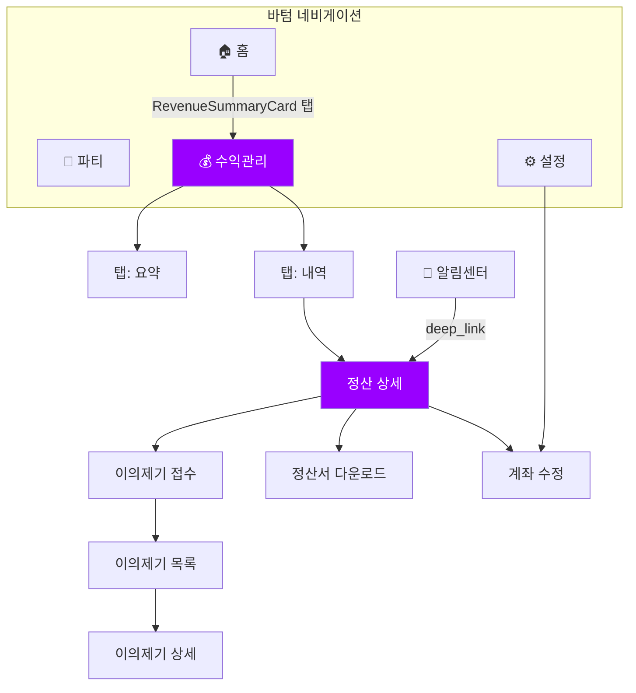
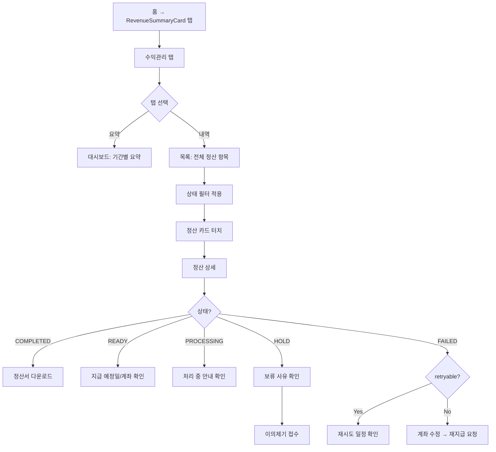
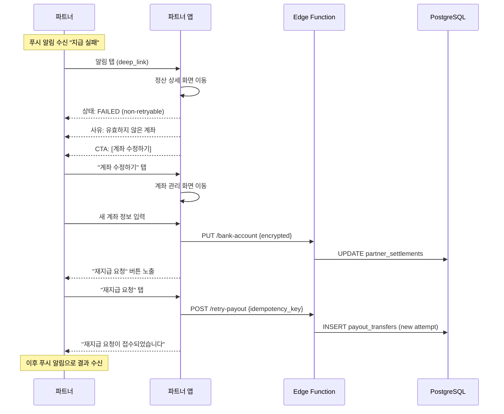

# 파트너 정산 UI/UX 설계서

- **버전**: 1.0
- **작성일**: 2026. 03. 13.
- **기반 문서**: SRS v2.0 (requirements.md), Architecture v1.1 (architecture.md)
- **대상 플랫폼**: Flutter 모바일 앱 (app_partner)

### 변경 이력

| 버전 | 일자 | 작성자 | 변경 내용 |
|------|------|--------|-----------|
| 1.0 | 2026.03.13 | — | 초안 작성. TO-BE 전체 범위 설계 |

---

## 목차

1. [설계 개요](#1-설계-개요)
2. [AS-IS 분석 및 개선 방향](#2-as-is-분석-및-개선-방향)
3. [정보 아키텍처](#3-정보-아키텍처)
4. [상태 시각화 시스템](#4-상태-시각화-시스템)
5. [화면별 설계](#5-화면별-설계)
6. [공통 컴포넌트](#6-공통-컴포넌트)
7. [인터랙션 플로우](#7-인터랙션-플로우)
8. [알림 시스템](#8-알림-시스템)
9. [디자인 토큰 확장](#9-디자인-토큰-확장)
10. [Phase별 구현 로드맵](#10-phase별-구현-로드맵)
11. [REQ 크로스 레퍼런스](#11-req-크로스-레퍼런스)

---

## 1. 설계 개요

### 1.1 목적

파트너(이벤트 호스트)가 정산 현황을 직관적으로 파악하고, 지급 상태를 추적하며, 문제 발생 시 자기 주도적으로 해결할 수 있는 정산 경험을 설계한다.

### 1.2 설계 원칙

| 원칙 | 설명 | 적용 방식 |
|------|------|----------|
| **투명성 (Transparency)** | 파트너는 자신의 돈이 어디에 있는지 항상 알 수 있어야 한다 | 7단계 상태, 수수료 breakdown, 타임라인 |
| **자기 해결 (Self-Service)** | 문제 발생 시 파트너가 직접 조치할 수 있어야 한다 | 이의제기, 계좌 수정, 재지급 요청 |
| **점진적 공개 (Progressive Disclosure)** | 복잡한 정보는 단계적으로 노출한다 | 요약 → 목록 → 상세 drill-down |
| **신뢰 (Trust)** | 금액 관련 정보는 정확하고 일관되어야 한다 | 원 단위 정수, 체크섬 조회, 정산서 일관성 |
| **맥락 적시성 (Contextual Timing)** | 상태에 맞는 안내와 액션만 노출한다 | 상태별 메시지 템플릿, 조건부 버튼 |

### 1.3 대상 사용자

| 페르소나 | 설명 | 핵심 니즈 |
|---------|------|----------|
| 초보 파트너 | 첫 이벤트 호스팅, 정산 경험 없음 | 쉬운 상태 이해, 가이드 메시지 |
| 활발한 파트너 | 월 5-10회 이벤트, 정산 익숙 | 빠른 요약, 기간별 필터, 다운로드 |
| 파워 파트너 | 월 20회+, 대량 정산 | 일괄 조회, 상세 분석, 이의제기 |

---

## 2. AS-IS 분석 및 개선 방향

### 2.1 현재 화면 구조

```
┌─────────────────────────────────────┐
│ AppBar: 정산 관리                     │
├─────────────────────────────────────┤
│ ┌─────────────────────────────────┐ │
│ │ 정산 요약 (Card)                 │ │
│ │ 총 매출 | 총 환불 | 정산 예정액    │ │
│ └─────────────────────────────────┘ │
│ ┌─────────────────────────────────┐ │
│ │ 매출 추이 (Card)                 │ │
│ │ ████ ██ ████████ ███ ██████     │ │
│ │  1월  2월   3월   4월   5월      │ │
│ └─────────────────────────────────┘ │
│ ┌─────────────────────────────────┐ │
│ │ 이벤트별 정산 목록                 │ │
│ │ ┌───────────────────────────┐   │ │
│ │ │ ▶ 봄맞이 와인파티  [정산대기]│   │ │
│ │ │   2026.03.01 · ₩150,000  │   │ │
│ │ ├───────────────────────────┤   │ │
│ │ │ ▶ 주말 브런치    [정산완료] │   │ │
│ │ │   2026.02.15 · ₩85,000   │   │ │
│ │ └───────────────────────────┘   │ │
│ └─────────────────────────────────┘ │
└─────────────────────────────────────┘
```

### 2.2 AS-IS 강점 (유지)

| 강점 | 설명 |
|------|------|
| 정보 계층 | 요약 → 추이 → 상세 순서가 자연스러움 |
| 시각적 강조 | 정산 예정액을 primary 색상으로 강조 |
| 상태 배지 | 한눈에 상태 파악 가능 |
| ExpansionTile | 필요시에만 수수료 상세 노출 |
| 디자인 토큰 | MinglitTheme, MinglitSpacing 일관 사용 |

### 2.3 AS-IS 한계 (개선)

| 한계 | TO-BE 개선 |
|------|-----------|
| 4상태만 표시 (pending/ready/requested/completed) | 7단계 상태 + 상태별 안내 메시지 |
| 필터/정렬 없음 | 상태별 필터, 기간별 필터, 금액순 정렬 |
| 읽기 전용 (액션 없음) | 이의제기, 계좌 수정, 재지급 요청, 다운로드 |
| 정산 상세 정보 부족 | item-level drill-down, 조정 항목, 체크섬 |
| 기간 선택 불가 | 월별/기간별 필터 |
| 홈 대시보드 연동 없음 | RevenueSummaryCard 활성화 |
| 스켈레톤 로딩 없음 | 섹션별 Shimmer 로딩 |
| 빈 상태 가이드 없음 | 온보딩 가이드 + 빈 상태 일러스트 |

---

## 3. 정보 아키텍처

### 3.1 화면 구조 (Sitemap)

```
파트너 앱 (app_partner)
├── 🏠 홈 (HomeRoute)
│   ├── RevenueSummaryCard ← ★ 활성화 (정산 요약 스니펫)
│   └── 미처리 알림 배지
│
├── 🎉 파티관리 (PartyListRoute)
│
├── 💰 수익관리 (SettlementRoute) ← ★ 정산 메인
│   ├── 정산 대시보드 (탭 1: 요약)
│   │   ├── 기간 선택기 (월별 / 기간 직접 입력)
│   │   ├── 수익 요약 카드 (총매출, 수수료, 정산금)
│   │   ├── 매출 추이 차트 (바 차트)
│   │   └── 상태별 요약 (파이 or 숫자 카드)
│   │
│   └── 정산 목록 (탭 2: 내역)
│       ├── 상태 필터 칩 (전체 / PENDING / READY / PROCESSING / COMPLETED / HOLD / FAILED)
│       ├── 정렬 옵션 (최신순 / 금액순)
│       └── 정산 항목 카드 리스트
│           └── → 정산 상세 (SettlementDetailRoute) ★ 신규
│               ├── 상태 타임라인
│               ├── 금액 breakdown (수수료 상세)
│               ├── 조정 항목 (환불/차지백)
│               ├── 고급 정보 (calc_checksum)
│               ├── 정산서 다운로드 버튼
│               └── 액션 버튼 (이의제기 / 지원센터)
│
│   ※ 이의제기 (DisputeRoute) ★ Phase 2
│   ├── 이의제기 목록
│   ├── 이의제기 상세 (6단계 상태)
│   ├── 이의제기 접수 폼
│   └── 추가 정보 제출 (NEED_INFO 응답)
│
│   ※ 계좌 관리 (BankAccountRoute) ★ 신규
│   ├── 현재 계좌 정보 (마스킹)
│   └── 계좌 수정 폼
│
├── ⚙️ 설정 (MoreRoute)
│   └── 계좌 관리 → BankAccountRoute (공유)
│
└── 🔔 알림 센터 (NotificationCenterRoute) ← AppBar에서 접근
    ├── 전체 알림 목록
    ├── 정산 관련 알림 (deep_link → 정산 상세)
    └── 알림 설정
```

### 3.2 네비게이션 흐름



### 3.3 라우팅 설계

| Route | Path | 설명 | Phase |
|-------|------|------|-------|
| SettlementRoute | `/settlement` | 정산 메인 (탭: 요약/내역) | Phase 1 |
| SettlementDetailRoute | `/settlement/:id` | 정산 상세 | Phase 1 |
| SettlementDownloadRoute | `/settlement/:id/download` | 정산서 다운로드 (바텀시트) | Phase 1 |
| BankAccountRoute | `/settlement/bank-account` | 계좌 관리 | Phase 1 |
| DisputeListRoute | `/settlement/disputes` | 이의제기 목록 | Phase 2 |
| DisputeCreateRoute | `/settlement/:id/dispute/new` | 이의제기 접수 | Phase 2 |
| DisputeDetailRoute | `/settlement/disputes/:id` | 이의제기 상세 | Phase 2 |

---

## 4. 상태 시각화 시스템

### 4.1 7단계 상태 정의

| 상태 | 한글 라벨 | 색상 | 아이콘 | 카테고리 |
|------|----------|------|--------|---------|
| `PENDING` | 정산 대기 | `onSurfaceVariant` (#6B7280) | `hourglass_empty` | 진행 중 |
| `HOLD` | 보류 | `error` (#EF4444) | `pause_circle_outline` | 주의 필요 |
| `CANCELED` | 취소됨 | `onSurfaceVariant` (#6B7280) | `cancel_outlined` | 종결 |
| `READY` | 지급 예정 | `primary` (#9900FF) | `check_circle_outline` | 긍정 |
| `PROCESSING` | 지급 처리중 | `tertiary` (#48C9B0) | `sync` (회전 애니메이션) | 진행 중 |
| `COMPLETED` | 지급 완료 | `success` (#22C55E) | `verified` | 종결 |
| `FAILED` | 지급 실패 | `error` (#EF4444) | `error_outline` | 주의 필요 |

### 4.2 상태별 안내 메시지 (REQ-8.05)

```
┌──────────────────────────────────────────────────────────────┐
│ PENDING                                                       │
│ ┌──────────────────────────────────────────────────────────┐ │
│ │ ⏳ 정산 데이터를 확인 중입니다.                             │ │
│ │    완료 예정: 2026.03.27 (D-14)                           │ │
│ │    ※ 이벤트 완료 후 14일간의 보류 기간이 필요합니다.         │ │
│ └──────────────────────────────────────────────────────────┘ │
│                                                              │
│ HOLD                                                         │
│ ┌──────────────────────────────────────────────────────────┐ │
│ │ ⚠️ 정산이 보류되었습니다.                                   │ │
│ │    사유: 환불 검토 대기                                     │ │
│ │    ※ 조치가 필요합니다.                                    │ │
│ │    [이의제기 접수]  [지원센터 문의]                          │ │
│ └──────────────────────────────────────────────────────────┘ │
│                                                              │
│ READY                                                        │
│ ┌──────────────────────────────────────────────────────────┐ │
│ │ ✅ 정산이 확정되었습니다.                                   │ │
│ │    지급 예정: 2026.03.28 (내일)                            │ │
│ │    지급 계좌: 국민은행 ****1234                             │ │
│ └──────────────────────────────────────────────────────────┘ │
│                                                              │
│ PROCESSING                                                   │
│ ┌──────────────────────────────────────────────────────────┐ │
│ │ 🔄 지급 처리 중입니다.                                     │ │
│ │    처리 시작: 2026.03.28 11:00                             │ │
│ │    ※ 은행 처리 시간에 따라 1~2영업일 소요될 수 있습니다.     │ │
│ └──────────────────────────────────────────────────────────┘ │
│                                                              │
│ COMPLETED                                                    │
│ ┌──────────────────────────────────────────────────────────┐ │
│ │ ✅ 지급이 완료되었습니다.                                   │ │
│ │    지급일시: 2026.03.28 14:32                              │ │
│ │    지급 금액: ₩150,000                                    │ │
│ │    입금 계좌: 국민은행 ****1234                             │ │
│ └──────────────────────────────────────────────────────────┘ │
│                                                              │
│ FAILED (retryable)                                           │
│ ┌──────────────────────────────────────────────────────────┐ │
│ │ ❌ 지급 처리에 실패했습니다.                                │ │
│ │    사유: 은행 시스템 오류 (일시적)                           │ │
│ │    다음 재시도: 2026.03.29 09:00                           │ │
│ │    재시도 횟수: 2/8                                        │ │
│ └──────────────────────────────────────────────────────────┘ │
│                                                              │
│ FAILED (non-retryable)                                       │
│ ┌──────────────────────────────────────────────────────────┐ │
│ │ ❌ 자동 재시도가 중단되었습니다.                             │ │
│ │    사유: 유효하지 않은 계좌                                 │ │
│ │    ※ 계좌 정보를 확인해 주세요.                             │ │
│ │    [계좌 수정하기]  [지원센터 문의]                          │ │
│ └──────────────────────────────────────────────────────────┘ │
│                                                              │
│ CANCELED                                                     │
│ ┌──────────────────────────────────────────────────────────┐ │
│ │ 정산이 취소되었습니다.                                      │ │
│ │    사유: 전체 환불 처리                                     │ │
│ └──────────────────────────────────────────────────────────┘ │
└──────────────────────────────────────────────────────────────┘
```

### 4.3 상태별 액션 버튼 매트릭스

| 상태 | 이의제기 | 계좌 수정 | 재지급 요청 | 다운로드 | 지원센터 |
|------|---------|----------|-----------|---------|---------|
| PENDING | — | — | — | — | ○ |
| HOLD | ● | — | — | — | ● |
| CANCELED | — | — | — | — | ○ |
| READY | — | ○ | — | — | ○ |
| PROCESSING | — | — | — | — | ○ |
| COMPLETED | ● | — | — | ● | ○ |
| FAILED (retryable) | — | — | — | — | ● |
| FAILED (non-retryable) | ● | ● | ● | — | ● |

● = 강조 노출 (Primary CTA), ○ = 보조 노출 (Secondary/Text), — = 미노출

---

## 5. 화면별 설계

### 5.1 정산 대시보드 (탭 1: 요약)

#### 와이어프레임

```
┌─────────────────────────────────────┐
│ ← 수익관리                     🔔(3) │
├────────────┬────────────────────────┤
│   요약     │        내역            │  ← 탭 바
├────────────┴────────────────────────┤
│                                     │
│ ┌─ 기간 선택 ─────────────────────┐ │
│ │ ◀ 2026년 3월                  ▶ │ │
│ │       [이번 달] [직접 입력]      │ │
│ └─────────────────────────────────┘ │
│                                     │
│ ┌─ 수익 요약 카드 ────────────────┐ │
│ │                                 │ │
│ │  총 매출           ₩2,350,000  │ │
│ │  ─ PG 수수료 (3.5%)  ▼82,250  │ │
│ │  ─ 플랫폼 수수료 (5%) ▼117,500 │ │
│ │  ─ 부가세 (10%)      ▼199,750  │ │
│ │  ──────────────────────────── │ │
│ │  정산 예정액        ₩1,950,500  │ │
│ │         (전월 대비 +12.3% ↑)    │ │
│ │                                 │ │
│ │  환불 차감             ▼45,000  │ │
│ │  ──────────────────────────── │ │
│ │  실 지급액          ₩1,905,500  │ │
│ │                                 │ │
│ └─────────────────────────────────┘ │
│                                     │
│ ┌─ 매출 추이 ─────────────────────┐ │
│ │  ₩2.4M ·                       │ │
│ │  ₩1.8M ·          ██           │ │
│ │  ₩1.2M ·    ██    ██    ██     │ │
│ │  ₩0.6M · ██ ██ ██ ██ ██ ██    │ │
│ │         ────────────────────   │ │
│ │         10월 11월 12월 1월 2월 3월│ │
│ │                                 │ │
│ │  ── 총매출  ── 정산금            │ │
│ └─────────────────────────────────┘ │
│                                     │
│ ┌─ 상태별 현황 ───────────────────┐ │
│ │                                 │ │
│ │  대기 3건   예정 2건   처리중 1건 │ │
│ │  ○ ○ ○     ● ●       ◐         │ │
│ │                                 │ │
│ │  보류 1건   실패 0건   완료 12건  │ │
│ │  ▲          —         ✓✓✓...   │ │
│ │                                 │ │
│ └─────────────────────────────────┘ │
│                                     │
└─────────────────────────────────────┘
```

#### 컴포넌트 스펙

**PeriodSelector**
- 좌우 화살표로 월 이동 (기본: 이번 달)
- "직접 입력" 탭 → DateRangePicker 바텀시트
- 상태: `selectedPeriod` (DateTime start, DateTime end)

**RevenueSummaryCard** (확장된 버전)
- AS-IS: 3개 항목 (총매출, 환불, 예정액)
- TO-BE: 수수료 breakdown 포함 + 전월 대비 변동률
- 금액 포맷: `₩{amount.toFormattedString()}` (천 단위 구분)
- 음수 금액: `▼` 접두사 + `error` 색상

**RevenueTrendChart** (확장된 버전)
- AS-IS: 단일 바 (netAmount)
- TO-BE: 이중 바 (총매출 + 정산금) 또는 선 그래프 오버레이
- 터치 인터랙션: 바 터치 시 해당 월 상세 팝업

**StatusSummaryGrid**
- 2행 3열 그리드
- 각 셀: 상태 라벨 + 건수 + 미니 아이콘
- 셀 터치 → 내역 탭으로 이동 (해당 상태 필터 적용)

---

### 5.2 정산 목록 (탭 2: 내역)

#### 와이어프레임

```
┌─────────────────────────────────────┐
│ ← 수익관리                     🔔(3) │
├────────────┬────────────────────────┤
│   요약     │        내역            │
├────────────┴────────────────────────┤
│                                     │
│ ┌─ 필터 칩 (수평 스크롤) ─────────┐ │
│ │ [전체 18] [대기 3] [예정 2]     │ │
│ │ [처리중 1] [완료 12] [보류 1]   │ │
│ │ [실패 0]                        │ │
│ └─────────────────────────────────┘ │
│                                     │
│ ┌─ 정렬 바 ──────────────────────┐ │
│ │ 정렬: 최신순 ▼   기간: 3월 ▼    │ │
│ └─────────────────────────────────┘ │
│                                     │
│ ── 2026년 3월 ─────────────────── │
│                                     │
│ ┌─────────────────────────────────┐ │
│ │ 봄맞이 와인파티                   │ │
│ │ 2026.03.01                      │ │
│ │                                 │ │
│ │ [지급 예정]        ₩150,000     │ │
│ │ 지급일: 03.28       총매출 ₩200K│ │
│ │                          ▶     │ │
│ └─────────────────────────────────┘ │
│                                     │
│ ┌─────────────────────────────────┐ │
│ │ 주말 브런치                       │ │
│ │ 2026.03.08                      │ │
│ │                                 │ │
│ │ [보류] ⚠                ₩85,000 │ │
│ │ 사유: 환불 검토            ▶    │ │
│ └─────────────────────────────────┘ │
│                                     │
│ ── 2026년 2월 ─────────────────── │
│                                     │
│ ┌─────────────────────────────────┐ │
│ │ 금요 네트워킹 파티                 │ │
│ │ 2026.02.22                      │ │
│ │                                 │ │
│ │ [지급 완료] ✅           ₩320,000│ │
│ │ 지급일: 03.15                ▶  │ │
│ └─────────────────────────────────┘ │
│                                     │
│         더 보기 (페이지네이션)         │
└─────────────────────────────────────┘
```

#### 컴포넌트 스펙

**StatusFilterChips** (수평 스크롤)
- `FilterChip` 위젯, 단일 선택 (또는 "전체")
- 각 칩에 건수 배지 표시
- 선택 시 `onSurfaceVariant` → 해당 상태 색상
- 건수 0인 상태는 dimmed 처리

**SortBar**
- 정렬 기준: 최신순(기본), 금액 높은순, 금액 낮은순
- 기간 필터: 대시보드와 동기화 (월별)
- DropdownButton 또는 바텀시트

**SettlementCard** (목록 아이템)
- 레이아웃: 이벤트명 + 날짜 (좌상), 상태 배지 (좌하), 정산금액 (우), 화살표 (우하)
- 터치 → SettlementDetailRoute로 이동
- HOLD/FAILED 상태: 배경에 `error` 색상 10% 틴트
- 월별 섹션 헤더로 그룹핑 (StickyHeader)

**페이지네이션**
- 무한 스크롤 (InfiniteListView) — 20건씩 로드
- 로딩 인디케이터: 하단 CircularProgressIndicator
- 빈 상태: 일러스트 + "아직 정산 내역이 없습니다" + 가이드 문구

---

### 5.3 정산 상세 (SettlementDetailRoute)

#### 와이어프레임

```
┌─────────────────────────────────────┐
│ ← 정산 상세                    ···  │
│                                     │
│ ┌─ 이벤트 정보 ───────────────────┐ │
│ │ 🎉 봄맞이 와인파티               │ │
│ │    2026.03.01 (토) 19:00        │ │
│ │    참가자 20명 · 1인 ₩10,000    │ │
│ └─────────────────────────────────┘ │
│                                     │
│ ┌─ 상태 타임라인 ─────────────────┐ │
│ │                                 │ │
│ │  ● 정산 대기    03.01 19:30     │ │
│ │  │                              │ │
│ │  ● 정산 확정    03.15 03:00     │ │
│ │  │                              │ │
│ │  ◉ 지급 예정    03.28 (예정)     │ │
│ │  ╎                              │ │
│ │  ○ 지급 완료    —               │ │
│ │                                 │ │
│ └─────────────────────────────────┘ │
│                                     │
│ ┌─ 상태 안내 메시지 ──────────────┐ │
│ │ ✅ 정산이 확정되었습니다.         │ │
│ │    지급 예정: 2026.03.28        │ │
│ │    지급 계좌: 국민은행 ****1234   │ │
│ └─────────────────────────────────┘ │
│                                     │
│ ┌─ 금액 상세 ─────────────────────┐ │
│ │                                 │ │
│ │  총 매출                         │ │
│ │  참가비 20명 × ₩10,000          │ │
│ │                     ₩200,000    │ │
│ │                                 │ │
│ │  차감 항목                       │ │
│ │  PG 수수료 (3.5%)     ▼₩7,000  │ │
│ │  플랫폼 수수료 (5%)   ▼₩10,000  │ │
│ │  부가세 (10%)         ▼₩17,000  │ │
│ │                                 │ │
│ │  환불 차감                       │ │
│ │  전액환불 1건         ▼₩10,000   │ │
│ │  부분환불 0건               ₩0   │ │
│ │  ──────────────────────────── │ │
│ │                                 │ │
│ │  정산 금액            ₩156,000  │ │
│ │                                 │ │
│ └─────────────────────────────────┘ │
│                                     │
│ ┌─ 조정 항목 (해당 시) ──────────┐  │
│ │ ⚡ 차기 정산에서 차감 예정        │  │
│ │                                 │ │
│ │  차지백 (2026.03.20)            │ │
│ │  사유: 카드사 분쟁    ▼₩10,000  │ │
│ │                                 │ │
│ └─────────────────────────────────┘ │
│                                     │
│ ▾ 고급 정보                         │
│ ┌─────────────────────────────────┐ │
│ │  체크섬: a3f2b8c1...            │ │
│ │  산식 버전: calc_v1              │ │
│ │  생성일시: 2026.03.01 19:30     │ │
│ └─────────────────────────────────┘ │
│                                     │
│ ┌─ 액션 버튼 ─────────────────────┐ │
│ │                                 │ │
│ │  [ 📄 정산서 다운로드 ]           │ │
│ │                                 │ │
│ │  이의제기 접수  ·  지원센터 문의   │ │
│ │                                 │ │
│ └─────────────────────────────────┘ │
│                                     │
└─────────────────────────────────────┘
```

#### 컴포넌트 스펙

**EventInfoHeader**
- 이벤트 제목, 날짜, 참가자 수, 1인 단가
- compact 레이아웃 (2줄)
- 이벤트 상세 페이지로 이동 가능 (optional)

**StatusTimeline**
- 4개 스텝: 정산 대기 → 정산 확정 → 지급 예정 → 지급 완료
- 현재 상태: 채워진 원 (●), 완료: 체크 (✓), 미래: 빈 원 (○)
- 각 스텝에 timestamp 표시 (완료된 것만)
- HOLD/FAILED: 해당 시점에 경고 아이콘 분기
- 세로 방향 (모바일 최적)

**StatusMessageCard**
- §4.2에 정의된 상태별 메시지 템플릿 적용
- 배경: 상태 색상 10% 틴트
- 액션 버튼: §4.3 매트릭스에 따라 조건부 렌더링

**AmountBreakdown**
- 트리 구조: 총매출 → 차감 항목들 → 환불 차감 → 정산 금액
- 차감 항목: `▼` 접두사 + 음수 금액 표시
- 최종 정산 금액: 굵은 폰트 + primary 색상
- 구분선: 정산 금액 위 Divider

**AdjustmentSection** (조건부 렌더링)
- 해당 정산의 adjustment_items가 있을 때만 표시
- 각 조정: 유형 (REFUND/CHARGEBACK), 날짜, 사유, 금액
- "차기 정산에서 차감 예정" 안내

**AdvancedInfoSection** (접혀진 상태 기본)
- ExpansionTile로 "고급 정보" 접기/펼치기
- calc_checksum (말줄임 + 복사 버튼)
- calc_version
- 생성일시

**ActionButtons**
- Primary CTA: 상태에 따라 다름 (§4.3 참조)
  - COMPLETED → "정산서 다운로드" (Primary)
  - FAILED (non-retryable) → "계좌 수정하기" (Primary)
  - HOLD → "이의제기 접수" (Primary)
- Secondary: "이의제기 접수", "지원센터 문의" (TextButton)
- 상태별 조건부 렌더링 (§4.3 매트릭스)

---

### 5.4 정산서 다운로드 (바텀시트)

#### 와이어프레임

```
┌─────────────────────────────────────┐
│              ── (핸들)               │
│                                     │
│  📄 정산서 다운로드                    │
│                                     │
│  ┌─────────────────────────────┐   │
│  │ ○ 정산 요약서 (CSV)           │   │
│  │   기간, 상태, 총액, 지급 정보   │   │
│  ├─────────────────────────────┤   │
│  │ ○ 항목 상세 (CSV)             │   │
│  │   라인아이템별 수수료 상세      │   │
│  └─────────────────────────────┘   │
│                                     │
│  파일 형식: CSV (UTF-8)              │
│  calc_version: v1                   │
│                                     │
│  ┌─────────────────────────────┐   │
│  │       [ 다운로드 ]            │   │
│  └─────────────────────────────┘   │
│                                     │
└─────────────────────────────────────┘
```

#### 컴포넌트 스펙

**DownloadBottomSheet**
- 2개 옵션 라디오 버튼: 요약서 / 항목 상세
- CSV 파일 생성 후 `share` (Flutter share_plus) 또는 디바이스 저장
- 다운로드 중 로딩 인디케이터
- 파일명 형식: `정산서_{partner_name}_{period}_{type}.csv`
- 요약서 필수 필드: REQ-7.19 (partner_id, settlement_period, currency, item_count, 총액들, payout_status, scheduled_at, completed_at, bank_account_last4, calc_version)
- 상세 필수 필드: REQ-8.16 (settlement_item_id, source_type, source_id, 수수료율/액, 부가세율/액, net_amount, reason_codes)

---

### 5.5 계좌 관리 (BankAccountRoute)

#### 와이어프레임

```
┌─────────────────────────────────────┐
│ ← 계좌 관리                          │
│                                     │
│ ┌─ 현재 계좌 ─────────────────────┐ │
│ │                                 │ │
│ │  🏦 국민은행                     │ │
│ │     ****1234                    │ │
│ │     홍길동                       │ │
│ │                                 │ │
│ │     마지막 수정: 2026.02.01      │ │
│ │                                 │ │
│ └─────────────────────────────────┘ │
│                                     │
│  ⚠️ 계좌 변경 시 다음 지급부터        │
│     변경된 계좌로 입금됩니다.          │
│     진행 중인 지급에는 영향 없습니다.   │
│                                     │
│ ┌─ 계좌 수정 ─────────────────────┐ │
│ │                                 │ │
│ │  은행 선택                       │ │
│ │  ┌───────────────────────────┐ │ │
│ │  │ 국민은행                ▼  │ │ │
│ │  └───────────────────────────┘ │ │
│ │                                 │ │
│ │  계좌번호                        │ │
│ │  ┌───────────────────────────┐ │ │
│ │  │ ●●●●●●●●●●●●             │ │ │
│ │  └───────────────────────────┘ │ │
│ │                                 │ │
│ │  예금주명                        │ │
│ │  ┌───────────────────────────┐ │ │
│ │  │ 홍길동                     │ │ │
│ │  └───────────────────────────┘ │ │
│ │                                 │ │
│ └─────────────────────────────────┘ │
│                                     │
│ ┌─────────────────────────────────┐ │
│ │        [ 계좌 변경 저장 ]         │ │
│ └─────────────────────────────────┘ │
│                                     │
│  ※ 계좌번호는 암호화되어 저장됩니다.   │
│                                     │
└─────────────────────────────────────┘
```

#### 컴포넌트 스펙

**CurrentAccountCard**
- bank_code → 은행명 변환 (코드 테이블)
- account_last4만 표시 (앞자리 마스킹 `****`)
- account_holder_name 표시
- REQ-6.07: 최소수집 원칙 (account_no_ciphertext는 표시 안 함)

**AccountEditForm**
- 은행 선택: DropdownButtonFormField (은행 코드 목록)
- 계좌번호: 입력 시 마스킹 (보안), 저장 시 암호화
- 예금주명: TextFormField
- 저장 시 확인 다이얼로그: "계좌를 변경하시겠습니까?"
- 성공 시 SnackBar + 이전 화면 복귀

**FAILED 상태에서 진입 시**
- 상단에 경고 배너: "지급 실패 사유: 유효하지 않은 계좌. 계좌 정보를 수정해 주세요."
- 수정 완료 후 "재지급 요청" 버튼 추가 노출
- 재지급 시 멱등키 생성 (REQ-8.19): `payout_request:{payout_id}:{timestamp}`
- 중복 클릭 방지: 버튼 disabled + 로딩 인디케이터

---

### 5.6 이의제기 (Phase 2)

#### 5.6.1 이의제기 접수 폼

```
┌─────────────────────────────────────┐
│ ← 이의제기 접수                       │
│                                     │
│ ┌─ 대상 정산 ─────────────────────┐ │
│ │ 봄맞이 와인파티 · 2026.03.01     │ │
│ │ 정산금 ₩156,000 · [보류]        │ │
│ └─────────────────────────────────┘ │
│                                     │
│  이의제기 유형                        │
│  ┌─────────────────────────────┐   │
│  │ ○ 금액 오류                   │   │
│  │ ○ 수수료율 이의               │   │
│  │ ○ 보류 사유 이의              │   │
│  │ ○ 지급 실패 관련              │   │
│  │ ○ 기타                       │   │
│  └─────────────────────────────┘   │
│                                     │
│  상세 내용                           │
│  ┌─────────────────────────────┐   │
│  │                             │   │
│  │ (최소 10자 이상 입력해 주세요) │   │
│  │                             │   │
│  │                             │   │
│  └─────────────────────────────┘   │
│  0/500자                            │
│                                     │
│  증빙 자료 (선택)                     │
│  ┌─────────────────────────────┐   │
│  │  + 파일 첨부 (최대 3개, 5MB)  │   │
│  └─────────────────────────────┘   │
│                                     │
│ ┌─────────────────────────────────┐ │
│ │       [ 이의제기 제출 ]           │ │
│ └─────────────────────────────────┘ │
│                                     │
│  ※ 제출 후 1영업일 이내 접수 확인     │
│    됩니다. (REQ-8.12)                │
│                                     │
└─────────────────────────────────────┘
```

#### 5.6.2 이의제기 상세 (6단계 상태)

```
┌─────────────────────────────────────┐
│ ← 이의제기 상세                       │
│                                     │
│ ┌─ 상태 타임라인 ─────────────────┐ │
│ │                                 │ │
│ │  ✓ 제출됨       03.20 14:30     │ │
│ │  │                              │ │
│ │  ✓ 접수됨       03.21 10:00     │ │
│ │  │                              │ │
│ │  ◉ 검토 중       03.21~         │ │
│ │  ╎                              │ │
│ │  ○ 결론          —              │ │
│ │                                 │ │
│ │  ⏱ 예상 완료: 03.28까지         │ │
│ │    (5영업일 이내)                │ │
│ │                                 │ │
│ └─────────────────────────────────┘ │
│                                     │
│ ┌─ 이의제기 내용 ─────────────────┐ │
│ │  유형: 금액 오류                  │ │
│ │  내용: 참가비가 ₩15,000인데      │ │
│ │        ₩10,000으로 계산됨...     │ │
│ │  첨부: 이벤트_스크린샷.png        │ │
│ └─────────────────────────────────┘ │
│                                     │
│ ┌─ 진행 상황 ─────────────────────┐ │
│ │  [03.21 10:15] 담당자 배정       │ │
│ │  [03.22 09:00] 검토 시작         │ │
│ │                                 │ │
│ │  ⚠ NEED_INFO인 경우:            │ │
│ │  "추가 정보가 필요합니다"          │ │
│ │  요청 내용: ~~~                  │ │
│ │  응답 기한: 03.29까지 (7일)       │ │
│ │  [ 추가 정보 제출 ]              │ │
│ └─────────────────────────────────┘ │
│                                     │
└─────────────────────────────────────┘
```

#### 이의제기 상태 시각화

| 상태 | 한글 라벨 | 색상 | 설명 |
|------|----------|------|------|
| `SUBMITTED` | 제출됨 | `primary` | 파트너가 제출 완료 |
| `ACKED` | 접수됨 | `primary` | 1영업일 이내 접수 확인 |
| `UNDER_REVIEW` | 검토 중 | `tertiary` | 담당자 검토 진행 |
| `NEED_INFO` | 추가정보 요청 | `warning` (#F59E0B) | 파트너 응답 필요 (7일 유예) |
| `RESOLVED_ACCEPTED` | 인용 (해결) | `success` | adjustment_items 생성 |
| `RESOLVED_REJECTED` | 기각 | `error` | 사유 안내 |

---

### 5.7 홈 대시보드 연동

#### RevenueSummaryCard (홈에 배치)

```
┌─────────────────────────────────────┐
│ 이번 달 정산                     ▶  │
│                                     │
│  정산 예정  ₩1,905,500              │
│  ───────────────────              │
│  대기 3건 · 예정 2건 · 완료 12건     │
│                                     │
│  ⚠ 보류 1건 · 주의 필요              │
│                                     │
└─────────────────────────────────────┘
```

- 홈 화면 상단 또는 중간에 배치
- 터치 → 수익관리 탭으로 이동
- HOLD/FAILED 건이 있으면 경고 배지 표시
- partner_home_page.dart의 기존 `RevenueSummaryCard` 위젯 활성화

---

## 6. 공통 컴포넌트

### 6.1 신규 컴포넌트 목록

| 컴포넌트 | 위치 | 사용 화면 | 설명 |
|---------|------|---------|------|
| `StatusBadge` | minglit_kit | 목록, 상세 | 7단계 상태 배지 (색상+라벨) |
| `StatusTimeline` | app_partner | 상세 | 4스텝 세로 타임라인 |
| `StatusMessageCard` | app_partner | 상세 | 상태별 안내 + 액션 버튼 |
| `AmountBreakdown` | app_partner | 상세 | 수수료 트리 breakdown |
| `PeriodSelector` | app_partner | 대시보드, 목록 | 월별/기간 선택기 |
| `StatusFilterChips` | app_partner | 목록 | 상태 필터 칩 (수평 스크롤) |
| `SettlementCard` | app_partner | 목록 | 정산 항목 리스트 카드 |
| `AdjustmentSection` | app_partner | 상세 | 조정 항목 리스트 |
| `DownloadBottomSheet` | app_partner | 상세 | 다운로드 옵션 시트 |
| `AccountCard` | app_partner | 계좌 관리 | 현재 계좌 표시 (마스킹) |
| `DisputeTimeline` | app_partner | 이의제기 | 6단계 이의제기 타임라인 |
| `RevenueSummaryCard` | app_partner | 홈 | 정산 스니펫 카드 |
| `EmptyStateWidget` | minglit_kit | 전체 | 빈 상태 일러스트+메시지 |
| `ShimmerLoading` | minglit_kit | 전체 | 스켈레톤 로딩 |

### 6.2 기존 컴포넌트 재사용

| 컴포넌트 | 출처 | 용도 |
|---------|------|------|
| `MinglitTheme.simpleAppBar` | minglit_kit | AppBar |
| `MinglitAsyncValueWidget` | minglit_kit | 로딩/에러 상태 |
| `Card` (elevation: 0, borderRadius: 24) | Flutter Material | 카드 컨테이너 |
| `ExpansionTile` | Flutter Material | 고급 정보 접기 |
| `RefreshIndicator` | Flutter Material | Pull-to-refresh |
| `FilterChip` | Flutter Material | 상태 필터 |

---

## 7. 인터랙션 플로우

### 7.1 핵심 시나리오: 정산 확인 → 지급 추적



### 7.2 핵심 시나리오: 지급 실패 → 자기 해결



### 7.3 핵심 시나리오: 이의제기 (Phase 2)

```mermaid
sequenceDiagram
    participant P as 파트너
    participant APP as 파트너 앱
    participant API as Edge Function
    participant ADMIN as 관리자

    P->>APP: 정산 상세 → "이의제기 접수"
    APP->>APP: 이의제기 폼 표시

    P->>APP: 유형 선택 + 내용 작성 + 증빙 첨부
    APP->>API: POST /disputes {settlement_id, type, content, files}
    API-->>APP: dispute_id, status=SUBMITTED

    Note over APP: 상태: SUBMITTED

    ADMIN->>API: PATCH /disputes/{id} {status: ACKED}
    API-->>APP: 푸시 알림 "이의제기가 접수되었습니다"

    alt 추가 정보 필요
        ADMIN->>API: PATCH /disputes/{id} {status: NEED_INFO, request}
        API-->>APP: 푸시 알림 "추가 정보가 필요합니다 (7일 이내)"
        P->>APP: 추가 정보 제출
    end

    alt 인용
        ADMIN->>API: PATCH /disputes/{id} {status: RESOLVED_ACCEPTED}
        API->>DB: INSERT adjustment_items (재정산)
        API-->>APP: 푸시 알림 "이의제기가 인용되었습니다. 차기 정산에 반영됩니다."
    else 기각
        ADMIN->>API: PATCH /disputes/{id} {status: RESOLVED_REJECTED, reason}
        API-->>APP: 푸시 알림 "이의제기가 기각되었습니다. 사유: {reason}"
    end
```



---

## 8. 알림 시스템

### 8.1 알림 트리거 및 템플릿

| 트리거 이벤트 | 알림 제목 | 알림 본문 | deep_link |
|-------------|---------|---------|-----------|
| READY 확정 | 정산 확정 | "{event_title}" 정산이 확정되었습니다. 지급 예정: {scheduled_at} | `/settlement/{id}` |
| payout_started | 지급 시작 | ₩{amount} 지급 처리가 시작되었습니다. | `/settlement/{id}` |
| COMPLETED | 지급 완료 | ₩{amount}이 {bank_name} ****{last4}로 입금되었습니다. | `/settlement/{id}` |
| FAILED (retryable) | 지급 지연 | 지급 처리 중 일시적 오류가 발생했습니다. 자동 재시도 예정: {next_retry_at} | `/settlement/{id}` |
| FAILED (non-retryable) | 지급 실패 | 계좌 정보를 확인해 주세요. 사유: {reason_code} | `/settlement/{id}` |
| HOLD | 정산 보류 | "{event_title}" 정산이 보류되었습니다. 사유: {hold_reason} | `/settlement/{id}` |
| adjustment_created | 정산 조정 | {adjustment_type} ₩{amount}이 차기 정산에서 차감됩니다. | `/settlement/{id}` |
| dispute_acked | 이의제기 접수 | 이의제기가 접수되었습니다. 5영업일 이내 결론 예정. | `/disputes/{id}` |
| dispute_need_info | 추가정보 요청 | 이의제기 관련 추가 정보가 필요합니다. 7일 이내 응답 부탁드립니다. | `/disputes/{id}` |
| dispute_resolved | 이의제기 결론 | 이의제기가 {인용/기각}되었습니다. | `/disputes/{id}` |

### 8.2 알림 디자인 원칙

| 원칙 | 적용 |
|------|------|
| **금액 먼저** | 지급 관련 알림은 금액을 제목 또는 본문 첫 줄에 배치 |
| **액션 유도** | FAILED/HOLD 알림은 "계좌 확인" 등 명확한 액션 안내 |
| **멱등성** | REQ-8.10: `notif:{event_type}:{entity_id}:{version}` 중복 방지 |
| **긴급도 구분** | COMPLETED/READY → 일반, FAILED/HOLD → 높은 우선순위 (heads-up) |
| **deep_link** | 모든 알림은 관련 화면으로 직접 이동 가능 |

### 8.3 인앱 알림 센터

```
┌─────────────────────────────────────┐
│ ← 알림                              │
│                                     │
│ ── 오늘 ────────────────────────── │
│                                     │
│ ┌─────────────────────────────────┐ │
│ │ 💰 지급 완료                     │ │
│ │ ₩150,000이 국민은행 ****1234    │ │
│ │ 로 입금되었습니다.                │ │
│ │                        14:32   │ │
│ └─────────────────────────────────┘ │
│                                     │
│ ┌─────────────────────────────────┐ │
│ │ ⚠️ 정산 보류           (미읽음)  │ │
│ │ "주말 브런치" 정산이 보류         │ │
│ │ 되었습니다. 사유: 환불 검토       │ │
│ │                        10:15   │ │
│ └─────────────────────────────────┘ │
│                                     │
│ ── 어제 ────────────────────────── │
│                                     │
│ ┌─────────────────────────────────┐ │
│ │ ✅ 정산 확정                     │ │
│ │ "봄맞이 와인파티" 정산이          │ │
│ │ 확정되었습니다. 지급 예정: 03.28  │ │
│ │                        03:00   │ │
│ └─────────────────────────────────┘ │
│                                     │
└─────────────────────────────────────┘
```

---

## 9. 디자인 토큰 확장

### 9.1 정산 전용 색상

기존 `minglit_design_tokens.dart` 확장:

| 토큰 | 값 | 용도 |
|------|---|------|
| `settlementPending` | `onSurfaceVariant` (#6B7280) | PENDING, CANCELED 상태 |
| `settlementReady` | `primary` (#9900FF) | READY 상태 |
| `settlementProcessing` | `tertiary` (#48C9B0) | PROCESSING 상태 |
| `settlementCompleted` | `success` (#22C55E) | COMPLETED 상태 |
| `settlementHold` | `error` (#EF4444) | HOLD 상태 |
| `settlementFailed` | `error` (#EF4444) | FAILED 상태 |
| `settlementWarning` | #F59E0B | NEED_INFO (이의제기) |
| `amountPositive` | `textPrimary` (#111827) | 양수 금액 |
| `amountNegative` | `error` (#EF4444) | 음수 금액 (차감) |
| `amountEmphasized` | `primary` (#9900FF) | 정산 예정액 강조 |

### 9.2 금액 표시 컨벤션

| 상황 | 포맷 | 예시 |
|------|------|------|
| 목록 카드 | `₩{amount}` | ₩150,000 |
| 상세 breakdown | `₩{amount}` (우측 정렬) | ₩7,000 |
| 차감 항목 | `▼₩{amount}` (error 색상) | ▼₩7,000 |
| 차트 축 | compact (`₩{n}M/K`) | ₩1.5M |
| 변동률 | `{sign}{pct}% {arrow}` | +12.3% ↑ |
| CSV 내보내기 | 정수 원 단위 (구분자 없음) | 150000 |

### 9.3 애니메이션

| 요소 | 애니메이션 | Duration |
|------|----------|----------|
| 상태 배지 | 색상 전환 (ColorTween) | 300ms |
| PROCESSING 아이콘 | 회전 (RotationTransition) | 2s loop |
| 차트 바 | 높이 증가 (SlideTransition) | 500ms, easeOutCubic |
| 카드 로딩 | Shimmer (좌→우 그라데이션) | 1.5s loop |
| 필터 칩 선택 | 크기+색상 (AnimatedContainer) | 200ms |
| 바텀시트 | SlideTransition (아래→위) | 250ms |

---

## 10. Phase별 구현 로드맵

### Phase 1: 정산 기본 경험 (MVP)

| 화면 | 컴포넌트 | 신규/수정 | 우선순위 |
|------|---------|---------|---------|
| 정산 대시보드 | PeriodSelector, RevenueSummaryCard (확장), RevenueTrendChart (확장), StatusSummaryGrid | 수정+신규 | P0 |
| 정산 목록 | StatusFilterChips, SortBar, SettlementCard, 무한 스크롤, 월별 그룹핑 | 수정+신규 | P0 |
| 정산 상세 | EventInfoHeader, StatusTimeline, StatusMessageCard, AmountBreakdown, AdjustmentSection, AdvancedInfo, ActionButtons | 신규 | P0 |
| 정산서 다운로드 | DownloadBottomSheet | 신규 | P0 |
| 계좌 관리 | AccountCard, AccountEditForm, RetryPayoutButton | 신규 | P0 |
| 홈 연동 | RevenueSummaryCard (홈 배치) | 수정 | P1 |
| 알림 | 정산 알림 타입 정의, deep_link 처리 | 수정 | P0 |
| 공통 | StatusBadge (7단계), EmptyStateWidget, ShimmerLoading | 신규 | P0 |

### Phase 2: 이의제기 + 고급 기능

| 화면 | 컴포넌트 | 신규/수정 | 우선순위 |
|------|---------|---------|---------|
| 이의제기 목록 | DisputeListView, DisputeCard | 신규 | P0 |
| 이의제기 접수 | DisputeForm, FileAttachment | 신규 | P0 |
| 이의제기 상세 | DisputeTimeline, NeedInfoForm | 신규 | P0 |
| 정산 상세 | calc_checksum 조회 영역 활성화 | 수정 | P2 |
| 운영 대시보드 | (관리자 앱/웹 — 별도 설계) | 신규 | P1 |

### Phase 3: 고도화

| 기능 | 설명 | 우선순위 |
|------|------|---------|
| 다국어 | 한국어 → 영어 확장 | P2 |
| 오프라인 캐싱 | 정산 목록 로컬 캐시 | P2 |
| 차트 인터랙션 | 바 터치 → 월별 드릴다운 팝업 | P2 |
| 알림 설정 | 채널별 on/off (FCM/Email) | P2 |
| 검색 | 이벤트명/금액으로 정산 검색 | P2 |

---

## 11. REQ 크로스 레퍼런스

| 화면 | 관련 REQ |
|------|---------|
| 정산 목록 | REQ-8.01, REQ-8.05, REQ-8.06, REQ-8.07, REQ-4.6.05 |
| 정산 상세 | REQ-8.02, REQ-8.03, REQ-8.04, REQ-7.19, REQ-7.20, REQ-7.21 |
| 정산서 다운로드 | REQ-8.15, REQ-8.16, REQ-8.17 |
| 계좌 관리 | REQ-8.18, REQ-8.19, REQ-8.20, REQ-8.21, REQ-6.07, REQ-6.08, REQ-6.09 |
| 이의제기 | REQ-8.11, REQ-8.12, REQ-8.13, REQ-8.14, REQ-6.16 |
| 알림 | REQ-8.08, REQ-8.09, REQ-8.10, REQ-6.14, REQ-6.15, REQ-4.6.06 |
| 상태 표시 | REQ-8.05, REQ-8.07 |
| 보안 | REQ-6.07, REQ-6.08, REQ-6.09, REQ-3.2.05 |

---

## 부록 A: 데이터 모델 매핑 (AS-IS → TO-BE)

### AS-IS (PartnerSettlement)

```dart
class PartnerSettlement {
  final String id;
  final String eventId;
  final String eventTitle;
  final DateTime eventDate;
  final int totalSales;
  final int totalRefunds;
  final int pgFee;
  final int platformFee;
  final int vat;
  final int netAmount;
  final String status;  // pending, ready, requested, completed
}
```

### TO-BE (SettlementItemDetail)

```dart
class SettlementItemDetail {
  final String id;
  final String partnerId;
  final String sourceType;       // 'event_application'
  final String sourceId;         // event_application_id
  final String eventId;
  final String eventTitle;
  final DateTime eventDate;

  // 금액 (bigint → int64)
  final int grossAmount;
  final double platformFeeRate;  // decimal(5,2) snapshot
  final int platformFeeAmount;
  final double pgFeeRate;        // decimal(5,2) snapshot
  final int pgFeeAmount;
  final double vatRate;           // decimal(5,2) snapshot
  final int vatAmount;
  final int netAmount;

  // 상태
  final String status;           // 7단계: PENDING/HOLD/CANCELED/READY/PROCESSING/COMPLETED/FAILED
  final String? holdReasonCode;
  final String? failureReasonCode;
  final bool? retryable;
  final int? retryCount;
  final DateTime? nextRetryAt;
  final int version;             // CAS 버전

  // 체크섬/감사
  final String? calcChecksum;
  final String? calcVersion;
  final DateTime createdAt;
  final DateTime updatedAt;

  // 지급 정보 (READY 이후)
  final String? payoutId;
  final DateTime? scheduledAt;
  final DateTime? completedAt;
  final String? bankAccountLast4;
  final String? bankCode;

  // 조정 항목
  final List<AdjustmentItem> adjustments;

  // 상태 이력
  final List<SettlementHistoryEntry> history;
}

class AdjustmentItem {
  final String id;
  final String adjustmentType;   // REFUND, CHARGEBACK, MANUAL
  final int amountSigned;        // 음수
  final String reasonCode;
  final String status;
  final DateTime createdAt;
}

class SettlementHistoryEntry {
  final String eventType;
  final String fromStatus;
  final String toStatus;
  final DateTime createdAt;
}
```

## 부록 B: 빈 상태 (Empty State) 메시지

| 화면 | 조건 | 메시지 | 가이드 |
|------|------|--------|-------|
| 정산 대시보드 | 정산 데이터 없음 | "아직 정산 내역이 없습니다" | "이벤트를 호스팅하면 정산이 시작됩니다. 첫 이벤트를 만들어 보세요!" |
| 정산 목록 (전체) | 필터 결과 없음 | "해당 조건의 정산이 없습니다" | "다른 필터를 시도하거나 기간을 변경해 보세요." |
| 정산 목록 (특정 상태) | 해당 상태 건 없음 | "{상태} 상태의 정산이 없습니다" | — |
| 이의제기 목록 | 이의제기 없음 | "이의제기 내역이 없습니다" | "정산 상세에서 이의제기를 접수할 수 있습니다." |
| 알림 센터 | 정산 알림 없음 | "정산 관련 알림이 없습니다" | — |
