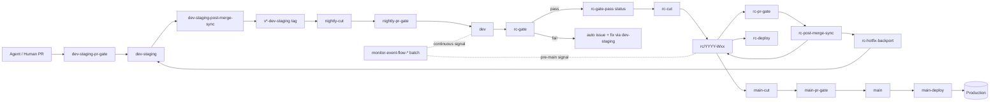

# Branch Strategy

4-stage (`dev-staging → dev → rc → main`) + 일반 PR/auto-merge + nightly snapshot + `rc-gate` green build picking + feature flag + 3가지 safety net. AI agent 가 dev-staging 에 PR, `rc-gate-pass` commit 에서 RC 를 cut 하고, main 머지에서 backend + mobile 모두 prod 로 deploy 한다 (hotfix 없으면 weekly). 이벤트 플로우 시뮬레이터는 release promotion 과 별개인 batch monitor 로 계속 돈다.

## Workflow Overview

### Abstract Workflow Set

| 단계 | Entry workflow | 역할 |
|------|----------------|------|
| dev-staging PR | `dev-staging-pr-gate` | feature/agent PR 의 빠른 CI gate |
| dev-staging post-merge | `dev-staging-post-merge-sync` | `v*-dev-staging` version/tag 생성 |
| dev promotion | `nightly-cut` + `nightly-pr-gate` | coherent dev-staging snapshot 을 dev 로 promote |
| dev post-merge | `rc-gate` | RC 후보 검증 후 `rc-gate-pass` status 부여 |
| dev deploy/validation | `dev-deploy` | dev 환경 deploy/validation orchestrator. 이벤트 플로우 시뮬레이터는 `monitor-event-flow-*` batch 로 별도 운영 |
| rc creation | `rc-cut` | latest `rc-gate-pass` commit 에서 `rc/YYYY-Wxx` 생성 |
| rc hotfix | `rc-pr-gate` + `rc-post-merge-sync` + `rc-hotfix-backport` | RC hotfix 검증, RC version bump, dev-staging backport |
| rc deploy/validation | `rc-deploy` | Supabase branching 기반 RC 검증 환경 구성 + pre-main validation |
| main promotion | `main-cut` + `main-pr-gate` | soak 완료 RC 를 main PR 로 promote |
| prod deploy | `main-deploy` | final version/tag, prod backend/mobile deploy, RC cleanup |

## 4-stage 모델

| 단계 | 역할 | 진입 방식 |
|------|------|-----------|
| `dev-staging` | AI agent commit zone | 일반 PR + auto-merge + 가벼운 `pr-gate` |
| `dev` | nightly-validated trunk | daily `nightly-cut` → post-merge `rc-gate` |
| `rc/YYYY-Wxx` | mobile RC, 5일 soak | weekly cut from latest rc-gate-pass |
| `main` | mobile-stable snapshot | rc → main 머지 (soak 통과 시) |

## Safety Nets 3종

| Safety Net | 정책 / 명세 |
|------------|-------------|
| Version kill switch (Tier 2a soft + 2b hard) | 6개월 backward compat, Firebase RC source / [main-promotion.md](./main-promotion.md) |
| Expand-Migrate-Contract CI | 6개월 DB schema, Option C / [dev-staging-pipeline.md](./dev-staging-pipeline.md) |
| Flag-registration CI | unflagged 코드 차단 / [dev-staging-pipeline.md](./dev-staging-pipeline.md) |

## 이정표

| 문서 | 내용 |
|------|------|
| [branch-flow.md](./branch-flow.md) | flow + protection + tag + backport |
| [test-strategy.md](./test-strategy.md) | per-stage gates |
| [error-detection.md](./error-detection.md) | detection layers |
| [dev-staging-pipeline.md](./dev-staging-pipeline.md) | 일반 PR/auto-merge + pr-gate + safety net CI |
| [dev-pipeline.md](./dev-pipeline.md) | nightly-cut + rc-gate + auto-deploy chain |
| [rc-promotion.md](./rc-promotion.md) | rc-cut + soak + hotfix + backport |
| [main-promotion.md](./main-promotion.md) | rc → main + main-deploy + min-version |
| [life-of-flag.md](./life-of-flag.md) | flag lifecycle |
| [versioning.md](./versioning.md) | CalVer + tag |
| [specs/](./specs/BLUEDOC.md) | workflow spec, branch spec, execution plan (구현 계약) |

## 역할 (workflow 가 처리 못하는 edge case 만)

**release manager** 비상 min-version bump · workflow-blocked promotion 수동 처리 / **on-call** workflow 자동 복구 실패한 P0 / **feature owner** flag 정책 결정 · cleanup PR review / **RC owner** abandon 판단 (TBD)

## 핵심 컨벤션

- 코드 promotion = 한 방향 PR, 기능 promotion = flag flip
- 모든 branch linear ON — dev-staging: squash, dev/rc/main: rebase
- Protected branch 직접 push 는 human 금지. version bump/tag/promotion 처리는 `minglit-release-bot` 전용 token + Ruleset bypass 로만 허용
- `monitor-event-flow-*` 는 release promotion 과 독립적인 batch signal. dev 에서 계속 돌고, RC 에서는 main 배포 전 검증 signal 로 사용한다
- main 머지 = backend + mobile 모두 prod deploy. backend prod deploy 는 `main-deploy` 에서 한 번에 수행한다
- **Hotfix 는 rc 에서, dev-staging 으로 자동 backport** ([rc-promotion.md](./rc-promotion.md))
- Tag regex 는 `RELEASE.md` lock (TODO)

### Promotion PR Title

Promotion PR 제목은 workflow 이름과 source artifact 를 앞에 둔다. PR list 와 git log 만 보고 어떤 workflow 가 무엇을 promote 했는지 알 수 있어야 한다.

| 단계 | 제목 형식 |
|------|-----------|
| dev-staging → dev | `ci(nightly-cut): promote v26.05.2722-dev-staging to dev` |
| dev → rc | `ci(rc-cut): cut rc/2026-W22 from <source>` |
| rc → main | `ci(main-cut): promote rc/2026-W22 to main` |
| rc hotfix backport | `ci(rc-backport): backport rc hotfix #1234 to dev-staging` |

### RC Eligibility Marker

RC cut 의 source-of-truth status 이름은 **`rc-gate-pass`** 이다. `rc-eligible` 은 현재 구현된 workflow/status 명칭이 아니며, 새 이름으로 바꾸려면 `rc-gate`, `rc-cut`, `main-pr-gate`, 문서 전체를 같은 PR 에서 일괄 변경한다.

---
_Reviewed: 2026-05-24 10:24_
