# Branch Strategy

4-stage (`dev-staging → dev → rc → main`) + 일반 PR/auto-merge + cut-gate/cut SRP + feature flag + 3가지 safety net. AI agent 가 dev-staging 에 PR, `dev-rc-cut-pass` commit 에서 RC 를 cut 하고, `rc-main-cut-pass` RC 에서 main PR 을 cut 한다. main 머지에서 backend + mobile 모두 prod 로 deploy 한다 (hotfix 없으면 weekly). 이벤트 플로우 시뮬레이터는 release promotion 과 별개인 batch monitor 로 계속 돈다.

## Workflow Overview

```mermaid
flowchart LR
  agent[Agent / Human PR] --> dsg[dev-staging-pr-gate]
  dsg --> ds[dev-staging]
  ds --> dss[dev-staging-dev-cut-gate]
  dss --> dstag["v*-dev-staging tag"]

  dstag --> nc[dev-staging-dev-cut]
  nc --> npg[dev-pr-gate]
  npg --> dev[dev]

  dev -. 24h soak .-> rg[dev-rc-cut-gate]
  monitor["monitor-event-flow-* batch"] -. dev-soak/backend-simulator .-> dev
  ai["AI app soak / real-device"] -. dev-soak/app-ai-review .-> dev
  rg -->|pass| rgp["dev-rc-cut-pass status"]
  rg -->|blocked| issue[status failure + issue/audit]
  rgp --> rcut[dev-rc-cut]
  rcut --> rc["rc/YYYY-Wxx"]

  rc --> rpg[rc-pr-gate]
  rpg --> rps[rc-post-merge-sync]
  rps --> rc
  rps --> rbp[rc-hotfix-backport]
  rbp --> ds

  rc --> rcd[rc-deploy]
  rc --> rmcg[rc-main-cut-gate]
  rcd --> rmcg
  rmcg -->|pass| rmcp["rc-main-cut-pass marker"]
  rmcp --> mcut[rc-main-cut]
  mcut --> mpg[main-pr-gate]
  mpg --> main[main]
  main --> md[main-deploy]
  md --> prod[(Production)]

  monitor -. pre-main signal .- rc
```

### Abstract Workflow Set

| 단계 | Entry workflow | 역할 |
|------|----------------|------|
| dev-staging PR | `dev-staging-pr-gate` | feature/agent PR 의 빠른 CI gate |
| dev-staging 지속 검증 | `monitor-dev-staging-health` | 6시간마다 EF unit/integration + user/partner CUJ 로 nightly 전 회귀 감지 |
| dev-staging → dev cut gate | `dev-staging-dev-cut-gate` | dev 로 promote 할 coherent dev-staging snapshot 을 `v*-dev-staging` tag 로 선별 |
| dev-staging → dev cut | `dev-staging-dev-cut` + `dev-pr-gate` | gate 가 선별한 snapshot 을 dev PR 로 promote |
| dev → rc cut gate | `dev-rc-cut-gate` | 24h dev soak status/run history 확인 후 `dev-rc-cut-pass` status 부여 |
| dev deploy/validation | `dev-deploy` | dev 환경 deploy/validation orchestrator. 이벤트 플로우 시뮬레이터는 `monitor-event-flow-*` batch 로 별도 운영 |
| dev → rc cut | `dev-rc-cut` | latest `dev-rc-cut-pass` commit 에서 `rc/YYYY-Wxx` 생성 |
| rc hotfix | `rc-pr-gate` + `rc-post-merge-sync` + `rc-hotfix-backport` | RC hotfix 검증, RC version bump, dev-staging backport |
| rc deploy/validation | `rc-deploy` | Supabase branching 기반 RC 검증 환경 구성 + pre-main validation |
| rc → main cut gate | `rc-main-cut-gate` | soak/pre-main validation 통과 RC 에 `rc-main-cut-pass` marker 부여 |
| rc → main cut | `rc-main-cut` + `main-pr-gate` | gate 가 선별한 RC 를 main PR 로 promote |
| prod deploy | `main-deploy` | final version/tag, prod backend/mobile deploy, RC cleanup |

## 4-stage 모델

| 단계 | 역할 | 진입 방식 |
|------|------|-----------|
| `dev-staging` | AI agent commit zone | 일반 PR + auto-merge + 가벼운 `pr-gate` |
| `dev` | soak-validated trunk | daily `dev-staging-dev-cut` → 24h soak → `dev-rc-cut-gate` |
| `rc/YYYY-Wxx` | mobile RC, 5일 soak | weekly cut from latest dev-rc-cut-pass |
| `main` | mobile-stable snapshot | rc → main 머지 (soak 통과 시) |

## Safety Nets 3종

| Safety Net | 정책 / 명세 |
|------------|-------------|
| Version kill switch (Tier 2a soft + 2b hard) | 6개월 backward compat, Firebase RC source / [main-promotion.md](./main-promotion.md) |
| Expand-Migrate-Contract CI | 6개월 DB schema, Option C / [dev-staging-pipeline.md](./dev-staging-pipeline.md) |
| Flag-registration CI | unflagged 코드 차단 / [dev-staging-pipeline.md](./dev-staging-pipeline.md) |

## 이정표

| 문서 | 내용 |
|------|------|
| [branch-flow.md](./branch-flow.md) | flow + protection + tag + backport |
| [test-strategy.md](./test-strategy.md) | per-stage gates |
| [error-detection.md](./error-detection.md) | detection layers |
| [dev-staging-pipeline.md](./dev-staging-pipeline.md) | 일반 PR/auto-merge + pr-gate + safety net CI |
| [dev-pipeline.md](./dev-pipeline.md) | dev-staging-dev-cut + dev-rc-cut-gate + auto-deploy chain |
| [dev-soak-status-model.md](./dev-soak-status-model.md) | dev soak commit status contexts + run history based `dev-rc-cut-gate` 판정 |
| [rc-promotion.md](./rc-promotion.md) | dev-rc-cut + soak + hotfix + backport |
| [main-promotion.md](./main-promotion.md) | rc → main + main-deploy + min-version |
| [hotfix-policy.md](./hotfix-policy.md) | dev/rc/main 직접 PR 차단 + branch별 hotfix 승인 규칙 |
| [life-of-flag.md](./life-of-flag.md) | flag lifecycle |
| [versioning.md](./versioning.md) | CalVer + tag |
| [specs/](./specs/BLUEDOC.md) | workflow spec, branch spec, execution plan (구현 계약) |

## 역할 (workflow 가 처리 못하는 edge case 만)

**release manager** 비상 min-version bump · workflow-blocked promotion 수동 처리 / **on-call** workflow 자동 복구 실패한 P0 / **feature owner** flag 정책 결정 · cleanup PR review / **RC owner** abandon 판단 (TBD)

## 핵심 컨벤션

- 코드 promotion = 한 방향 PR, 기능 promotion = flag flip
- `*-cut-gate` = 다음 브랜치로 promote 할 source artifact 선별/마킹, `*-cut` = 그 artifact 로 PR/branch 생성. 검증과 promotion 을 같은 workflow 에 섞지 않는다
- dev soak 판정의 source-of-truth 는 GitHub Issue/label 이 아니라 commit status context + workflow run history 다 ([dev-soak-status-model.md](./dev-soak-status-model.md))
- cut-gate Issue 는 사람이 진행 상태를 추적하기 위한 projection 이다. 생성/갱신/닫기는 `.github/actions/cut-issue` 와 `close-cut-issue-on-pr-merge` 가 담당하며, promotion 판정 SSOT 로 사용하지 않는다
- 모든 branch linear ON — dev-staging: squash, dev/rc/main: rebase
- Protected branch 직접 push 는 human 금지. version bump/tag/promotion 처리는 `minglit-release-bot` 전용 token + Ruleset bypass 로만 허용
- `monitor-event-flow-*` 는 release promotion 과 독립적인 batch signal. target 은 dev 5분 distributed tick 이고, RC 에서는 main 배포 전 검증 signal 로 사용한다
- main 머지 = backend + mobile 모두 prod deploy. backend prod deploy 는 `main-deploy` 에서 한 번에 수행한다
- `main-deploy` 는 version finalization 과 deploy execution 을 분리한다. RC promotion 은 final version/tag 를 만들고 deploy 하며, `main/hotfix/*` 처럼 이미 final version 인 main push 는 version bump 없이 prod deploy 만 실행한다
- 모바일 배포 산출물(APK/AAB/IPA)은 GitHub Release asset 이 canonical archive 다. Actions artifact 는 테스트 리포트/스크린샷/로그 같은 단기 디버깅 산출물에만 사용한다
- 일반 PR 은 `dev-staging` 으로만 진입한다. `dev`, `rc/*`, `main` 직접 PR 은 promotion 또는 승인된 hotfix 만 허용한다 ([hotfix-policy.md](./hotfix-policy.md))
- **Hotfix 는 merge 후 dev-staging 으로 backport** ([hotfix-policy.md](./hotfix-policy.md), [rc-promotion.md](./rc-promotion.md))
- Tag regex 는 `RELEASE.md` lock (TODO)

### Promotion PR Title

Promotion PR 제목은 workflow 이름과 source artifact 를 앞에 둔다. PR list 와 git log 만 보고 어떤 workflow 가 무엇을 promote 했는지 알 수 있어야 한다.

| 단계 | 제목 형식 |
|------|-----------|
| dev-staging → dev | `ci(dev-staging-dev-cut): promote v26.05.2722-dev-staging to dev` |
| dev → rc | `ci(dev-rc-cut): cut rc/2026-W22 from <source>` |
| rc → main | `ci(rc-main-cut): promote rc/2026-W22 to main` |
| rc hotfix backport | `ci(rc-backport): backport rc hotfix #1234 to dev-staging` |

### RC Eligibility Marker

RC cut 의 source-of-truth status 이름은 **`dev-rc-cut-pass`** 이다. `rc-eligible` 은 현재 구현된 workflow/status 명칭이 아니며, 새 이름으로 바꾸려면 `dev-rc-cut-gate`, `dev-rc-cut`, `main-pr-gate`, 문서 전체를 같은 PR 에서 일괄 변경한다.

---
_Reviewed: 2026-05-25 16:20_
