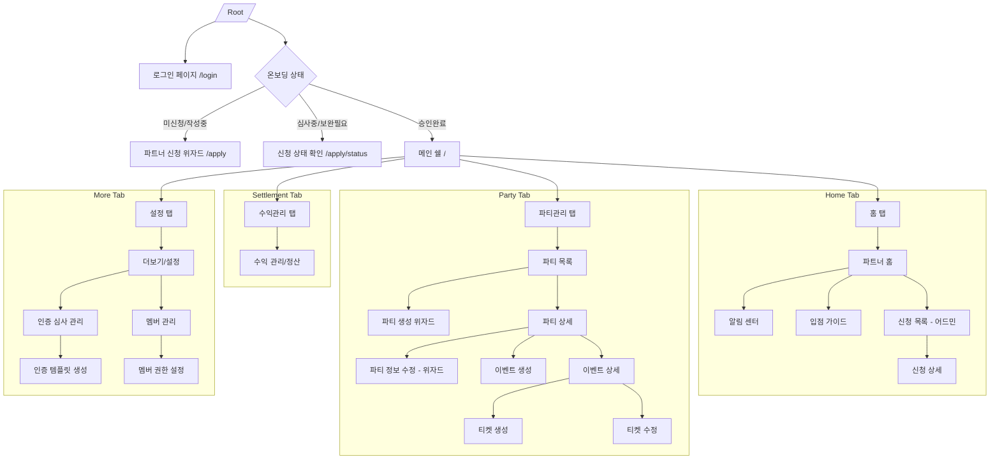
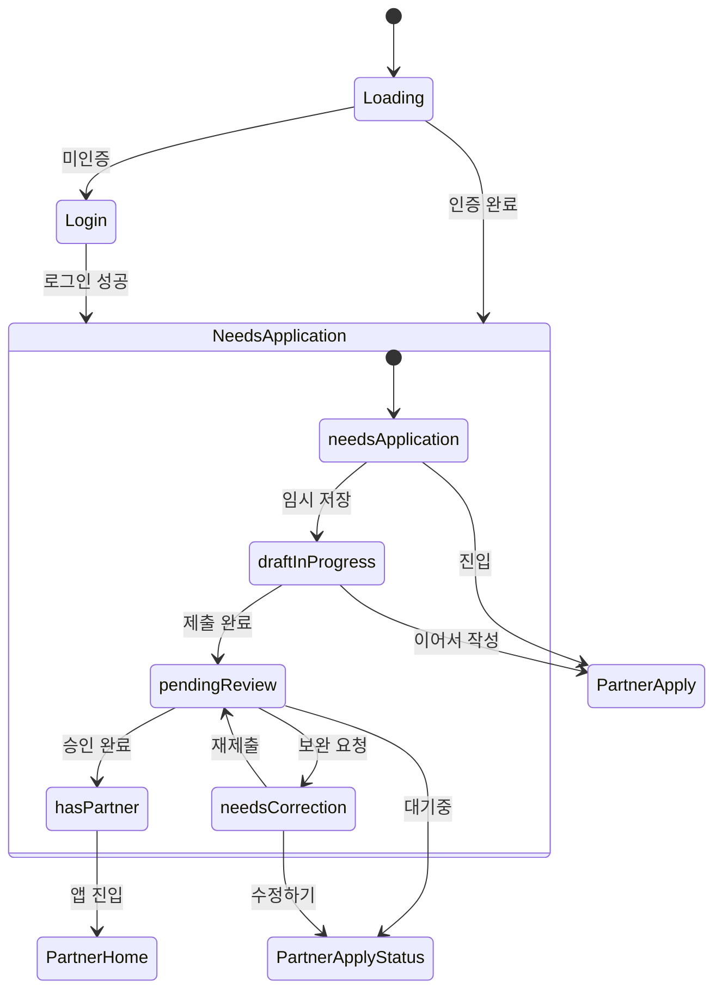

# 파트너 앱 화면 카탈로그 (Screen Catalog)

이 문서는 밍릿 파트너 앱(`app_partner`)의 모든 화면 구조와 네비게이션 경로를 정의한 UX/UI 레퍼런스 가이드입니다. 개발자와 디자이너가 앱의 전체 구조를 파악하고 각 화면의 역할과 연결 관계를 이해하는 데 사용됩니다.

## 1. 개요
밍릿 파트너 앱은 파트너(매장주)가 자신의 매장(파티)을 등록하고, 이벤트를 운영하며, 정산 및 멤버 권한을 관리하기 위한 도구입니다. 앱은 크게 4개의 하단 탭 내비게이션(Bottom Navigation) 구조를 가지고 있으며, 파트너 입점 신청을 위한 온보딩 프로세스가 포함되어 있습니다.

### 주요 구조
- **하단 내비게이션**: 홈, 파티관리, 수익관리, 설정의 4탭 구조.
- **온보딩 게이트**: 인증된 유저의 파트너십 상태에 따라 앱 접근 권한을 제어합니다.
- **위자드 패턴**: 복잡한 정보 입력이 필요한 파트너 신청 및 파티 생성은 단계별 위자드 방식을 채택합니다.

## 2. 사이트맵 (Sitemap)

파트너 앱의 전체 네비게이션 구조를 나타내는 다이어그램입니다.

## 3. 온보딩 상태 관리 (Onboarding State Management)

사용자의 인증 상태 및 파트너 신청 현황에 따른 화면 전이도입니다.

## 4. 파트너 로그인 및 인증 (Partner Login & Auth)
- **화면명**: 파트너 로그인 (PartnerLoginPage)
- **라우트**: `/login`
- **피처**: `auth`
- **용도**: 파트너 앱 서비스 이용을 위한 로그인 및 인증 관리.
- **주요 UI**: 
  - 이메일/비밀번호 입력 폼
  - 소셜 로그인 (카카오, 구글 등) 버튼
  - 파트너 회원가입 링크
- **네비게이션**: 
  - 진입: 앱 최초 구동 시 미인증 상태일 때
  - 이탈: 성공 시 온보딩 상태에 따라 `/apply`, `/apply/status` 또는 `/`로 리다이렉트

## 5. 알림 센터 (Notification Center)
- **화면명**: 알림 리스트 (NotificationListScreen)
- **라우트**: `/notifications`
- **피처**: `notification`
- **용도**: 앱 내 발생하는 각종 알림 내역 확인.
- **주요 UI**: 
  - 시간 역순 알림 리스트
  - 읽지 않은 알림 강조 표시
  - 알림 유형별 아이콘 (공지, 신청, 정산, 심사)
- **네비게이션**:
  - 진입: 홈 화면 또는 상단 앱바의 종 아이콘 클릭
  - 이탈: 뒤로가기 또는 각 알림 클릭 시 해당 상세 화면으로 이동

## 6. [홈 탭] 파트너 홈 (Home: Dashboard)
- **화면명**: 파트너 홈 (PartnerHomePage)
- **라우트**: `/`
- **피처**: `home`
- **용도**: 파트너의 운영 현황을 한눈에 보여주는 메인 대시보드.
- **주요 UI**: 
  - 오늘의 이벤트 요약 카드
  - 미처리 항목 (신청 대기자 등) 뱃지
  - 공지사항 배너
  - 주요 기능 퀵 메뉴 (이벤트 생성 등)
- **네비게이션**: Bottom Nav 첫 번째 탭

## 7. [홈 탭] 입점 안내 가이드 (Home: Location Guide)
- **화면명**: 장소 등록 가이드 (LocationGuidePage)
- **라우트**: `/guide/location`
- **피처**: `home`
- **용도**: 파티(장소) 등록 전 필요한 정보와 운영 정책 안내.
- **주요 UI**: 
  - 이미지 및 일러스트가 포함된 단계별 가이드
  - 준비물 체크리스트
  - 우수 운영 사례 링크
- **네비게이션**: 홈 화면의 가이드 배너 또는 링크를 통해 진입

## 8. [홈 탭] 파트너 입점 신청 목록 (Home: Application List - Admin)
- **화면명**: 입점 신청 목록 (PartnerApplicationListPage)
- **라우트**: `/applications`
- **피처**: `admin`
- **용도**: (시스템 관리자 전용) 신규 파트너들의 입점 신청 내역 관리.
- **주요 UI**: 
  - 신청서 리스트
  - 상태 필터 (전체, 대기, 보완, 반려, 승인)
  - 신청자명 및 매장명 검색
- **네비게이션**: 홈 화면의 어드민 섹션에서 진입

## 9. [홈 탭] 파트너 입점 신청 상세 (Home: Application Detail - Admin)
- **화면명**: 입점 신청 상세 (PartnerApplicationDetailPage)
- **라우트**: `/applications/:applicationId`
- **피처**: `admin`
- **용도**: 특정 파트너의 신청서를 검토하고 승인 여부를 결정.
- **주요 UI**: 
  - 사업자 정보 및 증빙 서류 이미지
  - 매장 위치 및 사진
  - 심사 결과 입력 폼 (반려 사유 등)
  - 승인 / 보완요청 / 반려 버튼
- **네비게이션**: 신청 목록에서 항목 클릭 시 진입

## 10. [파티 탭] 파티 목록 관리 (Party: List Management)
- **화면명**: 파티 목록 (PartyListPage)
- **라우트**: `/parties`
- **피처**: `party`
- **용도**: 운영 중이거나 준비 중인 모든 파티(매장) 관리.
- **주요 UI**: 
  - 파티 카드 (이미지, 제목, 상태)
  - 활성화/비활성화 토글
  - 파티 생성 플로팅 버튼 (FAB)
- **네비게이션**: Bottom Nav 두 번째 탭

## 11. [파티 탭] 파티 생성/편집 위자드 (Party: Create & Edit Wizard)
- **화면명**: 파티 생성 위자드 (PartyCreateWizardPage)
- **라우트**: 
  - 생성: `/parties/create`
  - 편집: `/parties/:partyId/edit`
- **피처**: `party`
- **용도**: **파티 신규 등록 및 기존 파티 정보 수정을 담당하는 통합 위자드.**
- **주요 특징**: 6단계의 프로세스로 구성되며, 편집 시에는 기존 데이터를 프리필(Pre-fill)함.
- **단계별 내용**:
  1. 기본 정보 (이름, 설명, 카테고리)
  2. 위치 (지도상 좌표, 상세 주소)
  3. 인원 및 연락처 (정원, 문의 전화)
  4. 입장 규칙 (연령, 성별, 매칭 여부)
  5. 티켓 템플릿 (기본 가격 구성)
  6. 최종 리뷰
- **네비게이션**: 파티 목록의 '생성' 버튼 또는 파티 상세의 '편집' 메뉴를 통해 진입

## 12. [파티 상세] 이벤트 관리 탭 (Party Detail: Events)
- **화면명**: 파티 상세 - 이벤트 관리 (PartyEventManagementTab)
- **소속**: `PartyDetailPage` (1번 탭)
- **용도**: 해당 파티에서 진행되는 실제 이벤트(회차)들의 일정 관리.
- **주요 UI**: 
  - 날짜별 이벤트 리스트
  - 이벤트 생성 버튼
  - 각 이벤트의 모집 현황 요약

## 13. [파티 상세] 파티 정보 탭 (Party Detail: Info)
- **화면명**: 파티 상세 - 정보 조회 (PartyInfoTab)
- **소속**: `PartyDetailPage` (2번 탭)
- **용도**: 등록된 파티의 고정적인 기본 정보 확인.
- **주요 UI**: 
  - 위치 지도 뷰
  - 파티 소개 텍스트 및 태그
  - 시설 정보 및 이용 수칙 리스트

## 14. [파티 상세] 입장 그룹 및 티켓 탭 (Party Rule Management)
- **화면명**: 파티 상세 - 입장/티켓 관리 (PartyRuleManagementTab)
- **소속**: `PartyDetailPage` (3번 탭)
- **용도**: 파티의 기본 입장 그룹과 티켓 판매 규칙 관리.
- **주요 UI**: 
  - 설정된 입장 그룹 목록 (남성, 여성 등)
  - 티켓 템플릿 관리 메뉴
  - 매칭 설정 요약 정보

## 15. [이벤트] 이벤트 생성 프로세스 (Event: Creation)
- **화면명**: 이벤트 생성 (EventCreatePage)
- **라우트**: `/parties/:partyId/events/create`
- **피처**: `party`
- **용도**: 특정 파티의 구체적인 일정을 생성.
- **주요 UI**: 
  - 날짜 및 시작/종료 시간 선택기
  - 모집 정원 설정 (파티 기본값 상속/변경)
  - 해당 회차 공지사항 입력
- **네비게이션**: 파티 상세 이벤트 관리 탭에서 '이벤트 생성' 클릭 시 진입

## 16. [이벤트] 이벤트 상세 및 운영 (Event: Detail & Operations)
- **화면명**: 이벤트 상세 (EventDetailPage)
- **라우트**: `/parties/:partyId/events/:eventId`
- **피처**: `party`
- **용도**: 특정 이벤트 회차의 실시간 참가자 관리 및 운영.
- **주요 UI**: 
  - 참가 신청자 명단
  - 체크인/미체크인 현황
  - 티켓 판매 통계
  - QR 스캐너 실행 버튼
- **네비게이션**: 파티 상세 이벤트 리스트에서 항목 클릭 시 진입

## 17. [티켓] 티켓 구성 및 가격 설정 (Ticket: Configuration)
- **화면명**: 티켓 생성/편집 (TicketCreatePage / TicketEditPage)
- **라우트**: 
  - 생성: `/parties/:partyId/events/:eventId/tickets/create`
  - 편집: `.../tickets/:ticketId/edit`
- **피처**: `ticket`
- **용도**: 판매할 티켓의 상세 조건 설정.
- **주요 UI**: 
  - 티켓 명칭 및 설명
  - 가격 및 할인 정보
  - 판매 수량 제한
  - 판매 기간 (시작/종료) 설정

## 18. [수익 탭] 정산 및 수익 관리 (Settlement & Revenue)
- **화면명**: 정산 관리 (SettlementPage)
- **라우트**: `/settlement`
- **피처**: `settlement`
- **용도**: 누적 수익금 조회 및 정산 신청 처리.
- **상세 사양**: 상세 UI/UX 명세는 [정산 UI/UX 설계서](../../features/partner-settlement/ui-ux-design.md)를 참조하십시오.
- **주요 UI**: 
  - 정산 가능 금액 섹션
  - 월별 수익 리포트 그래프
  - 정산 계좌 관리 기능
- **네비게이션**: Bottom Nav 세 번째 탭

## 19. [더보기 탭] 설정 및 프로필 (More: Settings & Profile)
- **화면명**: 설정 메인 (MorePage)
- **라우트**: `/more`
- **피처**: `more`
- **용도**: 개인 정보 관리 및 각종 부가 기능의 진입점.
- **주요 UI**: 
  - 파트너 프로필 정보
  - 메뉴 리스트 (멤버 관리, 인증 심사, 공지사항 등)
  - 앱 버전 정보 및 로그아웃 버튼
- **네비게이션**: Bottom Nav 네 번째 탭

## 20. [더보기 탭] 유저 인증 심사 관리 (More: Verification Management)
- **화면명**: 인증 심사 관리 (VerificationManagePage)
- **라우트**: `/more/verifications/manage`
- **피처**: `verification`
- **용도**: 유저 신뢰를 위한 인증 시스템(직장, 학력 등)의 활성화 및 상태 관리.
- **주요 UI**: 
  - 운영 중인 인증 템플릿 리스트
  - 심사 대기 건수 표시
  - 인증 프로세스 통계 요약

## 21. [더보기 탭] 인증 템플릿 생성 (More: Create Verification)
- **화면명**: 인증 템플릿 생성 (CreateVerificationPage)
- **라우트**: `/more/verifications/create`
- **피처**: `verification`
- **용도**: 새로운 유저 인증 요구사항(예: 특정 자격증, 신분증 인증)을 정의.
- **주요 UI**: 
  - 인증 제목 및 설명 입력
  - 제출 필수 서류 양식 정의
  - 인증 마크 이미지 업로드

## 22. [더보기 탭] 멤버 및 권한 관리 (More: Member & Permissions)
- **화면명**: 파트너 멤버 목록 (PartnerMemberListPage)
- **라우트**: `/more/partners/:partnerId/members`
- **피처**: `member`
- **용도**: 파티를 공동 운영하는 직원(매니저, 스태프) 관리.
- **주요 UI**: 
  - 멤버 리스트 및 현재 역할 표시
  - 새로운 멤버 초대 버튼
  - 멤버별 활동 로그 링크

## 23. [더보기 탭] 멤버 권한 상세 설정 (More: Member Permission Detail)
- **화면명**: 멤버 권한 설정 (PartnerMemberPermissionPage)
- **라우트**: `/more/partners/:partnerId/members/:targetUserId/permission`
- **피처**: `member`
- **용도**: 특정 멤버에게 부여된 권한(매니저, 스태프 등) 수정.
- **주요 UI**: 권한 항목 체크박스 리스트 (파티 관리 권한, 이벤트 관리 권한, 정산 조회 권한 등).

## 24. [모달] 파티 정보 부분 수정 (Modal: Quick Edit)
- **용도**: 전체 위자드 진입 없이 파티의 특정 정보만 빠르게 수정하기 위한 하단 시트 화면들.
- **주요 화면**:
  - **PartyBasicInfoEditScreen**: 이름, 설명, 이미지 수정.
  - **PartyLocationEditScreen**: 장소 좌표 및 주소 텍스트 수정.
  - **PartyCapacityContactEditScreen**: 정원, 최소 인원, 연락처 정보 수정.

## 25. [모달] 운영 및 매칭 설정 (Modal: Matching & Rules)
- **용도**: 파티의 입장 로직 및 매칭 조건을 세부적으로 조정.
- **주요 화면**:
  - **MatchingSettingsScreen**: 매칭 알고리즘 가중치 및 선호도 설정.
  - **EntryGroupEditorScreen**: 입장 그룹(예: 신규 회원, 우수 회원, 남성/여성 전용) 정의 및 편집.

## 26. [모달] 티켓 및 입장 관리 (Modal: Ticket & Entry)
- **용도**: 티켓 라이브러리 및 현장 입장 관련 부조 화면.
- **주요 화면**:
  - **TicketManageScreen**: 파티/이벤트별 전체 티켓 현황 조회.
  - **TicketTemplateManageScreen**: 자주 사용하는 티켓 설정 재사용을 위한 템플릿 관리.
  - **QRScannerScreen**: 티켓 검수용 카메라 스캐너. (체크인 및 일반 QR 인식 중복 기능 포함)

## 27. [온보딩] 파트너 입점 신청 위자드 (Onboarding: Application Wizard)
- **화면명**: 파트너 신청 페이지 (PartnerApplyPage)
- **라우트**: `/apply`
- **피처**: `onboarding`
- **용도**: 일반 유저가 파트너 권한을 획득하기 위한 필수 신청 프로세스.
- **단계**:
  1. 기본 매장 정보 입력
  2. 사업자 등록 정보 및 번호 인증
  3. 연락처 및 정산 수령 계좌 설정
  4. 증빙 서류 업로드 (사업자 등록증 등)
  5. 입력 정보 최종 확인 및 제출

## 28. [온보딩] 입점 신청 상태 및 보완 (Onboarding: Application Status)
- **화면명**: 신청 상태 확인 (PartnerApplyStatusPage)
- **라우트**: `/apply/status`
- **피처**: `onboarding`
- **용도**: 제출된 신청서의 심사 진행 현황 확인 및 보완 요청 대응.
- **주요 UI**: 
  - 상태 인디케이터 (심사중, 보완요청, 반려)
  - 관리자 의견 (보완 사유) 표시 섹션
  - 위자드로 다시 돌아가기 버튼 (수정용)

---
*이 문서는 파트너 앱의 화면 구성을 지속적으로 반영하며, 상세 디자인은 Figma 링크를 참조하십시오.*
