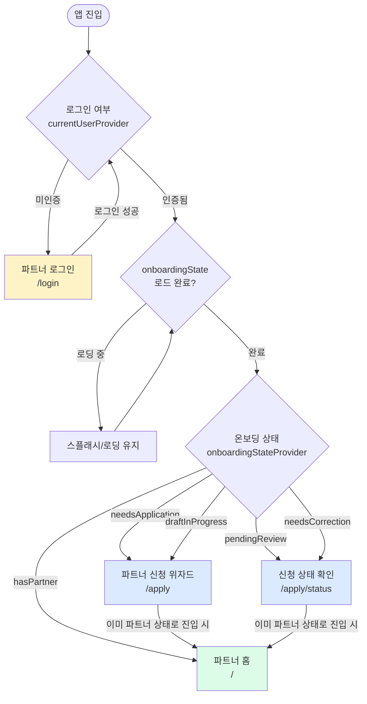
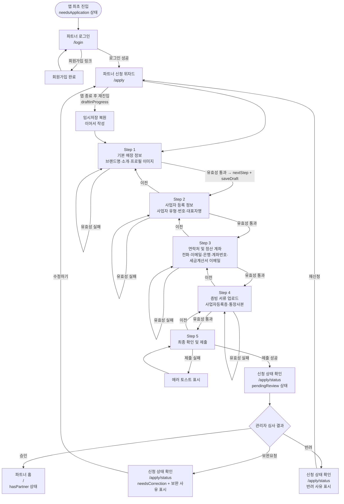
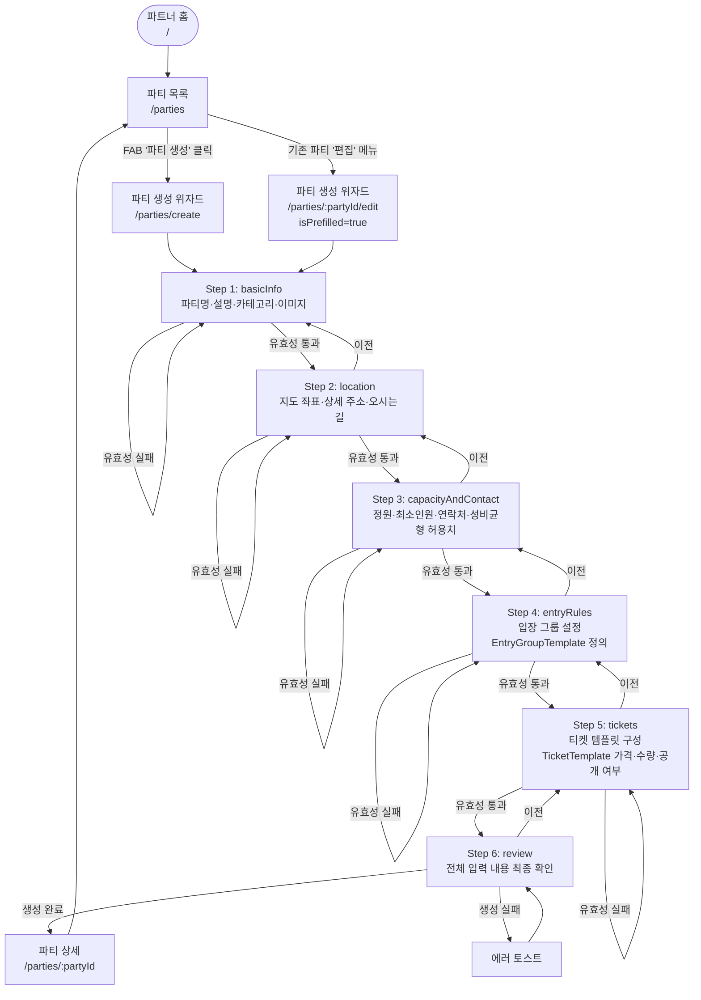
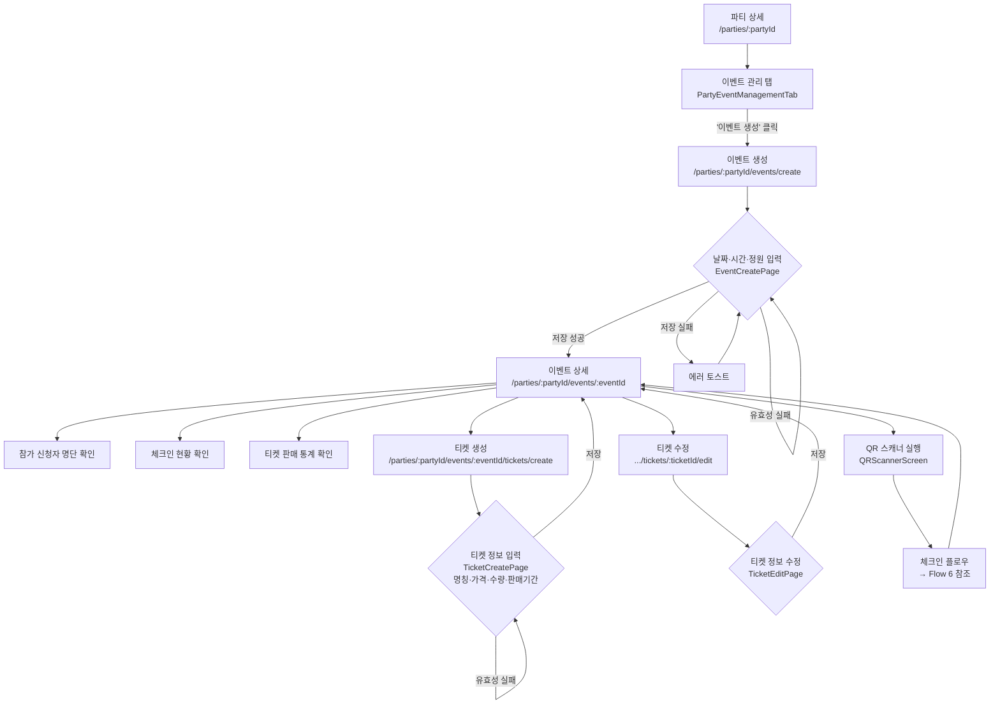
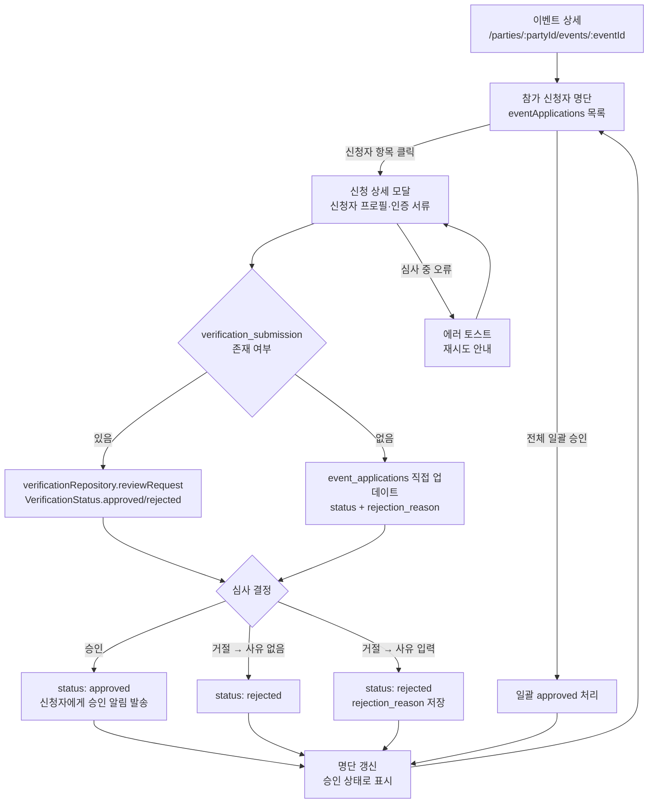
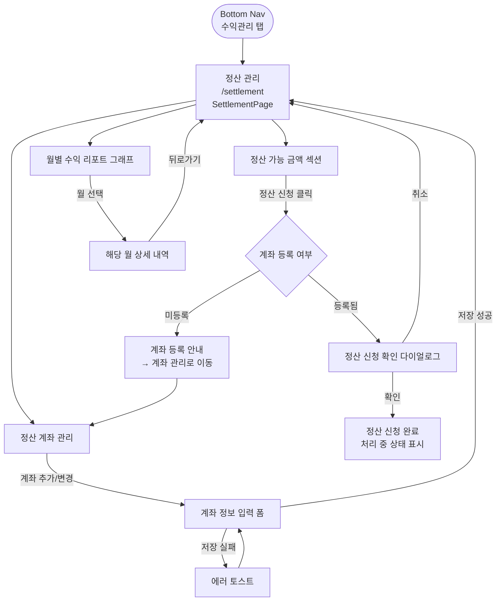
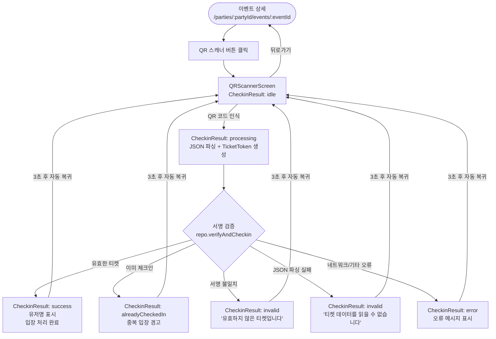

# 파트너 앱 사용자 여정 플로우 (User Flows)

이 문서는 밍릿 파트너 앱(`app_partner`)의 주요 사용자 여정을 플로우차트로 정의한 UX 레퍼런스입니다.
각 플로우에서 사용하는 화면명과 라우트 경로는 **[화면 카탈로그](./screen-catalog.md)** 를 기준으로 합니다.

---

## 목차

1. [인증 게이트 플로우](#인증-게이트-플로우)
2. [Flow 1 — 파트너 온보딩](#flow-1--파트너-온보딩)
3. [Flow 2 — 파티 생성](#flow-2--파티-생성)
4. [Flow 3 — 이벤트 생성 및 운영](#flow-3--이벤트-생성-및-운영)
5. [Flow 4 — 신청 심사](#flow-4--신청-심사)
6. [Flow 5 — 정산 확인](#flow-5--정산-확인)
7. [Flow 6 — QR 체크인](#flow-6--qr-체크인)
8. [공통 예외 경로](#공통-예외-경로)

---

## 인증 게이트 플로우

앱 진입 시 `GoRouter`의 `redirect` 로직이 인증 상태와 온보딩 상태를 순차적으로 검사하여 적절한 화면으로 분기한다.
분기 기준은 `currentUserProvider`(로그인 여부)와 `onboardingStateProvider`(파트너 신청 상태) 두 가지다.

> **참고**: `/dev` 경로는 인증 없이 접근 가능 (개발 전용 DevMap).
> 로그인 상태에서 `/login` 접근 시 `/`로 즉시 리다이렉트.

---

## Flow 1 — 파트너 온보딩

일반 유저가 파트너 권한을 획득하기까지의 전체 여정.
신청 위자드(`PartnerApplyPage`)는 5단계로 구성되며, 각 단계 이동 시 임시 저장(draft)이 자동으로 수행된다.

### 온보딩 상태 전이 요약

| 상태 | 진입 화면 | 트리거 |
|------|-----------|--------|
| `needsApplication` | `/apply` (Step 1) | 최초 진입 |
| `draftInProgress` | `/apply` (저장된 스텝) | 임시저장 후 재진입 |
| `pendingReview` | `/apply/status` | 제출 완료 |
| `needsCorrection` | `/apply/status` | 관리자 보완요청 |
| `hasPartner` | `/` | 관리자 승인 |

---

## Flow 2 — 파티 생성

파트너가 새로운 파티(매장)를 등록하는 여정.
위자드는 `PartyCreateStep` enum 기준 6단계로 구성되며, 편집 시에는 기존 데이터가 프리필(`isPrefilled=true`)된다.

### 파티 생성 위자드 단계 요약

| 스텝 | `PartyCreateStep` | 주요 입력 |
|------|-------------------|-----------|
| 1 | `basicInfo` | 파티명, 설명, 카테고리, 이미지 |
| 2 | `location` | 지도 좌표(`Location`), 상세 주소, 오시는 길 안내 |
| 3 | `capacityAndContact` | 정원, 최소 인원, 연락처, 성비 균형 허용치(`balanceTolerance`) |
| 4 | `entryRules` | 입장 그룹(`EntryGroupTemplate`) 정의 |
| 5 | `tickets` | 티켓 템플릿(`TicketTemplate`), 공개 여부(`visibility`) |
| 6 | `review` | 전체 내용 최종 확인 후 제출 |

---

## Flow 3 — 이벤트 생성 및 운영

파티 상세에서 특정 일정(이벤트 회차)을 생성하고 운영하는 여정.

---

## Flow 4 — 신청 심사

이벤트에 참가 신청한 유저를 개별 심사하는 여정.
`EventApplicationReviewController`가 `approved` / `rejected` 두 가지 상태를 처리하며,
인증 제출(`verification_submission`)이 연결된 경우 `verificationRepository`를 통해 처리한다.

### 심사 결과 상태값

| 결과 | `status` 값 | `rejection_reason` | 비고 |
|------|-------------|---------------------|------|
| 승인 | `approved` | — | 신청자 입장 확정, 알림 발송 |
| 거절 (사유 없음) | `rejected` | `null` | — |
| 거절 (사유 있음) | `rejected` | 사유 문자열 | 신청자에게 사유 전달 |

---

## Flow 5 — 정산 확인

정산 탭에서 수익 현황을 확인하는 여정. 상세 UI/UX 명세는
**[정산 UI/UX 설계서](../../features/partner-settlement/ui-ux-design.md)** 를 참조한다.

> 정산 플로우 상세(수수료 계산, 정산 주기, 세금계산서 등)는 [정산 UI/UX 설계서](../../features/partner-settlement/ui-ux-design.md)에서 관리한다.

---

## Flow 6 — QR 체크인

현장에서 유저의 QR 티켓을 스캔하여 입장을 처리하는 여정.
`CheckinController`는 `idle → processing → (success | invalid | alreadyCheckedIn | error) → idle` 사이클로 동작하며,
결과 표시 후 **3초 뒤 자동으로 `idle` 상태로 복귀**한다.

### 체크인 결과 상태 요약

| `CheckinResult` | 표시 내용 | 후속 동작 |
|-----------------|-----------|-----------|
| `idle` | 스캐너 대기 화면 | — |
| `processing` | 로딩 인디케이터 | — |
| `success` | 유저명 + 성공 메시지 | 3초 후 idle 복귀 |
| `alreadyCheckedIn` | 중복 입장 경고 | 3초 후 idle 복귀 |
| `invalid` | 오류 메시지 | 3초 후 idle 복귀 |
| `error` | 오류 메시지 | 3초 후 idle 복귀 |

---

## 공통 예외 경로

모든 플로우에 공통으로 적용되는 예외 처리 원칙.

| 예외 상황 | 처리 방식 |
|-----------|-----------|
| 네트워크 단절 | 스낵바 안내 + 재시도 유도 |
| 권한 부족 | "권한이 없습니다" 팝업 (멤버 권한 설정에 따라) |
| 위자드 유효성 실패 | 해당 필드 강조 + 다음 단계 이동 차단 |
| 세션 만료 | `/login`으로 자동 리다이렉트 |
| 서버 오류 (5xx) | 에러 토스트 + 재시도 버튼 |

---

## 화면 간 연결 관계 요약

각 플로우에서 등장하는 화면의 전체 목록과 라우트는 **[화면 카탈로그](./screen-catalog.md)** 를 참조한다.

| 플로우 | 진입점 | 핵심 화면 | 종료점 |
|--------|--------|-----------|--------|
| 인증 게이트 | 앱 진입 | `파트너 로그인`, `파트너 신청 위자드`, `신청 상태 확인` | `파트너 홈` |
| 파트너 온보딩 | `파트너 로그인` | `파트너 신청 위자드` (5단계), `신청 상태 확인` | `파트너 홈` |
| 파티 생성 | `파티 목록` | `파티 생성 위자드` (6단계) | `파티 상세` |
| 이벤트 생성·운영 | `파티 상세` | `이벤트 생성`, `이벤트 상세`, `티켓 생성/편집` | `이벤트 상세` |
| 신청 심사 | `이벤트 상세` | 신청 상세 모달 | `이벤트 상세` |
| 정산 확인 | Bottom Nav 수익관리 탭 | `정산 관리` | `정산 관리` |
| QR 체크인 | `이벤트 상세` | `QRScannerScreen` | `이벤트 상세` |

---

## 관련 문서

- [화면 카탈로그](screen-catalog.md) — 각 화면의 상세 정보, 라우트 경로, UI 요소
- [디자인 시스템](design-system.md) — 디자인 토큰, 컴포넌트 테마, 위젯 패턴 카탈로그
- [정산 UI/UX 설계](../../features/partner-settlement/ui-ux-design.md) — 정산 플로우 상세 설계

---

*이 문서는 `app_router.dart`, `partner_apply_controller.dart`, `party_create_wizard_controller.dart`, `event_application_controller.dart`, `checkin_controller.dart` 소스를 기반으로 작성되었습니다.*
