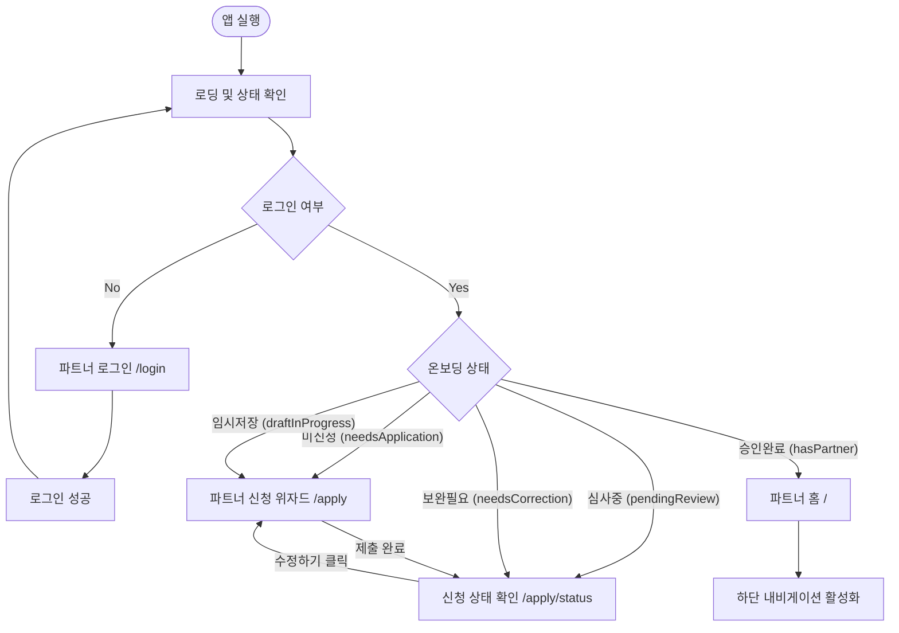
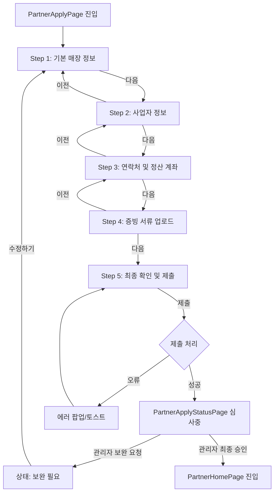
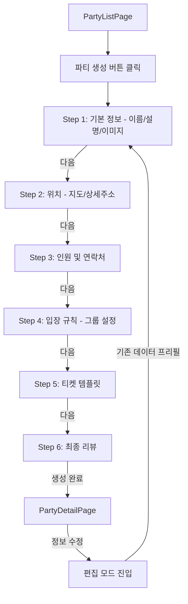
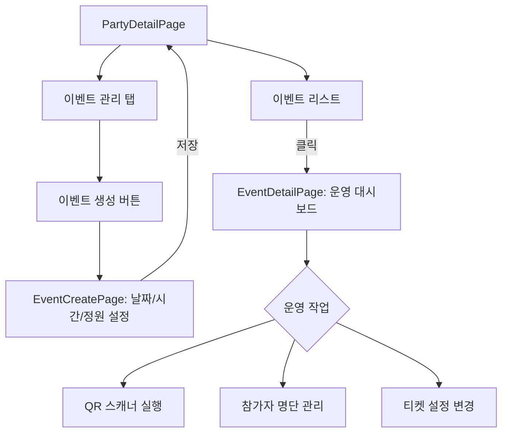
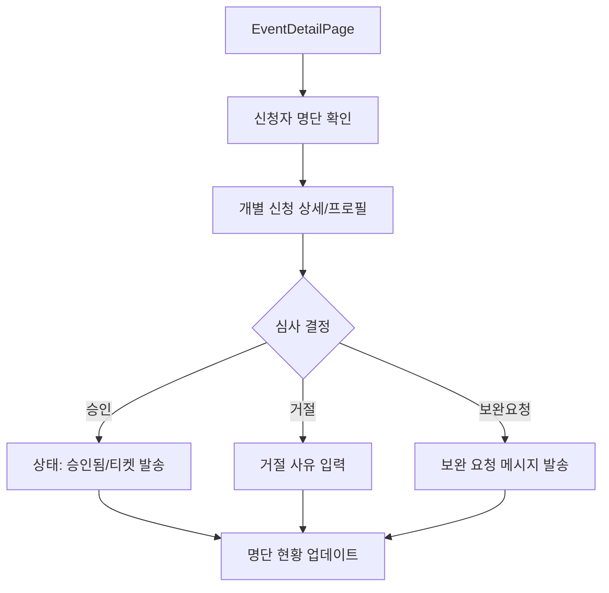
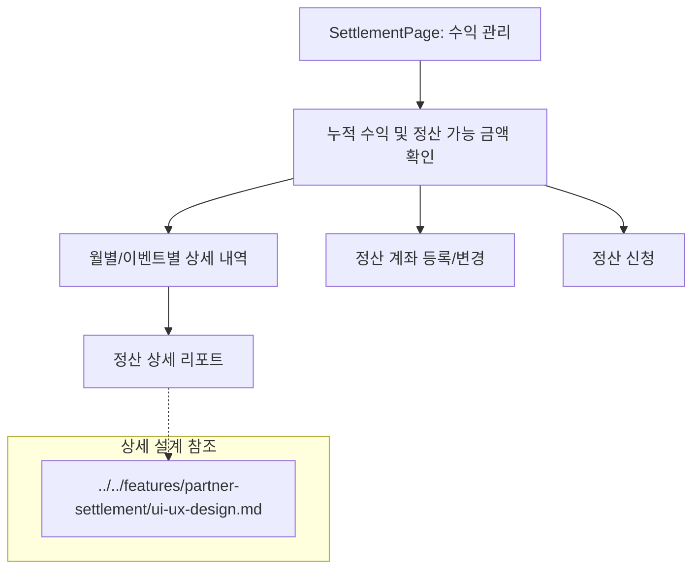
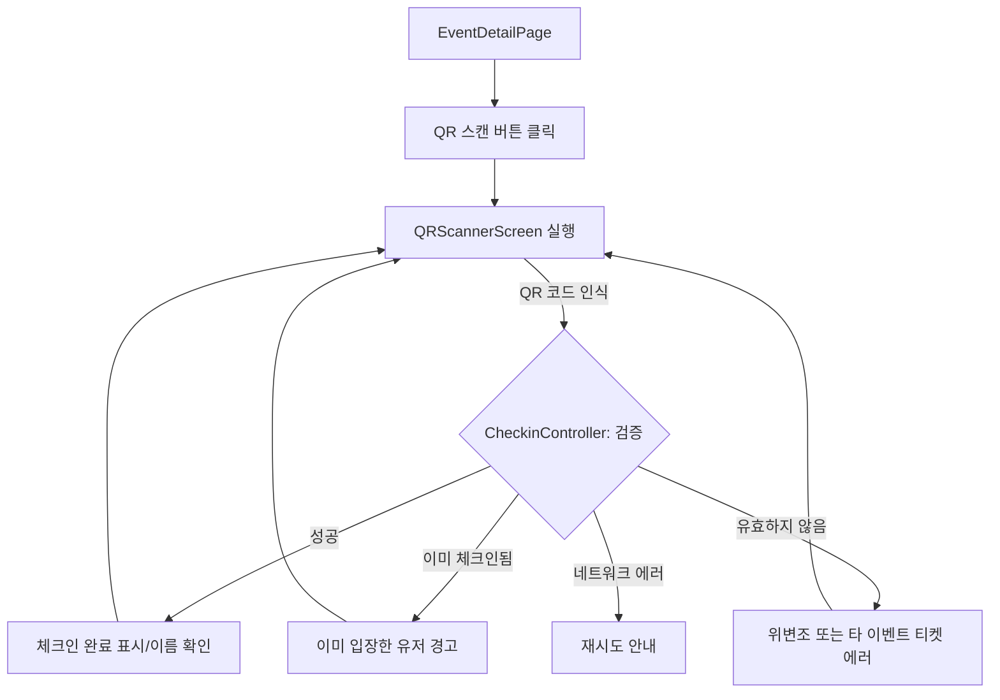

# 파트너 앱 사용자 여정 (User Flows)

이 문서는 밍릿 파트너 앱(`app_partner`)의 주요 사용자 여정과 핵심 비즈니스 로직에 따른 화면 전이 흐름을 정의합니다. 모든 화면 명칭과 라우트 경로는 [화면 카탈로그(screen-catalog.md)](screen-catalog.md)를 준수합니다.

## 1. 개요
파트너 앱은 사용자가 파트너 권한을 획득하는 **온보딩** 단계부터, 자신의 공간을 등록하고 **이벤트를 운영**하며 **수익을 정산**받는 전 과정을 포괄합니다. 각 여정은 복잡한 상태 전이를 포함하며, 특히 인증 게이트를 통해 사용자의 권한 상태에 맞는 최적의 화면을 제공합니다.

---

## 2. 인증 게이트 및 초기 진입 플로우
앱 실행 시 사용자의 인증 상태와 파트너 온보딩 완료 여부를 체크하여 적절한 페이지로 리다이렉트합니다.

---

## 3. 여정 1 — 파트너 온보딩 (입점 신청)
일반 유저가 파트너가 되기 위해 사업자 정보와 증빙 서류를 제출하는 5단계 위자드 프로세스입니다.

---

## 4. 여정 2 — 파티 생성 (장소 등록)
파트너가 이벤트를 개최할 기반이 되는 파티(매장) 공간을 등록하는 6단계 위자드입니다.

---

## 5. 여정 3 — 이벤트 생성 및 운영
등록된 파티를 기반으로 실제 모집 일정(이벤트)을 생성하고 관리합니다.

---

## 6. 여정 4 — 신청 심사 (참가 승인)
유저들이 신청한 이벤트 참가 요청을 검토하고 승인 또는 거절합니다.

---

## 7. 여정 5 — 정산 확인 및 관리
이벤트 운영을 통해 발생한 매출을 확인하고 정산을 관리합니다.

---

## 8. 여정 6 — QR 체크인 플로우
현장에서 유저의 디지털 티켓을 스캔하여 입장을 확인하는 프로세스입니다.

---

## 9. 예외 및 에러 경로
- **네트워크 단절**: 모든 API 요청 시 오프라인 상태이면 스낵바를 통해 안내하고 재시도를 유도합니다.
- **권한 부족**: 파트너 멤버 권한 설정에 따라 특정 메뉴(정산, 멤버 관리 등) 접근 시 "권한이 없습니다" 팝업을 노출합니다.
- **데이터 유효성 실패**: 위자드 단계 이동 시 필수 항목 누락 시 해당 필드를 강조하고 이동을 차단합니다.
